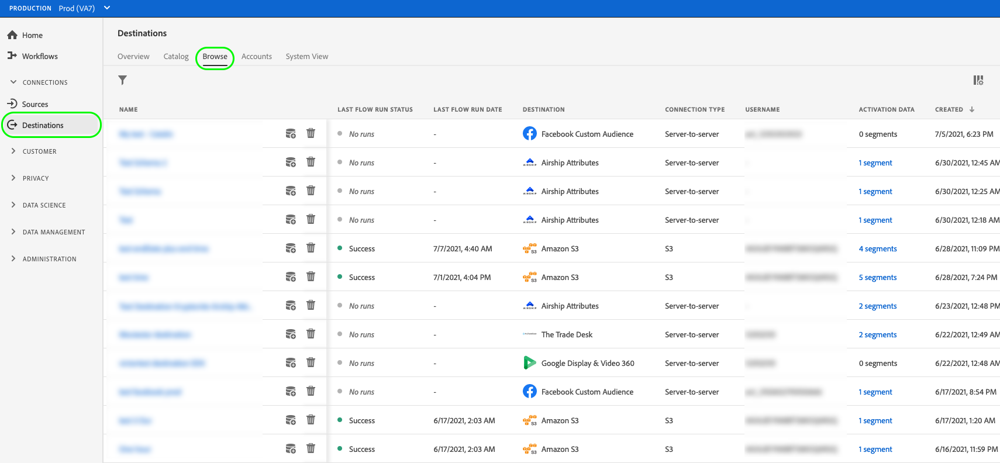

# 對串流區段匯出目的地啟用受眾資料

## 概覽 {#overview}

本文說明在Adobe Experience Platform區段串流目的地中啟用受眾資料所需的工作流程。

## 先決條件 {#prerequisites}

若要將資料激活到目的地，您必須已成功[連接到目標](./connect-destination.md)。 如果尚未這麼做，請前往[目標目錄](../catalog/overview.md)，瀏覽支援的目標，並設定您要使用的目標。

## 選取您的目的地 {#select-destination}

1. 前往&#x200B;**[!UICONTROL 連線>目的地]**，然後選取&#x200B;**[!UICONTROL 瀏覽]**&#x200B;標籤。

   

1. 選取與您要啟用區段的目的地對應的&#x200B;**[!UICONTROL 新增區段]**&#x200B;按鈕，如下圖所示。

   

1. 移至下一個區段至[選取您的區段](#select-segments)。

## 選取您的區段 {#select-segments}

使用區段名稱左側的核取方塊，選取您要啟用至目的地的區段，然後選取&#x200B;**[!UICONTROL Next]**。

## 對應屬性和身分 {#mapping}

>[!IMPORTANT]
>
>此步驟僅適用於某些區段串流目的地。 如果您的目的地沒有&#x200B;**[!UICONTROL 對應]**&#x200B;步驟，請跳至[排程區段匯出](#scheduling)。

有些區段串流目的地會要求您選取來源屬性或身分識別命名空間，以對應為目的地中的目標身分識別。

1. 在&#x200B;**[!UICONTROL 映射]**&#x200B;頁中，選擇&#x200B;**[!UICONTROL 添加新映射]**。

   

1. 選擇&#x200B;**[!UICONTROL 源欄位]**&#x200B;條目右側的箭頭。

   

1. 在&#x200B;**[!UICONTROL 選擇源欄位]**&#x200B;頁中，使用&#x200B;**[!UICONTROL 選擇屬性]**&#x200B;或&#x200B;**[!UICONTROL 選擇標識命名空間]**&#x200B;選項在兩個可用源欄位類別之間切換。 從可用的[!DNL XDM]配置檔案屬性和標識命名空間中，選擇要映射到目標的屬性和標識命名空間，然後選擇&#x200B;**[!UICONTROL 選擇]**。

   

1. 選擇&#x200B;**[!UICONTROL 目標欄位]**&#x200B;條目右側的按鈕。

   

1. 在&#x200B;**[!UICONTROL 選擇目標欄位]**&#x200B;頁中，選擇要將源欄位映射到的目標標識命名空間，然後選擇&#x200B;**[!UICONTROL 選擇]**。

   

1. 要添加更多映射，請重複步驟1到5。

### 套用轉換 {#apply-transformation}

>[!CONTEXTUALHELP]
>id="platform_destinations_activate_applytransformation"
>title="套用轉換"
>abstract="使用未雜湊的來源欄位時，請核取此選項，讓Adobe Experience Platform在啟動時自動雜湊這些欄位。"
>additional-url="https://experienceleague.adobe.com/docs/experience-platform/destinations/ui/activate/activate-segment-streaming-destinations.html?lang=en#apply-transformation" text="進一步了解檔案"

將非雜湊來源屬性對應至目標預期雜湊的目標屬性時(例如：`email_lc_sha256`或`phone_sha256`)，勾選「**套用轉換**」選項，讓Adobe Experience Platform在啟動時自動雜湊來源屬性。

## 排程區段匯出 {#scheduling}

1. 在&#x200B;**[!UICONTROL 區段排程]**&#x200B;頁面上，選取每個區段，然後使用&#x200B;**[!UICONTROL 開始日期]**&#x200B;和&#x200B;**[!UICONTROL 結束日期]**&#x200B;選取器來設定將資料傳送至目的地的時間間隔。

   

   * 有些目的地會要求您使用日曆選取器下方的下拉式功能表，為每個區段選取&#x200B;**[!UICONTROL 受眾來源]**。 如果您的目的地不包含此選取器，請略過此步驟。

      

   * 某些目的地需要您手動將[!DNL Platform]區段對應至目標目的地的對應項目。 若要這麼做，請選取每個區段，然後在&#x200B;**[!UICONTROL 對應ID]**&#x200B;欄位中輸入目標平台中對應的區段ID。 如果您的目的地不包含此欄位，請略過此步驟。

      

   * 啟用[!DNL IDFA]或[!DNL GAID]區段時，某些目的地需要您輸入&#x200B;**[!UICONTROL 應用程式ID]**。 如果您的目的地不包含此欄位，請略過此步驟。

      

1. 選擇&#x200B;**[!UICONTROL Next]**&#x200B;以轉至[!UICONTROL Review]頁。

## 檢閱 {#review}

在&#x200B;**[!UICONTROL 檢閱]**&#x200B;頁面上，您會看到您所選項目的摘要。 選擇&#x200B;**[!UICONTROL 取消]**&#x200B;以分解流，選擇&#x200B;**[!UICONTROL 返回]**&#x200B;以修改設定，或選擇&#x200B;**[!UICONTROL 完成]**&#x200B;以確認您的選擇並開始向目標發送資料。

>[!IMPORTANT]
>
>在此步驟中，Adobe Experience Platform會檢查資料使用政策是否違反。 以下顯示違反原則的範例。 除非您解決違規，否則無法完成區段啟用工作流程。 有關如何解決策略違規的資訊，請參閱資料控管文檔部分中的[策略實施](../../rtcdp/privacy/data-governance-overview.md#enforcement)。

如果未檢測到任何違反策略的情況，請選擇&#x200B;**[!UICONTROL 完成]**&#x200B;以確認您的選擇並開始向目標發送資料。

## 驗證區段啟用 {#verify}

檢查您的目的地帳戶。 如果啟動成功，則會在您的目的地平台中填入對象。

<!-- 
For [!DNL Facebook Custom Audience], a successful activation means that a [!DNL Facebook] custom audience would be created programmatically in [[!UICONTROL Facebook Ads Manager]](https://www.facebook.com/adsmanager/manage/). Segment membership in the audience would be added and removed as users are qualified or disqualified for the activated segments.

>[!TIP]
>
>The integration between Adobe Experience Platform and [!DNL Facebook] supports historical audience backfills. All historical segment qualifications are sent to [!DNL Facebook] when you activate the segments to the destination.
-->
