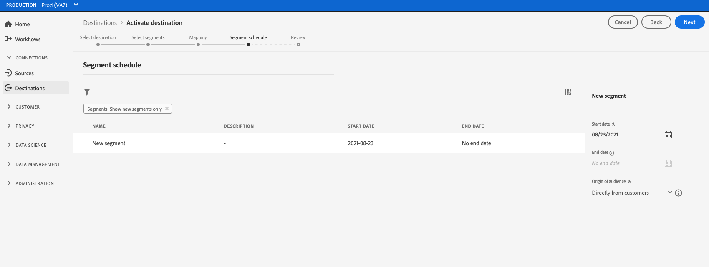

# 對串流區段匯出目的地啟用受眾資料

>[!IMPORTANT]
> 
>若要啟用資料，您需要 **[!UICONTROL 管理目的地]**, **[!UICONTROL 啟動目的地]**, **[!UICONTROL 檢視設定檔]**，和 **[!UICONTROL 檢視區段]** [存取控制權限](/help/access-control/home.md#permissions). 閱讀 [存取控制概觀](/help/access-control/ui/overview.md) 或聯絡您的產品管理員以取得所需的權限。

## 總覽 {#overview}

本文說明在Adobe Experience Platform區段串流目的地中啟用受眾資料所需的工作流程。

## 先決條件 {#prerequisites}

若要將資料啟用至目的地，您必須成功 [連接到目的地](./connect-destination.md). 如果尚未這麼做，請前往 [目的地目錄](../catalog/overview.md)，瀏覽支援的目的地，並設定您要使用的目的地。

## 選取您的目的地 {#select-destination}

1. 前往 **[!UICONTROL 連線>目的地]**，然後選取 **[!UICONTROL 目錄]** 標籤。

   

1. 選擇 **[!UICONTROL 啟用區段]** 在與您要啟用區段的目的地對應的卡片上，如下圖所示。

   

1. 選取您要用來啟用區段的目的地連線，然後選取 **[!UICONTROL 下一個]**.

   

1. 移至下一節，以 [選取區段](#select-segments).

## 選取您的區段 {#select-segments}

使用區段名稱左側的核取方塊，選取您要啟用至目的地的區段，然後選取 **[!UICONTROL 下一個]**.

## 對應屬性和身分 {#mapping}

>[!IMPORTANT]
>
>此步驟僅適用於某些區段串流目的地。 如果您的目的地 **[!UICONTROL 對應]** 步驟，跳到 [排程區段匯出](#scheduling).

有些區段串流目的地會要求您選取來源屬性或身分識別命名空間，以對應為目的地中的目標身分識別。

1. 在 **[!UICONTROL 對應]** 頁面，選取 **[!UICONTROL 新增對應]**.

   

1. 選取 **[!UICONTROL 源欄位]** 的下界。

   

1. 在 **[!UICONTROL 選擇源欄位]** 頁面，使用 **[!UICONTROL 選擇屬性]** 或 **[!UICONTROL 選取身分命名空間]** 在兩類可用源欄位之間切換的選項。 從可用 [!DNL XDM] 設定檔屬性和身分識別命名空間，選取您要對應至目的地的屬性，然後選擇 **[!UICONTROL 選擇]**.

   

1. 選取右側的按鈕 **[!UICONTROL 目標欄位]** 的下界。

   

1. 在 **[!UICONTROL 選擇目標欄位]** 頁，選擇要將源欄位映射到的目標標識命名空間，然後選擇 **[!UICONTROL 選擇]**.

   

1. 要添加更多映射，請重複步驟1到5。

### 套用轉換  {#apply-transformation}

>[!CONTEXTUALHELP]
>id="platform_destinations_activate_applytransformation"
>title="套用轉換 "
>abstract="使用未雜湊的來源欄位時勾選此選項，讓 Adobe Experience Platform 在啟動時自動將它們雜湊。"

將非雜湊來源屬性對應至目標預期雜湊的目標屬性時(例如： `email_lc_sha256` 或 `phone_sha256`)，檢查 **套用轉換** 選項，讓Adobe Experience Platform在啟動時自動雜湊來源屬性。

## 排程區段匯出 {#scheduling}

>[!CONTEXTUALHELP]
>id="platform_destinations_activate_enddate"
>title="結束日期"
>abstract="無法使用新增區段排程的結束日期。"

依預設， [!UICONTROL 區段排程] 頁面只會顯示您在目前啟動流程中選取的新區段。

若要查看所有要啟動至目的地的區段，請使用篩選選項並停用 **[!UICONTROL 僅顯示新區段]** 篩選。

1. 在 **[!UICONTROL 區段排程]** 頁面，選取每個區段，然後使用 **[!UICONTROL 開始日期]** 和 **[!UICONTROL 結束日期]** 設定傳送資料至目的地的時間間隔的選取器。

   

   * 某些目的地會要求您選取 **[!UICONTROL 受眾來源]** 對於每個區段，使用日曆選取器下方的下拉式功能表。 如果您的目的地不包含此選取器，請略過此步驟。

      

   * 有些目的地需要您手動對應 [!DNL Platform] 區段至目標目的地的對應項目。 若要這麼做，請選取每個區段，然後在 **[!UICONTROL 對應ID]** 欄位。 如果您的目的地不包含此欄位，請略過此步驟。

      

   * 有些目的地會要求您輸入 **[!UICONTROL 應用程式ID]** 啟用 [!DNL IDFA] 或 [!DNL GAID] 區段。 如果您的目的地不包含此欄位，請略過此步驟。

      

1. 選擇 **[!UICONTROL 下一個]** 前往 [!UICONTROL 檢閱] 頁面。

## 請檢閱 {#review}

在 **[!UICONTROL 檢閱]** 頁面，您可以看到您所選內容的摘要。 選擇 **[!UICONTROL 取消]** 來分解流， **[!UICONTROL 返回]** 修改設定，或 **[!UICONTROL 完成]** 確認您的選擇並開始將資料傳送至目的地。

### 同意政策評估 {#consent-policy-evaluation}

如果您的組織購買了 **Adobe Healthcare Shield** 或 **Adobe Privacy &amp; Security Shield**，請選取&#x200B;**[!UICONTROL 檢視適用的同意原則]**，以查看套用了哪些同意原則以及由於這些原則啟動中包含了多少個設定檔。閱讀 [同意政策評估](/help/data-governance/enforcement/auto-enforcement.md#consent-policy-evaluation) 以取得更多資訊。

### 資料使用原則檢查 {#data-usage-policy-checks}

在 **[!UICONTROL 檢閱]** 步驟中，Experience Platform也會檢查是否有任何資料使用策略違規。 以下顯示違反原則的範例。 除非您解決違規，否則無法完成區段啟用工作流程。 有關如何解決策略違規的資訊，請參閱 [資料使用策略違規](/help/data-governance/enforcement/auto-enforcement.md#data-usage-violation) （位於資料控管檔案一節）。

### 篩選區段 {#filter-segments}

此外，在此步驟中，您也可以使用頁面上的可用篩選器，以僅顯示排程或對應已隨此工作流程更新的區段。 您也可以切換要查看的表格欄。

如果您對您的選擇感到滿意，並且未檢測到任何違反策略的情況，請選擇 **[!UICONTROL 完成]** 確認您的選擇並開始將資料傳送至目的地。

## 驗證區段啟用 {#verify}

檢查 [目的地監視檔案](../../dataflows/ui/monitor-destinations.md) 以取得如何監控資料流向目的地的詳細資訊。

<!-- 
For [!DNL Facebook Custom Audience], a successful activation means that a [!DNL Facebook] custom audience would be created programmatically in [[!UICONTROL Facebook Ads Manager]](https://www.facebook.com/adsmanager/manage/). Segment membership in the audience would be added and removed as users are qualified or disqualified for the activated segments.

>[!TIP]
>
>The integration between Adobe Experience Platform and [!DNL Facebook] supports historical audience backfills. All historical segment qualifications are sent to [!DNL Facebook] when you activate the segments to the destination.
-->
