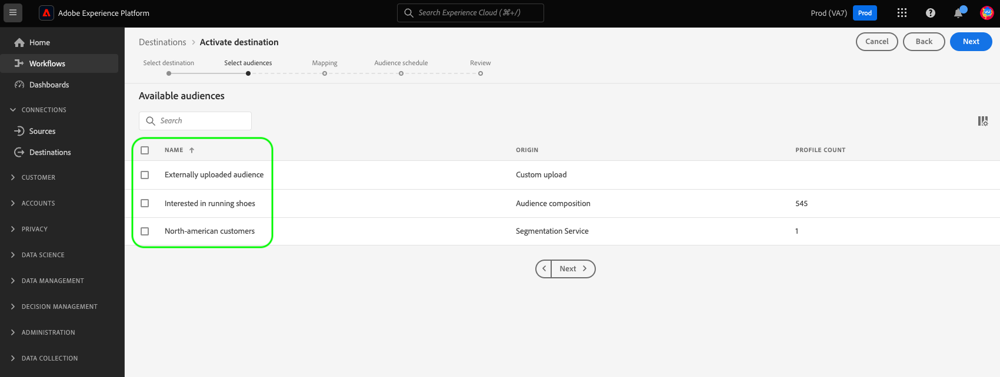
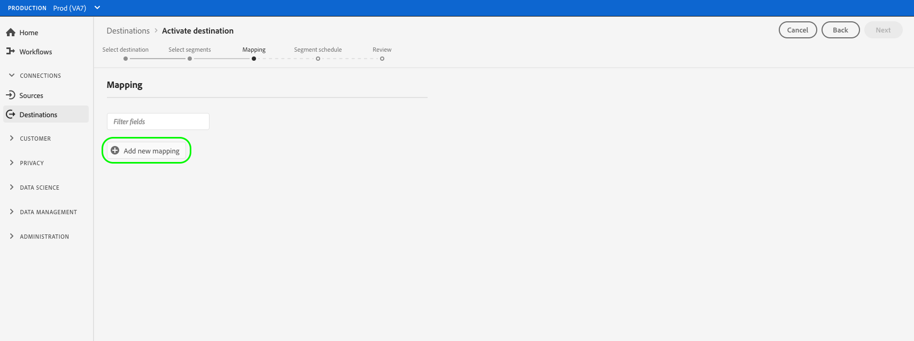
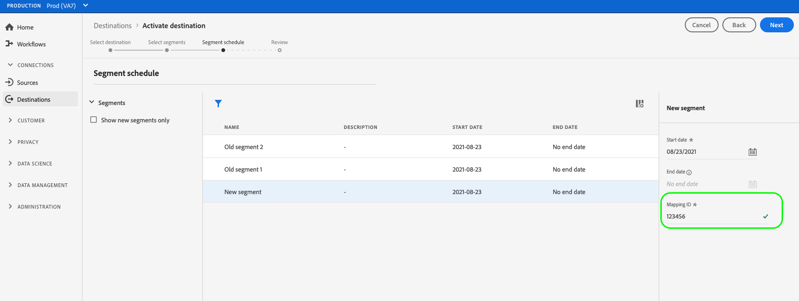

# 啟用串流目的地的對象

>[!IMPORTANT]
> 
> * 若要啟用對象並啟用 [對應步驟](#mapping) 的工作流程中，您需要 **[!UICONTROL 檢視目的地]**， **[!UICONTROL 啟用目的地]**， **[!UICONTROL 檢視設定檔]**、和 **[!UICONTROL 檢視區段]** [存取控制許可權](/help/access-control/home.md#permissions).
> * 若要在不透過 [對應步驟](#mapping) 的工作流程中，您需要 **[!UICONTROL 檢視目的地]**， **[!UICONTROL 啟用區段而不進行對應]**， **[!UICONTROL 檢視設定檔]**、和 **[!UICONTROL 檢視區段]** [存取控制許可權](/help/access-control/home.md#permissions).
>* 要匯出 *身分*，您需要 **[!UICONTROL 檢視身分圖表]** [存取控制許可權](/help/access-control/home.md#permissions).   {width="100" zoomable="yes"}
> 
> 閱讀 [存取控制總覽](/help/access-control/ui/overview.md) 或聯絡您的產品管理員以取得必要許可權。

## 概觀 {#overview}

本文說明在Adobe Experience Platform串流目的地啟用對象所需的工作流程。

## 先決條件 {#prerequisites}

若要對目的地啟用對象，您必須已成功 [已連線至目的地](./connect-destination.md). 如果您尚未這麼做，請前往 [目的地目錄](../catalog/overview.md)，瀏覽支援的目的地，並設定您要使用的目的地。

## 選取您的目的地 {#select-destination}

1. 前往 **[!UICONTROL 連線>目的地]**，然後選取 **[!UICONTROL 目錄]** 標籤。

   

1. 選取 **[!UICONTROL 啟用對象]** 位於您要啟用對象之目的地的對應卡片上，如下圖所示。

   

1. 選取您要用來啟用對象的目的地連線，然後選取「 」 **[!UICONTROL 下一個]**.

   

1. 移至下一個區段至 [選取您的對象](#select-audiences).

## 選取您的對象 {#select-audiences}

若要選取您要啟用至目的地的對象，請使用對象名稱左邊的核取方塊，然後選取「 」 **[!UICONTROL 下一個]**.

您可以根據對象的來源，從多種對象型別中進行選取：

* **[!UICONTROL 分段服務]**：細分服務在Experience Platform中產生的對象。 請參閱 [細分檔案](../../segmentation/ui/overview.md) 以取得更多詳細資料。
* **[!UICONTROL 自訂上傳]**：在Experience Platform外部產生的對象，並以CSV檔案的形式上傳至Platform。 若要深入瞭解外部對象，請參閱以下檔案： [匯入對象](../../segmentation/ui/overview.md#import-audience).
* 其他型別的對象，源自其他Adobe解決方案，例如 [!DNL Audience Manager].

## 對應屬性和身分 {#mapping}

>[!IMPORTANT]
>
>此步驟僅適用於部分受眾串流目的地。 如果您的目的地沒有 **[!UICONTROL 對應]** 步驟，跳至 [對象排程](#scheduling).

有些對象串流目的地會要求您選取來源屬性或身分名稱空間，以將目的地中的身分對應為目標身分。

1. 在 **[!UICONTROL 對應]** 頁面，選取 **[!UICONTROL 新增對應]**.

   

1. 選取右側的箭頭 **[!UICONTROL 來源欄位]** 登入點。

   

1. 在 **[!UICONTROL 選取來源欄位]** 頁面，使用 **[!UICONTROL 選取屬性]** 或 **[!UICONTROL 選取身分名稱空間]** 在兩個可用來源欄位類別之間切換的選項。 從可用的 [!DNL XDM] 設定檔屬性和身分名稱空間，選取要對應至目的地的設定檔屬性，然後選擇 **[!UICONTROL 選取]**.

   

1. 選取右側的按鈕 **[!UICONTROL 目標欄位]** 登入點。

   

1. 在 **[!UICONTROL 選取目標欄位]** 頁面，選取您要對應來源欄位的目標身分名稱空間，然後選擇 **[!UICONTROL 選取]**.

   

1. 若要新增更多對應，請重複步驟1至5。

### 套用轉換  {#apply-transformation}

>[!CONTEXTUALHELP]
>id="platform_destinations_activate_applytransformation"
>title="套用轉換 "
>abstract="使用未雜湊的來源欄位時勾選此選項，讓 Adobe Experience Platform 在啟動時自動將它們雜湊。"

將未雜湊的來源屬性對應到目的地預期會雜湊的目標屬性時(例如： `email_lc_sha256` 或 `phone_sha256`)，檢查 **套用轉換** 讓Adobe Experience Platform在啟動時自動雜湊來源屬性的選項。

## 排程對象匯出 {#scheduling}

>[!CONTEXTUALHELP]
>id="platform_destinations_activate_enddate"
>title="結束日期"
>abstract="無法使用新增對象排程的結束日期。"

根據預設， **[!UICONTROL 對象排程]** 頁面僅顯示您在目前啟用流程中選擇的新選取對象。

若要檢視所有啟用至您目的地的對象，請使用篩選選項並停用 **[!UICONTROL 僅顯示新對象]** 篩選。

1. 在 **[!UICONTROL 對象排程]** 頁面，選取每個對象，然後使用 **[!UICONTROL 開始日期]** 和 **[!UICONTROL 結束日期]** 選取器，設定傳送資料至目的地的時間間隔。

   

   * 有些目的地會要求您選取 **[!UICONTROL 對象來源]** 針對每個對象，使用行事曆選擇器下方的下拉式功能表。 如果您的目的地不包含此選擇器，請略過此步驟。

     

   * 有些目的地需要您手動對應 [!DNL Platform] 對象與目標目的地中的對應對象。 若要這麼做，請選取每個對象，然後在中輸入目的地平台中對應的對象ID **[!UICONTROL 對應ID]** 欄位。 如果您的目的地不包含此欄位，請略過此步驟。

     

   * 有些目的地會要求您輸入 **[!UICONTROL 應用程式ID]** 啟用時 [!DNL IDFA] 或 [!DNL GAID] 對象。 如果您的目的地不包含此欄位，請略過此步驟。

     

1. 選取 **[!UICONTROL 下一個]** 前往 [!UICONTROL 檢閱] 頁面。

## 檢閱 {#review}

在 **[!UICONTROL 檢閱]** 頁面中，您可以看到選取範圍的摘要。 選取 **[!UICONTROL 取消]** 若要分解流量， **[!UICONTROL 返回]** 以修改您的設定，或 **[!UICONTROL 完成]** 以確認您的選取範圍並開始傳送資料至目的地。

### 同意原則評估 {#consent-policy-evaluation}

如果您的組織購買了 **Adobe Healthcare Shield** 或 **Adobe Privacy &amp; Security Shield**，請選取&#x200B;**[!UICONTROL 檢視適用的同意原則]**，以查看套用了哪些同意原則以及由於這些原則啟動中包含了多少個設定檔。閱讀關於 [同意原則評估](/help/data-governance/enforcement/auto-enforcement.md#consent-policy-evaluation) 以取得詳細資訊。

### 資料使用原則檢查 {#data-usage-policy-checks}

在 **[!UICONTROL 檢閱]** 步驟，Experience Platform也會檢查是否有任何資料使用原則違規。 以下是違反原則的範例。 在解決違規之前，您無法完成對象啟用工作流程。 如需有關如何解決原則違規的資訊，請參閱 [資料使用原則違規](/help/data-governance/enforcement/auto-enforcement.md#data-usage-violation) 資料控管檔案區段中的。

### 篩選對象 {#filter-audiences}

此外，在此步驟中，您可以使用頁面上的可用篩選器，只顯示其排程或對應已隨著此工作流程而更新的對象。 您也可以切換要檢視的表格欄。

如果您對您的選取感到滿意，並且未偵測到任何原則違規，請選取 **[!UICONTROL 完成]** 以確認您的選取範圍並開始傳送資料至目的地。

## 驗證受眾啟用 {#verify}

檢查 [目的地監視檔案](../../dataflows/ui/monitor-destinations.md) 有關如何監視流向目的地的資料流的詳細資訊。

<!-- 
For [!DNL Facebook Custom Audience], a successful activation means that a [!DNL Facebook] custom audience would be created programmatically in [[!UICONTROL Facebook Ads Manager]](https://www.facebook.com/adsmanager/manage/). Audience membership in the audience would be added and removed as users are qualified or disqualified for the activated audiences.

>[!TIP]
>
>The integration between Adobe Experience Platform and [!DNL Facebook] supports historical audience backfills. All historical audience qualifications are sent to [!DNL Facebook] when you activate the audiences to the destination.
-->
