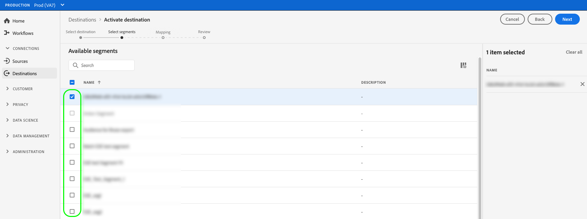

# 對串流設定檔匯出目的地啟用受眾資料

>[!IMPORTANT]
> 
> * 啟用資料並啟用 [對應步驟](#mapping) 工作流程中，您需要 **[!UICONTROL 管理目的地]**, **[!UICONTROL 啟動目的地]**, **[!UICONTROL 檢視設定檔]**，和 **[!UICONTROL 檢視區段]** [存取控制權限](/help/access-control/home.md#permissions).
> * 若要啟動資料，而不要透過 [對應步驟](#mapping) 工作流程中，您需要 **[!UICONTROL 管理目的地]**, **[!UICONTROL 啟用區段而不對應]**, **[!UICONTROL 檢視設定檔]**，和 **[!UICONTROL 檢視區段]** [存取控制權限](/help/access-control/home.md#permissions).
> 
> 閱讀 [存取控制概觀](/help/access-control/ui/overview.md) 或聯絡您的產品管理員以取得所需的權限。

## 總覽 {#overview}

本文說明在Adobe Experience Platform串流設定檔型目的地(例如Amazon Kinesis)中啟用受眾資料所需的工作流程。

## 先決條件 {#prerequisites}

若要將資料啟用至目的地，您必須成功 [連接到目的地](./connect-destination.md). 如果尚未這麼做，請前往 [目的地目錄](../catalog/overview.md)，瀏覽支援的目的地，並設定您要使用的目的地。

## 選取您的目的地 {#select-destination}

1. 前往 **[!UICONTROL 連線>目的地]**，然後選取 **[!UICONTROL 目錄]** 標籤。

   

1. 選擇 **[!UICONTROL 啟用區段]** 在與您要啟用區段的目的地對應的卡片上，如下圖所示。

   

1. 選取您要用來啟用區段的目的地連線，然後選取 **[!UICONTROL 下一個]**.

   

1. 移至下一節，以 [選取區段](#select-segments).

## 選取您的區段 {#select-segments}

使用區段名稱左側的核取方塊，選取您要啟用至目的地的區段，然後選取 **[!UICONTROL 下一個]**.



## 選取設定檔屬性 {#select-attributes}

在 **[!UICONTROL 對應]** 步驟中，選取您要傳送至目標目的地的設定檔屬性。

>[!NOTE]
>
> Adobe Experience Platform會從您的架構中，使用四個建議且常用的屬性來填入您的選取項目： `person.name.firstName`, `person.name.lastName`, `personalEmail.address`, `segmentMembership.status`.

檔案匯出會依下列方式而異，具體取決於 `segmentMembership.status` 已選取：
* 若 `segmentMembership.status` 欄位，導出的檔案包括 **[!UICONTROL 作用中]** 初始完整快照和 **[!UICONTROL 作用中]** 和 **[!UICONTROL 過期]** 成員。
* 若 `segmentMembership.status` 欄位未選中，導出的檔案僅包括 **[!UICONTROL 作用中]** 初始完整快照和後續增量導出中的成員。


1. 在 **[!UICONTROL 選擇屬性]** 頁面，選取 **[!UICONTROL 新增欄位]**.

   

1. 選取 **[!UICONTROL 結構欄位]** 的下界。

   

1. 在 **[!UICONTROL 選擇欄位]** 頁，選擇要發送到目標的XDM屬性，然後選擇 **[!UICONTROL 選擇]**.

   


1. 若要新增更多對應，請重複步驟1至3，然後選取 **[!UICONTROL 下一個]**.

## 請檢閱 {#review}

在 **[!UICONTROL 檢閱]** 頁面，您可以看到您所選內容的摘要。 選擇 **[!UICONTROL 取消]** 來分解流， **[!UICONTROL 返回]** 修改設定，或 **[!UICONTROL 完成]** 確認您的選擇並開始將資料傳送至目的地。


### 同意政策評估 {#consent-policy-evaluation}

如果您的組織購買了 **Adobe Healthcare Shield** 或 **Adobe Privacy &amp; Security Shield**，請選取&#x200B;**[!UICONTROL 檢視適用的同意原則]**，以查看套用了哪些同意原則以及由於這些原則啟動中包含了多少個設定檔。閱讀 [同意政策評估](/help/data-governance/enforcement/auto-enforcement.md#consent-policy-evaluation) 以取得更多資訊。

### 資料使用原則檢查 {#data-usage-policy-checks}

在 **[!UICONTROL 檢閱]** 步驟中，Experience Platform也會檢查是否有任何資料使用策略違規。 以下顯示違反原則的範例。 除非您解決違規，否則無法完成區段啟用工作流程。 有關如何解決策略違規的資訊，請參閱 [資料使用策略違規](/help/data-governance/enforcement/auto-enforcement.md#data-usage-violation) （位於資料控管檔案一節）。


### 篩選區段 {#filter-segments}

此外，在此步驟中，您也可以使用頁面上的可用篩選器，以僅顯示排程或對應已隨此工作流程更新的區段。


如果您對您的選擇感到滿意，並且未檢測到任何違反策略的情況，請選擇 **[!UICONTROL 完成]** 確認您的選擇並開始將資料傳送至目的地。

## 驗證區段啟用 {#verify}

已導出 [!DNL Experience Platform] 資料會以JSON格式登陸目標目的地。 例如，以下事件包含已符合特定區段資格並退出其他區段之對象的電子郵件地址設定檔屬性。 此潛在客戶的身分識別為ECID和電子郵件。

```json
{
  "person": {
    "email": "yourstruly@adobe.com"
  },
  "segmentMembership": {
    "ups": {
      "7841ba61-23c1-4bb3-a495-00d3g5fe1e93": {
        "lastQualificationTime": "2020-05-25T21:24:39Z",
        "status": "exited"
      },
      "59bd2fkd-3c48-4b18-bf56-4f5c5e6967ae": {
        "lastQualificationTime": "2020-05-25T23:37:33Z",
        "status": "existing"
      }
    }
  },
  "identityMap": {
    "ecid": [
      {
        "id": "14575006536349286404619648085736425115"
      },
      {
        "id": "66478888669296734530114754794777368480"
      }
    ],
    "email_lc_sha256": [
      {
        "id": "655332b5fa2aea4498bf7a290cff017cb4"
      },
      {
        "id": "66baf76ef9de8b42df8903f00e0e3dc0b7"
      }
    ]
  }
}
```
