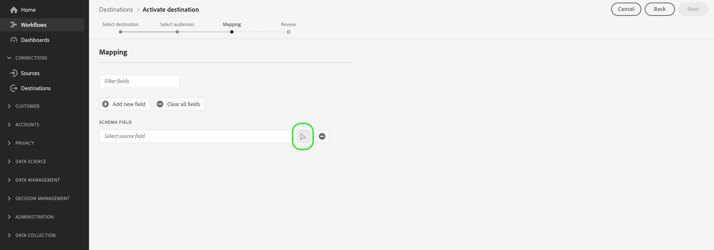

# 激活受眾資料以流式處理配置檔案導出目標

>[!IMPORTANT]
> 
> * 激活資料並啟用 [映射步驟](#mapping) 工作流中，您需要 **[!UICONTROL 管理目標]**。 **[!UICONTROL 激活目標]**。 **[!UICONTROL 查看配置檔案]**, **[!UICONTROL 查看段]** [訪問控制權限](/help/access-control/home.md#permissions)。
> * 在不通過 [映射步驟](#mapping) 工作流中，您需要 **[!UICONTROL 管理目標]**。 **[!UICONTROL 激活段而不映射]**。 **[!UICONTROL 查看配置檔案]**, **[!UICONTROL 查看段]** [訪問控制權限](/help/access-control/home.md#permissions)。
> 
> 閱讀 [訪問控制概述](/help/access-control/ui/overview.md) 或聯繫您的產品管理員以獲取所需權限。

## 總覽 {#overview}

本文介紹在Adobe Experience Platform流式基於配置檔案的目標(如AmazonKinesis)激活觀眾資料所需的工作流。

## 先決條件 {#prerequisites}

要將資料激活到目標，必須已成功 [連接到目標](./connect-destination.md)。 如果尚未執行此操作，請轉至 [目標目錄](../catalog/overview.md)，瀏覽支援的目標，並配置要使用的目標。

## 選擇目標 {#select-destination}

1. 轉到 **[!UICONTROL 連接>目標]**，然後選擇 **[!UICONTROL 目錄]** 頁籤。

   

1. 選擇 **[!UICONTROL 激活段]** 在與要激活段的目標相對應的卡上，如下圖所示。

   

1. 選擇要用於激活段的目標連接，然後選擇 **[!UICONTROL 下一個]**。

   

1. 移至下一節 [選擇段](#select-segments)。

## 選擇段 {#select-segments}

使用段名稱左側的複選框選擇要激活到目標的段，然後選擇 **[!UICONTROL 下一個]**。


## 選擇配置檔案屬性 {#select-attributes}

在 **[!UICONTROL 映射]** 步驟，選擇要發送到目標目標的配置檔案屬性。

>[!NOTE]
>
> Adobe Experience Platform用您的架構中的四個推薦的常用屬性來預先填充您的選擇： `person.name.firstName`。 `person.name.lastName`。 `personalEmail.address`。 `segmentMembership.status`。

檔案導出方式將因以下方式而異，具體取決於 `segmentMembership.status` 已選中：
* 如果 `segmentMembership.status` 欄位，導出的檔案包括 **[!UICONTROL 活動]** 初始完整快照中的成員和 **[!UICONTROL 活動]** 和 **[!UICONTROL 已過期]** 後續增量導出中的成員。
* 如果 `segmentMembership.status` 欄位未選中，導出的檔案僅包括 **[!UICONTROL 活動]** 初始完整快照和後續增量導出中的成員。


1. 在 **[!UICONTROL 選擇屬性]** ，選擇 **[!UICONTROL 添加新欄位]**。

   

1. 選擇右側的箭頭 **[!UICONTROL 架構欄位]** 的子菜單。

   

1. 在 **[!UICONTROL 選擇欄位]** 頁，選擇要發送到目標的XDM屬性，然後選擇 **[!UICONTROL 選擇]**。

   


1. 要添加更多映射，請重複步驟1至3，然後選擇 **[!UICONTROL 下一個]**。

## 請檢閱 {#review}

在 **[!UICONTROL 審閱]** 的子菜單。 選擇 **[!UICONTROL 取消]** 分解流， **[!UICONTROL 後退]** 修改設定，或 **[!UICONTROL 完成]** 確認選擇並開始向目標發送資料。


### 同意政策評估 {#consent-policy-evaluation}

如果您的組織購買了 **Adobe Healthcare Shield** 或 **Adobe Privacy &amp; Security Shield**，請選取&#x200B;**[!UICONTROL 檢視適用的同意原則]**，以查看套用了哪些同意原則以及由於這些原則啟動中包含了多少個設定檔。閱讀 [同意政策評估](/help/data-governance/enforcement/auto-enforcement.md#consent-policy-evaluation) 的子菜單。

### 資料使用策略檢查 {#data-usage-policy-checks}

在 **[!UICONTROL 審閱]** 步驟，Experience Platform還檢查是否存在任何資料使用策略違規。 下面顯示的示例違反了策略。 在解決違規之前，無法完成段激活工作流。 有關如何解決策略違規的資訊，請閱讀 [資料使用策略違規](/help/data-governance/enforcement/auto-enforcement.md#data-usage-violation) 資料治理文檔部分。


### 篩選區段 {#filter-segments}

此外，在此步驟中，還可以使用頁面上的可用篩選器來僅顯示其計畫或映射已作為此工作流的一部分進行更新的段。


如果您對所選內容感到滿意，但未檢測到任何違反策略的情況，請選擇 **[!UICONTROL 完成]** 確認選擇並開始向目標發送資料。

## 驗證段激活 {#verify}

已導出 [!DNL Experience Platform] 資料以JSON格式降落到目標目標中。 例如，以下事件包含已限定某個段並退出另一個段的受眾的電子郵件地址配置檔案屬性。 此潛在客戶的標識為ECID和電子郵件。

```json
{
  "person": {
    "email": "yourstruly@adobe.com"
  },
  "segmentMembership": {
    "ups": {
      "7841ba61-23c1-4bb3-a495-00d3g5fe1e93": {
        "lastQualificationTime": "2020-05-25T21:24:39Z",
        "status": "exited"
      },
      "59bd2fkd-3c48-4b18-bf56-4f5c5e6967ae": {
        "lastQualificationTime": "2020-05-25T23:37:33Z",
        "status": "realized"
      }
    }
  },
  "identityMap": {
    "ecid": [
      {
        "id": "14575006536349286404619648085736425115"
      },
      {
        "id": "66478888669296734530114754794777368480"
      }
    ],
    "email_lc_sha256": [
      {
        "id": "655332b5fa2aea4498bf7a290cff017cb4"
      },
      {
        "id": "66baf76ef9de8b42df8903f00e0e3dc0b7"
      }
    ]
  }
}
```
