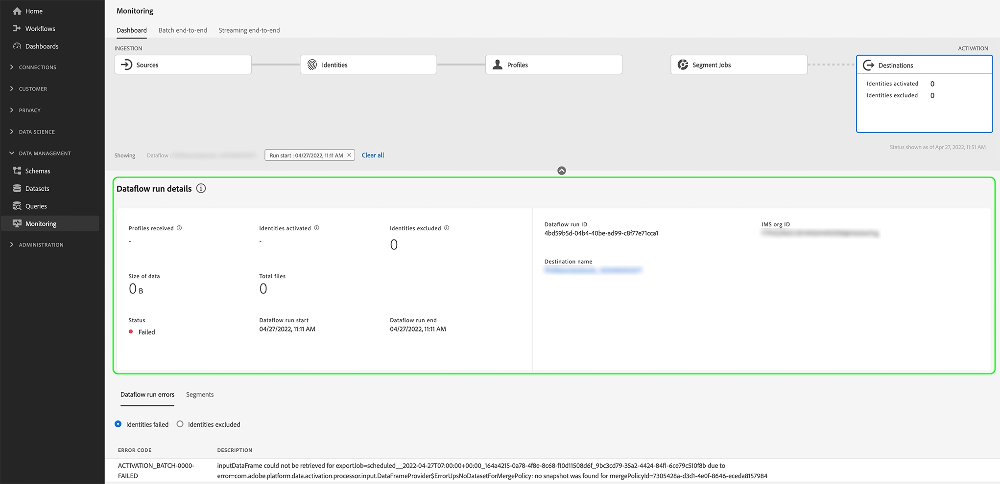

# 訂閱內容內目的地警報

Adobe Experience Platform可讓您訂閱Adobe Experience Platform活動的事件型警報。 警報減少或消除輪詢 [[!DNL Observability Insights] API](../../observability/api/overview.md) 為了檢查作業是否已完成、是否已到達工作流中的某個里程碑，或是否發生任何錯誤。

建立資料流時，您可以訂閱警報，以接收有關流運行狀態、成功或失敗的警報消息。

本文檔提供了如何訂閱接收目標資料流的警報消息的步驟。

## 快速入門

本檔案需要妥善了解下列Adobe Experience Platform元件：

* [目的地](../home.md):預先建置與目的地平台的整合，可順暢地從Adobe Experience Platform啟動資料。 您可以使用目的地來針對跨通路行銷活動、電子郵件行銷活動、目標廣告和其他許多使用案例，啟用已知和未知的資料。
* [可觀察性](../../observability/home.md): [!DNL Observability Insights] 可讓您透過使用統計量度和事件通知來監控Platform活動。
   * [警報](../../observability/alerts/overview.md):當您的Platform作業達到特定條件集時（例如，當系統違反臨界值時，可能會發生問題）,Platform會將警報訊息傳送給組織中已訂閱的任何使用者。

## 在UI中訂閱警報 {#subscribe-destination-alerts}

>[!CONTEXTUALHELP]
>id="platform_destination_alerts_subscribe"
>title="訂閱目標警報"
>abstract="警報允許您根據目標資料流的狀態接收通知。 如果資料流已啟動、成功、失敗或未向目標發送任何資料，則可以設定警報通知來獲取更新。"
>text="Learn more in documentation"

>[!IMPORTANT]
>
>您必須為Platform帳戶啟用電子郵件的即時通知，才能接收資料流的電子郵件型警報通知。

您可以在 [!UICONTROL 配置新目標] 步驟 [目的地連線](connect-destination.md) 工作流程。

選取您要訂閱的警報，然後選取 **[!UICONTROL 下一個]** 來檢查並完成資料流。

下表介紹了可用於目標資料流的警報。

* 針對串流目的地，僅 [!DNL Activation Skipped Rate Exceeded] 警報可用。
* 對於檔案型目的地，所有警報皆可使用。

| 警報 | 說明 |
| --- | --- |
| 目標流運行延遲 | 目的地流程執行需要超過150分鐘才啟動區段時，此警報會通知您。 |
| 目標流運行失敗 | 啟動目的地區段時發生錯誤時，此警報會通知您。 |
| 目標流運行成功 | 當區段成功啟動至目的地時，此警報會通知您。 |
| 目標流運行開始 | 目的地流程執行開始啟用區段時，此警報會通知您。 |
| 超過激活跳過率 | 當啟動跳過率超過總啟動數的1%時，此警報會通知您。 身分識別遺失屬性或違反同意時，會在啟用期間略過。 |

## 接收警報 {#receiving-alerts}

目標資料流運行後，您可以通過UI或電子郵件接收警報。

### 在UI中接收警報 {#receiving-alerts-in-ui}

警報在UI中會以Platform UI頂端標題中的通知圖示表示。 選擇通知表徵圖以查看有關資料流的特定警報消息。

此時將顯示通知面板，其中顯示您建立的資料流狀態更新清單。

您可以將滑鼠移到警報消息上，將它們標籤為已讀，也可以選擇時鐘錶徵圖來設定資料流狀態的將來提醒。

選擇警報消息以查看資料流的特定資訊。

此 [!UICONTROL 資料流運行詳細資訊] 頁。 螢幕的上半部顯示了資料流的概述，包括有關其屬性、相應資料流運行ID和高級錯誤摘要的資訊。

頁面的下半部顯示任何 [!UICONTROL 資料流運行錯誤] 資料流運行階段期間發生的錯誤。 從這裡，您可以預覽錯誤診斷或使用 [[!DNL Data Access] API](https://www.adobe.io/experience-platform-apis/references/data-access/) 下載與資料流對應的錯誤診斷或檔案清單。

有關處理資料流錯誤的詳細資訊，請參閱 [在UI中監視目標資料流](../../dataflows/ui/monitor-destinations.md).

### 通過電子郵件接收警報 {#receiving-alerts-by-email}

資料流的警報也通過電子郵件傳送給您。 在電子郵件正文中選擇資料流名稱，以查看有關資料流的詳細資訊。

與UI警報類似， [!UICONTROL 資料流運行概述] 頁面，提供您一個介面來調查與資料流關聯的任何錯誤。

## 訂閱和取消訂閱警報 {#subscribe-and-unsubscribe}

您可以訂閱更多警報或取消訂閱目標中現有目標資料流的已建立警報 [!UICONTROL 瀏覽] 頁面。

找出您要接收警報的目的地連線，並選取點(`...`)，查看選項的下拉式功能表。 下一步，選擇 **[!UICONTROL 訂閱警報]** 修改目標資料流的警報設定。

此時將出現一個彈出窗口，提供目標警報的清單。 選擇要訂閱或取消選擇要取消訂閱的警報的任何警報。 完成後，請選取 **[!UICONTROL 儲存]**.

## 後續步驟 {#next-steps}

本文檔提供了有關如何為目標資料流訂閱上下文內警報的逐步指南。 如需詳細資訊，請參閱 [警報UI指南](../../observability/alerts/ui.md).
