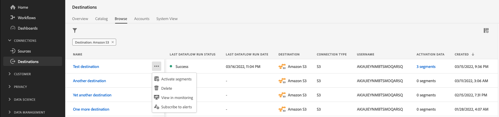

# 訂閱內容感知目的地警示

Adobe Experience Platform可讓您訂閱有關Adobe Experience Platform活動的事件型警報。 警報可減少或免除輪詢 [[!DNL Observability Insights] API](../../observability/api/overview.md) 以檢查工作是否已完成、是否已到達工作流程中的某個里程碑，或是否已發生任何錯誤。

建立資料流以接收有關資料流執行的狀態、成功或失敗的警報訊息時，您可以訂閱警報。

本檔案提供如何訂閱接收目的地資料流程之警示訊息的步驟。

## 快速入門

本檔案需要您實際瞭解下列Adobe Experience Platform元件：

* [目的地](../home.md)：預先建立與目的地平台的整合，可順暢地從Adobe Experience Platform啟用資料。 您可使用目的地啟用已知和未知的資料，以進行跨通路行銷活動、電子郵件行銷活動、設定目標的廣告活動和其他諸多使用案例。
* [可觀察性](../../observability/home.md)： [!DNL Observability Insights] 可讓您透過使用統計量度和事件通知來監控Platform活動。
   * [警報](../../observability/alerts/overview.md)：當您的Platform作業達到特定條件集時（例如系統違反臨界值時會發生問題），Platform可以向您組織中訂閱警報訊息的任何使用者傳送警報訊息。

## 訂閱UI中的警示 {#subscribe-destination-alerts}

>[!CONTEXTUALHELP]
>id="platform_destination_alerts_subscribe"
>title="訂閱目的地警示"
>abstract="警示可讓您根據目的地資料流的狀態接收通知。如果資料流已啟動、成功、失敗或未向目的地傳送任何資料，您可以設定警示通知以獲取更新。"
>text="Learn more in documentation"

>[!IMPORTANT]
>
>您必須啟用Platform帳戶的即時電子郵件通知，才能接收資料流的電子郵件警示通知。

您可以在以下期間為資料流啟用警報： [!UICONTROL 設定新目的地] 步驟 [目的地連線](connect-destination.md) 工作流程。

選取您要訂閱的警示，然後選取 **[!UICONTROL 下一個]** 以檢閱並完成您的資料流。

下表說明目的地資料流可用的警示。

* 對於串流目的地，僅限 [!DNL Activation Skipped Rate Exceeded] 警報可供使用。
* 針對以檔案為基礎的目的地，所有警報皆可使用。

| 警報 | 說明 |
| --- | --- |
| 目的地資料流執行延遲 | 此警報會在目的地流程執行耗時超過150分鐘啟動對象時通知您。 |
| 目的地流程執行失敗 | 此警報會在將受眾啟用至目的地時發生錯誤時通知您。 |
| 目的地流程執行成功 | 此警報會在對象成功啟用至目的地時通知您。 |
| 目的地流程執行開始 | 此警報會在目的地流程執行開始啟用對象時通知您。 |
| 超過啟用略過率 | 此警報會在啟用略過率超過啟用總數的1%時通知您。 當身分缺少屬性或違反同意時，會在啟用期間略過身分。 |

## 接收警示 {#receiving-alerts}

目的地資料流執行後，您可以透過UI或電子郵件接收警報。

### 在UI中接收警報 {#receiving-alerts-in-ui}

警報會在UI中以Platform UI頂端標題中的通知圖示表示。 選取通知圖示以檢視與資料流相關的特定警報訊息。

此時會顯示通知面板，其中顯示您所建立之資料流上的狀態更新清單。

您可以將滑鼠指標暫留在警示訊息上，將其標示為已讀取，也可以選取時鐘圖示來設定資料流狀態的未來提醒。

選取警報訊息以檢視資料流的特定資訊。

此 [!UICONTROL 資料流執行詳細資料] 頁面便會顯示。 畫面的上半部分會顯示資料流的概觀，包括其屬性、對應資料流執行ID和高級別錯誤摘要的相關資訊。

頁面下半部會顯示任何 [!UICONTROL 資料流執行錯誤] 在資料流執行階段發生的錯誤。 從這裡，您可以預覽錯誤診斷或使用 [[!DNL Data Access] API](https://www.adobe.io/experience-platform-apis/references/data-access/) 以下載與您的資料流對應的錯誤診斷或檔案資訊清單。

如需處理資料流錯誤的詳細資訊，請參閱以下指南： [在UI中監視目的地資料流](../../dataflows/ui/monitor-destinations.md).

### 透過電子郵件接收警示 {#receiving-alerts-by-email}

資料流的警報也會透過電子郵件傳送給您。 選取電子郵件內文中的資料流名稱，以檢視資料流的詳細資訊。

與UI警報類似， [!UICONTROL 資料流執行概觀] 頁面隨即顯示，提供您一個介面來調查與資料流關聯的任何錯誤。

## 訂閱和取消訂閱警示 {#subscribe-and-unsubscribe}

您可以針對目的地中現有的目的地資料流，訂閱更多警報或取消訂閱已建立的警報 [!UICONTROL 瀏覽] 頁面。

找到您要接收警示的目的地連線，並選取省略符號(`...`)，以檢視選項的下拉式功能表。 接下來，選取 **[!UICONTROL 訂閱警示]** 修改目的地資料流的警示設定。

隨即出現快顯視窗，提供目的地警示清單。 選取您要訂閱的警示，或取消選取您要取消訂閱的警示。 完成後，選取 **[!UICONTROL 儲存]**.

## 後續步驟 {#next-steps}

本檔案提供逐步指南，說明如何訂閱目的地資料流的內容感知警報。 如需詳細資訊，請參閱 [警報UI指南](../../observability/alerts/ui.md).
