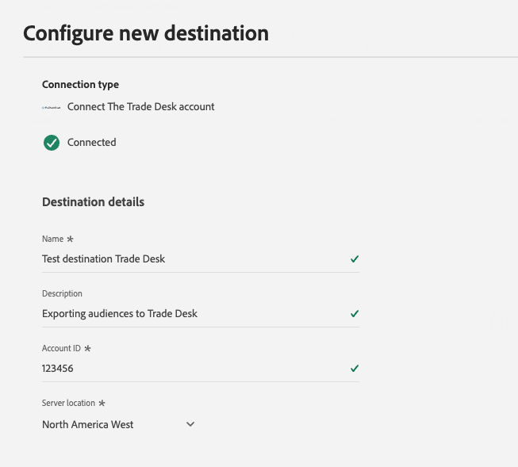
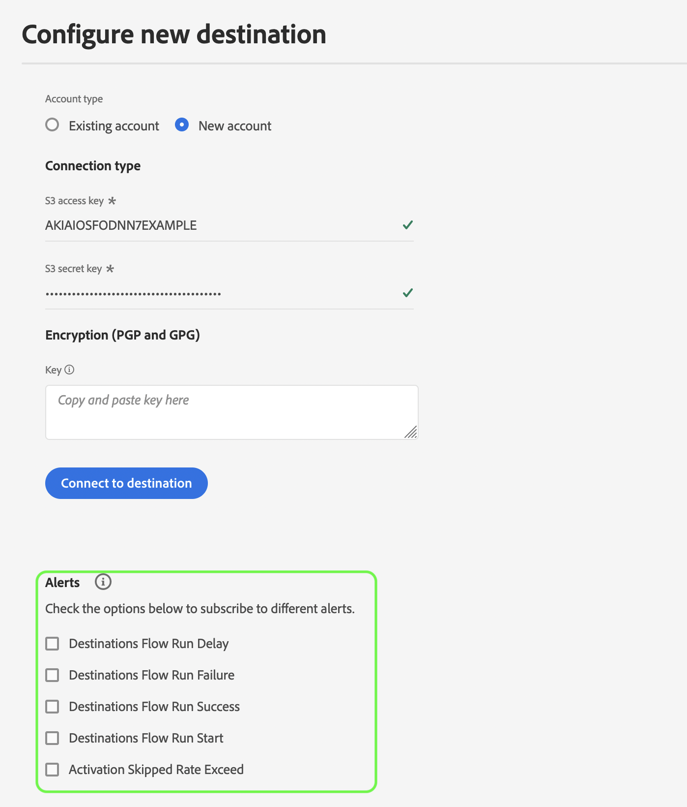

# 新建目標連接

>[!IMPORTANT]
> 
>* 要連接到目標，您需要 **[!UICONTROL 管理目標]** [訪問控制權限](/help/access-control/home.md#permissions)。 閱讀 [訪問控制概述](/help/access-control/ui/overview.md) 或聯繫您的產品管理員以獲取所需權限。
>* 要連接到支援資料集導出的目標，您需要 **[!UICONTROL 管理和激活資料集目標]** [訪問控制權限](/help/access-control/home.md#permissions)。 閱讀 [訪問控制概述](/help/access-control/ui/overview.md) 或聯繫您的產品管理員以獲取所需權限。

## 總覽 {#overview}

在將受眾資料發送到目標之前，必須設定到目標平台的連接。 本文介紹如何設定新的目標連接，然後可以使用Adobe Experience Platform用戶介面激活段或導出資料集。

## 在目錄中查找所需目標 {#setup}

1. 轉到 **[!UICONTROL 連接]** > **[!UICONTROL 目標]**，然後選擇 **[!UICONTROL 目錄]** 頁籤。

   

2. 目錄中的目標卡可能具有不同的操作控制，具體取決於您是否與目標有現有連接，以及目標是否支援激活段、導出資料集或兩者。 您可能會看到目標卡的下列任何控制項：

   * **[!UICONTROL 設定]**。 首先需要設定到此目標的連接，然後才能激活段或導出資料集。
   * **[!UICONTROL 啟動]**. 已設定到此目標的連接。 此目標支援段激活和資料集導出。
   * **[!UICONTROL 激活段]**。 已設定到此目標的連接。 此目標僅支援段激活。

   有關這些控制項之間差異的詳細資訊，還可參閱 [目錄](../ui/destinations-workspace.md#catalog) 目標工作區文檔的「 」部分。

   選擇 **[!UICONTROL 設定]**。 **[!UICONTROL 激活]**&#x200B;或 **[!UICONTROL 激活段]**，具體取決於您可以使用哪個控制項。

   

   

3. 如果已選擇 **[!UICONTROL 設定]**，跳到下一步，到 [驗證](#authenticate) 到目的地。

   如果已選擇 **[!UICONTROL 激活]**。 **[!UICONTROL 激活段]**&#x200B;或 **[!UICONTROL 導出資料集]**，您現在可以看到現有目標連接的清單。

   選擇 **[!UICONTROL 配置新目標]** 建立到目標的新連接。

   

## 驗證到目標 {#authenticate}

連接到目標的第一步是驗證到目標平台。

根據您要連接到的目標，您可能會被帶到目標合作夥伴的頁面進行身份驗證，或者可能會要求您直接在平台工作流中輸入身份驗證憑據。 下面是驗證到 [!DNL Amazon S3] 目標。 每個目標文檔頁面都提供了有關所需輸入的詳細說明(例如，請參閱的驗證部分 [[!DNL Amazon S3]](/help/destinations/catalog/cloud-storage/amazon-s3.md#authenticate) 和 [[!DNL Facebook]](/help/destinations/catalog/social/facebook.md#authenticate))。

**[!DNL Amazon S3]必需和可選的驗證參數**

## 設定連接參數 {#set-up-connection-parameters}

如果您已經設定了目標的身份驗證，則可以繼續使用現有帳戶或設定新帳戶。

根據您要連接到的目標，可能會要求您輸入不同類型的連接參數。 例如，當連接到 [!DNL Amazon S3] 目標，要求您提供有關 [!DNL Amazon S3] 儲存檔案的儲存段名稱和資料夾路徑。 以下為兩個實例 [!DNL Amazon S3] 目的地和 [!DNL Trade Desk] 目標。 每個目標文檔頁面都提供了有關所需輸入的詳細說明。

>[!IMPORTANT]
>
>下面的影像僅用於圖示目的。 目標連接詳細資訊因目標而異。 有關目標的連接詳細資訊，請閱讀 **連接到目標** 的 [目標目錄](../catalog/overview.md) 頁面(例如， [[!DNL Google Customer Match]](../catalog/advertising/google-customer-match.md#connect)。 [[!DNL Trade Desk]](/help/destinations/catalog/advertising/tradedesk.md#connect)或 [[!DNL Amazon S3]](/help/destinations/catalog/cloud-storage/amazon-s3.md#destination-details))。

**[!DNL Amazon S3]必需和可選輸入參數**

**[!DNL The Trade Desk]必需和可選輸入參數**

### (Beta)設定導出檔案的檔案格式選項 {#file-formatting-and-compression-options}

對於基於檔案的目標，可以配置與導出檔案的格式化和壓縮方式相關的各種設定。 有關所有可用格式和壓縮選項的詳細資訊，請閱讀 [配置基於檔案的目標的檔案格式選項教程](/help/destinations/ui/batch-destinations-file-formatting-options.md)。

### 為段激活或資料集導出設定目標連接 {#segment-activation-or-dataset-exports}

某些基於檔案的目標支援段激活和資料集導出。 對於這些目標，您可以選擇是建立連接以激活段還是導出資料集。

### 啟用目標警報 {#enable-alerts}

1. （可選）選擇要訂閱的目標資料流警報。 在建立資料流以接收有關流運行狀態、成功或失敗的警報消息時，可以訂閱警報。 可用警報因您所連接的目標類型（基於檔案或流）而異。 閱讀 [訂閱上下文中的目標警報](alerts.md) 有關目標資料流警報的詳細資訊。

   

2. 選取&#x200B;**[!UICONTROL 「下一步」]**。

   

## 選擇市場營銷活動 {#select-marketing-actions}

1. 選擇適用於要導出到目標的資料的市場營銷操作。 市場營銷操作指明將資料導出到目標的目的。 您可以從Adobe定義的市場營銷活動中進行選擇，也可以建立自己的市場營銷活動。 有關市場營銷活動的詳細資訊，請參閱 [資料使用策略概述](../../data-governance/policies/overview.md) 的子菜單。

   

2. 選擇 **[!UICONTROL 保存並退出]** 保存目標配置，或選擇 **[!UICONTROL 下一個]** 繼續訪問受眾資料 [激活流](activation-overview.md)。

## 後續步驟 {#next-steps}

通過閱讀此文檔，您已學會了如何使用Experience PlatformUI建立到目標的連接。 作為提醒，可用的連接參數和所需的連接參數因目標而異。 您還應查閱中的目標文檔頁 [目標目錄](/help/destinations/catalog/overview.md) 按目標類型獲取有關所需輸入和可用選項的特定資訊。

接下來，您可以繼續 [激活段](/help/destinations/ui/activation-overview.md) 或 [導出資料集](/help/destinations/ui/export-datasets.md) 去你的目的地。