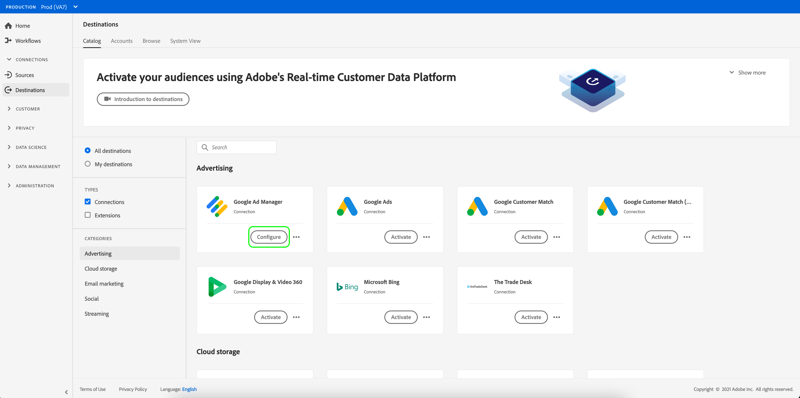

# 連接到目標

請依照下列步驟連線至Adobe Experience Platform的目的地：

1. 登入[Experience PlatformUI](https://platform.adobe.com/)並從左導覽列選擇&#x200B;**[!UICONTROL Destinations]**。

   

2. 在[[!UICONTROL Catalog]](./destinations-workspace.md#catalog)標籤中，選擇要連接的目標。

3. 選擇&#x200B;**[!UICONTROL Configure]**&#x200B;以啟動連接目標嚮導。

   

   >[!NOTE]
   >
   >如果存在與目標的連接，您可以在目標卡上看到&#x200B;**[!UICONTROL Activate]**&#x200B;按鈕。 有關&#x200B;**[!UICONTROL Activate]**&#x200B;和&#x200B;**[!UICONTROL Configure]**&#x200B;之間差異的詳細資訊，請參閱目標工作區文檔的[目錄](../ui/destinations-workspace.md#catalog)部分。

4. 有關如何連接到特定目標類型的說明，請參閱[目標目錄概述](../catalog/overview.md)。

5. （可選）觀賞以下影片，以瞭解如何連線至目的地並啟用區段至目的地的概觀。

   >[!VIDEO](https://video.tv.adobe.com/v/29710?quality=12)
