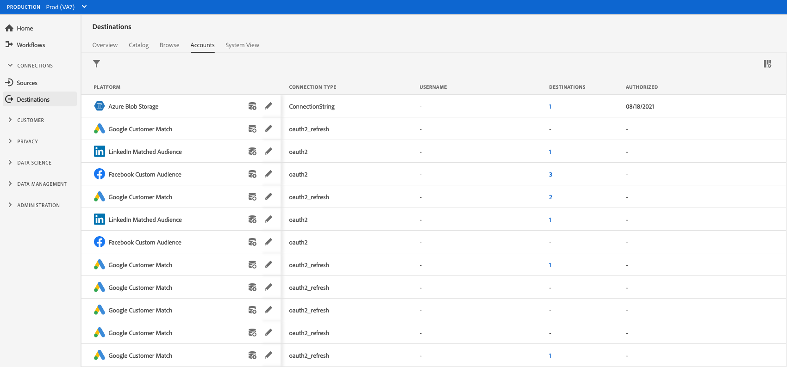

# 刪除目的地帳戶

## 概觀 {#overview}

**[!UICONTROL Accounts]**&#x200B;索引標籤顯示您已與各種目的地建立之連線的詳細資料。 如需每個目的地帳戶的所有可用資訊，請參閱[帳戶總覽](../ui/destinations-workspace.md#accounts)。

本教學課程涵蓋如何使用Experience Platform UI刪除不再需要的目的地帳戶的步驟。

## 刪除帳戶 {#delete}

>[!TIP]
>
>在刪除目的地帳戶之前，您必須先刪除與目的地帳戶相關聯的任何現有資料流。 若要刪除現有的目的地資料流，請參閱有關[在UI](./delete-destinations.md)中刪除目的地資料流的教學課程。

請依照下列步驟刪除現有的目的地帳戶。

1. 前往[Experience Platform UI](https://platform.adobe.com/)，然後從左側導覽列中選取&#x200B;**[!UICONTROL Destinations]**。 從頂端標題選取&#x200B;**[!UICONTROL Accounts]**&#x200B;以檢視您現有的帳戶。

   

2. 選取左上方的篩選圖示以啟動排序面板。 排序面板會提供您所有目的地的清單。 您可以從清單中選取多個目的地，以檢視與所選目的地相關聯的已篩選帳戶選擇。

   

3. 選取您要刪除之帳戶名稱旁的省略符號(`...`)。 出現快顯面板，提供帳戶&#x200B;**[!UICONTROL Activate audiences]**、**[!UICONTROL Edit details]**&#x200B;和&#x200B;**[!UICONTROL Delete]**&#x200B;的選項。 選取 **[!UICONTROL Delete]**&#x200B;按鈕以刪除所需的帳戶。

   

4. 最後確認對話方塊出現，選取&#x200B;**[!UICONTROL Delete]**&#x200B;以完成程式。

## 後續步驟 {#next-steps}

您已成功使用目的地工作區來刪除現有帳戶。

如需有關如何使用[!DNL Flow Service] API以程式設計方式執行這些操作的步驟，請參閱有關使用Flow Service API [刪除連線的教學課程](../api/delete-destination-account.md)
