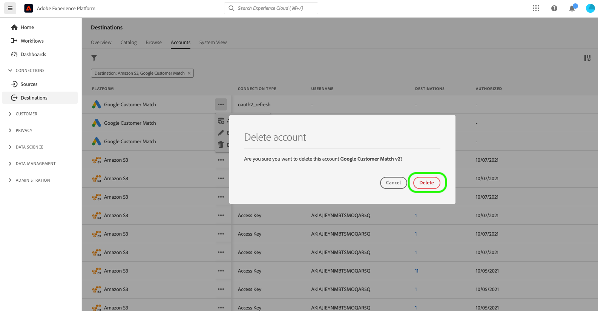

# 刪除目標帳戶

## 總覽 {#overview}

的 **[!UICONTROL 帳戶]** 頁籤顯示您已與各種目標建立的連接的詳細資訊。 請參閱 [帳戶概述](../ui/destinations-workspace.md#accounts) 獲取每個目標帳戶上可獲取的所有資訊。

本教程介紹了使用Experience PlatformUI刪除不再需要的目標帳戶的步驟。

## 刪除帳戶 {#delete}

>[!TIP]
>
>在刪除目標帳戶之前，必須先刪除與目標帳戶關聯的任何現有資料流。 要刪除現有目標資料流，請參閱上的教程 [刪除UI中的目標資料流](./delete-destinations.md)。

按照以下步驟刪除現有目標帳戶。

1. 登錄到 [Experience PlatformUI](https://platform.adobe.com/) 選擇 **[!UICONTROL 目標]** 的下界。 選擇 **[!UICONTROL 帳戶]** 查看現有帳戶。

   

2. 選擇篩選器表徵圖  的子菜單。 排序面板提供所有目標的清單。 您可以從清單中選擇多個目標，以查看與所選目標關聯的帳戶的篩選選擇。

   

3. 選取橢圓(`...`)。 出現一個彈出面板，提供選項 **[!UICONTROL 激活段]**。 **[!UICONTROL 編輯詳細資訊]**, **[!UICONTROL 刪除]** 賬戶。 選擇  **[!UICONTROL 刪除]** 按鈕以刪除所需的帳戶。

   

4. 出現最終確認對話框，選擇 **[!UICONTROL 刪除]** 來完成此過程。

## 後續步驟

按照本教程，您已成功使用目標工作區刪除現有帳戶。

有關如何使用 [!DNL Flow Service] API，請參閱有關 [使用流服務API刪除連接](../api/delete-destination-account.md)
