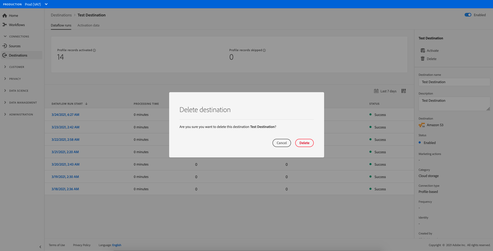

# 刪除目標 {#delete-destinations}

## 總覽 {#overview}

在Adobe Experience Platform用戶介面中，可以刪除到目標的現有連接。

刪除目標會將任何現有資料流刪除到該目標。 在刪除資料流之前，所有激活到您刪除的目標的段都將取消映射。

有兩種方法可從 [!DNL Platform] [!DNL UI]。 您可以：

* [從 [!UICONTROL 瀏覽] 頁籤](#delete-browse-tab)
* [從目標詳細資訊頁刪除目標](#delete-destination-details-page)

## 從「瀏覽」頁籤中刪除目標{#delete-browse-tab}

按照以下步驟從 [!UICONTROL 瀏覽] 頁籤。

1. 登錄到 [Experience PlatformUI](https://platform.adobe.com/) 選擇 **[!UICONTROL 目標]** 的下界。 要查看現有目標，請選擇 **[!UICONTROL 瀏覽]** 的下界。

   

2. 選擇篩選器表徵圖  的子菜單。 排序面板提供所有目標的清單。 可以從清單中選擇多個目標，以查看與所選目標關聯的資料流的篩選選擇。

   

3. 選擇  按鈕，然後選擇  **[!UICONTROL 刪除]** 刪除現有目標連接。
   

4. 選擇 **[!UICONTROL 刪除]** 確認刪除目標連接。

   

## 從目標詳細資訊頁刪除目標{#delete-destination-details-page}

按照以下步驟從目標詳細資訊頁面中刪除目標。

1. 登錄到 [Experience PlatformUI](https://platform.adobe.com/) 選擇 **[!UICONTROL 目標]** 的下界。 要查看現有目標，請選擇 **[!UICONTROL 瀏覽]** 的下界。

   

2. 選擇篩選器表徵圖  的子菜單。 排序面板提供所有目標的清單。 可以從清單中選擇多個目標，以查看與所選目標關聯的資料流的篩選選擇。

   

3. 選擇要刪除的目標的名稱。

   

   * 如果目標具有現有資料流，則將轉到 [!UICONTROL 資料流運行] 頁籤。

      

   * 如果目標沒有現有資料流，則您將進入一個空頁，在該頁中可以開始激活受眾。

      

4. 選擇 **[!UICONTROL 刪除]** 右欄。

   

5. 選擇 **[!UICONTROL 刪除]** 的子菜單。

   

   >[!NOTE]
   >
   >根據伺服器負載，可能需要幾分鐘 [!DNL Platform] 刪除目標。
