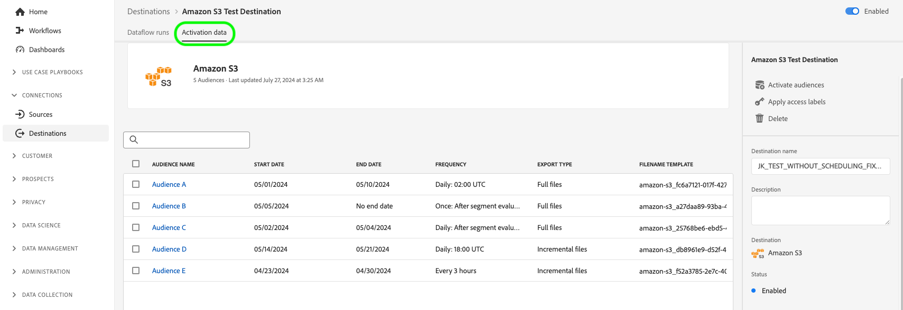

# 檢視目的地詳細資料

## 概觀 {#overview}

在Adobe Experience Platform使用者介面中，您可以檢視及監視目標的屬性和活動。 這些詳細資訊包括目的地的名稱和ID、啟用或停用目的地的控制項及其他。 詳細資訊也包含啟用的設定檔記錄、啟用的身分、失敗和排除的身分，以及資料流執行的歷程記錄等量度。

>[!NOTE]
>
>目的地詳細資訊頁面是[!DNL Platform] [!DNL UI]中[!UICONTROL 目的地]工作區的一部分。 如需詳細資訊，請參閱[[!UICONTROL 目的地]工作區總覽](./destinations-workspace.md)。

## 檢視目的地詳細資料 {#view-details}

請依照下列步驟，檢視現有目的地的詳細資訊。 您可以找出目的地的目的地ID、建立目的地的使用者、目的地的建立時間以及其他資訊。

1. 登入[Experience PlatformUI](https://platform.adobe.com/)，並從左側導覽列中選取&#x200B;**[!UICONTROL 目的地]**。 從頂端標題選取&#x200B;**[!UICONTROL 瀏覽]**&#x200B;以檢視您現有的目的地。

   

2. 選取左上方的篩選圖示以啟動排序面板。 排序面板會提供您所有目的地的清單。 您可以從清單中選取多個目的地，以檢視與所選目的地相關聯的資料流篩選選取專案。

   

3. 選取您想要顯示詳細資訊之目的地的列。 這會顯示右側邊欄，其中包含有關目的地的資訊，包括目的地ID、建立目的地連線的使用者以及其他資訊。

   

4. 或者，您可以選取要檢視的目的地&#x200B;*的*&#x200B;名稱，以顯示其他目的地的相關資訊。

   

5. 目的地的詳細資訊頁面會顯示在右側邊欄中，顯示其可用的控制項。

   

## 右側邊欄 {#right-rail}

右邊欄會顯示所選目的地的基本資訊。

下表涵蓋右側邊欄提供的控制項和詳細資訊：

| 右側邊欄專案 | 說明 |
| --- | --- |
| [!UICONTROL 啟用對象] | 選取此控制項可編輯哪些對象已對應至目的地、更新匯出排程，或新增及移除已對應的屬性和身分。 如需詳細資訊，請參閱[啟用受眾資料至受眾串流目的地](./activate-segment-streaming-destinations.md)、[啟用受眾資料至批次設定檔目的地](./activate-batch-profile-destinations.md)以及[啟用受眾資料至串流設定檔目的地](./activate-streaming-profile-destinations.md)的相關指南。 |
| [!UICONTROL 刪除] | 可讓您刪除此資料流，並取消對應先前已啟用的對象（如果存在）。 |
| [!UICONTROL 目的地名稱] | 可編輯此欄位以更新目的地的名稱。 |
| [!UICONTROL 說明] | 您可以編輯此欄位，以更新或新增選擇性說明至目的地。 |
| [!UICONTROL 目標] | 代表傳送對象的目的地平台。 如需詳細資訊，請參閱[目的地目錄](../catalog/overview.md)。 |
| [!UICONTROL 狀態] | 指示目的地是啟用或停用。 |
| [!UICONTROL 行銷動作] | 表示適用於此目的地以進行資料控管的行銷動作（使用案例）。 |
| [!UICONTROL 類別] | 指示目的地型別。 如需詳細資訊，請參閱[目的地目錄](../catalog/overview.md)。 |
| [!UICONTROL 連線型別] | 指出將您的對象傳送至目的地所使用的表單。 可能的值包括[!UICONTROL Cookie]和[!UICONTROL 設定檔型]。 |
| [!UICONTROL 頻率] | 指出將對象傳送到目的地的頻率。 可能的值包括[!UICONTROL 串流]和[!UICONTROL 批次]。 |
| [!UICONTROL 身分] | 代表目的地接受的身分名稱空間，例如`GAID`、`IDFA`或`email`。 如需接受之身分名稱空間的詳細資訊，請參閱[身分名稱空間概觀](../../identity-service/features/namespaces.md)。 |
| [!UICONTROL 建立者：] | 表示建立此目的地的使用者。 |
| [!UICONTROL 已建立] | 表示建立此目的地的UTC日期時間。 |

{style="table-layout:auto"}

## [!UICONTROL 已啟用]/[!UICONTROL 已停用]切換 {#enabled-disabled-toggle}

您可以使用&#x200B;**[!UICONTROL 已啟用]/[!UICONTROL 已停用]**&#x200B;切換來開始和暫停所有資料匯出至目的地。

## [!UICONTROL 資料流執行] {#dataflow-runs}

[!UICONTROL 資料流執行]索引標籤會針對您的資料流執行提供量度資料給批次和串流目的地。 如需詳細資訊和量度定義，請參閱[監視資料流](monitor-dataflows.md)。

>[!NOTE]
>
>* 目的地監視功能目前支援Experience Platform *中除* [Adobe Target](/help/destinations/catalog/personalization/adobe-target-connection.md)、[自訂個人化](/help/destinations/catalog/personalization/custom-personalization.md)和[Experience Cloud對象](/help/destinations/catalog/adobe/experience-cloud-audiences.md)目的地以外的所有目的地。
>* 對於[Amazon Kinesis](/help/destinations/catalog/cloud-storage/amazon-kinesis.md)、[Azure事件中樞](/help/destinations/catalog/cloud-storage/azure-event-hubs.md)和[HTTP API](/help/destinations/catalog/streaming/http-destination.md)目的地，與已排除、失敗和已啟用的身分相關的量度是估計值。 較大量的啟用資料會導致量度的準確性較高。

### 資料流執行持續時間 {#dataflow-runs-duration}

串流和檔案型目的地之間的資料流執行時間有差異。

### 串流目的地 {#streaming}

雖然大多數串流資料流執行所指示的&#x200B;**[!UICONTROL 處理持續時間]**&#x200B;大約是四個小時（如下圖所示），但任何資料流執行的實際處理時間都短很多。 若Experience Platform需要重試對目的地的呼叫，資料流執行視窗會維持較長的開啟時間，同時確保不會錯過相同時間視窗中任何延遲送達的資料。

如需詳細資訊，請參閱監視檔案中有關[資料流執行到串流目的地](/help/dataflows/ui/monitor-destinations.md#dataflow-runs-for-streaming-destinations)的資訊。

### 以檔案為基礎的目的地 {#file-based}

針對以檔案為基礎的目的地執行資料流，**[!UICONTROL 處理持續時間]**&#x200B;取決於要匯出的資料大小以及系統載入。 另請注意，對檔案型目的地執行的資料流會依對象細分。

如需詳細資訊，請參閱監視檔案中關於批次（檔案型）目的地](/help/dataflows/ui/monitor-destinations.md#dataflow-runs-for-batch-destinations)的[資料流執行。

## [!UICONTROL 啟用資料] {#activation-data}

[!UICONTROL 啟用資料]索引標籤會顯示已對應到目的地的對象清單，包括其開始日期和結束日期（如果適用），以及資料匯出的其他相關資訊，例如匯出型別、排程和頻率。 若要檢視特定對象的詳細資訊，請從清單中選取其名稱。

>[!TIP]
>
>若要檢視和編輯對應到目的地之屬性和身分的相關詳細資訊，請在[右側邊欄](#right-rail)中選取&#x200B;**[!UICONTROL 啟用對象]**。

### [!BADGE Beta]{type=Informative}從啟用流程中移除多個對象 {#bulk-remove}

>[!NOTE]
>
此功能為測試版，僅供特定客戶使用。 若要要求存取此功能，請聯絡您的Adobe代表。

若要從現有的啟用流程移除多個對象，請選取對象，然後選取&#x200B;**[!UICONTROL 移除對象]**。

![醒目提示[移除對象]選項的[啟用資料]畫面。](../assets/ui/details-page/bulk-remove-audiences.png)

### 隨選將多個檔案匯出至批次目的地 {#bulk-export}

您可以從&#x200B;**[!UICONTROL 啟用資料]**&#x200B;頁面[隨選匯出多個檔案](../ui/export-file-now.md)。 若要這麼做，請選取您要隨選匯出檔案的對象，並選取&#x200B;**[!UICONTROL 立即匯出檔案]**&#x200B;控制項以觸發一次性匯出，該匯出會將每個所選對象的檔案傳送到您的批次目的地。

![影像反白顯示[立即匯出檔案]按鈕。](../assets/ui/details-page/bulk-export-file-now.png)

### 編輯匯出至批次目的地的多個對象的啟用排程 {#bulk-edit-schedule}

若要同時編輯多個對象的現有啟用排程，請選取所要的對象，然後選取&#x200B;**[!UICONTROL 編輯排程]**。 如需如何定義或編輯匯出排程的詳細資訊，請參閱[排程對象匯出](../ui/activate-batch-profile-destinations.md#scheduling)區段。

>[!NOTE]
>
如需探索對象詳細資訊頁面的詳細資訊，請參閱[對象入口網站概觀](../../segmentation/ui/audience-portal.md#segment-details)。
