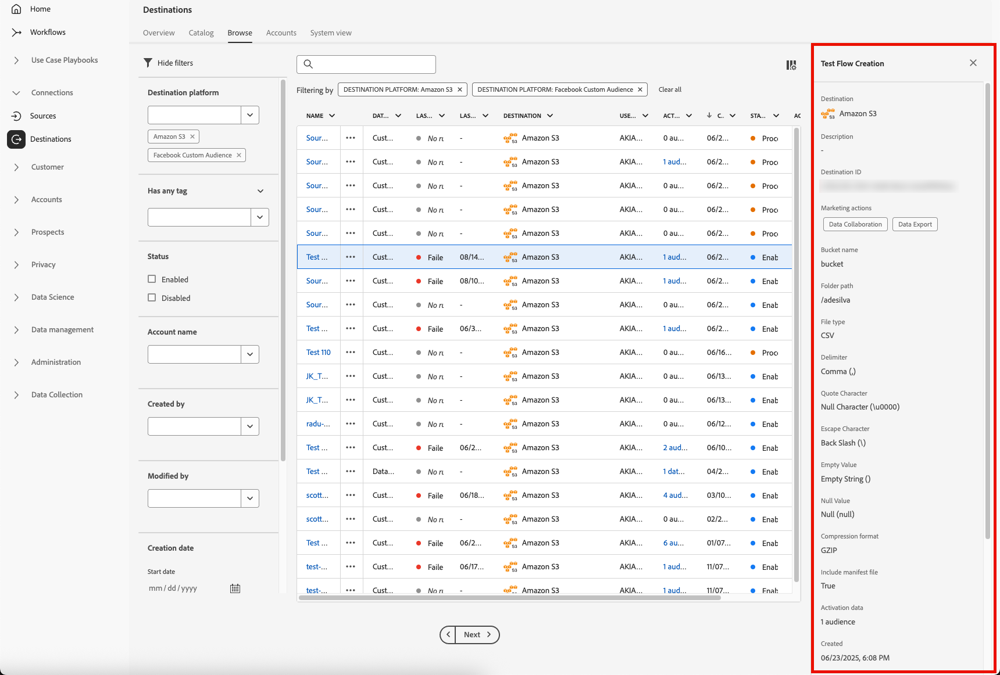

# 目標工作區 {#destinations-workspace}

在Adobe Experience Platform，選擇 **[!UICONTROL 目標]** 從左導航欄訪問 [!UICONTROL 目標] 工作區。

的 [!UICONTROL 目標] 工作區由五個部分組成， [!UICONTROL 概述]。 [!UICONTROL 目錄]。 [!UICONTROL 瀏覽]。 [!UICONTROL 帳戶], [!UICONTROL 系統視圖]，在下面各節中介紹。

## [!UICONTROL 概觀] {#overview}

的 **[!UICONTROL 概述]** 頁籤顯示 [!UICONTROL 目標] 控制板，提供與組織的目標資料相關的關鍵度量。 要瞭解更多資訊，請訪問 [[!UICONTROL 目標] 儀表板指南](../../dashboards/guides/destinations.md)。

>[!NOTE]
>
>如果您的組織是新Experience Platform的，且尚未有活動目標， [!UICONTROL 目標] 儀表板和 [!UICONTROL 概述] 頁籤不可見。 而是選擇 [!UICONTROL 目標] 從左側導航顯示 [[!UICONTROL 目錄] 頁籤](#catalog)。

## [!UICONTROL 目錄] {#catalog}

的 **[!UICONTROL 目錄]** 頁籤顯示中所有可用目標的清單 [!DNL Platform]，以便向其發送資料。

的 [!DNL Platform] 用戶介面在目標目錄頁上提供了幾個搜索和篩選選項：

* 使用頁面上的搜索功能查找特定目標。
* 使用 [!UICONTROL 類別] 控制項。
* 在 [!UICONTROL 所有目標] 和 [!UICONTROL 我的目的地]。 選擇時 **[!UICONTROL 所有目標]**，全部可用 [!DNL Platform] 顯示目標。 選擇時 **[!UICONTROL 我的目的地]**，您只能查看已建立連接的目標。
* 選擇以查看 **[!UICONTROL 連接]** 和/或 **[!UICONTROL 擴展]**。 要瞭解兩種類別之間的差異，請參閱 [目標類型和類別](../destination-types.md)。

目標卡包含 **[!UICONTROL 設定]** 或 **[!UICONTROL 激活段]** 控制項和輔助控制項，可顯示更多選項。 下面介紹了這些控制項：

| 控制項 | 說明 |
|---------|----------|
| [!UICONTROL 設定] | 允許您建立到目標的連接。 |
| [!UICONTROL 激活段] | 建立到目標的連接後，可以激活段。 |
| [!UICONTROL 查看帳戶] | 查看您為目標連接的帳戶。 |
| [!UICONTROL 查看資料流] | 查看目標存在的資料激活流。 |
| [!UICONTROL 查看文檔] | 開啟指向該特定目標的文檔頁面的連結，瞭解詳細資訊並幫助您設定該目標。 |

{style=&quot;table-layout:auto&quot;}

在目錄中選擇目標卡以開啟右滑軌。 在這裡，您可以看到目標的描述。 右滑軌提供上表中描述的相同控制項，包括目的地的說明以及目的地類別和類型的指示。

有關目標類別和每個目標資訊的詳細資訊，請參閱 [目標目錄](../catalog/overview.md) 和 [目標類型和類別](../destination-types.md)。

## [!UICONTROL 帳戶] {#accounts}

的 **[!UICONTROL 帳戶]** 頁籤顯示您與各種目標建立的連接的詳細資訊，並允許您更新或刪除現有帳戶詳細資訊。 有關每個目標帳戶的所有資訊，請參閱下表。

>[!TIP]
>
> * 選擇 [!UICONTROL 平台] 列和使用 **[!UICONTROL 激活段&#x200B;]**按鈕將段發送到該目標。
> * 選擇 [!UICONTROL 平台] 列和使用 **[!UICONTROL 編輯詳細資訊&#x200B;]**按鈕 [更新](update-accounts.md) 現有目標帳戶的詳細資訊。
> * 選擇 [!UICONTROL 平台] 列和使用 **[!UICONTROL 刪除&#x200B;]**按鈕 [刪除](delete-destination-account.md) 現有目標帳戶。

| 元素 | 說明 |
|---|---|
| [!UICONTROL 平台] | 您為其設定連接的目標。 |
| [!UICONTROL 連線類型] | 表示到儲存桶或目標的帳戶連接類型。 驗證選項取決於目標： <ul><li>對於電子郵件營銷目標：可以是S3、FTP或Azure Blob。</li><li>對於即時廣告目標：伺服器到伺服器</li><li>對於AmazonS3雲儲存目標：訪問密鑰 </li><li>對於SFTP雲儲存目標：SFTP的基本身份驗證</li><li>OAuth 1或OAuth 2身份驗證</li><li>持有者令牌驗證</li></ul> |
| [!UICONTROL 用戶名] | 您在 [連接目標嚮導](../catalog/email-marketing/overview.md#connect-destination)。 |
| [!UICONTROL 目的地] | 表示與為目標建立的基本資訊連接的唯一成功目標資料流的數量。 |
| [!UICONTROL 已驗證] | 授權到此目標的連接的日期。 |

{style=&quot;table-layout:auto&quot;&quot;

## [!UICONTROL 瀏覽] {#browse}

的 **[!UICONTROL 瀏覽]** 頁籤顯示已建立連接的目標。 目標 **[!UICONTROL 已啟用/已禁用]** 開啟切換，將目標分別設定為活動或非活動。 通過選擇 **[!UICONTROL 段]** > **[!UICONTROL 瀏覽]** 並選擇要檢查的段。 請參閱下表，瞭解中為每個目標提供的所有資訊 [!UICONTROL 瀏覽] 頁籤：

>[!TIP]
>
> * 選擇 [!UICONTROL 名稱] 列和使用 **[!UICONTROL 激活段&#x200B;]**按鈕將段發送到該目標。
> * 選擇 [!UICONTROL 名稱] 列和使用 **[!UICONTROL 刪除&#x200B;]**按鈕 [刪除](delete-destinations.md) 到目標的現有連接。
> * 選擇 [!UICONTROL 名稱] 列和使用 **[!UICONTROL 在監視中查看&#x200B;]**按鈕查看此目標的激活資訊 [監控儀表板](/help/dataflows/ui/monitor-destinations.md#monitoring-destinations-dashboard)。
> * 選擇 [!UICONTROL 名稱] 列和使用 **[!UICONTROL 訂閱警報&#x200B;]**按鈕以訂閱目標資料流警報。 您可以訂閱警報以接收有關流運行狀態、成功或失敗的消息。 請參閱 [訂閱上下文中的目標警報](alerts.md) 有關目標資料流警報的詳細資訊……

| 元素 | 說明 |
|---------|----------|
| 名稱 | 您為到此目標的激活流提供的名稱。 同一列包含兩個控制項： [!UICONTROL 激活 ] 和 [!UICONTROL 刪除目標]。 |
| [!UICONTROL 上次流運行狀態] | 上次資料流運行的狀態。 請參閱 [查看目標詳細資訊](destination-details-page.md) 的子菜單。 |
| [!UICONTROL 上次流運行日期] | 上次資料流運行的時間和日期。 請參閱 [查看目標詳細資訊](destination-details-page.md) 的子菜單。 |
| [!UICONTROL 目標] | 為激活流選擇的目標平台。 |
| [!UICONTROL 連線類型] | 表示到儲存桶或目標的連接類型。 <ul><li>對於電子郵件營銷目標：可以是S3、FTP或 [!DNL Azure Blob]。</li><li>對於即時廣告目標：伺服器到伺服器。</li><li>對於流目標：可以 [!DNL Azure Event Hubs] 或 [!DNL Amazon Kinesis]。</li></ul> |
| [!UICONTROL 用戶名] | 為目標流選擇的帳戶憑據。 |
| [!UICONTROL 激活資料] | 指示正被激活到此目標的段數。 選擇此控制項可瞭解有關已激活段的詳細資訊。 請參閱 [激活資料](/help/destinations/ui/destination-details-page.md#activation-data) 的子菜單。 |
| [!UICONTROL 已建立] | 建立到目標的激活流的日期和時間。 選擇向上/向下箭頭符號，按最新的第一個或最早的第一個對激活流進行排序。 |
| [!UICONTROL 狀態] | `Enabled` 或 `Disabled`. 指示是否正在將資料激活到此目標。 |

按一下目標行，在右欄中顯示有關目標的詳細資訊。

選擇目標名稱以查看有關激活到此目標的段的資訊。 按一下 **[!UICONTROL 編輯激活]** 修改或添加到要發送到此目標的段。

## [!UICONTROL 系統視圖] {#system-view}

的 **[!UICONTROL 系統視圖]** 頁籤顯示您在Adobe Experience Platform中設定的激活流的圖形表示。

選擇頁面上顯示的任何目標，然後按一下 **[!UICONTROL 查看資料流]** 查看您為每個目標設定的所有連接的資訊。

