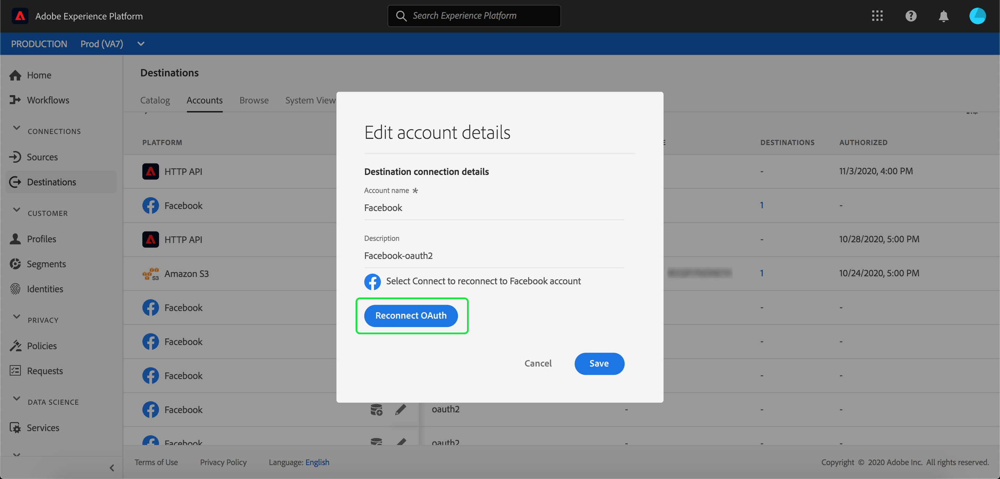

# 目標工作區{#destinations-workspace}

## 概述 {#overview}

在Adobe Experience Platform，從左側導航欄選擇&#x200B;**[!UICONTROL Destinations]**&#x200B;以訪問[!UICONTROL Destinations]工作區。

[!UICONTROL Destinations]工作區由以下幾節中介紹的四個部分組成：[!UICONTROL Catalog]、[!UICONTROL Browse]、[!UICONTROL Accounts]和[!UICONTROL System View]。

## [!UICONTROL Catalog] {#catalog}

**[!UICONTROL Catalog]**&#x200B;標籤顯示平台中所有可傳送資料的目標清單。

平台使用者介面在目標目錄頁面上提供數個搜尋和篩選選項：

* 使用頁面上的搜尋功能來尋找特定目標。
* 使用[!UICONTROL Categories]控制項篩選目標。
* 在[!UICONTROL All destinations]和[!UICONTROL My destinations]之間切換。 選擇&#x200B;**[!UICONTROL All destinations]**&#x200B;時，將顯示所有可用的平台目標。 選擇&#x200B;**[!UICONTROL My destinations]**&#x200B;時，您只能看到已建立連接的目標。
* 選擇查看&#x200B;**[!UICONTROL Connections]**&#x200B;和／或&#x200B;**[!UICONTROL Extensions]**。 要瞭解兩個類別之間的差異，請參閱[目標類型和類別](../destination-types.md)。

目標卡包含&#x200B;**[!UICONTROL Configure]**&#x200B;或&#x200B;**[!UICONTROL Activate]**&#x200B;控制項，以及可顯示更多選項的次要控制項。 這些控制項說明如下：

| 控制 | 說明 |
---------|----------
| [!UICONTROL Configure] | 允許您建立到目標的連接。 |
| [!UICONTROL Activate] | 一旦建立與目標的連線後，您就可以啟動區段。 |
| [!UICONTROL View account] | 查看您已為目標連接的帳戶。 |
| [!UICONTROL View dataflows] | 檢視目的地的資料啟動流程。 |
| [!UICONTROL View documentation] | 開啟該特定目的地的檔案頁面連結，以取得詳細資訊並協助您設定。 |

在目錄中選取目標卡片，以開啟右側導軌。 在這裡，您可以看到目的地的說明。 右側導軌提供與上表所述相同的控制項，以及目的地的描述，以及目的地類別和類型的指示。

有關目標類別和每個目標資訊的詳細資訊，請參閱[目標目錄](../catalog/overview.md)和[目標類型和類別](../destination-types.md)。

## [!UICONTROL Accounts] {#accounts}

在&#x200B;**[!UICONTROL Accounts]**&#x200B;標籤中，您可以進一步瞭解您與各種目的地建立的連線。 請參閱下表，以取得有關每個目標的所有資訊：

>[!TIP]
>
>使用&#x200B;**[!UICONTROL Platform]**&#x200B;欄中的按鈕為該帳戶建立新的目的地連線。

| 元素 | 說明 |
---------|----------
| [!UICONTROL Platform] | 您已設定連接的目標。 |
| [!UICONTROL Connection Type] | 表示與儲存桶或目標的連接類型。 <ul><li>對於電子郵件行銷目標：可以是S3或FTP。</li><li>針對即時廣告目的地：伺服器對伺服器</li><li>針對AmazonS3雲端儲存空間目標：存取金鑰 </li><li>對於SFTP雲端儲存空間目標：SFTP的基本驗證</li></ul> |
| [!UICONTROL Username] | 在[連接目標嚮導](../catalog/email-marketing/overview.md#connect-destination)中選擇的用戶名。 |
| [!UICONTROL Destinations] | 表示與為目標建立的基本資訊連接的唯一成功目標流的數量。 |
| [!UICONTROL Authorized] | 授權此目的地的連線的日期。 |

此外，您也可以編輯或更新帳戶資訊。 在&#x200B;**[!UICONTROL Platform]**&#x200B;欄中選擇「編輯帳戶」按鈕

對於使用`OAuth2`連接類型的帳戶，您可以選擇&#x200B;**[!UICONTROL Reconnect OAuth]**&#x200B;以續約帳戶憑證。

對於使用`Access Key`或`ConnectionString`連線類型的帳戶，您可以編輯帳戶驗證資訊，包括存取ID、機密金鑰或連線字串等資訊。

編輯完帳戶詳細資訊後，選擇&#x200B;**[!UICONTROL Save]**&#x200B;以完成更新。

## [!UICONTROL Browse] {#browse}

**[!UICONTROL Browse]**&#x200B;頁籤顯示已建立連接的目標。 啟用&#x200B;**[!UICONTROL Enabled]**&#x200B;切換的目標會將目標設為作用中，反之亦然。 您也可以選擇&#x200B;**[!UICONTROL Segments]** > **[!UICONTROL Browse]**&#x200B;並選取要檢查的區段，以檢視資料流動的目的地。 有關「瀏覽」頁籤中為每個目標提供的所有資訊，請參見下表：

>[!TIP]
>
> * 使用&#x200B;**[!UICONTROL Name]**&#x200B;欄中的按鈕，將其他區段啟用至該目標。
> * 使用&#x200B;**[!UICONTROL Name]**&#x200B;欄中的按鈕刪除目標的現有連接。

| 元素 | 說明 |
---------|----------
| 名稱 | 您為啟動流程提供的名稱，會前往此目的地。 同一欄包含兩個控制項：[!UICONTROL Activate ]和[!UICONTROL Delete destination]。 |
| [!UICONTROL Last Flow Run Status] | 上次資料流運行的狀態。 有關資料流運行的詳細資訊，請參見[查看目標詳細資訊](destination-details-page.md)。 |
| [!UICONTROL Last Flow Run Date] | 上次資料流運行的時間和日期。 有關資料流運行的詳細資訊，請參見[查看目標詳細資訊](destination-details-page.md)。 |
| [!UICONTROL Destination] | 您為啟動流程選擇的目標平台。 |
| [!UICONTROL Connection Type] | 表示與儲存桶或目標的連接類型。 <ul><li>對於電子郵件行銷目標：可以是S3、FTP或[!DNL Azure Blob]。</li><li>針對即時廣告目的地：伺服器對伺服器。</li><li>對於串流目的地：可以是[!DNL Azure Event Hubs]或[!DNL Amazon Kinesis]。</li></ul> |
| [!UICONTROL Username] | 您為目標流選擇的帳戶憑據。 |
| [!UICONTROL Activation Data] | 指出要啟動至此目標的區段數。 選取此控制項，以進一步瞭解已啟動的區段。 如需已啟動區段的詳細資訊，請參閱目標詳細資訊頁面中的[啟動資料](/help/destinations/ui/destination-details-page.md#activation-data)。 |
| [!UICONTROL Created] | 建立啟動流程至目的地的日期和UTC時間。 |
| [!UICONTROL Status] | `Active` 或 `Inactive`. 指示是否正在將資料激活到此目標。 若要編輯狀態，請參閱[停用啟動](./activate-destinations.md#disable-activation)。 |

按一下目標列，以顯示右側導軌中有關目標的詳細資訊。

選取目標名稱，以查看啟動至此目標之區段的相關資訊。 按一下&#x200B;**[!UICONTROL Edit activation]**&#x200B;可修改或新增至傳送至此目的地的區段。

## [!UICONTROL System View] {#system-view}

**[!UICONTROL System View]**&#x200B;標籤會顯示您在Adobe Experience Platform所設定之啟動流程的圖形表示。

選擇頁面上顯示的任何目標，然後按一下&#x200B;**[!UICONTROL View flows]**&#x200B;查看您為每個目標設定的所有連接的資訊。

