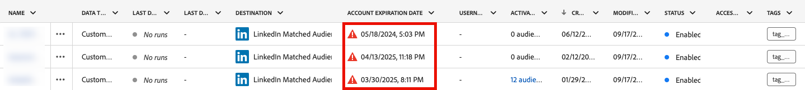
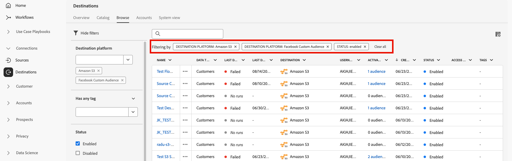

# 目的地工作區 {#destinations-workspace}

在Adobe Experience Platform中，從左側導覽列選取&#x200B;**[!UICONTROL 目的地]**&#x200B;以存取[!UICONTROL 目的地]工作區。

[!UICONTROL 目的地]工作區包含五個區段，[!UICONTROL 總覽]、[!UICONTROL 目錄]、[!UICONTROL 瀏覽]、[!UICONTROL 帳戶]以及[!UICONTROL 系統檢視]，如下節所述。

## [!UICONTROL 概觀] {#overview}

**[!UICONTROL 總覽]**&#x200B;標籤會顯示[!UICONTROL 目的地]儀表板，提供與貴組織目的地資料相關的關鍵量度。 若要深入瞭解，請造訪[[!UICONTROL 目的地]儀表板指南](../../dashboards/guides/destinations.md)。

>[!NOTE]
>
>如果您的組織剛開始使用Experience Platform，但尚未擁有作用中的目的地，則不會顯示[!UICONTROL 目的地]儀表板和[!UICONTROL 概觀]標籤。 從左側導覽選取[!UICONTROL 目的地]會顯示[[!UICONTROL 目錄]索引標籤](#catalog)。

## [!UICONTROL 目錄] {#catalog}

**[!UICONTROL 目錄]**&#x200B;索引標籤會顯示[!DNL Experience Platform]中所有可用目的地的清單，您可以將這些資料傳送至這些目的地。

[!DNL Experience Platform]使用者介面在目的地目錄頁面上提供數個搜尋和篩選選項：

* 使用頁面上的搜尋功能來找出特定目的地。
* 使用&#x200B;**[!UICONTROL 類別]**&#x200B;控制項篩選目的地。
* 在&#x200B;**[!UICONTROL 所有目的地]**&#x200B;和&#x200B;**[!UICONTROL 我的目的地]**&#x200B;之間切換。 當您選取「**[!UICONTROL 所有目的地]**」時，會顯示所有可用的[!DNL Experience Platform]目的地。 當您選取&#x200B;**[!UICONTROL 我的目的地]**&#x200B;時，您只能看到已建立連線的目的地。
* 選取以檢視&#x200B;**[!UICONTROL 連線]**&#x200B;和/或&#x200B;**[!UICONTROL 延伸模組]**&#x200B;型別。 若要瞭解這兩個類別之間的差異，請閱讀[目的地型別和類別](../destination-types.md)。
* 根據受支援的[資料型別](/help/destinations/destination-sdk/functionality/destination-configuration/audience-data-type.md)篩選可用的目的地。 在人員對象、帳戶對象、潛在客戶對象或資料集匯出之間選擇。

目的地卡片包含主要和次要控制選項。 主要控制項包括[!UICONTROL 設定]、[!UICONTROL 啟動]、[!UICONTROL 啟動對象]或[!UICONTROL 匯出資料集]。 次要控制項允許檢視選項。 這些控制項說明如下：

| 控制 | 說明 |
|---------|----------|
| [!UICONTROL 設定] | 可讓您建立與目的地的連線。 |
| [!UICONTROL 啟動] | 建立與目的地的連線後，您可以啟用對象或匯出資料集到此目的地。 |
| [!UICONTROL 啟用對象] | 建立與目的地的連線後，您就可以啟用此目的地的對象。 |
| [!UICONTROL 匯出資料集] | 建立與目的地的連線後，您可以將資料集匯出到此目的地。 |
| [!UICONTROL 檢視帳戶] | 檢視您已為目的地連線的帳戶。 |
| [!UICONTROL 檢視資料流] | 檢視目的地現有的資料啟用流程。 |
| [!UICONTROL 檢視檔案] | 開啟該特定目的地的檔案頁面連結，以取得詳細資訊並協助您設定。 |

{style="table-layout:auto"}

目的地卡上的

在目錄中選取目的地卡片，以開啟右側邊欄。 在這裡，您可以看到目的地的說明。 右邊欄提供與上表相同的控制項，包括目的地的說明，以及目的地類別和型別的指示。

如需目的地類別與每個目的地相關資訊的詳細資訊，請參閱[目的地目錄](../catalog/overview.md)與[目的地型別與類別](../destination-types.md)。

## [!UICONTROL 瀏覽] {#browse}

**[!UICONTROL 瀏覽]**&#x200B;索引標籤會顯示您已建立連線的目的地。

>[!TIP]
>
> 從[搜尋列](#search-browse)開始尋找特定的資料流，然後使用[側邊欄篩選器](#filter-options-browse)進一步縮小結果範圍。

已開啟&#x200B;**[!UICONTROL 已啟用/已停用]**&#x200B;切換的目的地分別將目的地設定為&#x200B;**[!UICONTROL 已啟用]**&#x200B;或&#x200B;**[!UICONTROL 已停用]**。 您也可以選取&#x200B;**[!UICONTROL 對象]** > **[!UICONTROL 瀏覽]**&#x200B;並選取要檢查的對象，以檢視資料流動的目的地。

>[!TIP]
>
> 
> 
> * 選取`...`名稱[!UICONTROL 欄中的省略符號(])，並使用 **[!UICONTROL 啟用對象控制項]**&#x200B;將對象或資料集匯出至該目的地。
> * 選取`...`名稱[!UICONTROL 資料行中的省略符號(])，並使用**[!UICONTROL 編輯目的地&#x200B;]**&#x200B;控制項來編輯現有的目的地連線。 如需詳細資訊，請閱讀[編輯目的地](/help/destinations/ui/edit-destination.md)的教學課程。
> * 選取`...`名稱[!UICONTROL 欄中的省略符號(])，並使用 **[!UICONTROL 編輯行銷動作]**&#x200B;控制項變更為[變更所選目的地的行銷動作](/help/destinations/ui/edit-activation.md#edit-marketing-actions)。
> * 選取`...`名稱[!UICONTROL 資料行中的省略符號(])，並使用 **[!UICONTROL 刪除]**&#x200B;控制項來[移除](delete-destinations.md)與目的地的現有連線。
> * 選取`...`名稱[!UICONTROL 資料行中的省略符號(])，並使用監視控制項中的 **[!UICONTROL 監視控制項中的檢視]**&#x200B;控制項中的檢視，在[監視儀表板](/help/dataflows/ui/monitor-destinations.md#monitoring-destinations-dashboard)中檢視此目的地的啟用資訊。
> * 選取`...`名稱[!UICONTROL 資料欄中的省略符號(])，並使用 **[!UICONTROL 訂閱警示]**&#x200B;控制項訂閱目的地資料流警示。 您可以訂閱警報，以接收有關流程執行的狀態、成功或失敗的訊息。 如需有關目的地資料流警示的詳細資訊，請參閱[訂閱內文中目的地警示](alerts.md)。
> * 選取`...`名稱[!UICONTROL 資料行中的省略符號(])，並使用 **[!UICONTROL 管理標籤]**&#x200B;控制項來新增或移除目的地的標籤。 如需使用標籤的詳細資訊，請參閱[管理目的地標籤](#manage-tags)區段。

請參閱下表，瞭解[!UICONTROL 瀏覽]索引標籤中每個目的地提供的所有資訊。

| 元素 | 說明 |
|---------|----------|
| 名稱 | 您為此目的地的啟用流程提供的名稱。 |
| 資料類型 | 目的地連線支援的資料型別。 支援的資料型別： <ul><li>**[!UICONTROL 客戶]**</li><li>**[!UICONTROL 潛在客戶]**</li><li>**[!UICONTROL 帳戶]**</li><li>**[!UICONTROL 資料集]**</li></ul> |
| [!UICONTROL 上次資料流執行狀態] | 上次資料流執行的狀態。 如需資料流執行的詳細資訊，請參閱[檢視目的地詳細資料](destination-details-page.md)。 |
| [!UICONTROL 上次資料流執行日期] | 上次資料流執行的時間和日期。 選取欄標題以存取排序選項（**[!UICONTROL 遞增排序]**，**[!UICONTROL 遞減排序]**）。 如需資料流執行的詳細資訊，請參閱[檢視目的地詳細資料](destination-details-page.md)。 |
| [!UICONTROL 目標] | 您為啟動流程選取的目的地平台。 |
| [!UICONTROL 帳戶到期日] | 此目的地的連線授權到期的日期。  警告圖示會在到期日之前出現，提醒您連線即將到期，而且可能需要續約。 到期連線的資料流已停止，您必須重新驗證以繼續您的啟用工作流程。  **重要**：此資料行目前僅適用於[Pinterest](../catalog/advertising/pinterest.md)、[LinkedIn](../catalog/social/linkedin.md)和[LinkedIn相符對象](../catalog/social/linkedin-b2b.md)連線。  {width="100" zoomable="yes" alt="Screenshot showing the account expiration warning icon and expiration date in the Browse tab."} |
| [!UICONTROL 使用者名稱] | 您為目的地流程選取的帳戶認證。 |
| [!UICONTROL 啟用資料] | 表示正在啟用至此目的地的對象數量。 選取此控制項以進一步瞭解啟用的對象。 請參閱目的地詳細資訊頁面中的[啟用資料](/help/destinations/ui/destination-details-page.md#activation-data)，瞭解啟用對象的詳細資訊。 |
| [!UICONTROL 已建立] | 至目的地的啟動流程建立日期與時間。 選取上/下箭頭符號，依最新先或最舊先排序啟動流程。 |
| [!UICONTROL 已修改] | 上次修改至目的地的啟動流程時的日期與時間。 |
| [!UICONTROL 狀態] | `Enabled`或`Disabled`。 表示資料是否正在啟用至此目的地。 |
| [!UICONTROL 存取標籤] | 顯示已新增至此目的地資料流的任何存取標籤。 深入瞭解[將存取標籤套用至目的地資料流](/help/access-control/abac/apply-access-labels-destinations.md)。 |
| [!UICONTROL 標記] | 顯示已新增至此目的地資料流的任何標籤。 使用標籤來組織和分類您的資料流，以方便管理。 |

按一下目的地列，即可在右側欄中顯示目的地的詳細資訊，例如目的地ID、說明、啟用的對象數量等。

選取目的地名稱，可檢視與此目的地啟用的對象相關的資訊。 按一下&#x200B;**[!UICONTROL 編輯目的地]**&#x200B;以[修改目的地設定](/help/destinations/ui/edit-destination.md)或&#x200B;**[!UICONTROL 啟用對象]**&#x200B;以將新對象新增至資料流。

### 在瀏覽標籤中篩選資料流 {#filter-browse}

**[!UICONTROL 瀏覽]**&#x200B;索引標籤包含增強的篩選和搜尋功能，可協助您快速尋找和管理目的地資料流。 使用左側邊欄套用篩選器，並使用搜尋列依名稱尋找特定資料流。

### 搜尋功能 {#search-browse}

使用表格頂端的搜尋列，依名稱快速尋找資料流。 當您輸入時，結果會自動進行篩選，以僅顯示相符的資料流。

>[!NOTE]
>
> 使用搜尋方塊搜尋資料流時，結果可能包含您的[使用者存取標籤](/help/access-control/abac/apply-access-labels-destinations.md)限制您檢視的資料流。 此行為將在未來更新中更正。 選取這類資料流不會在右側邊欄中顯示資訊，且無權存取所需標籤的使用者無法執行任何修改，例如將受眾對應至資料流或編輯其排程。

### 篩選器選項 {#filter-options-browse}

使用左側邊欄中的篩選器來縮小搜尋範圍。

* **[!UICONTROL 目的地平台]**：依特定目的地平台（例如[!DNL Amazon S3]、[!DNL Facebook Custom Audience]、[!DNL LinkedIn Matched Audience]等）篩選資料流程。 您可以同時選取多個平台。
* **[!UICONTROL 具有任何標籤]**：已指派特定標籤的篩選資料流。 這可幫助您根據自訂標籤來組織和尋找資料流。
* **[!UICONTROL 狀態]**：依資料流的作業狀態篩選資料流：
   * **[!UICONTROL 已啟用]**：僅顯示作用中的資料流
   * **[!UICONTROL 已停用]**：僅顯示非使用中的資料流
* **[!UICONTROL 帳戶名稱]**：依關聯的帳戶名稱篩選資料流程。 這可協助您找到所有連線至特定目的地帳戶的資料流。
* **[!UICONTROL 已建立]**：依建立資料流程的使用者篩選資料流程。 使用此篩選器來尋找由特定團隊成員建立的資料流。
* **[!UICONTROL 修改者]**：依上次修改資料流程的使用者篩選資料流程。 使用此篩選條件來識別特定使用者最近所做的變更。
* **[!UICONTROL 建立日期]**：使用日期範圍依資料流的建立日期篩選資料流：
   * **[!UICONTROL 開始日期]**：設定日期範圍的開始
   * **[!UICONTROL 結束日期]**：設定日期範圍的結束
* **[!UICONTROL 修改日期]**：使用日期範圍依資料流的修改日期篩選資料流：
   * **[!UICONTROL 開始日期]**：設定日期範圍的開始
   * **[!UICONTROL 結束日期]**：設定日期範圍的結束

### 作用中的篩選器 {#active-filters-browse}

套用篩選器時，篩選器會在搜尋列下方顯示為標籤。

您可以：

* 檢視所有目前作用中的篩選器
* 按一下每個篩選器標籤上的`X`圖示，移除個別的篩選器
* 使用&#x200B;**[!UICONTROL 全部清除]**&#x200B;選項一次清除所有篩選器

### 管理目的地標籤 {#manage-tags}

標籤可協助您整理和分類目的地資料流，以便更輕鬆管理。 您可以在個別資料流中新增和移除標籤，以根據您的業務需求將其分組。

若要新增標籤至資料流，請在`...`名稱&#x200B;**[!UICONTROL 欄中選取省略符號(]**)，然後從內容功能表中選取&#x200B;**[!UICONTROL 管理標籤]**。
在&#x200B;**[!UICONTROL 標籤]**&#x200B;欄位中輸入新標籤的名稱，並選取&#x200B;**[!UICONTROL 儲存]**&#x200B;以套用您的變更。

若要從資料流移除標籤，請選取`...`名稱&#x200B;**[!UICONTROL 欄中的省略符號(]**)，然後從內容功能表選取&#x200B;**[!UICONTROL 管理標籤]**，然後選取您要移除之標籤上的`X`圖示。

### 標籤最佳實務 {#tag-best-practices}

請遵循下列標籤准則，確保您的目的地資料流維持井然有序、易於找到且可管理。

* **使用描述性名稱**：建立可清楚表示資料流用途或類別的標籤（例如「行銷活動」、「客戶保留」、「季節性促銷活動」）
* **保持一致**：在整個組織內使用一致的命名慣例
* **保持簡單**：避免建立太多標籤，因為這會降低篩選的效率
* **使用階層式標籤**：請考慮使用首碼來群組相關標籤（例如「Campaign-Q4」、「Campaign-Q1」）

## [!UICONTROL 帳戶] {#accounts}

**[!UICONTROL 帳戶]**&#x200B;索引標籤顯示您已與各種目的地建立連線的詳細資料，並可讓您更新或刪除現有的帳戶詳細資料。 請參閱下表，以取得每個目的地帳戶的所有資訊。

>[!TIP]
>
> * 選取`...`Platform[!UICONTROL 資料行中的省略符號(])，並使用**[!UICONTROL 啟用&#x200B;]**/**[!UICONTROL &#x200B;啟用對象&#x200B;]**/**[!UICONTROL &#x200B;匯出資料集&#x200B;]**&#x200B;控制項，將對象或資料集匯出至該目的地。
> * 選取`...`Platform[!UICONTROL 資料行中的省略符號(])，並使用**[!UICONTROL 編輯詳細資訊&#x200B;]**&#x200B;控制項來[更新](update-accounts.md)現有目的地帳戶的詳細資訊。
> * 選取`...`Platform[!UICONTROL 資料行中的省略符號(])，並使用**[!UICONTROL 刪除&#x200B;]**&#x200B;控制項來[刪除](delete-destination-account.md)現有的目的地帳戶。

| 元素 | 說明 |
|---|---|
| [!UICONTROL 名稱] | [設定](connect-destination.md#authenticate)目的地時，您指派給目的地帳戶的名稱。 選取欄標題以存取排序選項（**[!UICONTROL 遞增排序]**，**[!UICONTROL 遞減排序]**）。 |
| [!UICONTROL 目標] | 您已為其設定連線的目的地聯結器。 |
| [!UICONTROL 連線型別] | 代表與儲存貯體或目的地的帳戶連線型別。 根據目的地，驗證選項為： <ul><li>針對電子郵件行銷目標：可以是S3、FTP或Azure Blob。</li><li>針對即時廣告目的地：伺服器對伺服器</li><li>對於Amazon S3雲端儲存目的地：存取金鑰 </li><li>對於SFTP雲端儲存目標： SFTP的基本驗證</li><li>OAuth 1或OAuth 2驗證</li><li>持有人權杖驗證</li></ul> |
| [!UICONTROL 使用者名稱] | 您在[連線目的地工作流程](../catalog/email-marketing/overview.md#connect-destination)中選取的使用者名稱。 |
| [!UICONTROL 連線] | 代表與針對目的地建立的基本資訊相連結的唯一成功目的地資料流數目。 |
| [!UICONTROL 授權日期] | 授權連線到此目的地的日期。 |
| [!UICONTROL 到期日] | 此目的地的連線授權到期的日期。  警告圖示會在到期日之前出現，提醒您連線將會到期，而且可能需要續約。 到期連線的資料流已停止，您必須重新驗證以繼續您的啟用工作流程。  **重要**：此資料行目前僅適用於[Pinterest](../catalog/advertising/pinterest.md)、[LinkedIn](../catalog/social/linkedin.md)和[LinkedIn相符對象](../catalog/social/linkedin-b2b.md)連線。  {width="100" zoomable="yes"} |

{style="table-layout:auto"}

### 篩選帳戶 {#filter-accounts}

**[!UICONTROL 帳戶]**&#x200B;索引標籤包含增強的篩選和搜尋功能，可協助您快速尋找和管理您的目的地帳戶。 使用左側邊欄套用篩選器，並使用搜尋列依名稱尋找特定帳戶。

#### 搜尋帳戶 {#search-accounts}

使用表格頂端的搜尋列，快速依名稱尋找帳號。 當您輸入時，結果會自動篩選以僅顯示相符的帳戶。

#### 篩選器選項 {#filter-options-accounts}

使用左側邊欄中的篩選器來縮小搜尋範圍。

* **[!UICONTROL 目的地平台]**：依特定目的地平台篩選帳戶（例如： [!DNL Microsoft Bing]、[!DNL Amazon S3]、[!DNL Facebook Custom Audiences]、[!DNL LinkedIn Matched Audiences]等）。 您可以同時選取多個平台。
* **[!UICONTROL 建立者]**：依建立帳戶的使用者篩選帳戶。 使用此篩選器來尋找由特定團隊成員建立的帳戶。

#### 作用中的篩選器 {#active-filters-accounts}

套用篩選器時，篩選器會在搜尋列下方顯示為標籤。

![在[帳戶]索引標籤中顯示為標籤的有效篩選器](../assets/ui/workspace/accounts-active-filters.png)

您可以：

* 檢視所有目前作用中的篩選器
* 按一下每個篩選器標籤上的`X`圖示，移除個別的篩選器
* 使用&#x200B;**[!UICONTROL 全部清除]**&#x200B;選項一次清除所有篩選器

## [!UICONTROL 系統檢視] {#system-view}

**[!UICONTROL 系統檢視]**&#x200B;標籤會顯示您在Adobe Experience Platform中設定的啟動流程的圖形表示。

選取頁面上顯示的任何目的地，然後按一下&#x200B;**[!UICONTROL 檢視資料流程]**，檢視您為每個目的地設定的所有連線的相關資訊。

