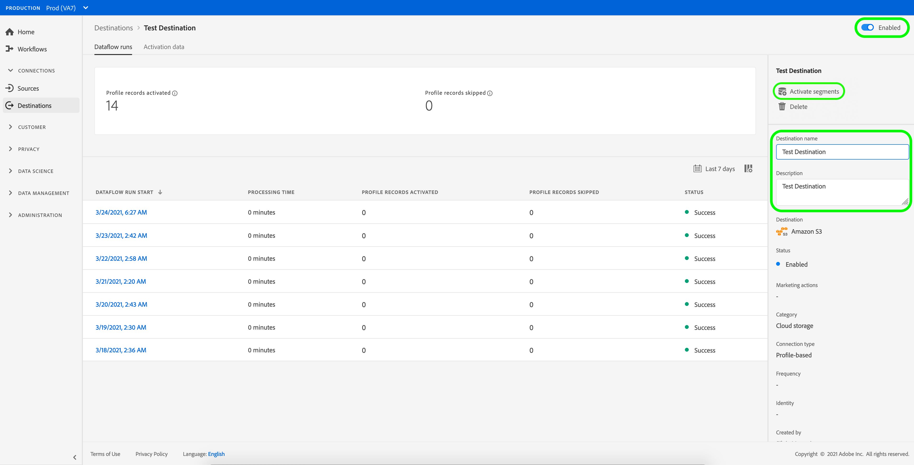

# 編輯啟動資料流程 {#edit-activation-flows}

在Adobe Experience Platform中，您可以編輯現有啟用資料流到目的地的各種元件，例如匯出的對象和設定檔屬性、匯出頻率、啟用資料流是啟用還是停用等等。

## 編輯資料流 {#edit-dataflows}

請依照下列步驟編輯現有的啟用資料流程：

1. 登入 [EXPERIENCE PLATFORMUI](https://platform.adobe.com/) 並選取 **[!UICONTROL 目的地]** 左側導覽列中的。 選取 **[!UICONTROL 瀏覽]** 以檢視您現有的目的地資料流。

   

2. 選取篩選圖示  以啟動「排序」面板。 排序面板會提供您所有目的地的清單。 您可以從清單中選取多個目的地，以檢視與所選目的地相關聯的資料流篩選選取專案。

   

3. 選取您要編輯的目的地資料流名稱。

   

4. 此 **[!UICONTROL 資料流執行]** 目的地頁面隨即顯示，並顯示其可用的控制項。 此時，您可以編輯目的地資料流的幾個元件：

   * 選取 **[!UICONTROL 啟用對象]** ，以變更要傳送至目的地的對象或設定檔屬性。 此動作會帶您進入啟動工作流程，此工作流程會依目的地型別而異。 如需詳細資訊，請參閱以下指南：
      * [啟用對象資料至對象串流目的地](./activate-segment-streaming-destinations.md) (例如Facebook或Twitter)；
      * [啟用受眾資料以批次設定檔為基礎的目的地](./activate-batch-profile-destinations.md) (例如Amazon S3或Oracle Eloqua)；
      * [啟用以串流設定檔為基礎的目的地的受眾資料](./activate-streaming-profile-destinations.md) (例如HTTP API或Amazon Kinesis)。

   * 此外，您也可以編輯目的地資料流名稱和說明。
   * 您可以使用 **[!UICONTROL 已啟用]/[!UICONTROL 已停用]** 切換以開始和暫停所有匯出至目的地的資料。

   

## 後續步驟 {#next-steps}

依照本教學課程，您已成功使用 **[!UICONTROL 目的地]** 工作區以更新現有的目的地資料流。

如需有關目的地的詳細資訊，請參閱 [目的地概觀](../catalog/overview.md).
