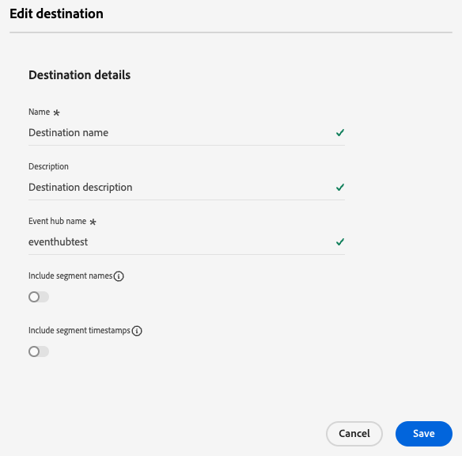

# 編輯目的地

瞭解如何編輯現有目的地連線的各種元件，包括如何使用Experience Platform UI更新驗證認證、匯出位置等。

>[!NOTE]
>
> 透過API作業也可支援本教學課程中所述的編輯作業。 閱讀教學課程，瞭解如何[編輯API中的目的地](/help/destinations/api/edit-destination.md)以取得詳細資訊。

## 先決條件 {#prerequisites}

若要編輯目的地連線，您需要&#x200B;**[!UICONTROL Manage Destinations]** [存取控制許可權](/help/access-control/home.md#permissions)。 閱讀[存取控制總覽](/help/access-control/ui/overview.md)或連絡您的產品管理員以取得必要的許可權。

## 編輯目的地連線 {#edit}

若要編輯現有目的地連線的各種元件：

1. 導覽至&#x200B;**[!UICONTROL Destinations]** > **[!UICONTROL Browse]**。
2. 選取想要編輯的目的地。
3. 選取`...`資料行中的省略符號([!UICONTROL Name])，並使用**[!UICONTROL Edit destination]**&#x200B;控制項來編輯現有的目的地連線。
4. 在強制回應視窗中，編輯任何需要的設定。 完成時選取&#x200B;**[!UICONTROL Save]**。

在編輯目的地視窗中，您可以更新您最初連線至目的地時所設定的任何設定。 這些設定會因您更新的目標平台而異。

視目的地的設定方式而定，某些欄位可能會為唯讀且無法編輯。 若要變更唯讀欄位的值，您必須使用新的欄位值[建立新的目的地連線](../ui/connect-destination.md)。

以下是您可以為[Amazon S3](../catalog/cloud-storage/amazon-s3.md)、[Azure事件中樞](../catalog/cloud-storage/azure-event-hubs.md)和[Google Ads](../catalog/advertising/google-ads-destination.md)目的地更新的設定範例。

  
  
  

>[!SUCCESS]
>
>您的目的地連線設定現已更新。

## 其他編輯選項

您可以使用Experience Platform UI或流量服務API來編輯各種目的地設定，如下列連結所述：

| 使用Experience Platform UI | 使用流量服務API |
|---------|----------|
| 編輯目的地連線（此頁面） | [編輯目標連線元件（儲存位置和其他元件）](/help/destinations/api/edit-destination.md#patch-target-connection) |
| [編輯帳戶](/help/destinations/ui/update-accounts.md) | [編輯基本連線元件（驗證引數和其他元件）](/help/destinations/api/edit-destination.md#patch-base-connection) |
| [編輯啟動資料流](/help/destinations/ui/edit-activation.md) | [更新目的地資料流](/help/destinations/api/update-destination-dataflows.md) |

## 後續步驟

依照此教學課程，您已成功使用&#x200B;**[!UICONTROL destinations]**&#x200B;工作區來更新現有的目的地連線。

如需有關目的地的詳細資訊，請參閱[目的地概觀](../catalog/overview.md)。
