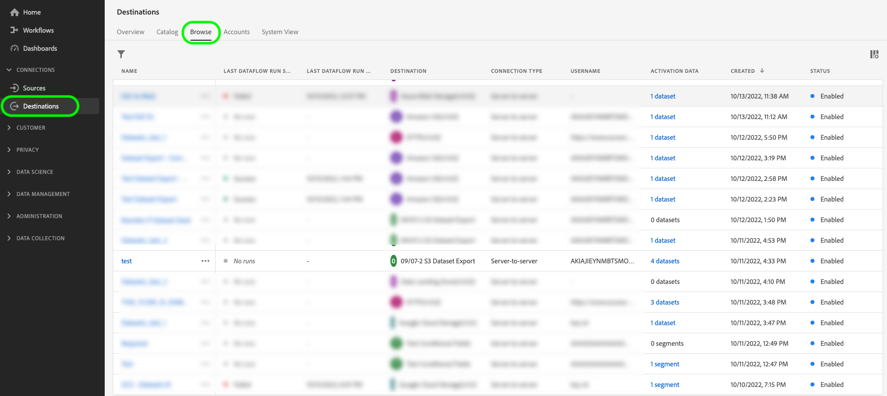

# 將資料集匯出至雲端儲存空間目的地

>[!AVAILABILITY]
>
>已購買Real-Time CDP Prime或Ultimate套件、Adobe Journey Optimizer或Customer Journey Analytics的客戶可使用此功能。 如需詳細資訊，請聯絡您的Adobe代表。

>[!IMPORTANT]
>
>**動作專案**： Experience Platform [&#128279;](/help/release-notes/latest/latest.md#destinations)的2024年9月發行版本匯入了為匯出資料集資料流設定`endTime`日期的選項。 Adobe也針對2024年9月版本&#x200B;*之前建立*&#x200B;的所有資料集匯出資料流，引入了2025年9月1日的預設結束日期。
>
>對於這些資料流中的任一資料流，您需要在結束日期之前手動更新資料流中的結束日期，否則您的匯出將在該日期停止。 使用Experience Platform UI檢視哪些資料流將設定在2025年9月1日停止。
>
>請參閱[排程區段](#scheduling)，瞭解如何編輯資料集匯出資料流的結束日期。

本文說明從Adobe Experience Platform將[資料集](/help/catalog/datasets/overview.md)匯出至您偏好的雲端儲存空間位置（例如[!DNL Amazon S3]、SFTP位置或[!DNL Google Cloud Storage]）所需的工作流程(使用Experience Platform UI)。

您也可以使用Experience Platform API來匯出資料集。 如需詳細資訊，請參閱[匯出資料集API教學課程](/help/destinations/api/export-datasets.md)。

## 可用於匯出的資料集 {#datasets-to-export}

您可以匯出的資料集因Experience Platform應用程式(Real-Time CDP、Adobe Journey Optimizer)、層級(Prime或Ultimate)以及您購買的任何附加元件(例如：Data Distiller)而異。

根據您的應用程式、產品層級和購買的任何附加元件，使用下表瞭解您可以匯出哪些資料集型別：

<table>
<thead>
  <tr>
    <th>應用程式/附加元件</th>
    <th>層級</th>
    <th>可供匯出的資料集</th>
  </tr>
</thead>
<tbody>
  <tr>
    <td rowspan="2">Real-Time CDP</td>
    <td>Prime</td>
    <td>在透過來源、Web SDK、Mobile SDK、Analytics Data Connector和Audience Manager擷取或收集資料後，在Experience Platform UI中建立的設定檔和體驗事件資料集。</td>
  </tr>
  <tr>
    <td>Ultimate</td>
    <td><ul><li>在透過來源、Web SDK、Mobile SDK、Analytics Data Connector和Audience Manager擷取或收集資料後，在Experience Platform UI中建立的設定檔和體驗事件資料集。</li><li> <a href="https://experienceleague.adobe.com/docs/experience-platform/dashboards/query.html#profile-attribute-datasets">系統產生的設定檔快照集資料集</a>。</li></td>
  </tr>
  <tr>
    <td rowspan="2">Adobe Journey Optimizer</td>
    <td>Prime</td>
    <td>請參閱<a href="https://experienceleague.adobe.com/docs/journey-optimizer/using/data-management/datasets/export-datasets.html#datasets"> Adobe Journey Optimizer</a>檔案。</td>
  </tr>
  <tr>
    <td>Ultimate</td>
    <td>請參閱<a href="https://experienceleague.adobe.com/docs/journey-optimizer/using/data-management/datasets/export-datasets.html#datasets"> Adobe Journey Optimizer</a>檔案。</td>
  </tr>
  <tr>
    <td>Customer Journey Analytics</td>
    <td>全部</td>
    <td> 在透過來源、Web SDK、Mobile SDK、Analytics Data Connector和Audience Manager擷取或收集資料後，在Experience Platform UI中建立的設定檔和體驗事件資料集。</td>
  </tr>
  <tr>
    <td>資料蒸餾器</td>
    <td>資料Distiller （附加元件）</td>
    <td>透過查詢服務建立的衍生資料集。</td>
  </tr>
</tbody>
</table>

## 教學課程影片 {#video-tutorial}

請觀看下方的影片，瞭解本頁所述工作流程的端對端說明、使用匯出資料集功能的好處，以及一些建議的使用案例。

>[!VIDEO](https://video.tv.adobe.com/v/3424392/)

## 支援的目的地 {#supported-destinations}

目前，您可以將資料集匯出至熒幕擷取畫面中強調並列於下方的雲端儲存空間目的地。

* [[!DNL Azure Data Lake Storage Gen2]](../../destinations/catalog/cloud-storage/adls-gen2.md)
* [[!DNL Data Landing Zone]](../../destinations/catalog/cloud-storage/data-landing-zone.md)
* [[!DNL Google Cloud Storage]](../../destinations/catalog/cloud-storage/google-cloud-storage.md)
* [[!DNL Amazon S3]](../../destinations/catalog/cloud-storage/amazon-s3.md#changelog)
* [[!DNL Azure Blob]](../../destinations/catalog/cloud-storage/azure-blob.md#changelog)
* [[!DNL SFTP]](../../destinations/catalog/cloud-storage/sftp.md#changelog)

## 何時啟用對象或匯出資料集 {#when-to-activate-audiences-or-activate-datasets}

Experience Platform目錄中的某些檔案型目的地同時支援對象啟用和資料集匯出。

* 當您想要將資料結構化為依對象興趣或資格分組的設定檔時，請考慮啟用對象。
* 或者，當您想要匯出原始資料集時，也可以考慮匯出資料集，這些資料集未根據對象興趣或資格進行分組或結構化。 您可以將這些資料用於報表、資料科學工作流程和其他許多使用案例。 例如，身為管理員、資料工程師或分析師，您可以從Experience Platform匯出資料，以便與您的資料倉儲同步、在BI分析工具、外部雲端ML工具中使用，或儲存在您的系統中以符合長期儲存需求。

本檔案包含匯出資料集所需的所有資訊。 如果您想要將&#x200B;*對象*&#x200B;啟動至雲端儲存空間或電子郵件行銷目的地，請閱讀[啟動對象資料至批次設定檔匯出目的地](/help/destinations/ui/activate-batch-profile-destinations.md)。

## 先決條件 {#prerequisites}

若要匯出資料集，請注意下列先決條件：

* 若要將資料集匯出至雲端儲存空間目的地，您必須已成功[連線至目的地](./connect-destination.md)。 如果您尚未這麼做，請前往[目的地目錄](../catalog/overview.md)，瀏覽支援的目的地，並設定您要使用的目的地。
* 需要啟用設定檔資料集才能在即時客戶設定檔中使用。 [閱讀更多資訊](/help/ingestion/tutorials/ingest-batch-data.md#enable-for-profile)以瞭解如何啟用此選項。

### 必要權限 {#permissions}

若要匯出資料集，您需要&#x200B;**[!UICONTROL 檢視目的地]**、**[!UICONTROL 檢視資料集]**&#x200B;以及&#x200B;**[!UICONTROL 管理和啟用資料集目的地]** [存取控制許可權](/help/access-control/home.md#permissions)。 閱讀[存取控制總覽](/help/access-control/ui/overview.md)或連絡您的產品管理員以取得必要的許可權。

為確保您擁有匯出資料集的必要許可權以及目的地支援匯出資料集，請瀏覽目的地目錄。 如果目的地有&#x200B;**[!UICONTROL 啟用]**&#x200B;或&#x200B;**[!UICONTROL 匯出資料集]**&#x200B;控制項，則您擁有適當的許可權。

## 選取您的目的地 {#select-destination}

依照指示選取可匯出資料集的目的地：

1. 移至&#x200B;**[!UICONTROL 連線>目的地]**，然後選取&#x200B;**[!UICONTROL 目錄]**&#x200B;標籤。

   

1. 在對應您要匯出資料集之目的地的卡片上，選取&#x200B;**[!UICONTROL 啟用]**&#x200B;或&#x200B;**[!UICONTROL 匯出資料集]**。

   

1. 選取&#x200B;**[!UICONTROL 資料型別資料集]**，並選取您要匯出資料集的目的地連線，然後選取&#x200B;**[!UICONTROL 下一步]**。

>[!TIP]
> 
>如果要設定匯出資料集的新目的地，請選取&#x200B;**[!UICONTROL 設定新目的地]**&#x200B;以觸發[連線到目的地](/help/destinations/ui/connect-destination.md)工作流程。

1. **[!UICONTROL 選取資料集]**&#x200B;檢視就會顯示。 繼續下一節以[選取要匯出的資料集](#select-datasets)。

## 選取您的資料集 {#select-datasets}

使用資料集名稱左邊的核取方塊來選取您要匯出至目的地的資料集，然後選取&#x200B;**[!UICONTROL 下一步]**。

## 排程資料集匯出 {#scheduling}

>[!CONTEXTUALHELP]
>id="platform_destinations_activate_datasets_exportoptions"
>title="資料集的檔案匯出選項"
>abstract="選取&#x200B;**匯出增量檔案**，僅匯出上次匯出後新增至資料集的資料。 第一個增量檔案匯出包括資料集中的所有資料，充當回填。未來的增量檔案僅包括第一次匯出後新增至資料集的資料。  選取「**匯出完整檔案**」，在每次匯出時匯出每個資料集的完整會籍資料。 "

>[!CONTEXTUALHELP]
>id="dataset_dataflow_needs_schedule_end_date_header"
>title="更新此資料流的結束日期"
>abstract="更新此資料流的結束日期"

>[!CONTEXTUALHELP]
>id="dataset_dataflow_needs_schedule_end_date_body"
>title="更新此資料流主體的結束日期"
>abstract="由於最近對此目的地進行更新，資料流現在需要結束日期。Adobe 已將預設結束日期設定為 2025 年 9 月 1 日。請更新至您想要的結束日期，否則資料匯出將在預設日期停止。"

使用&#x200B;**[!UICONTROL 排程]**&#x200B;步驟來：

* 設定開始日期和結束日期，以及資料集匯出的匯出步調。
* 設定匯出的資料集檔案應該匯出資料集的完整成員資格，還是只對每個匯出事件的成員資格進行累加變更。
* 自訂資料集應匯出的儲存位置中的資料夾路徑。 深入瞭解如何[編輯匯出資料夾路徑](#edit-folder-path)。

使用頁面上的&#x200B;**[!UICONTROL 編輯排程]**&#x200B;控制項來編輯匯出的匯出步調，以及選取要匯出完整檔案還是增量檔案。

預設會選取&#x200B;**[!UICONTROL 匯出增量檔案]**&#x200B;選項。 這會觸發一或多個檔案的匯出，這些檔案代表資料集的完整快照。 後續檔案是自上次匯出以來的資料集增量新增。 您也可以選取&#x200B;**[!UICONTROL 匯出完整檔案]**。 在這種情況下，請選取頻率&#x200B;**[!UICONTROL 一次]**&#x200B;以一次完整匯出資料集。

>[!IMPORTANT]
>
>第一個增量檔案匯出會包含資料集中的所有現有資料，以作為回填功能。 匯出可包含一或多個檔案。

1. 使用&#x200B;**[!UICONTROL 頻率]**&#x200B;選擇器來選取匯出頻率：

   * **[!UICONTROL 每日]**：排程增量檔案匯出一次，每天一次，在您指定的時間。
   * **[!UICONTROL 每小時]**：排程每3、6、8或12小時匯出一次增量檔案。

2. 使用&#x200B;**[!UICONTROL Time]**&#x200B;選擇器來選擇要進行匯出的時間（格式為[!DNL UTC]）。

3. 使用&#x200B;**[!UICONTROL 日期]**&#x200B;選擇器來選擇匯出發生的間隔。

4. 選取[儲存]以儲存排程，並繼續[檢閱]步驟。**&#x200B;**&#x200B;**&#x200B;**

>[!NOTE]
> 
>對於資料集匯出，檔案名稱具有無法修改的預設集預設格式。 如需匯出檔案的詳細資訊與範例，請參閱[驗證資料集匯出成功](#verify)一節。

## 編輯資料夾路徑 {#edit-folder-path}

>[!CONTEXTUALHELP]
>id="destinations_folder_name_template"
>title="編輯資料夾路徑"
>abstract="使用所提供的幾個巨集來自訂匯出資料集的資料夾路徑。"

>[!CONTEXTUALHELP]
>id="destinations_folder_name_template_preview"
>title="資料集資料夾路徑預覽"
>abstract="預覽根據您在此視窗中新增巨集而在您的儲存位置中建立的資料夾結構。"

選取「**[!UICONTROL 編輯資料夾路徑]**」以自訂儲存匯出資料集所在儲存位置的資料夾結構。

您可以使用數個可用的巨集來自訂所需的資料夾名稱。 按兩下巨集以將其新增至資料夾路徑，並在巨集之間使用`/`來分隔資料夾。

選取所需的巨集後，您可以看到將在儲存位置中建立的資料夾結構預覽。 資料夾結構的第一個層級代表您[連線至目的地](/help/destinations/ui/connect-destination.md##set-up-connection-parameters)以匯出資料集時所指示的&#x200B;**[!UICONTROL 資料夾路徑]**。

## 審核 {#review}

在&#x200B;**[!UICONTROL 檢閱]**&#x200B;頁面上，您可以看到選取專案的摘要。 選取&#x200B;**[!UICONTROL 取消]**&#x200B;以中斷流程，**[!UICONTROL 上一步]**&#x200B;以修改您的設定，或選取&#x200B;**[!UICONTROL 完成]**&#x200B;以確認您的選取並開始將資料集匯出至目的地。

## 驗證資料集匯出成功 {#verify}

匯出資料集時，Experience Platform會在您提供的儲存位置中建立一或多個`.json`或`.parquet`檔案。 預期會根據您提供的匯出排程，將新檔案儲存在您的儲存位置。

Experience Platform會在您指定的儲存位置中建立資料夾結構，並存放匯出的資料集檔案。 預設的資料夾匯出模式如下所示，但您可以[使用您偏好的巨集](#edit-folder-path)自訂資料夾結構。

>[!TIP]
> 
>此資料夾結構的第一個層級 — `folder-name-you-provided` — 代表您[連線至目的地](/help/destinations/ui/connect-destination.md##set-up-connection-parameters)以匯出資料集時所指示的&#x200B;**[!UICONTROL 資料夾路徑]**。

`folder-name-you-provided/datasetID/exportTime=YYYYMMDDHHMM`

預設檔案名稱是隨機產生的，並確保匯出的檔案名稱是唯一的。

### 範例資料集檔案 {#sample-files}

這些檔案存在於您的儲存位置即表示匯出成功。 若要瞭解匯出的檔案是如何建構的，您可以下載範例[.parquet檔案](../assets/common/part-00000-tid-253136349007858095-a93bcf2e-d8c5-4dd6-8619-5c662e261097-672704-1-c000.parquet)或[.json檔案](../assets/common/part-00000-tid-4172098795867639101-0b8c5520-9999-4cff-bdf5-1f32c8c47cb9-451986-1-c000.json)。

#### 壓縮的資料集檔案 {#compressed-dataset-files}

在[連線到目的地工作流程](/help/destinations/ui/connect-destination.md#file-formatting-and-compression-options)中，您可以選取要壓縮的匯出資料集檔案，如下所示：

請注意兩種檔案型別在壓縮時的檔案格式差異：

* 匯出壓縮的JSON檔案時，匯出的檔案格式為`json.gz`。 匯出的JSON格式為NDJSON，這是大資料生態系統中的標準交換格式。 Adobe建議使用與NDJSON相容的使用者端來讀取匯出的檔案。
* 匯出壓縮的parquet檔案時，匯出的檔案格式為`gz.parquet`

*僅支援在壓縮模式中匯出至JSON檔案*。 壓縮和未壓縮模式支援匯出至Parquet檔案。

## 從目的地移除資料集 {#remove-dataset}

若要從現有資料流移除資料集，請遵循下列步驟：

1. 登入[Experience Platform UI](https://experience.adobe.com/platform/)，並從左側導覽列中選取&#x200B;**[!UICONTROL 目的地]**。 從頂端標題選取&#x200B;**[!UICONTROL 瀏覽]**&#x200B;以檢視您現有的目的地資料流。

   

   >[!TIP]
   > 
   >選取左上方的篩選圖示以啟動排序面板。 排序面板會提供您所有目的地的清單。 您可以從清單中選取多個目的地，以檢視與所選目的地相關聯的資料流篩選選取專案。

2. 從&#x200B;**[!UICONTROL 啟用資料]**&#x200B;欄中，選取資料集控制項，以檢視對應至此匯出資料流的所有資料集。

   ![可用的資料集導覽選項在[啟動資料]欄中反白顯示。](../assets/ui/export-datasets/go-to-datasets-data.png)

3. 目的地的&#x200B;**[!UICONTROL 啟用資料]**&#x200B;頁面隨即顯示。 使用資料集清單左側的核取方塊來選取您要移除的資料集，然後在右側邊欄中選取&#x200B;**[!UICONTROL 移除資料集]**，以觸發移除資料集確認對話方塊。

   

4. 在確認對話方塊中，選取&#x200B;**[!UICONTROL 移除]**&#x200B;以立即從匯出至目的地的資料集中移除資料集。

   

## 資料集匯出權益 {#licensing-entitlement}

請參閱產品說明檔案，瞭解您每年每個Experience Platform應用程式有權匯出多少資料。 例如，您可以在[這裡](https://helpx.adobe.com/legal/product-descriptions/real-time-customer-data-platform-b2c-edition-prime-and-ultimate-packages.html)檢視Real-Time CDP產品說明。

請注意，不同應用程式的資料匯出許可權並非累加。 例如，這表示如果您購買Real-Time CDP Ultimate和Adobe Journey Optimizer Ultimate，則根據產品說明，設定檔匯出權利將是兩個權利中較大的一個權利。 您的大量權益的計算方式為：取用您的授權設定檔總數，然後乘以Real-Time CDP Prime的500 KB或Real-Time CDP Ultimate的700 KB，以判斷您有權取得的資料量。

另一方面，如果您購買了Data Distiller等附加元件，您有權取得的資料匯出限制則代表產品層級和附加元件的總和。

您可以在[授權使用儀表板](/help/landing/license-usage-and-guardrails/license-usage-dashboard.md)中檢視及追蹤您的設定檔匯出，以符合合約限制。

## 已知限制 {#known-limitations}

針對資料集匯出的一般可用性版本，請記住下列限制：

* 即使是小型資料集，Experience Platform也可以匯出多個檔案。 資料集匯出是針對系統間整合而設計，並針對效能而最佳化，因此匯出的檔案數量無法自訂。
* 匯出的檔案名稱目前無法自訂。
* UI目前不會阻止您刪除匯出至目的地的資料集。 請勿刪除匯出至目的地的資料集。 [請先從目的地資料流移除資料集](#remove-dataset)，然後再刪除它。
* 資料集匯出的監控量度目前與設定檔匯出的數字混合在一起，因此不能反映真正的匯出數字。
* 時間戳記超過365天的資料會從資料集匯出中排除。 如需詳細資訊，請檢視排程資料集匯出的[護欄](/help/destinations/guardrails.md#guardrails-for-scheduled-dataset-exports)

## 常見問題 {#faq}

**如果我們只在`/`儲存為資料夾路徑，可以產生沒有資料夾的檔案嗎？ 此外，如果我們不需要資料夾路徑，如何在資料夾或位置中產生具有重複名稱的檔案？**

+++回答
自2024年9月發行版本開始，您可以自訂資料夾名稱，甚至使用`/`匯出相同資料夾中所有資料集的檔案。 Adobe不建議將此用於匯出多個資料集的目的地，因為屬於不同資料集的系統產生檔案名稱將混合在同一個資料夾中。
+++

**您可將資訊清單檔案路由到某個資料夾，並將資料檔路由到另一個資料夾嗎？**

+++回答
否，無法將資訊清單檔案複製到其他位置。
+++

**我們可以控制檔案傳送的順序或時間嗎？**

+++回答
有排程匯出的選項。 沒有延遲或排序檔案副本的選項。 產生後，就會立即複製到您的儲存位置。
+++

**資訊清單檔案可以使用哪些格式？**

+++回答
資訊清單檔案為.json格式。
+++

**資訊清單檔案是否有API可用性？**

+++回答
資訊清單檔案沒有API，但包含構成匯出的檔案清單。
+++

**我們可以將其他詳細資料加入資訊清單檔案（即記錄計數）嗎？ 如果是，如何進行？**

+++回答
無法將其他資訊新增至資訊清單檔案。 記錄計數可透過`flowRun`實體取得（可透過API查詢）。 如需詳細資訊，請參閱目的地監視。
+++

**如何分割資料檔案？ 每個檔案有多少記錄？**

+++回答
資料檔會根據Experience Platform資料湖中的預設分割進行分割。 資料集越大，分割區數量就越多。 使用者無法設定預設分割，因為它已針對讀取最佳化。
+++

**我們可以設定閾值（每個檔案的記錄數）嗎？**

+++回答
不行。
+++

**在初始傳送錯誤時，我們如何重新傳送資料集？**

+++回答
大多數型別的系統錯誤都會自動進行重試。
+++