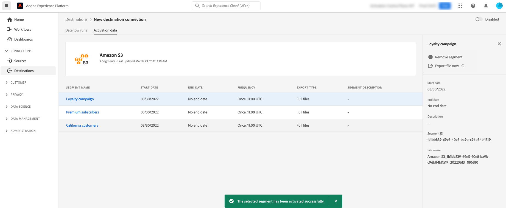

# 使用Experience PlatformUI隨選將檔案匯出至批次目的地

>[!IMPORTANT]
> 
>若要啟用資料，您需要&#x200B;**[!UICONTROL 檢視目的地]**、**[!UICONTROL 啟用目的地]**、**[!UICONTROL 檢視設定檔]**&#x200B;和&#x200B;**[!UICONTROL 檢視區段]** [存取控制許可權](/help/access-control/home.md#permissions)。 閱讀[存取控制總覽](/help/access-control/ui/overview.md)或連絡您的產品管理員以取得必要的許可權。

## **[!UICONTROL 立即匯出檔案]**&#x200B;概觀 {#overview}

>[!CONTEXTUALHELP]
>id="platform_destinations_activationchaining_activatenow"
>title="立即匯出檔案"
>abstract="選取此控制項可在任何先前排程的匯出外實現完整的檔案匯出。檔案匯出會即刻觸發，並從 Experience Platform 分段執行中獲取最新結果。"

本文說明如何使用Experience PlatformUI隨選將檔案匯出至批次目的地，例如[雲端儲存空間](/help/destinations/catalog/cloud-storage/overview.md)和[電子郵件行銷](/help/destinations/catalog/email-marketing/overview.md)目的地。

**[!UICONTROL 立即匯出檔案]**&#x200B;控制項可讓您匯出完整檔案，而不會中斷先前排程對象的目前匯出排程。 除了先前排程的匯出外，也會進行此匯出，不會變更對象的匯出頻率。 檔案匯出會即刻觸發，並從 Experience Platform 分段執行中獲取最新結果。

您也可以將Experience Platform API用於此目的。 瞭解如何透過Ad Hoc Activation API](/help/destinations/api/ad-hoc-activation-api.md)將隨選對象[啟動至批次目的地。

## 先決條件 {#prerequisites}

若要隨選將檔案匯出至批次目的地，您必須已成功[連線至目的地](./connect-destination.md)。 如果您尚未這麼做，請前往[目的地目錄](../catalog/overview.md)，瀏覽支援的目的地，並設定您要使用的目的地。

## 如何隨選匯出檔案 {#how-to-export-files-on-demand}

1. 移至&#x200B;**[!UICONTROL 連線>目的地]**，選取&#x200B;**[!UICONTROL 瀏覽]**&#x200B;索引標籤和篩選符號，以顯示現有連線到您想要的批次目的地。

   

2. 選取您需要的目的地連線，以檢查到目的地的現有資料流。

   

3. 選取「**[!UICONTROL 啟用資料]**」標籤，並選取您要隨選匯出檔案的對象，然後選取「**[!UICONTROL 立即匯出檔案]**」控制項以觸發一次性匯出，將每個所選對象的檔案傳送到批次目的地。

   ![影像反白顯示[立即匯出檔案]按鈕。](../assets/ui/activate-on-demand/bulk-export-file-now.png)

4. 選取&#x200B;**[!UICONTROL 是]**&#x200B;以確認並觸發檔案匯出。

   ![影像顯示[立即匯出檔案]確認對話方塊。](../assets/ui/activate-on-demand/confirm-activation.png)

5. 系統會顯示確認訊息，告知您已開始匯出檔案。

   

6. 您也可以切換至&#x200B;**[!UICONTROL 資料流執行]**&#x200B;標籤，確認檔案匯出已啟動。

## 考量事項 {#considerations}

使用&#x200B;**[!UICONTROL 立即匯出檔案]**&#x200B;控制項時，請記住下列考量事項：

* **[!UICONTROL 現在匯出檔案]**&#x200B;僅適用於批次啟動資料流中的排程與目前日期重疊的對象。 這包含其排程沒有結束日期（**[!UICONTROL 一次]**&#x200B;的匯出頻率）或結束日期尚未超過的受眾。
* 將對象新增至現有資料流時，請等候至少15分鐘，直到使用&#x200B;**[!UICONTROL 立即匯出檔案]**&#x200B;控制項為止。
* 如果您變更對象的合併原則，或如果您建立使用新合併原則的對象，請等待24小時，直到使用&#x200B;**[!UICONTROL 立即匯出檔案]**&#x200B;控制項。

## UI錯誤訊息 {#ui-error-messages}

使用&#x200B;**[!UICONTROL 立即匯出檔案]**&#x200B;控制項時，您可能會遇到下列任何錯誤訊息。 請檢閱表格以瞭解如何在它們出現時解決它們。

| 錯誤訊息 | 解決方法 |
|---------|----------|
| 已對執行識別碼為`flow run ID`的訂單`dataflow ID`的對象`segment ID`執行中 | 此錯誤訊息表示對象目前正在進行臨機啟動流程。 再次觸發啟動工作前，請等候工作完成。 |
| 對象`<segment name>`不是此資料流的一部分或超出排程範圍！ | 此錯誤訊息指出您選取要啟用的對象未對應至資料流，或是為對象設定的啟用排程已過期或尚未開始。 檢查對象是否確實對應至資料流，並確認對象啟用排程與目前日期重疊。 |

## 相關資訊 {#related-information}

* [使用Experience PlatformAPI依需求啟用批次目的地的對象](/help/destinations/api/ad-hoc-activation-api.md)
* [啟用對象資料至批次設定檔匯出目的地](/help/destinations/ui/activate-batch-profile-destinations.md)
