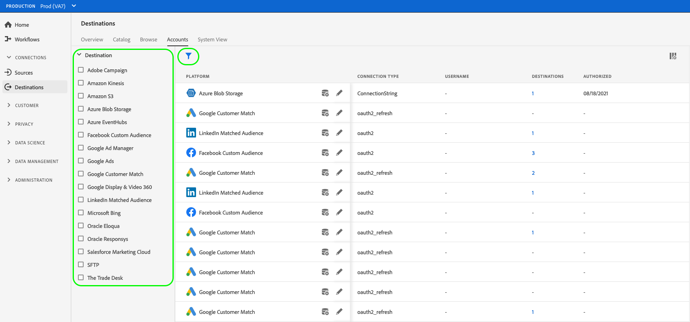

# 更新目的地帳戶

## 概觀 {#overview}

**[!UICONTROL 帳戶]**&#x200B;索引標籤顯示您已與各種目的地建立之連線的詳細資料。 請參閱[帳戶總覽](../ui/destinations-workspace.md#accounts)，瞭解您可以在每個目的地帳戶上取得的所有資訊。

本教學課程涵蓋使用Experience PlatformUI更新目的地帳戶詳細資訊的步驟。

您可以更新目的地帳戶詳細資料，以重新整理並重新驗證您目前使用之目的地的目前或過期帳戶的認證。 通常OAuth和持有人權杖的存留期有限，具體取決於目的地平台。 當這些Token過期時，您可在下文進一步說明的工作流程中重新整理。 此工作流程會引導您完成OAuth工作流程或重新插入代號。 同樣地，如果密碼或使用者存取權在下游平台中已變更，您可以重新整理認證。

對於批次目的地，您可以更新存取權或秘密金鑰（如果其中任何一項已變更）。 此外，如果您想要繼續加密檔案，可以插入RSA公開金鑰，而且您匯出的檔案將會繼續加密。

## 更新帳戶 {#update}

請依照下列步驟，將連線詳細資料更新至現有的目的地。

1. 登入[Experience PlatformUI](https://platform.adobe.com/)，並從左側導覽列中選取&#x200B;**[!UICONTROL 目的地]**。 從頂端標題選取&#x200B;**[!UICONTROL 帳戶]**&#x200B;以檢視您現有的帳戶。

   

2. 選取左上方的篩選圖示以啟動排序面板。 排序面板會提供您所有目的地的清單。 您可以從清單中選取多個目的地，以檢視與所選目的地相關聯的已篩選帳戶選擇。

   

3. 選取您要更新的帳戶名稱旁邊的省略符號(`...`)。 出現快顯面板，其中提供&#x200B;**[!UICONTROL 啟用對象]**、**[!UICONTROL 編輯詳細資料]**&#x200B;和&#x200B;**[!UICONTROL 刪除]**&#x200B;帳戶的選項。 選取「「**[!UICONTROL 編輯詳細資料]**」按鈕以編輯帳戶資訊。

   

4. 輸入您更新的帳戶認證。

   * 針對使用`OAuth1`或`OAuth2`連線型別的帳戶，請選取&#x200B;**[!UICONTROL 重新連線OAuth]**&#x200B;以更新您的帳戶認證。 您也可以更新帳戶的名稱和說明。

   

   * 對於使用`Access Key`或`ConnectionString`連線型別的帳戶，您可以編輯帳戶驗證資訊，包括存取識別碼、密碼金鑰或連線字串等資訊。 您也可以更新帳戶的名稱和說明。

   

   * 對於使用`Bearer token`連線型別的帳戶，您可以視需要輸入新的持有人權杖。 您也可以更新帳戶的名稱和說明。

   

   * 對於使用`Server to server`連線型別的帳戶，您可以更新帳戶的名稱和描述。

   

5. 選取&#x200B;**[!UICONTROL 儲存]**&#x200B;以完成帳戶詳細資料更新。

## 後續步驟

依照此教學課程，您已成功使用&#x200B;**[!UICONTROL 目的地]**&#x200B;工作區來更新現有帳戶。

如需有關目的地的詳細資訊，請參閱[目的地概觀](../catalog/overview.md)。