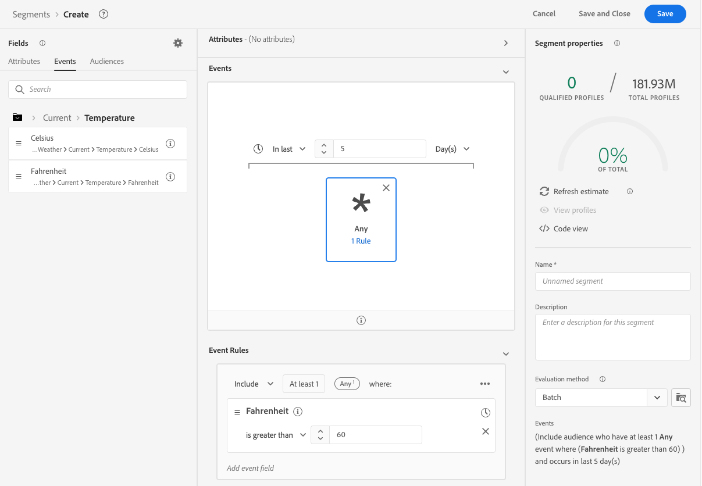

# 使用來自的天氣資料 [!DNL The Weather Channel]

Adobe已與 [!DNL [The Weather Company]](https://www.ibm.com/weather) 為透過資料流收集的資料帶來美國天氣的額外內容。 您可以將此資料用於分析、鎖定目標及建立Experience Platform。

有3種資料類型可從 [!DNL The Weather Channel]:

* **[!UICONTROL 當前天氣]**:使用者目前的天氣狀況（根據其位置）。 這包括目前的溫度、枕頭、雲端覆蓋範圍等。
* **[!UICONTROL 預測天氣]**:預測包括用戶地點的1、2、3、5、7和10天預測。
* **[!UICONTROL 觸發器]**:觸發器是對應至不同語義天氣條件的特定組合。 有三種不同的天氣觸發因素：

   * **[!UICONTROL 天氣觸發器]**:在語義上有意義的條件，如寒冷或雨天。 不同氣候的定義可能不同。
   * **[!UICONTROL 產品觸發器]**:導致購買不同產品類型的條件。 例如：天氣預報寒冷意味著購買雨衣的可能性更大。
   * **[!UICONTROL 惡劣天氣觸發]**:嚴重的天氣警告，比如冬季風暴或颶風警告。

## 先決條件 {#prerequisites}

使用天氣資料之前，請務必符合下列必要條件：

* 您必須授權將使用的天氣資料，從 [!DNL The Weather Channel]. 然後，他們會在您的帳戶上啟用。
* 氣象資料僅透過資料流提供。 若要使用天氣資料，您必須使用 [!DNL Web SDK], [!DNL Mobile Edge Extension] 或 [伺服器API](../../../server-api/overview.md) 來運用此資料。
* 您的資料流必須 [[!UICONTROL 地理位置]](../configure.md#advanced-options) 已啟用。
* 新增 [氣象組](#schema-configuration) 至您使用的結構。

## 佈建 {#provisioning}

取得資料授權後， [!DNL The Weather Channel]，則會啟用您的帳戶以存取資料。 接下來，您必須聯絡Adobe客戶服務，在您的資料流上啟用資料。 啟用後，資料會自動附加。

您可以透過偵錯工具執行邊緣追蹤，或使用「保證」來追蹤透過的點擊，以驗證是否已新增 [!DNL Edge Network].

### 結構配置 {#schema-configuration}

您必須將天氣欄位群組新增至與您在資料流中使用的事件資料集相對應的Experience Platform結構。 可用的欄位組有5個：

* [!UICONTROL 預測天氣]
* [!UICONTROL 當前天氣]
* [!UICONTROL 產品觸發器]
* [!UICONTROL 相對觸發器]
* [!UICONTROL 惡劣天氣觸發]

## 存取天氣資料 {#access-weather-data}

在您的資料獲得授權並可供使用後，您就可以在Adobe服務中以各種方式存取資料。

### Adobe Analytics {#analytics}

在 [!DNL Adobe Analytics]，則天氣資料可透過處理規則與其餘的 [!DNL XDM] 綱要。

您可以在 [天氣參考](weather-reference.md) 頁面。 與所有 [!DNL XDM] 結構，索引鍵會加上前置詞 `a.x`. 例如，名為 `weather.current.temperature.farenheit` 會出現 [!DNL Analytics] as `a.x.weather.current.temperature.farenheit`.

### Adobe Customer Journey Analytics {#cja}

在 [!DNL Adobe Customer Journey Analytics]，則氣象資料可在資料流中指定的資料集中使用。 只要天氣屬性 [已新增至您的架構](#prerequisites-prerequisites)，則可供 [新增至資料檢視](https://experienceleague.adobe.com/docs/analytics-platform/using/cja-dataviews/create-dataview.html) in [!DNL Customer Journey Analytics].

### Real-Time Customer Data Platform {#rtcdp}

天氣資料可在 [Real-time Customer Data Platform](../../../rtcdp/overview.md)，以用於區段。 天氣資料會附加至事件。

由於天氣條件經常變更，Adobe建議您對區段設定時間限制，如上例所示。 與6個月前寒冷的一天相比，在最後一兩天裡過冷日更具影響力。

請參閱 [天氣參考](weather-reference.md) ，以取得Advertising Cloud的說明。

### Adobe Target {#target}

在 [!DNL Adobe Target]，您可以使用天氣資料來推動即時個人化。 天氣資料會傳遞至 [!DNL Target] as [!UICONTROL mBox] 參數，您可以透過自訂 [!UICONTROL mBox] 參數。

參數為 [!DNL XDM] 特定欄位的路徑。 請參閱 [天氣參考](weather-reference.md) ，以取得可用欄位及其對應路徑的資訊。

## 後續步驟 {#next-steps}

閱讀本檔案後，您現在更了解如何在各種Adobe解決方案中使用天氣資料。 若要進一步了解氣象資料欄位對應，請參閱 [欄位對應參考](weather-reference.md).