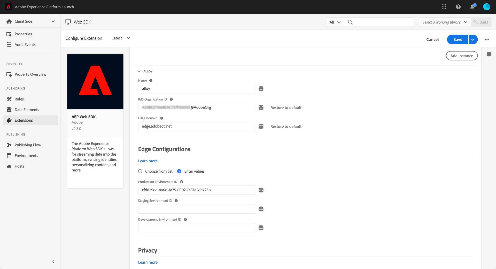
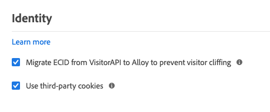

# 設定Adobe Experience Platform Web SDK擴充功能

Adobe Experience Platform Web SDK標籤擴充功能會透過Adobe Experience Platform邊緣網路，將資料從Web屬性傳送至Adobe Experience Cloud。 擴充功能可讓您將資料串流至Platform、同步身分、處理客戶同意訊號，以及自動收集內容資料。

本檔案說明如何在UI中設定擴充功能。

## 快速入門

如果已為屬性安裝Platform Web SDK擴充功能，請開啟UI中的屬性，然後選取 **[!UICONTROL 擴充功能]** 標籤。 在「平台Web SDK」下方，選取 **[!UICONTROL 設定]**.

如果您尚未安裝擴充功能，請選取 **[!UICONTROL 目錄]** 標籤。 從可用擴充功能的清單中，尋找Platform Web SDK擴充功能，然後選取 **[!UICONTROL 安裝]**.

在這兩種情況下，您都會到達Platform Web SDK的設定頁面。 以下各節說明擴充功能的設定選項。

## 一般配置選項

頁面頂端的設定選項會告訴Adobe Experience Platform要在何處路由資料，以及要在伺服器上使用哪些設定。

### [!UICONTROL 名稱]

Adobe Experience Platform Web SDK擴充功能支援頁面上的多個執行個體。 名稱可用來透過標籤設定將資料傳送至多個組織。

擴充功能的名稱預設為「[!DNL alloy]」。 不過您可將例項名稱變更為任何有效的 JavaScript 物件名稱。

### **[!UICONTROL IMS 組織 ID]**

此 [!UICONTROL IMS組織ID] 是您要在Adobe傳送資料的組織。 大部分時候，請使用自動填入的預設值。 頁面上有多個執行個體時，請以您要傳送資料的第二個組織的值填入此欄位。

### **[!UICONTROL 邊緣網域]**

此 [!UICONTROL 邊緣網域] 是Adobe Experience Platform擴充功能傳送及接收資料的網域。 Adobe建議為此擴充功能使用第一方網域(CNAME)。 預設的第三方網域適用於開發環境，但不適用於生產環境。若需設定第一方 CNAME 的相關說明，請參閱[此處](https://experienceleague.adobe.com/docs/core-services/interface/ec-cookies/cookies-first-party.html?lang=zh-Hant)。

## [!UICONTROL 資料串流]

當請求傳送至Adobe Experience Platform邊緣網路時，資料流ID會用來參考伺服器端設定。 您不必在網站上變更程式碼，即可更新設定。

請參閱 [資料流](../datastreams/overview.md) 以取得更多資訊。

## [!UICONTROL 隱私]

此 [!UICONTROL 隱私權] 區段可讓您設定SDK如何處理來自您網站的使用者同意訊號。 具體來說，它可讓您在未提供其他明確同意偏好設定時，選取使用者所假設的預設同意等級。 預設同意層級不會儲存至使用者的設定檔。 下表列出每個選項的要求：

| [!UICONTROL 預設同意層級] | 說明 |
| --- | --- |
| [!UICONTROL 在] | 收集在使用者提供同意偏好設定之前發生的事件。 |
| [!UICONTROL 退出] | 捨棄在使用者提供同意偏好設定之前發生的事件。 |
| [!UICONTROL 待定] | 在使用者提供同意偏好設定之前，將發生的事件排入佇列。 提供同意偏好設定時，系統會根據提供的偏好設定，收集或捨棄事件。 |
| [!UICONTROL 由資料元素提供] | 預設同意層級由您定義的個別資料元素決定。 使用此選項時，您必須使用提供的下拉式選單來指定資料元素。 |

如果您的業務操作需要明確的用戶同意，請使用「取消」或「待定」。

## [!UICONTROL 身分]

### [!UICONTROL 從VisitorAPI移轉ECID]

依預設，會啟用此選項。啟用此功能後，SDK將可讀取AMCV和s_ecid Cookie，並設定Visitor.js使用的AMCV Cookie。 移轉至Adobe Experience Platform Web SDK時，此功能很重要，因為某些頁面可能仍在使用Visitor.js。 它可讓SDK繼續使用相同的ECID，以免將使用者識別為兩個不同的使用者。

### [!UICONTROL 使用第三方Cookie]

此選項可讓SDK嘗試將使用者識別碼儲存在協力廠商Cookie中。 如果成功，當使用者跨多個網域導覽時，系統會將該使用者識別為單一使用者，而非在每個網域上識別為個別使用者。 如果啟用此選項，如果瀏覽器不支援第三方Cookie，或使用者已設定為不允許第三方Cookie，則SDK仍無法將使用者識別碼儲存在第三方Cookie中。 在此情況下，SDK只會將識別碼儲存在第一方網域中。

## [!UICONTROL 個人化]

如果您想要在載入個人化內容時隱藏特定部分，則可以在預先隱藏樣式編輯器中指定要隱藏的元素。 接著，您可以複製提供給您的預設預先隱藏程式碼片段，並貼到 `<head>`元素。

## [!UICONTROL 資料收集]

### [!UICONTROL 回呼函式]

擴充功能中提供的回呼函式也稱為 [`onBeforeEventSend` 函式](https://experienceleague.adobe.com/docs/experience-platform/edge/fundamentals/configuring-the-sdk.html?lang=en) 在資料庫中。 此函式可讓您在將事件傳送至Adobe Edge網路之前，先全域修改事件。 如需如何使用此函式的詳細資訊，請參閱 [此處](https://experienceleague.adobe.com/docs/experience-platform/edge/fundamentals/tracking-events.html?lang=en#modifying-events-globally).

### [!UICONTROL 按一下資料收集]

SDK可自動為您收集連結點按資訊。 此功能預設為啟用，但可使用此選項停用。 如果連結包含列於 [!UICONTROL 下載連結限定符] 框。 Adobe提供一些預設的下載連結限定符，但您可以隨時編輯這些限定符。

### [!UICONTROL 自動收集的內容資料]

依預設，SDK會收集與裝置、網頁、環境和放置內容相關的特定內容資料。 如果您想查看Adobe收集的資訊清單，可以找到 [此處](https://experienceleague.adobe.com/docs/experience-platform/edge/data-collection/automatic-information.html?lang=en). 如果您不想要收集此資料，或只想收集特定類別的資料，您可以變更這些選項。

## [!UICONTROL 進階設定]

### [!UICONTROL 邊基路徑]

如果您需要變更與Adobe Edge網路互動的基本路徑，請使用此欄位。 這不需要更新，但如果您參與測試版或測試版，Adobe可能會要求您變更此欄位。
