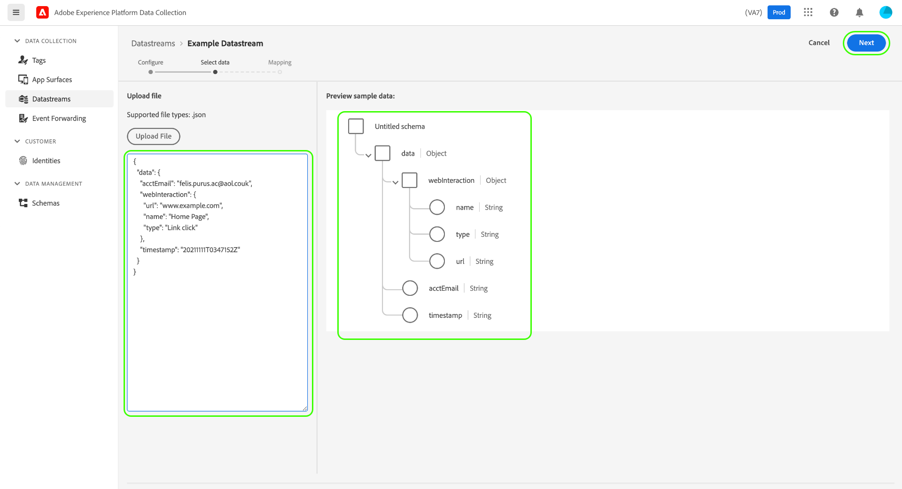
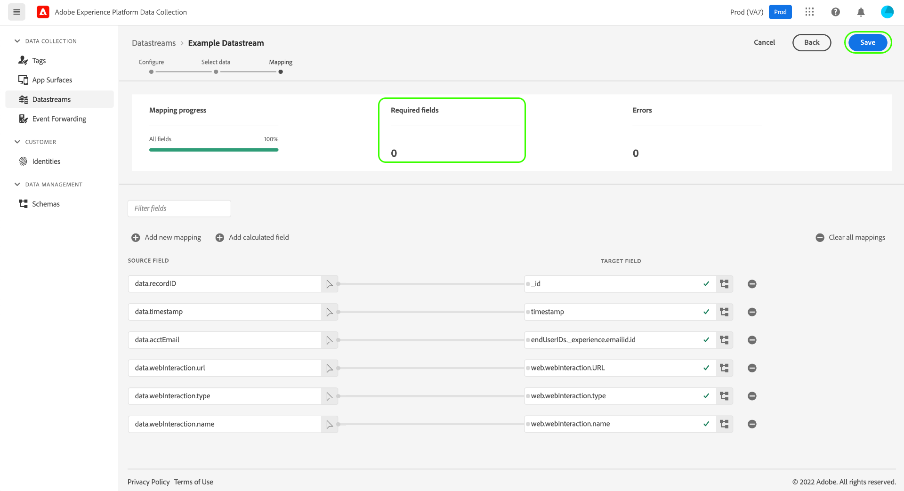
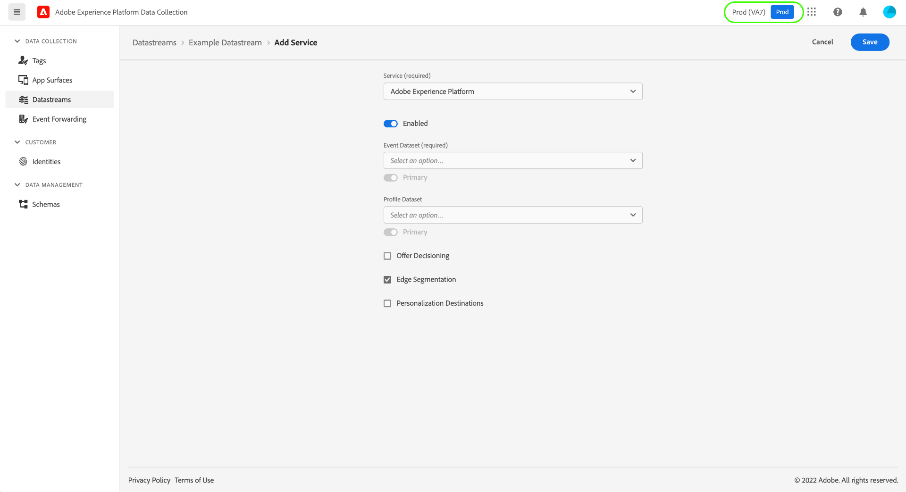

# 配置資料流

資料流表示實施Adobe Experience PlatformWeb和移動SDK時的伺服器端配置。 當 [configure命令](configuring-the-sdk.md) 在SDK中，控制必須在客戶端上處理的內容(如 `edgeDomain`)，資料流處理SDK的所有其它配置。 當請求發送到Adobe Experience Platform邊緣網路時， `edgeConfigId` 用於引用資料流。 這樣，您就可以更新伺服器端配置，而無需在網站上進行代碼更改。

本文檔介紹在資料收集UI中配置資料流的步驟。

>[!NOTE]
>
>必須為您的組織設定此功能，才能在UI中訪問它。 請填寫以下內容 [表格](https://adobe.ly/websdkaccess) 請求必要的訪問權。

## 訪問 [!UICONTROL 資料流] 工作區

通過選擇 **[!UICONTROL 資料流]** 的子菜單。

>[!NOTE]
>
>當您可以訪問 [!UICONTROL 資料流] 頁籤無論您是否使用平台的標籤管理功能，您都必須具有開發人員權限才能自己管理資料流。 查看 [用戶權限](../../tags/ui/administration/user-permissions.md) 的子文檔。

的 [!UICONTROL 資料流] 頁籤顯示現有資料流的清單，包括其友好名稱、ID和上次修改日期。 選擇要 [查看其詳細資訊並配置服務](#view-details)。

選擇「更多」表徵圖(**...**)以顯示更多選項。 選擇 **[!UICONTROL 編輯]** 更新 [基本配置](#configure) 或選擇 **[!UICONTROL 刪除]** 刪除資料流。

## 建立新資料流 {#create}

要建立資料流，請通過選擇 **[!UICONTROL 新建資料流]**。

### [!UICONTROL 設定] {#configure}

將顯示資料流建立工作流，從配置步驟開始。 在此處，必須提供資料流的名稱和可選說明。

如果要配置此資料流以在Experience Platform中使用，並且使用平台Web SDK，則還必須選擇 [基於事件的經驗資料模型(XDM)模式](../../xdm/classes/experienceevent.md) 表示您計畫接收的資料。

選擇 **[!UICONTROL 高級選項]** 顯示配置資料流的其他控制項。

| 設定 | 說明 |
| --- | --- |
| [!UICONTROL 地理位置] | 根據用戶的IP地址確定GPS查找是否發生。 預設設定 **[!UICONTROL 無]** 禁用任何GPS查找，而 **[!UICONTROL 城市]** 設定將GPS坐標設定為兩個小數位。 |
| [!UICONTROL 第一方ID Cookie] | 啟用後，此設定將指示邊緣網路在查找 [第一方設備ID](../identity/first-party-device-ids.md)，而不是在「身份映射」中查找此值。  啟用此設定時，必須提供應儲存ID的Cookie的名稱。 |
| [!UICONTROL 第三方ID同步] | ID同步可以分組到容器中，以允許在不同時間運行不同的ID同步。 啟用此設定後，可以指定為此資料流運行ID同步的容器。 |

本節的其餘部分重點介紹將資料映射到所選平台事件架構的步驟。 如果您使用MobileSDK，或者沒有為平台配置資料流，請選擇 **[!UICONTROL 保存]** 繼續下一節， [將服務添加到資料流](#add-services)。

### 資料收集的資料準備 {#data-prep}

>[!IMPORTANT]
>
>MobileSDK實現當前不支援資料收集的資料準備。

資料準備是一種Experience Platform服務，允許您將資料映射到體驗資料模型(XDM)和從體驗資料模型(XDM)轉換和驗證資料。 配置支援平台的資料流時，可以使用資料準備功能將源資料發送到平台邊緣網路時映射到XDM。

下面的子部分介紹在資料收集UI中映射資料的基本步驟。 有關所有資料準備功能（包括計算欄位的轉換函式）的全面指導，請參閱以下文檔：

* [資料準備概述](../../data-prep/home.md)
* [資料準備映射函式](../../data-prep/functions.md)
* [使用資料準備處理資料格式](../../data-prep/data-handling.md)

#### [!UICONTROL 選擇資料]

選擇 **[!UICONTROL 保存和添加映射]** 完成後 [基本配置步驟](#configure)的 **[!UICONTROL 選擇資料]** 的上界。 在此處，必須提供一個示例JSON對象，該對象表示您計畫發送到平台的資料的結構。 您可以選擇將對象作為檔案上載的選項，或將原始對象貼上到提供的文本框中。

>[!IMPORTANT]
>
>JSON對象必須具有單個根節點 `data` 以通過驗證。

如果JSON有效，則在右面板中顯示預覽架構。 選擇 **[!UICONTROL 下一個]** 繼續。

#### [!UICONTROL 對應]

的 **[!UICONTROL 映射]** 步驟，允許您將源資料中的欄位映射到平台中目標事件模式的欄位。 要開始，請選擇 **[!UICONTROL 添加新映射]** 的子菜單。

選擇源表徵圖()，並在顯示的對話框中選擇要在提供的畫布中映射的源欄位。 選擇欄位後，使用 **[!UICONTROL 選擇]** 按鈕繼續。

接下來，選擇架構表徵圖()開啟目標事件架構的類似對話框。 選擇在確認之前要將資料映射到的欄位 **[!UICONTROL 選擇]**。

此時將重新顯示映射頁，並顯示已完成的欄位映射。 的 **[!UICONTROL 映射進度]** 部分更新以反映已成功映射的欄位總數。

繼續執行上述步驟，將其餘欄位映射到目標架構。 雖然您不必映射所有可用的源欄位，但必須映射目標架構中根據需要設定的任何欄位才能完成此步驟。 的 **[!UICONTROL 必填欄位]** counter表示當前配置中尚未映射的必填欄位數。

一旦必填欄位數達到零且您對映射感到滿意，請選擇 **[!UICONTROL 保存]** 完成更改。

## 查看資料流詳細資訊 {#view-details}

配置新資料流或選擇要查看的現有資料流後，將顯示該資料流的詳細資訊頁。 在此，您可以找到有關資料流（包括其ID）的詳細資訊。

在資料流詳細資訊螢幕中， [添加服務](#add-services) 從您有權訪問的Adobe Experience Cloud產品啟用功能。

## 將服務添加到資料流 {#add-services}

在資料流的詳細資訊頁面上，選擇 **[!UICONTROL 添加服務]** 開始為該資料流添加可用服務。

在下一螢幕上，使用下拉菜單選擇要為此資料流配置的服務。 只有您有權訪問的服務才會顯示在此清單中。

選擇所需的服務，填寫顯示的配置選項，然後選擇 **[!UICONTROL 保存]** 將服務添加到資料流。 所有添加的服務都顯示在資料流的詳細資訊視圖中。

以下各節介紹了每項服務的配置選項。

>[!NOTE]
>
>每個服務配置都包含 **[!UICONTROL 已啟用]** 切換在選擇服務時自動激活的選項。 要禁用此資料流的選定服務，請選擇 **[!UICONTROL 已啟用]** 再次切換。

### Adobe Analytics設定

此服務控制資料是否以及如何發送到Adobe Analytics。 有關其他詳細資訊，請參閱上 [將資料發送到分析](../data-collection/adobe-analytics/analytics-overview.md)。

| 設定 | 說明 |
| --- | --- |
| [!UICONTROL 報告套裝 ID] | **（必需）** 要向其發送資料的分析報告套件的ID。 此ID可在Adobe AnalyticsUI下找到 [!UICONTROL 管理] > [!UICONTROL 報表套件]。 如果指定了多個報表套件，則資料將複製到每個報表套件。 |

### Adobe Audience Manager設定

此服務控制資料是否以及如何發送到Adobe Audience Manager。 將資料發送到Audience Manager所需的一切就是啟用此部分。 其他設定是可選的，但是是鼓勵的。

| 設定 | 說明 |
| --- | --- |
| [!UICONTROL 已啟用Cookie目標] | 允許SDK通過 [cookie目標](https://experienceleague.adobe.com/docs/audience-manager/user-guide/features/destinations/custom-destinations/create-cookie-destination.html) 從 [!DNL Audience Manager]。 |
| [!UICONTROL 已啟用URL目標] | 允許SDK通過 [URL目標](https://experienceleague.adobe.com/docs/audience-manager/user-guide/features/destinations/custom-destinations/create-url-destination.html) 從 [!DNL Audience Manager]。 |

### Adobe Experience Platform設定

>[!IMPORTANT]
>
>在為平台啟用資料流時，請注意您當前使用的平台沙箱，如資料收集UI頂部功能區中所示。
>
>
>
>沙箱是Adobe Experience Platform的虛擬分區，允許您將資料和實施與組織中的其他人隔離開來。 建立資料流後，其沙盒將無法更改。 有關沙箱在Experience Platform中角色的詳細資訊，請參見 [箱文檔](../../sandboxes/home.md)。

此服務控制資料是否以及如何發送到Adobe Experience Platform。

| 設定 | 說明 |
| --- | --- |
| [!UICONTROL 事件資料集] | **（必需）** 選擇將客戶事件資料流式傳輸到的平台資料集。 此架構必須使用 [XDM ExperienceEvent類](../../xdm/classes/experienceevent.md)。 |
| [!UICONTROL 配置檔案資料集] | 選擇客戶屬性資料將發送到的平台資料集。 此架構必須使用 [XDM個人配置檔案類](../../xdm/classes/individual-profile.md)。 |
| [!UICONTROL Offer Decisioning] | 選中此複選框可啟用平台Web SDK實現的Offer decisioning。 請參閱上的指南 [與平台Web SDK一起使用Offer decisioning](../personalization/offer-decisioning/offer-decisioning-overview.md) 的子菜單。 有關Offer decisioning功能的詳細資訊，請參閱 [Adobe Journey Optimizer文檔](https://experienceleague.adobe.com/docs/journey-optimizer/using/offer-decisioniong/get-started/starting-offer-decisioning.html?lang=zh-Hant)。 |
| [!UICONTROL 邊緣分割] | 選中此複選框以啟用 [邊緣分割](../../segmentation/ui/edge-segmentation.md) 資料流。 當SDK通過啟用邊緣分割的資料流發送資料時，在響應中將有關配置檔案的任何更新的段成員身份發回。  此選項可與 [!UICONTROL 個性化目標] 為 [下一頁個性化用例](../../destinations/ui/configure-personalization-destinations.md)。 |
| [!UICONTROL 個性化目標] | 與 [!UICONTROL 邊緣分割] 複選框，此選項允許資料流連接到個性化引擎，如Adobe Target。 請參閱目標文檔以瞭解有關 [配置個性化目標](../../destinations/ui/configure-personalization-destinations.md)。 |

### Adobe Target設定

此服務控制資料是否以及如何發送到Adobe Target。

| 設定 | 說明 |
| --- | --- |
| [!UICONTROL 屬性標籤] | [!DNL Target] 允許客戶通過使用屬性來控制權限。 有關屬性的詳細資訊，請參見上的指南 [配置企業權限](https://experienceleague.adobe.com/docs/target/using/administer/manage-users/enterprise/properties-overview.html) 的 [!DNL Target] 文檔。  在Adobe TargetUI中，可以找到屬性令牌 [!UICONTROL 設定] > [!UICONTROL 屬性]。 |
| [!UICONTROL 目標環境ID] | [Adobe Target環境](https://experienceleague.adobe.com/docs/target/using/administer/hosts.html) 幫助您管理實施過程的所有階段。 此設定指定要與此資料流一起使用的環境。  最佳做法是為您的 `dev`。 `stage`, `prod` 資料流環境使事情變得簡單。 但是，如果您已經定義了Adobe Target環境，則可以使用這些環境。 |
| [!UICONTROL 目標第三方ID命名空間] | 的標識命名空間 `mbox3rdPartyId` 要用於此資料流。 請參閱上的指南 [實施 `mbox3rdPartyId` Web SDK](../personalization/adobe-target/using-mbox-3rdpartyid.md) 的子菜單。 |

### [!UICONTROL 事件轉發] 設定

此服務控制資料是否以及如何發送到 [事件轉發](../../tags/ui/event-forwarding/overview.md)。

| 設定 | 說明 |
| --- | --- |
| [!UICONTROL 啟動屬性] | **（必需）** 要向其發送資料的事件轉發屬性。 |
| [!UICONTROL 啟動環境] | **（必需）** 要向其發送資料的選定屬性中的環境。 |

>[!NOTE]
>
>可以選擇 **[!UICONTROL 手動輸入ID]** 鍵入屬性和環境名稱，而不是使用下拉菜單。

## 後續步驟

本指南介紹了如何在資料收集UI中配置資料流。 有關如何在設定資料流後安裝和配置Web SDK的詳細資訊，請參閱 [資料收集E2E指南](../../collection/e2e.md#install)。
