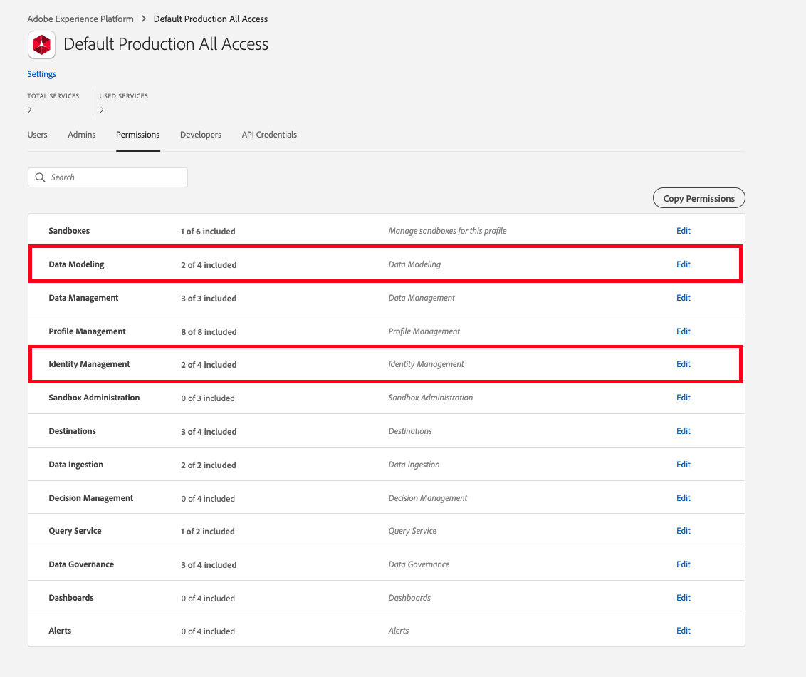

# 使用Adobe Experience Platform Web SDK的必要條件

若要使用Platform Web SDK，您必須先：

- 已針對此功能布建您的組織。 (若想取得存取權，可免費存取Platform Web SDK，請洽詢您的客戶成功經理(CSM)。)
- 建議啟用第一方網域(CNAME)。 如果您已有Adobe Analytics的CNAME，則應使用該CNAME。 在開發中進行測試沒有CNAME，但Adobe建議您先有CNAME，再投入生產。 雖然CNAME實作不會提供Cookie存留期的任何優點，但可防止特定廣告封鎖程式和較不常見的瀏覽器封鎖SDK請求。 在這些情況下，使用CNAME可能會防止使用這些工具的使用者中斷資料收集作業。

>[!IMPORTANT]
>
>**請注意，自11/10/20起，第一方CNAME實作的所有Safari瀏覽器和行動iOS裝置上都有7天的到期日。**

- 有權獲得Adobe Experience Platform。 若您尚未購買Adobe Experience Platform,Adobe會免費為您布建SDK有限使用方式的必要存取權。
- 如果您的網站已在網站上使用[Experience CloudID服務](https://experienceleague.adobe.com/docs/experience-platform/edge/identity/overview.html)(透過訪客API或Adobe Experience Platform Launch中的Experience CloudID服務擴充功能)，而您想在移轉至Adobe Experience Platform Web SDK時繼續使用，則必須使用最新版的訪客API或Experience CloudID服務擴充功能。 如需詳細資訊，請參閱[ID移轉](https://experienceleague.adobe.com/docs/experience-platform/edge/identity/overview.html?lang=en#identity) 。

## 管理Adobe Experience Platform Web SDK的權限

使用Adobe Experience Platform不需要任何特殊權限，但您必須擁有[權限](https://experienceleague.adobe.com/docs/experience-platform/access-control/home.html?lang=zh-Hant)，才能在Adobe Experience Platform中建立結構描述。 可在「資料模型」和「身分」類別中找到某人需要的最低權限。

在「資料模型」類別中，授予使用者「管理結構描述」和「檢視結構描述」權限。

在Identity Management類別中，授與使用者「管理身分識別命名空間」和「檢視身分識別命名空間」權限。

