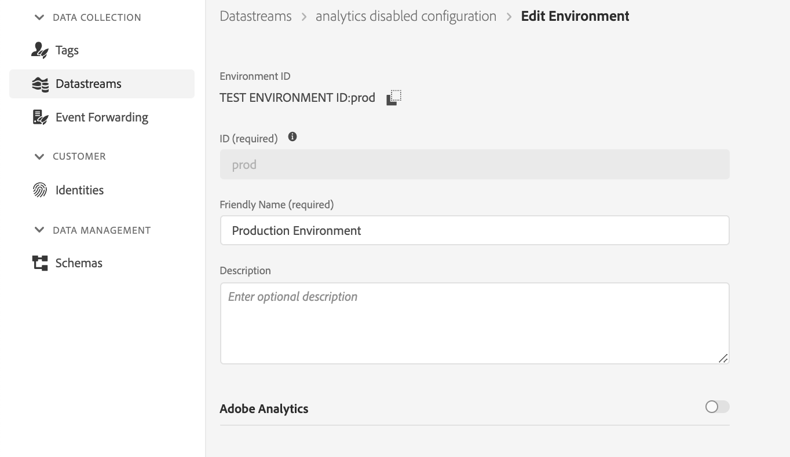

# 將at.js庫與Web SDK進行比較

## 總覽

本文概述了 `at.js` 庫和體驗平台Web SDK。

## 安裝庫

### 安裝at.js

我們允許客戶直接從Adobe Experience Cloud的「實施」頁籤下載庫。 at.js庫是使用客戶具有的設定自定義的：clientCode、imsOrgId等

### 安裝Web SDK

預構建版本可在CDN上使用。 您可以直接在頁面上引用CDN上的庫，或下載並托管在您自己的基礎架構上。 它以縮小和未縮小的格式提供。 未修改的版本有助於調試。

URL結構：https://cdn1.adoberesources.net/alloy/[版本]/alloy.min.js或alloy.js，用於非精簡版本。

例如：

* 已簡化： [https://cdn1.adoberesources.net/alloy/2.14.0/alloy.min.js](https://cdn1.adoberesources.net/alloy/2.14.0/alloy.min.js)
* 未限定： [https://cdn1.adoberesources.net/alloy/2.14.0/alloy.js](https://cdn1.adoberesources.net/alloy/2.14.0/alloy.js)

[更多詳情](../../fundamentals/installing-the-sdk.md)

## 配置庫

### 配置at.js

在每個at.js檔案的末尾，您將找到一個節，在該節中我們實例化並傳遞設定對象。 它可自定義，下載時，我們將用當前客戶設定填充該部分。

```javascript
window.adobe.target.init(window, document, {
  "clientCode": "demo",
  "imsOrgId": "",
  "serverDomain": "localhost:5000",
  "timeout": 2000,
  "globalMboxName": "target-global-mbox",
  "version": "2.0.0",
  "defaultContentHiddenStyle": "visibility: hidden;",
  "defaultContentVisibleStyle": "visibility: visible;",
  "bodyHiddenStyle": "body {opacity: 0 !important}",
  "bodyHidingEnabled": true,
  "deviceIdLifetime": 63244800000,
  "sessionIdLifetime": 1860000,
  "selectorsPollingTimeout": 5000,
  "visitorApiTimeout": 2000,
  "overrideMboxEdgeServer": false,
  "overrideMboxEdgeServerTimeout": 1860000,
  "optoutEnabled": false,
  "optinEnabled": false,
  "secureOnly": false,
  "supplementalDataIdParamTimeout": 30,
  "authoringScriptUrl": "//cdn.tt.omtrdc.net/cdn/target-vec.js",
  "urlSizeLimit": 2048,
  "endpoint": "/rest/v1/delivery",
  "pageLoadEnabled": true,
  "viewsEnabled": true,
  "analyticsLogging": "server_side",
  "serverState": {},
  "decisioningMethod": "server-side",
  "legacyBrowserSupport":  false
});
```

[了解更多](https://experienceleague.adobe.com/docs/target/using/implement-target/client-side/at-js-implementation/functions-overview/targetgobalsettings.html?lang=en)


### 配置Web SDK

SDK的配置是使用 `configure` 的子菜單。

>[!IMPORTANT]
>
>`configure` 是 *總是* 第一個命令叫做。

範例：

```javascript
alloy("configure", {
  "edgeConfigId": "ebebf826-a01f-4458-8cec-ef61de241c93",
  "orgId":"ADB3LETTERSANDNUMBERS@AdobeOrg"
});
```

在配置過程中可以設定許多選項。 所有選項都可在下面找到，按類別分組。

[更多詳情](../../fundamentals/configuring-the-sdk.md)


## 如何請求並自動呈現頁面載入目標產品

### 使用at.js

啟用設定時使用at.js 2.x `pageLoadEnabled`，庫將觸發對目標邊緣的調用 `execute -> pageLoad`。 如果所有設定都設定為預設值，則無需自定義編碼。一旦at.js添加到頁面並由瀏覽器載入，將執行目標邊緣調用。

### 使用Web SDK

在Adobe Target內建立的內容 [視覺體驗作曲家](https://experienceleague.adobe.com/docs/target/using/experiences/vec/visual-experience-composer.html) 可由SDK自動檢索和呈現。

要請求並自動呈現目標優惠，請使用 `sendEvent` 命令並設定 `renderDecisions` 選項 `true`。 這樣做會強制SDK自動呈現任何符合自動呈現條件的個性化內容。

範例：

```javascript
alloy("sendEvent", {
  "renderDecisions": true,
  "xdm": {
    "commerce": {
      "order": {
        "purchaseID": "a8g784hjq1mnp3",
        "purchaseOrderNumber": "VAU3123",
        "currencyCode": "USD",
        "priceTotal": 999.98
      }
    }
  }
});
```

Experience PlatformWeb SDK自動發送包含由WEB SDK執行的優惠的通知，這是通知請求負載的樣式示例：

```json
{
  "events": [{
      "xdm": {
        "_experience": {
          "decisioning": {
            "propositions": [
              {
                "id": "AT:eyJhY3Rpdml0eUlkIjoiMTI3MDE5IiwiZXhwZXJpZW5jZUlkIjoiMCJ9",
                "scope": "cart",
                "scopeDetails": {
                  "decisionProvider": "TGT",
                  "activity": {
                    "id": "127019"
                  },
                  "experience": {
                    "id": "0"
                  },
                  "strategies": [
                    {
                      "step": "entry",
                      "algorithmID": "0",
                      "trafficType": "0"
                    },
                    {
                      "step": "display",
                      "algorithmID": "0",
                      "trafficType": "0"
                    }
                  ],
                  "characteristics": {
                    "eventToken": "bKMxJ8dCR1XlPfDCx+2vSGqipfsIHvVzTQxHolz2IpSCnQ9Y9OaLL2gsdrWQTvE54PwSz67rmXWmSnkXpSSS2Q=="
                  }
                }
              }
            ]
          }
        },
        "eventType": "display",
        "web": {
          "webPageDetails": {
            "viewName": "cart",
            "URL": "https://alloyio.com/personalizationSpa/cart"
          },
          "webReferrer": {
            "URL": ""
          }
        },
        "device": {
          "screenHeight": 800,
          "screenWidth": 1280,
          "screenOrientation": "landscape"
        },
        "environment": {
          "type": "browser",
          "browserDetails": {
            "viewportWidth": 1280,
            "viewportHeight": 284
          }
        },
        "placeContext": {
          "localTime": "2021-12-10T15:50:34.467+02:00",
          "localTimezoneOffset": -120
        },
        "timestamp": "2021-12-10T13:50:34.467Z",
        "implementationDetails": {
          "name": "https://ns.adobe.com/experience/alloy",
          "version": "2.6.2",
          "environment": "browser"
        }
      }
    }
  ]
}
```

[更多詳情](../rendering-personalization-content.md)

## 如何請求和不自動呈現頁面載入目標產品

### 使用at.js

有兩種方法可以激發到目標邊緣的呼叫，以獲取頁面載入的優惠。

範例 1:

```javascript
adobe.target.getOffer({
   mbox: "target-global-mbox", 
   success: console.log,
   error: console.error
});
```

範例 2:

```javascript
adobe.target.getOffers({
    request: {
      execute: {
        pageLoad: {}
    }
  }
})
.then(console.log)
.catch(console.error);
```

[了解更多](https://experienceleague.adobe.com/docs/target/using/implement-target/client-side/at-js-implementation/functions-overview/cmp-atjs-functions.html?lang=en)

### 使用Web SDK

執行 `sendEvent` 具有特殊範圍的命令 `decisionScopes`: `__view__`。 我們將此範圍用作信號，從「目標」(Target)中提取所有頁面載入活動並預取所有視圖。 Web SDK還將嘗試評估所有基於VEC視圖的活動。 Web SDK當前不支援禁用視圖預取。

要訪問任何個性化內容，您可以提供回調函式，該函式將在SDK從伺服器收到成功響應後調用。 您的回調提供了結果對象，該對象可能包含包含任何返回的個性化內容的命題屬性。

範例：

```javascript
alloy("sendEvent", {
    xdm: {...},
    decisionScopes: ["__view__"]
  }).then(function(result) {
    if (result.propositions) {
      result.propositions.forEach(proposition => {
        proposition.items.forEach(item => {
          if (item.schema === HTML_SCHEMA) {
            // manually apply offer
            document.getElementById("form-based-offer-container").innerHTML =
              item.data.content;
            const executedPropositions = [
              {
                id: proposition.id,
                scope: proposition.scope,
                scopeDetails: proposition.scopeDetails
              }
            ];
          // manually send the display notification event, so that Target/Analytics impressions aare increased
            alloy("sendEvent",{
              "xdm": {
                "eventType": "decisioning.propositionDisplay",
                "_experience": {
                  "decisioning": {
                    "propositions": executedPropositions
                  }
                }
              }
            });
          }
        });
      });
    }
  });
```

[更多詳情](../rendering-personalization-content.md#manually-rendering-content)


## 如何請求特定的基於表單的目標框


### 使用at.js

可以使用 `getOffer` 函式：

範例 1:

```javascript
adobe.target.getOffer({
   mbox: "hero-banner", 
   success: console.log,
   error: console.error
});
```

範例 2:

```javascript
adobe.target.getOffers({
    request: {
      execute: {
        mboxes: [
        {
          index: 0,
          name: "hero-banner"
        }]
    }
  }
})
.then(console.log)
.catch(console.error);
```

[了解更多](https://experienceleague.adobe.com/docs/target/using/implement-target/client-side/at-js-implementation/functions-overview/cmp-atjs-functions.html?lang=en)


### 使用Web SDK

您可以使用 `sendEvent` 命令並傳遞mbox名稱 `decisionScopes` 的雙曲餘切值。 的 `sendEvent` 命令將返回一個包含請求的活動/主張的對象所解決的承諾：這就是 `propositions` 陣列如下所示：

```javascript
[
  {
    "id": "AT:eyJhY3Rpdml0eUlkIjoiNDM0Njg5IiwiZXhwZXJpZW5jZUlkIjoiMCJ9",
    "scope": "hero-banner",
    "scopeDetails": {
      "decisionProvider": "TGT",
      "activity": {
        "id": "434689"
      },
      "experience": {
        "id": "0"
      },
      "strategies": [
        {
          "algorithmID": "0",
          "trafficType": "0"
        }
      ],
      "characteristics": {
        "eventToken": "2lTS5KA6gj4JuSjOdhqUhGqipfsIHvVzTQxHolz2IpTMromRrB5ztP5VMxjHbs7c6qPG9UF4rvQTJZniWgqbOw=="
      }
    },
    "items": [
      {
        "id": "1184844",
        "schema": "https://ns.adobe.com/personalization/html-content-item",
        "meta": {
          "geo.state": "bucuresti",
          "activity.id": "434689",
          "experience.id": "0",
          "activity.name": "a4t test form based activity",
          "offer.id": "1184844",
          "profile.tntId": "04608610399599289452943468926942466370-pybgfJ"
        },
        "data": {
          "id": "1184844",
          "format": "text/html",
          "content": "<div> analytics impressions </div>"
        }
      }
    ]
  },
  {
    "id": "AT:eyJhY3Rpdml0eUlkIjoiNDM0Njg5IiwiZXhwZXJpZW5jZUlkIjoiMCJ9",
    "scope": "hero-banner",
    "scopeDetails": {
      "decisionProvider": "TGT",
      "activity": {
        "id": "434689"
      },
      "characteristics": {
        "eventToken": "E0gb6q1+WyFW3FMbbQJmrg=="
      }
    },
    "items": [
      {
        "id": "434689",
        "schema": "https://ns.adobe.com/personalization/measurement",
        "data": {
          "type": "click",
          "format": "application/vnd.adobe.target.metric"
        }
      }
    ]
  }
]
```

範例：

```javascript
alloy("sendEvent", {
  xdm: { ...},
  decisionScopes: ["hero-banner"]
}).then(function (result) {
  var propositions = result.propositions;

  if (propositions) {
    // Find the discount proposition, if it exists.
    for (var i = 0; i < propositions.length; i++) {
      var proposition = propositions[i];
      for (var j = 0; j < proposition.items; j++) {
        var item = proposition.items[j];
        if (item.schema === HTML_SCHEMA) {
          // apply offer
          document.getElementById("form-based-offer-container").innerHTML =
            item.data.content;
          const executedPropositions = [
            {
              id: proposition.id,
              scope: proposition.scope,
              scopeDetails: proposition.scopeDetails
            }
          ];

          alloy("sendEvent", {
            "xdm": {
              "eventType": "decisioning.propositionDisplay",
              "_experience": {
                "decisioning": {
                  "propositions": executedPropositions
                }
              }
            }
          });
        }
      }
    }
  }
});
```

[更多詳情](../rendering-personalization-content.md#manually-rendering-content)

## 如何應用目標活動

### 使用at.js

您可以使用 `applyOffers` 函式： `adobe.target.applyOffer(options)`

範例：

```javascript
adobe.target.getOffers({...})
  .then(response => adobe.target.applyOffers({ response: response }))
  .then(() => console.log("Success"))
  .catch(error => console.log("Error", error));
```

瞭解有關 `applyOffers` 命令 [專用文檔](https://experienceleague.adobe.com/docs/target/using/implement-target/client-side/at-js-implementation/functions-overview/adobe-target-applyoffers-atjs-2.html?lang=en)。


### 使用Web SDK

您可以使用 `applyPropositions` 的子菜單。

範例：

```javascript
alloy("applyPropositions", {
    propositions: [...]
});
```

瞭解有關 `applyPropositions` 命令 [專用文檔](../../personalization/rendering-personalization-content.md#applypropositions)。

## 如何跟蹤事件

### 使用at.js

您可以使用 `trackEvent` 函式或使用 `sendNotifications`。

此函式將觸發報告用戶操作（如按一下和轉換）的請求。 它不提供響應中的活動。


**範例 1**

```javascript
adobe.target.trackEvent({ 
    "type": "click",
    "mbox": "some-mbox"
});
```

**範例 2**

```javascript
adobe.target.sendNotifications({ 
    request: {
       notifications: [{
          ...,
          mbox: {
            name: "some-mbox"
          },
          type: "click",
          ...
       }]
    }
});
```

[了解更多](https://experienceleague.adobe.com/docs/target/using/implement-target/client-side/at-js-implementation/functions-overview/adobe-target-trackevent.html?lang=en)

### 使用Web SDK

通過調用 `sendEvent` 命令，填充 `_experience.decisioning.propositions` XDM欄位組，並設定 `eventType` 到2個值之一：

* `decisioning.propositionDisplay`:指示「目標」活動的呈現。
* `decisioning.propositionInteract`:指示用戶與活動的交互，如按一下滑鼠。

的 `_experience.decisioning.propositions` XDM欄位組是對象的陣列。 每個對象的屬性都從 `result.propositions` 會在 `sendEvent` 命令： `{ id, scope, scopeDetails }`

**示例1 — 跟蹤 `decisioning.propositionDisplay` 呈現活動後的事件**

```javascript
alloy("sendEvent", {
  xdm: {},
  decisionScopes: ['discount']
}).then(function(result) {
  var propositions = result.propositions;

  var discountProposition;
  if (propositions) {
    // Find the discount proposition, if it exists.
    for (var i = 0; i < propositions.length; i++) {
      var proposition = propositions[i];
      if (proposition.scope === "discount") {
        discountProposition = proposition;
        break;
      }
    }
  }

  if (discountProposition) {
    // Find the item from proposition that should be rendered.
    // Rather than assuming there a single item that has HTML
    // content, find the first item whose schema indicates
    // it contains HTML content.
    for (var j = 0; j < discountProposition.items.length; j++) {
      var discountPropositionItem = discountProposition.items[i];
      if (discountPropositionItem.schema === "https://ns.adobe.com/personalization/html-content-item") {
        var discountHtml = discountPropositionItem.data.content;
        // Render the content
        var dailySpecialElement = document.getElementById("daily-special");
        dailySpecialElement.innerHTML = discountHtml;
        
        // For this example, we assume there is only a single place to update in the HTML.
        break;  
      }
    }
      // Send a "decisioning.propositionDisplay" event signaling that the proposition has been rendered.
    alloy("sendEvent", {
      xdm: {
        eventType: "decisioning.propositionDisplay",
        _experience: {
          decisioning: {
            propositions: [
              {
                id: discountProposition.id,
                scope: discountProposition.scope,
                scopeDetails: discountProposition.scopeDetails
              }
            ]
          }
        }
      }
    });
  }
});
```

**示例2 — 跟蹤 `decisioning.propositionInteract` 按一下度量後發生的事件**

```javascript
alloy("sendEvent", {
  xdm: { ...},
  decisionScopes: ["hero-banner"]
}).then(function (result) {
  var propositions = result.propositions;

  if (propositions) {
    // Find the discount proposition, if it exists.
    for (var i = 0; i < propositions.length; i++) {
      var proposition = propositions[i];
      for (var j = 0; j < proposition.items.length; j++) {
        var item = proposition.items[j];

        if (item.schema === "https://ns.adobe.com/personalization/measurement") {
          // add metric to the DOM element
          const button = document.getElementById("form-based-click-metric");

          button.addEventListener("click", event => {
            const executedPropositions = [
              {
                id: proposition.id,
                scope: proposition.scope,
                scopeDetails: proposition.scopeDetails
              }
            ];
            // send the click track event
            alloy("sendEvent", {
              "xdm": {
                "eventType": "decisioning.propositionInteract",
                "_experience": {
                  "decisioning": {
                    "propositions": executedPropositions
                  }
                }
              }
            });
          });
        }
      }
    }
  }
});
```

[更多詳情](../rendering-personalization-content.md#manually-rendering-content)

## 如何在單頁應用程式中觸發視圖更改

### 使用at.js

使用 `adobe.target.triggerView` 的子菜單。 每當新頁面載入或頁面上的元件重新呈現時，就可呼叫此函數。應為單頁應用程式(SPA)實現adobe.target.triggerView()，以便使用Visual Experience Composer(VEC)建立A/BTest和體驗目標(XT)活動。 如果站點上未實現adobe.target.triggerView()，則無法使用VECSPA。

**範例**

```javascript
adobe.target.triggerView("homeView")
```

[了解更多](https://experienceleague.adobe.com/docs/target/using/implement-target/client-side/at-js-implementation/functions-overview/adobe-target-triggerview-atjs-2.html?lang=en)


### 使用Web SDK

為了觸發或發出單頁應用程式的「查看更改」信號，請設定 `web.webPageDetails.viewName` 屬性 `xdm` 選項 `sendEvent` 的子菜單。 Web SDK將檢查視圖快取(如果 `viewName` 指定 `sendEvent` 它將執行這些命令併發送顯示通知事件。

**範例**

```javascript
alloy("sendEvent", {
  renderDecisions: true,
  xdm:{
    web:{
      webPageDetails:{
        viewName: "homeView"
      }
    }
  }
});
```

[更多詳情](./spa-implementation.md#implementing-xdm-views)

## 如何利用響應令牌

從Adobe Target返回的個性化內容包括 [響應令牌](https://experienceleague.adobe.com/docs/target/using/administer/response-tokens.html)，這些是有關活動、服務、體驗、用戶配置檔案、地理資訊等的詳細資訊。 這些詳細資訊可以與第三方工具共用或用於調試。 可以在Adobe Target用戶介面中配置響應令牌。

### 使用at.js

使用at.js自定義事件偵聽目標響應並讀取響應令牌。

**範例**

```javascript
document.addEventListener(adobe.target.event.REQUEST_SUCCEEDED, function(e) { 
  console.log("Request succeeded", e.detail); 
}); 
```

[了解更多](https://experienceleague.adobe.com/docs/target/using/administer/response-tokens.html?lang=en)


### 使用Web SDK

>[!IMPORTANT]
>
>確保您正在使用Platform Web SDK 2.6.0或更高版本。

響應令牌作為 `propositions` 因為 `sendEvent` 的子菜單。 每個命題都包含 `items`，並且每個項都 `meta` 在「目標管理員UI」中啟用響應令牌時，使用響應令牌填充對象。 [了解更多](https://experienceleague.adobe.com/docs/target/using/administer/response-tokens.html?lang=en)

**範例**

```javascript
alloy("sendEvent", {
    renderDecisions: true,
    xdm: {}
  }).then(function(result) {
    if (result.propositions) {
      // Format of result.propositions:
      /*
        [
            {
                "id": "",
                "scope": "",
                "items": [
                    {
                        "id": "",
                        "schema": "",
                        "data": {},
                        "meta": { // RESPONSE TOKENS
                            "activity.name": ...,
                            "offer.id": ...,
                            "profile.activeActivities": ...
                        }
                    }
                ],
                "scopeDetails": {}
                "renderAttempted": false
            }
        ]
      */
    }
  });
```

[更多詳情](./accessing-response-tokens.md)

## 如何管理閃爍

### 使用at.js

使用at.js可以通過設定 `bodyHidingEnabled: true` 因此，at.js是在讀取並應用DOM更改之前先處理預隱藏的個性化容器。
通過覆蓋at.js，可以預先隱藏包含個性化內容的頁面部分 `bodyHiddenStyle`。
預設情況下 `bodyHiddenStyle` 隱藏了整個HTML `body`。
可以使用 `window.targetGlobalSettings`。 `window.targetGlobalSettings` 應在載入at.js之前放置。

### 使用Web SDK

使用Web SDK，客戶可以在configure命令中設定其預隱藏樣式，如下例所示：

```javascript
alloy("configure", {
  edgeConfigId: "configurationId",
  orgId: "orgId@AdobeOrg",
  debugEnabled: true,
  prehidingStyle: "body { opacity: 0 !important }"
});
```

載入Web SDK非同步時，建議在注入Web SDK之前在頁面中注入以下代碼段：

```html
<script>
  !function(e,a,n,t){
  if (a) return;
  var i=e.head;if(i){
  var o=e.createElement("style");
  o.id="alloy-prehiding",o.innerText=n,i.appendChild(o),
  setTimeout(function(){o.parentNode&&o.parentNode.removeChild(o)},t)}}
  (document, document.location.href.indexOf("adobe_authoring_enabled") !== -1, "body { opacity: 0 !important }", 3000);
</script>
```

## 如何處理A4T

### 使用at.js

使用at.js支援2種A4T日誌記錄：

* 分析客戶端日誌記錄
* 分析伺服器端日誌記錄

#### 分析客戶端日誌記錄

**示例1:使用目標全局設定**

可以通過設定啟用分析客戶端日誌 `analyticsLogging: client_side` 在at.js設定中或通過覆蓋 `window.targetglobalSettings` 的雙曲餘切值。
設定此選項時，返回的負載的格式如下所示：

```json
{
  "analytics": {
    "payload": {
      "pe": "tnt",
      "tnta": "167169:0:0|0|100,167169:0:0|2|100,167169:0:0|1|100"
    }
  }
}
```

然後，可通過資料插入API將負載轉發到分析。

示例2:在每個 `getOffers` 函式：

```javascript
adobe.target.getOffers({
      request: {
        experienceCloud: {
          analytics: {
            logging: "client_side"
          }
        },
        prefetch: {
          mboxes: [{
            index: 0,
            name: "a1-serverside-xt"
          }]
        }
      }
    })
    .then(console.log)
```

這是響應負載的樣子：

```json
{
  "prefetch": {
    "mboxes": [{
      "index": 0,
      "name": "a1-serverside-xt",
      "options": [{
        "content": "",
        "type": "html",
        "eventToken": "n/K05qdH0MxsiyH4gX05/2qipfsIHvVzTQxHolz2IpSCnQ9Y9OaLL2gsdrWQTvE54PwSz67rmXWmSnkXpSSS2Q==",
        "responseTokens": {
          "profile.memberlevel": "0",
          "geo.city": "bucharest",
          "activity.id": "167169",
          "experience.name": "USA Experience",
          "geo.country": "romania"
        }
      }],
      "analytics": {
        "payload": {
          "pe": "tnt",
          "tnta": "167169:0:0|0|100,167169:0:0|2|100,167169:0:0|1|100"
        }
      }
    }]
  }
}
```

分析負載(`tnta` 標籤)應包含在使用 [資料插入API](https://github.com/AdobeDocs/analytics-1.4-apis/blob/master/docs/data-insertion-api/index.md)。

#### 分析伺服器端日誌記錄

可以通過設定啟用分析伺服器端日誌記錄 `analyticsLogging: server_side` 在at.js設定中或通過覆蓋 `window.targetglobalSettings` 的雙曲餘切值。
然後，資料流如下：


[了解更多](https://experienceleague.adobe.com/docs/target/using/integrate/a4t/a4timplementation.html?lang=en)

### 使用Web SDK

Web SDK還支援：

* 分析客戶端日誌記錄
* 分析伺服器端日誌記錄

#### 分析客戶端日誌記錄

當為該DataStream配置禁用Adobe Analytics時，將啟用分析客戶端日誌記錄。



客戶有權訪問分析令牌(`tnta`)需要與Analytics共用 [資料插入API](https://github.com/AdobeDocs/analytics-1.4-apis/blob/master/docs/data-insertion-api/index.md)
通過連結 `sendEvent` 命令並迭代生成的命題陣列。

**範例**

```javascript
alloy("sendEvent", {
    "renderDecisions": true,
    "xdm": {
      "web": {
        "webPageDetails": {
          "name": "Home Page"
        }
      }
    }
  }
).then(function (results) {
  var analyticsPayloads = new Set();
  for (var i = 0; i < results.propositions.length; i++) {
    var proposition = results.propositions[i];
    var renderAttempted = proposition.renderAttempted;

    if (renderAttempted === true) {
      var analyticsPayload = getAnalyticsPayload(proposition);
      if (analyticsPayload !== undefined) {
        analyticsPayloads.add(analyticsPayload);
      }
    }
  }
  var analyticsPayloadsToken = concatenateAnalyticsPayloads(analyticsPayloads);
  // send the page view Analytics hit with collected Analytics payload using Data Insertion API
});
```

下面是一個圖，顯示啟用分析客戶端時資料如何流動：


#### 分析伺服器端日誌記錄

為該DataStream配置啟用Analytics時，將啟用Analytics伺服器端日誌記錄。


啟用伺服器端分析日誌記錄後，需要與分析共用的A4T負載，以便分析報告顯示正確的印象和轉換將在體驗邊緣級別共用，這樣客戶就不必進行任何附加處理。

以下是啟用伺服器端分析日誌記錄時資料如何流入我們的系統：


## 如何設定目標全局設定

### 使用at.js

您可以使用 `window.targetGlobalSettings` 覆寫 at.js 資料庫中的設定，而非在 Target Standard/Premium UI 中或使用 REST API 進行設定。

應在載入at.js之前或在「管理」>「實施」>「編輯at.js設定」>「代碼設定」>「庫標題」中定義覆蓋。

範例：

```javascript
window.targetGlobalSettings = {  
   timeout: 200, // using custom timeout  
   visitorApiTimeout: 500, // using custom API timeout  
   enabled: document.location.href.indexOf('https://www.adobe.com') >= 0 // enabled ONLY on adobe.com  
};
```

[了解更多](https://experienceleague.adobe.com/docs/target/using/implement-target/client-side/at-js-implementation/functions-overview/targetgobalsettings.html?lang=en)

### 使用Web SDK

Web SDK不支援此功能。

## 如何更新目標配置檔案屬性

### 使用at.js

**範例 1**

```javascript
adobe.target.getOffer({
   mbox: "target-global-mbox",
   params: {
     "profile.name": "test",
     "profile.gender": "female"
   },
   success: console.log,
   error: console.error
});
```

**範例 2**

```javascript
adobe.target.getOffers({
    request: {
      execute: {
        pageLoad: {
          profileParameters: {
            name: "test",
            gender: "female"
          }
        }
    }
  }
})
.then(console.log)
.catch(console.error);
```

### 使用Web SDK

要更新目標配置檔案，請使用 `sendEvent` 命令並設定 `data.__adobe.target` 屬性，使用 `profile`。

**範例**

```javascript
alloy("sendEvent", {
  renderDecisions: true,
  data: {
    __adobe: {
      target: {
        "profile.gender": "female",
        "profile.age": 30
      }
    }
  }
});
```

## 如何使用塔吉特·Recommendations

### 使用at.js

**範例 1**

```javascript
adobe.target.getOffer({
   mbox: "target-global-mbox",
   params: {
     "entity.name": "T-shirt",
     "entity.id": "1234"
   },
   success: console.log,
   error: console.error
});
```

**範例 2**

```javascript
adobe.target.getOffers({
    request: {
      execute: {
        pageLoad: {
          parameters: {
            "entity.name": "T-shirt",
            "entity.id": "1234"
          }
        }
    }
  }
})
.then(console.log)
.catch(console.error);
```

[了解更多](https://experienceleague.adobe.com/docs/target/using/implement-target/client-side/at-js-implementation/functions-overview/adobe-target-getoffers-atjs-2.html?lang=en)


### 使用Web SDK

要發送建議資料，請使用 `sendEvent` 命令並設定 `data.__adobe.target` 屬性，使用 `entity`。

**範例**

```javascript
alloy("sendEvent", {
  renderDecisions: true,
  data: {
    __adobe: {
      target: {
        "entity.name": "T-shirt",
        "entity.id": "1234"
      }
    }
  }
});
```

## 如何使用第三方ID

### 使用at.js

使用at.js有多種發送方式 `mbox3rdPartyId`，使用 `getOffer` 或 `getOffers`:

**範例 1**

```javascript
adobe.target.getOffer({
  mbox:"test",
  params:{
    "mbox3rdPartyId": "1234"
  },
  success: console.log,
  error: console.error
});
```

**範例 2**

```javascript
adobe.target.getOffers({
    request: {
      id:{
        thirdPartyId: "1234"
      },
      execute: {
        pageLoad: {}
    }
  }
})
.then(console.log)
.catch(console.error);
```

或者有辦法 `mbox3rdPartyId` 在 `targetPageParams` 或 `targetPageParamsAll`。
在中設定時 `targetPageParams`，它將在 `target-global-mbox` 也稱為 `pag-lLoad`。
建議將使用 `targetPageParamsAll` 因為它將被發送到每個目標請求中。
使用 `targetPageParamsAll` 就是你可以定義 `mbox3rdPartyId` 將確保所有目標請求都 `mbox3rdPartyId`。

```javascript
window.targetPageParamsAll = function() {
      return {
        "mbox3rdPartyId": "1234"
      };
    };
```

```javascript
window.targetPageParams = function() {
  return {
    "mbox3rdPartyId": "1234"
  };
};
```

[了解更多](https://experienceleague.adobe.com/docs/target/using/implement-target/client-side/at-js-implementation/functions-overview/targetpageparams.html?lang=en)

### 使用Web SDK

Web SDK支援目標第三方ID。 但還需要幾步。 在探討解決方案之前，我們應該談一談 `identityMap`。
標識映射允許客戶發送多個標識。 所有身份都以命名。 每個命名空間可以具有一個或多個標識。 可將特定標識標籤為主標識。
考慮到這些知識，我們可以瞭解設定Web SDK以使用目標第三方ID的必要步驟。

1. 在「資料流配置」視圖中設定將包含目標第三方ID的命名空間：


1. 在每個sendEvent命令中發送該標識命名空間，如下所示：

```javascript
alloy("sendEvent", {
  "renderDecisions": true,
  "xdm": {
    "identityMap": {
      "TGT3PID": [
        {
          "id": "1234",
          "primary": true
        }
      ]
    }
  }
});
```

## 如何設定屬性令牌

### 使用at.js

使用at.js有兩種設定屬性令牌的方法， `targetPageParams` 或 `targetPageParamsAll`。 使用 `targetPageParams` 將屬性令牌添加到 `target-global-mbox` 呼叫，但使用 `targetPageParamsAll` 將令牌添加到所有目標調用：

**範例 1**

```javascript
   window.targetPageParamsAll = function() {
      return {
        "at_property": "1234"
      };
    };
```

**範例 2**

```javascript
window.targetPageParams = function() {
      return {
        "at_property": "1234"
      };
    };
```

### 使用Web SDK

使用Web SDK，客戶在設定資料流配置時能夠在更高級別設定屬性，位於Adobe Target命名空間下：

這意味著針對該特定資料流配置的每個目標調用都將包含該屬性令牌。

## 如何預取框

### 使用at.js

此功能僅在at.js 2.x中可用。at.js 2.x有一個名為 `getOffers`。 `getOffers` 允許客戶預取一個或多個框的內容。 其範例如下：

```javascript
adobe.target.getOffers({
    request: {
      prefetch: {
        mboxes: [{
          index: 0,
          name: "test-mbox",
          parameters: {
            ...
          },
          profileParameters: {
            ...
          }
        }]
    }
  }
})
.then(console.log)
.catch(console.error);
```

注：我們奉勸，確保 `mbox` 的 `mboxes` 陣列有其自己的索引。 通常第一個盒子 `index=0`，下一個 `index=1`的子菜單。

### 使用Web SDK

Web SDK當前不支援此功能。

## 如何調試我的目標實現

### 使用at.js

At.js公開了以下調試功能：

* 禁用Mbox — 禁用目標以讀取和呈現，以檢查頁是否在沒有目標交互的情況下斷開
* Mbox調試 — at.js記錄每個操作
* 目標跟蹤 — 在Bullseye中生成mbox跟蹤令牌，在下面提供了包含參與決策過程的詳細資訊的跟蹤對象 `window.___target_trace` 對象

注：所有這些調試功能都可在 [Adobe Experience Platform調試器](https://chrome.google.com/webstore/detail/adobe-experience-platform/bfnnokhpnncpkdmbokanobigaccjkpob)

### 使用Web SDK

使用Web SDK時，您具有多個調試功能：

* 使用 [格里豐](https://aep-sdks.gitbook.io/docs/beta/project-griffon)
* [已啟用Web SDK調試](../../../edge/fundamentals/debugging.md)
* 使用 [Web SDK監視掛接](https://github.com/adobe/alloy/wiki/Monitoring-Hooks)
* 使用 [Adobe Experience Platform調試器](../../../debugger/home.md)
* 目標跟蹤
