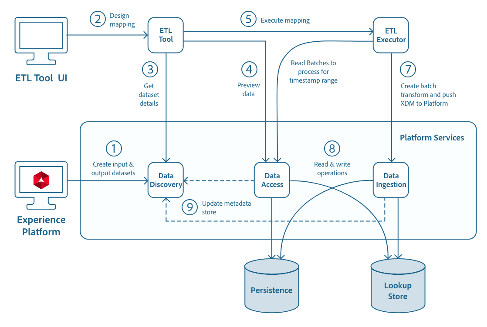

# 開發適用於Adobe Experience Platform的ETL整合

ETL整合指南概述了為[!DNL Experience Platform]建立高效能、安全連接器以及將資料內嵌到[!DNL Platform]的一般步驟。


- [[!DNL Catalog]](https://www.adobe.io/experience-platform-apis/references/catalog/)
- [[!DNL Data Access]](https://www.adobe.io/experience-platform-apis/references/data-access/)
- [[!DNL Data Ingestion]](https://www.adobe.io/experience-platform-apis/references/data-ingestion/)
- [Experience PlatformAPI的驗證和授權](https://www.adobe.com/go/platform-api-authentication-en)
- [[!DNL Schema Registry]](https://www.adobe.io/experience-platform-apis/references/schema-registry/)

本指南也包含設計ETL連接器時要使用的範例API呼叫，其中包含概述每個[!DNL Experience Platform]服務的檔案連結，以及其API的使用，詳細說明。

在[!DNL GitHub]上，透過[!DNL Apache]授權2.0版下的[ ETL生態系統整合參考代碼](https://github.com/adobe/acp-data-services-etl-reference)提供範例整合。

## 工作流程

以下工作流程圖表提供整合Adobe Experience Platform元件與ETL應用程式和連接器的高階概觀。



## Adobe Experience Platform元件

ETL連接器整合涉及多個Experience Platform元件。 以下清單概述數個關鍵元件和功能：

- **AdobeIdentity Management系統(IMS)**  — 提供Adobe服務驗證的架構。
- **IMS組織**  — 擁有或授權產品與服務，並可存取其成員的公司實體。
- **IMS使用者**  - IMS組織的成員。組織與使用者的關係是多對多。
- **[!DNL Sandbox]**  — 將單個實例進行虛擬分 [!DNL Platform] 區，以幫助開發和改進數字型驗應用程式。
- **資料探索**  — 在中記錄擷取和轉換資料的中繼 [!DNL Experience Platform]資料。
- **[!DNL Data Access]**  — 為使用者提供存取其資料的介 [!DNL Experience Platform]面。
- **[!DNL Data Ingestion]**  — 使用API將資 [!DNL Experience Platform] 料推 [!DNL Data Ingestion] 播至。
- **[!DNL Schema Registry]**  — 定義並儲存描述要用於的資料結構的架 [!DNL Experience Platform]構。

## [!DNL Experience Platform] API快速入門

以下各節提供您需要知道或掌握的其他資訊，以便成功呼叫[!DNL Experience Platform] API。

### 讀取範例API呼叫

本指南提供範例API呼叫，以示範如何設定請求格式。 這些功能包括路徑、必要標題和格式正確的請求裝載。 也提供API回應中傳回的範例JSON。 如需範例API呼叫檔案中所使用慣例的資訊，請參閱[!DNL Experience Platform]疑難排解指南中[如何讀取範例API呼叫](../landing/troubleshooting.md#how-do-i-format-an-api-request)一節。

### 收集必要標題的值

若要呼叫[!DNL Platform] API，您必須先完成[authentication tutorial](https://www.adobe.com/go/platform-api-authentication-en)。 完成驗證教學課程後，將提供所有[!DNL Experience Platform] API呼叫中每個必要標題的值，如下所示：

- 授權：承載`{ACCESS_TOKEN}`
- x-api-key: `{API_KEY}`
- x-gw-ims-org-id: `{IMS_ORG}`

[!DNL Experience Platform]中的所有資源都與特定虛擬沙箱隔離。 對[!DNL Platform] API的所有請求都需要標題，以指定作業將在下列位置進行的沙箱名稱：

- x-sandbox-name: `{SANDBOX_NAME}`

>[!NOTE]
>
>如需[!DNL Platform]中沙箱的詳細資訊，請參閱[沙箱概觀檔案](../sandboxes/home.md)。

所有包含裝載(POST、PUT、PATCH)的請求都需要額外的標題：

- 內容類型：application/json

## 一般使用者流程

若要開始，ETL使用者會登入[!DNL Experience Platform]使用者介面(UI)，並使用標準連接器或推送服務連接器建立資料集以擷取。

在UI中，使用者會選取資料集結構，以建立輸出資料集。 架構的選擇取決於要內嵌到[!DNL Platform]中的資料類型（記錄或時間序列）。 按一下UI中的「結構」標籤，使用者就能檢視所有可用的結構，包括結構支援的行為類型。

在ETL工具中，使用者將在設定適當的連線（使用其憑證）後，開始設計其對應轉換。 假定ETL工具已安裝[!DNL Experience Platform]連接器（本整合指南中未定義進程）。

[ETL工作流程](./workflow.md)中已提供範例ETL工具和工作流程的模型。 雖然ETL工具的格式可能不同，但大部分都會公開類似的功能。

>[!NOTE]
>
>ETL連接器必須指定標籤要接收資料和偏移的日期的時間戳篩選器（即要讀取其資料的窗口）。 ETL工具應支援在此或其他相關UI中採用這兩個參數。 在Adobe Experience Platform中，這些參數會對應至資料集批次物件中的可用日期（若有）或擷取日期。

### 檢視資料集清單

使用資料來源進行對應時，可使用[[!DNL Catalog API]](https://www.adobe.io/experience-platform-apis/references/catalog/)擷取所有可用資料集的清單。

您可以發出單一API請求來檢視所有可用的資料集(例如`GET /dataSets`)，最佳實務是納入限制回應大小的查詢參數。

如果要求完整資料集資訊，回應裝載的大小可能會超過3GB，進而降低整體效能。 因此，使用查詢參數僅篩選所需資訊將使[!DNL Catalog]查詢更有效。

#### 清單篩選

篩選回應時，您可以使用&amp;符號來分隔參數，借此在單一呼叫中使用多個篩選器。 `&`有些查詢參數接受以逗號分隔的值清單，例如下列範例要求中的「屬性」篩選器。

[!DNL Catalog] 系統會根據設定的限制自動計量回應，但「limit」查詢參數可用來自訂限制並限制傳回的物件數量。預先設定的[!DNL Catalog]回應限制為：

- 如果未指定限制參數，則每個回應有效負載的物件數上限為20。
- 所有其他[!DNL Catalog]查詢的全局限制為100個對象。
- 若為資料集查詢，若使用屬性查詢參數請求了ovebableSchema ，則傳回的資料集數上限為20。
- 無效的限制參數（包括`limit=0`）會遇到HTTP 400錯誤，而該錯誤會概述正確的範圍。
- 如果以查詢參數傳遞限制或位移，則其優先於以標頭傳遞的限制或位移。

[目錄服務概述](../catalog/home.md)中會詳細說明查詢參數。

**API格式**

```http
GET /catalog/dataSets
GET /catalog/dataSets?{filter1}={value1},{value2}&{filter2}={value3}
```

**要求**

```shell
curl -X GET "https://platform.adobe.io/data/foundation/catalog/dataSets?limit=3&properties=name,description,schemaRef" \
  -H "Authorization: Bearer {ACCESS_TOKEN}" \
  -H "x-api-key: {API_KEY}" \
  -H "x-gw-ims-org-id: {IMS_ORG}" \
  -H "x-sandbox-name: {SANDBOX_NAME}"
```

如需如何呼叫[[!DNL Catalog API]](https://www.adobe.io/experience-platform-apis/references/catalog/)的詳細範例，請參閱[目錄服務概述](../catalog/home.md)。

**回應**

回應包含三個(`limit=3`)資料集，分別顯示`properties`查詢參數所指示的「name」、「description」和「schemaRef」。

```json
{
    "5b95b155419ec801e6eee780": {
        "name": "Store Transactions",
        "description": "Retails Store Transactions",
        "schemaRef": {
            "id": "https://ns.adobe.com/{TENANT_ID}/schemas/274f17bc5807ff307a046bab1489fb18",
            "contentType": "application/vnd.adobe.xed+json;version=1"
        }
    },
    "5c351fa2f5fee300000fa9e8": {
        "name": "Loyalty Members",
        "description": "Loyalty Program Members",
        "schemaRef": {
            "id": "https://ns.adobe.com/{TENANT_ID}/schemas/fbc52b243d04b5d4f41eaa72a8ba58be",
            "contentType": "application/vnd.adobe.xed+json;version=1"
        }
    },
    "5c1823b19e6f400000993885": {
        "name": "Web Traffic",
        "description": "Retail Web Traffic",
        "schemaRef": {
            "id": "https://ns.adobe.com/{TENANT_ID}/schemas/2025a705890c6d4a4a06b16f8cf6f4ca",
            "contentType": "application/vnd.adobe.xed+json;version=1"
        }
    }
}
```

### 檢視資料集結構

資料集的「schemaRef」屬性包含引用資料集所基於的XDM架構的URI。 XDM結構(「schemaRef」)代表資料集可使用的所有潛在欄位，而非所需使用的欄位（請參閱下方的「可觀察的結構」）。

XDM結構是您在需要向使用者顯示可寫入的所有可用欄位清單時，所使用的結構。

先前回應物件(`https://ns.adobe.com/{TENANT_ID}/schemas/274f17bc5807ff307a046bab1489fb18`)中的第一個&quot;schemaRef.id&quot;值是指向[!DNL Schema Registry]中特定XDM架構的URI。 對[!DNL Schema Registry] API發出查詢(GET)請求，即可擷取結構。

>[!NOTE]
>
>「schemaRef」屬性會取代目前淘汰的「schema」屬性。 如果資料集中沒有「schemaRef」或不含值，則需要檢查是否有「schema」屬性。 若要這麼做，請在先前呼叫的`properties`查詢參數中，將「schemaRef」取代為「schema」。 [資料集「schema」屬性](#dataset-schema-property-deprecated---eol-2019-05-30)區段提供有關「schema」屬性的更多詳細資訊。

**API格式**

```http
GET /schemaregistry/tenant/schemas/{url encoded schemaRef.id}
```

**要求**

該請求使用架構的URL編碼`id` URI（&quot;schemaRef.id&quot;屬性的值），並需要Accept標頭。

```shell
curl -X GET \
  https://platform.adobe.io/data/foundation/schemaregistry/tenant/schemas/https%3A%2F%2Fns.adobe.com%2F{TENANT_ID}%2Fschemas%2F274f17bc5807ff307a046bab1489fb18 \
  -H 'Authorization: Bearer {ACCESS_TOKEN}' \
  -H 'x-api-key: {API_KEY}' \
  -H 'x-gw-ims-org-id: {IMS_ORG}' \
  -H 'x-sandbox-name: {SANDBOX_NAME}' \
  -H 'Accept: application/vnd.adobe.xed-full+json; version=1' \
```

回應格式取決於要求中傳送的接受標題類型。 查閱請求也需要在Accept標題中加入`version`。 下表概述可用於查閱的Accept標題：

| Accept | 說明 |
| ------ | ----------- |
| `application/vnd.adobe.xed-id+json` | 清單(GET)請求、標題、ID和版本 |
| `application/vnd.adobe.xed-full+json; version={major version}` | $ref和allOf已解析，有標題和說明 |
| `application/vnd.adobe.xed+json; version={major version}` | 帶有$ref和allOf的原始，有標題和說明 |
| `application/vnd.adobe.xed-notext+json; version={major version}` | 帶有$ref和allOf的原始，無標題或說明 |
| `application/vnd.adobe.xed-full-notext+json; version={major version}` | $ref和allOf已解析，無標題或說明 |
| `application/vnd.adobe.xed-full-desc+json; version={major version}` | $refs和allOf已解析，包括描述符 |

>[!NOTE]
>
>`application/vnd.adobe.xed-id+json` 和 `application/vnd.adobe.xed-full+json; version={major version}` 是最常使用的接受標題。`application/vnd.adobe.xed-id+json` 最好在中列出資 [!DNL Schema Registry] 源，因為它只傳回「title」、「id」和「version」。`application/vnd.adobe.xed-full+json; version={major version}` 檢視特定資源（依其「id」）時最好使用，因為它會傳回所有欄位（巢狀內嵌於「屬性」下）以及標題和說明。

**回應**

傳回的JSON結構描述說明結構和欄位層級資訊（「type」、「format」、「minimum」、「maximum」等） 序列化為JSON的資料。 如果使用JSON以外的序列化格式進行擷取（例如Parquet或Scala）,[Schema Registry Guide](../xdm/tutorials/create-schema-api.md)中會包含一個表格，顯示所需的JSON類型(&quot;meta:xdmType&quot;)，以及以其他格式呈現的對應表示。

除了此表格外，[!DNL Schema Registry]開發人員指南還包含可使用[!DNL Schema Registry] API進行的所有可能呼叫的深入範例。

### 資料集「綱要」屬性(已過時 — EOL 2019-05-30)

資料集可能包含「結構描述」屬性，現已淘汰此屬性，並暫時可供回溯相容性使用。 例如，清單(GET)請求與先前提出的請求類似，其中`properties`查詢參數中的&quot;schemaRef&quot;被替換，可能返回以下消息：

```json
{
  "5ba9452f7de80400007fc52a": {
    "name": "Sample Dataset 1",
    "description": "Description of Sample Dataset 1.",
    "schema": "@/xdms/context/person"
  }
}
```

如果填入資料集的「schema」屬性，這表示該架構是已棄用的`/xdms`架構，且在支援的情況下，ETL連接器應使用「schema」屬性中的值與`/xdms`端點（[[!DNL Catalog API]](https://www.adobe.io/experience-platform-apis/references/catalog/)中已棄用的端點）來擷取舊版架構。

**API格式**

```http
GET /catalog/{"schema" property without the "@"}
```

**要求**

```shell
curl -X GET "https://platform.adobe.io/data/foundation/catalog/xdms/context/person?expansion=xdm" \
  -H "x-gw-ims-org-id: {IMS_ORG}" \
  -H "x-sandbox-name: {SANDBOX_NAME}" \
  -H "Authorization: Bearer {ACCESS_TOKEN}" \
  -H "x-api-key: {API_KEY}"
```

>[!NOTE]
>
>選用的查詢參數`expansion=xdm`會告訴API要完全展開並串連任何參考的結構。 向使用者顯示所有潛在欄位清單時，您可能會想要執行此操作。

**回應**

與[檢視資料集結構](#view-dataset-schema)的步驟類似，回應包含JSON結構，說明資料的結構和欄位層級資訊，序列化為JSON。

>[!NOTE]
>
>當&quot;schema&quot;欄位為空或完全不存在時，連接器應讀取&quot;schemaRef&quot;欄位，並使用[Schema Registry API](https://www.adobe.io/experience-platform-apis/references/schema-registry/)，如前幾個步驟所示，[查看資料集架構](#view-dataset-schema)。

### 「ovearableSchema」屬性

資料集的「vocableSchema」屬性的JSON結構與XDM結構JSON的結構相符。 &quot;ovebartedSchema&quot;包含傳入輸入檔案中的欄位。 將資料寫入[!DNL Experience Platform]時，用戶不需要使用目標架構中的每個欄位。 相反，它們應僅提供正在使用的欄位。

可觀察結構是您讀取資料或顯示可讀取/映射的欄位清單時要使用的結構。

```json
{
    "598d6e81b2745f000015edcb": {
        "observableSchema": {
            "type": "object",
            "meta:xdmType": "object",
            "properties": {
                "name": {
                    "type": "string",
                },
                "age": {
                    "type": "string",
                }
            }
        }
    }
}
```

### 預覽資料

ETL應用程式可提供預覽資料的功能（[&quot;圖8&quot;在ETL工作流](./workflow.md)中）。 資料存取API提供數種預覽資料的選項。

您可在[資料存取教學課程](../data-access/tutorials/dataset-data.md)中找到其他資訊，包括使用資料存取API預覽資料的逐步指南。

### 使用「屬性」查詢參數取得資料集詳細資訊

如上述[檢視資料集清單](#view-list-of-datasets)的步驟所示，您可以使用&quot;properties&quot;查詢參數來請求&quot;files&quot;。

有關查詢資料集和可用響應篩選器的詳細資訊，請參閱[目錄服務概述](../catalog/home.md)。

**API格式**

```http
GET /catalog/dataSets?limit={value}&properties={value}
```

**要求**

```shell
curl -X GET "https://platform.adobe.io/data/foundation/catalog/dataSets?limit=1&properties=files" \
  -H "Authorization: Bearer {ACCESS_TOKEN}" \
  -H "x-api-key: {API_KEY}" \
  -H "x-gw-ims-org-id: {IMS_ORG}" \
  -H "x-sandbox-name: {SANDBOX_NAME}"
```

**回應**

回應將包含一個顯示&quot;files&quot;屬性的資料集(`limit=1`)。

```json
{
  "5bf479a6a8c862000050e3c7": {
    "files": "@/dataSets/5bf479a6a8c862000050e3c7/views/5bf479a654f52014cfffe7f1/files"
  }
}
```

### 使用「檔案」屬性列出資料集檔案

您也可以使用GET要求，使用「files」屬性擷取檔案詳細資訊。

**API格式**

```http
GET /catalog/dataSets/{DATASET_ID}/views/{VIEW_ID}/files
```

**要求**

```shell
curl -X GET "https://platform.adobe.io/data/foundation/catalog/dataSets/5bf479a6a8c862000050e3c7/views/5bf479a654f52014cfffe7f1/files" \
  -H "Accept: application/json" \
  -H "x-gw-ims-org-id: {IMS_ORG}" \
  -H "x-sandbox-name: {SANDBOX_NAME}" \
  -H "Authorization: Bearer {ACCESS_TOKEN}" \
  -H "x-api-key : {API_KEY}"
```

**回應**

回應會以資料集檔案ID為頂層屬性，且「資料集檔案ID」物件中包含檔案詳細資訊。

```json
{
    "194e89b976494c9c8113b968c27c1472-1": {
        "batchId": "194e89b976494c9c8113b968c27c1472",
        "dataSetViewId": "5bf479a654f52014cfffe7f1",
        "imsOrg": "{IMS_ORG}",
        "availableDates": {},
        "createdUser": "{USER_ID}",
        "createdClient": "{API_KEY}",
        "updatedUser": "{USER_ID}",
        "version": "1.0.0",
        "created": 1542749145828,
        "updated": 1542749145828
    },
    "14d5758c107443e1a83c714e56ca79d0-1": {
        "batchId": "14d5758c107443e1a83c714e56ca79d0",
        "dataSetViewId": "5bf479a654f52014cfffe7f1",
        "imsOrg": "{IMS_ORG}",
        "availableDates": {},
        "createdUser": "{USER_ID}",
        "createdClient": "{API_KEY}",
        "updatedUser": "{USER_ID}",
        "version": "1.0.0",
        "created": 1542752699111,
        "updated": 1542752699111
    },
    "ea40946ac03140ec8ac4f25da360620a-1": {
        "batchId": "ea40946ac03140ec8ac4f25da360620a",
        "dataSetViewId": "5bf479a654f52014cfffe7f1",
        "imsOrg": "{IMS_ORG}",
        "availableDates": {},
        "createdUser": "{USER_ID}",
        "createdClient": "{API_KEY}",
        "updatedUser": "{USER_ID}",
        "version": "1.0.0",
        "created": 1542756935535,
        "updated": 1542756935535
    }
}
```

### 擷取檔案詳細資訊

先前回應中傳回的資料集檔案ID可用於GET請求，以透過[!DNL Data Access] API擷取更多檔案詳細資訊。

[資料存取概述](../data-access/home.md)包含如何使用[!DNL Data Access] API的詳細資訊。

**API格式**

```http
GET /export/files/{DATASET_FILE_ID}
```

**要求**

```shell
curl -X GET "https://platform.adobe.io/data/foundation/export/files/ea40946ac03140ec8ac4f25da360620a-1" \
  -H "x-gw-ims-org-id: {IMS_ORG}" \
  -H "x-sandbox-name: {SANDBOX_NAME}" \
  -H "Authorization: Bearer {ACCESS_TOKEN}" \
  -H "x-api-key : {API_KEY}"
```

**回應**

```json
[
    {
    "name": "{FILE_NAME}.parquet",
    "length": 2576,
    "_links": {
        "self": {
            "href": "https://platform.adobe.io/data/foundation/export/files/ea40946ac03140ec8ac4f25da360620a-1?path=samplefile.parquet"
            }
        }
    }
]
```

### 預覽檔案資料

&quot;href&quot;屬性可用來透過[[!DNL Data Access API]](../data-access/home.md)擷取預覽資料。

**API格式**

```http
GET /export/files/{FILE_ID}?path={FILE_NAME}.{FILE_FORMAT}
```

**要求**

```shell
curl -X GET "https://platform.adobe.io/data/foundation/export/files/ea40946ac03140ec8ac4f25da360620a-1?path=samplefile.parquet" \
  -H "x-gw-ims-org-id: {IMS_ORG}" \
  -H "x-sandbox-name: {SANDBOX_NAME}" \
  -H "Authorization: Bearer {ACCESS_TOKEN}" \
  -H "x-api-key : {API_KEY}"
```

上述要求的回應將包含檔案內容的預覽。

有關[!DNL Data Access] API的詳細資訊，包括詳細的請求和回應，請參閱[資料存取概述](../data-access/home.md)。

### 從資料集取得「fileDescription」

作為轉換資料的輸出的目標元件，資料工程師將選擇輸出資料集([「Figure 12」（在ETL工作流](workflow.md)中）。 XDM結構與輸出資料集相關聯。 要寫入的資料將由Data Discovery API中資料集實體的「fileDescription」屬性標識。 此資訊可使用資料集ID(`{DATASET_ID}`)擷取。 JSON回應中的「fileDescription」屬性將提供要求的資訊。

**API格式**

```shell
GET /catalog/dataSets/{DATASET_ID}
```

| 屬性 | 說明 |
| -------- | ----------- |
| `{DATASET_ID}` | 您嘗試存取之資料集的`id`值。 |

**要求**

```shell
curl -X GET "https://platform.adobe.io/data/foundation/catalog/dataSets/59c93f3da7d0c00000798f68" \
-H "accept: application/json" \
-H "x-gw-ims-org-id: {IMS_ORG}" \
-H "x-sandbox-name: {SANDBOX_NAME}" \
-H "Authorization: Bearer {ACCESS_TOKEN}" \
-H "x-api-key : {API_KEY}"
```

**回應**

```JSON
{
  "59c93f3da7d0c00000798f68": {
    "version": "1.0.4",
    "fileDescription": {
        "persisted": false,
        "format": "parquet"
    }
  }
}
```

使用[資料擷取API](https://www.adobe.io/experience-platform-apis/references/data-ingestion/)將資料寫入[!DNL Experience Platform]。  資料寫入是一個非同步過程。 將資料寫入Adobe Experience Platform時，只有在完全寫入資料後，才會建立批次並標示為成功。

[!DNL Experience Platform]中的資料應以Parquet檔案的形式寫入。

## 執行階段

當執行開始時，連接器（如源元件中定義）將使用[[!DNL Data Access API]](https://www.adobe.io/experience-platform-apis/references/data-access/)從[!DNL Experience Platform]讀取資料。 轉換過程將讀取某個時間範圍內的資料。 在內部，它會查詢大量來源資料集。 查詢時，會為這些批次使用參數化（滾動時間系列資料或增量資料）的開始日期和清單資料集檔案，並開始請求這些資料集檔案的資料。

### 範例轉換

[示例ETL轉換](./transformations.md)文檔包含一些示例轉換，包括身份處理和資料類型映射。 請使用這些轉換以供參考。

### 從[!DNL Experience Platform]讀取資料

使用[[!DNL Catalog API]](https://www.adobe.io/experience-platform-apis/references/catalog/)，可以從指定的開始時間和結束時間之間提取所有批處理，並按照它們的建立順序對其進行排序。

**要求**

```shell
curl -X GET "https://platform.adobe.io/data/foundation/catalog/batches?dataSet=DATASETID&createdAfter=START_TIMESTAMP&createdBefore=END_TIMESTAMP&sort=desc:created" \
  -H "Accept: application/json" \
  -H "Authorization:Bearer {ACCESS_TOKEN}" \
  -H "x-api-key : {API_KEY}" \
  -H "x-gw-ims-org-id: {IMS_ORG}" \
  -H "x-sandbox-name: {SANDBOX_NAME}"
```

有關篩選批的詳細資訊，請參見[資料訪問教程](../data-access/tutorials/dataset-data.md)。

### 從批中取出檔案

在您擁有要查找的批的ID(`{BATCH_ID}`)後，就可以通過[[!DNL Data Access API]](https://www.adobe.io/experience-platform-apis/references/data-access/)檢索屬於特定批的檔案清單。  有關執行此操作的詳細資訊，請參閱[[!DNL Data Access] 教程](../data-access/tutorials/dataset-data.md)。

**要求**

```shell
curl -X GET "https://platform.adobe.io/data/foundation/export/batches/{BATCH_ID}/files" \
  -H "x-gw-ims-org-id: {IMS_ORG}" \
  -H "x-sandbox-name: {SANDBOX_NAME}" \
  -H "Authorization: Bearer {ACCESS_TOKEN}" \
  -H "x-api-key : {API_KEY}"
```

### 使用檔案ID訪問檔案

使用檔案(`{FILE_ID`)的唯一ID,[[!DNL Data Access API]](https://www.adobe.io/experience-platform-apis/references/data-access/)可用於訪問檔案的特定詳細資訊，包括其名稱、大小（位元組）以及下載該檔案的連結。

**要求**

```shell
curl -X GET "https://platform.adobe.io/data/foundation/export/files/{FILE_ID}" \
  -H "Authorization: Bearer {ACCESS_TOKEN}" \
  -H "x-gw-ims-org-id: {IMS_ORG}" \
  -H "x-sandbox-name: {SANDBOX_NAME}" \
  -H "x-api-key : {API_KEY}"
```

響應可指向單個檔案或目錄。 有關每個的詳細資訊，請參見[[!DNL Data Access] 教程](../data-access/tutorials/dataset-data.md)。

### 存取檔案內容

[[!DNL Data Access API]](https://www.adobe.io/experience-platform-apis/references/data-access/)可用來存取特定檔案的內容。 若要擷取內容，使用針對`_links.self.href`傳回的值來存取使用檔案ID的檔案時，會提出GET要求。

**要求**

```shell
curl -X GET "https://platform.adobe.io/data/foundation/export/files/{DATASET_FILE_ID}?path=filename1.csv" \
  -H "Authorization: Bearer {ACCESS_TOKEN}" \
  -H "x-gw-ims-org-id: {IMS_ORG}" \
  -H "x-sandbox-name: {SANDBOX_NAME}" \
  -H "x-api-key: {API_KEY}"
```

此要求的回應包含檔案的內容。 如需詳細資訊，包括回應分頁的詳細資訊，請參閱[如何透過資料存取API](../data-access/tutorials/dataset-data.md)教學課程。

### 驗證方案符合性記錄

寫入資料時，使用者可以選擇根據XDM架構中定義的驗證規則來驗證資料。 有關架構驗證的詳細資訊，請參閱 [!DNL GitHub]](https://github.com/adobe/experience-platform-etl-reference/blob/fd08dd9f74ae45b849d5482f645f859f330c1951/README.md#validation)上的[ETL生態系統整合參考代碼。

如果您使用[[!DNL GitHub]](https://github.com/adobe/experience-platform-etl-reference/blob/fd08dd9f74ae45b849d5482f645f859f330c1951/README.md)上的參考實作，則可使用系統屬性`-DenableSchemaValidation=true`開啟此實作的架構驗證。

可對邏輯XDM類型執行驗證，字串使用`minLength`和`maxlength`等屬性，整數使用`minimum`和`maximum`等屬性。 [Schema Registry API開發人員指南](../xdm/api/getting-started.md)包含一個表，其中概述了XDM類型和可用於驗證的屬性。

>[!NOTE]
>
>為各種`integer`類型提供的最小值和最大值是類型可支援的最小值和最大值，但這些值可以進一步限制為您選擇的最小值和最大值。

### 建立批次

處理資料後，ETL工具會使用[批次擷取API](https://www.adobe.io/experience-platform-apis/references/data-ingestion/)將資料寫回[!DNL Experience Platform]。 資料必須先連結至批次資料，之後才能上傳至特定資料集。

**要求**

```SHELL
curl -X POST "https://platform.adobe.io/data/foundation/import/batches" \
  -H "accept: application/json" \
  -H "x-gw-ims-org-id: {IMS_ORG}" \
  -H "x-sandbox-name: {SANDBOX_NAME}" \
  -H "Authorization: Bearer {ACCESS_TOKEN}" \
  -H "x-api-key: {API_KEY}" \
  -d '{
        "datasetId":"{DATASET_ID}"
      }'
```

建立批次的詳細資訊，包括範例請求和回應，可在[批次擷取概述](../ingestion/batch-ingestion/overview.md)中找到。

### 寫入資料集

成功建立新批次後，即可將檔案上傳至特定資料集。 可以在批次中發佈多個檔案，直到升級為止。 可使用小型檔案上傳API來上傳檔案；不過，如果您的檔案太大，且超出閘道限制，則可使用「大型檔案上傳API」。 有關同時使用大檔案和小檔案上傳的詳細資訊，請參閱[批次擷取概述](../ingestion/batch-ingestion/overview.md)。

**要求**

[!DNL Experience Platform]中的資料應以Parquet檔案的形式寫入。

```shell
curl -X PUT "https://platform.adobe.io/data/foundation/import/batches/{BATCH_ID}/dataSets/{DATASET_ID}/files/{FILE_NAME}.parquet" \
  -H "accept: application/json" \
  -H "x-gw-ims-org-id:{IMS_ORG}" \
  -H "Authorization:Bearer ACCESS_TOKEN" \
  -H "x-api-key: API_KEY" \
  -H "content-type: application/octet-stream" \
  --data-binary "@{FILE_PATH_AND_NAME}.parquet"
```

### 標籤批上載完成

將所有檔案上載到批後，可以發出該批完成的信號。 通過執行此操作，將為已完成的檔案建立[!DNL Catalog] &quot;DataSetFile&quot;條目，並與生成批相關聯。 接著， [!DNL Catalog]批次會標示為成功，這會觸發下游流程內嵌可用資料。

資料會先登陸Adobe Experience Platform的測試位置，然後在編目和驗證後，移至最終位置。 所有資料移至永久位置後，批次會標示為成功。

**要求**

```shell
curl -X POST "https://platform.adobe.io/data/foundation/import/batches/{BATCH_ID}?action=COMPLETE" \
  -H "x-gw-ims-org-id: {IMS_ORG}" \
  -H "x-sandbox-name: {SANDBOX_NAME}" \
  -H "Authorization:Bearer {ACCESS_TOKEN}" \
  -H "x-api-key : {API_KEY}"
```

如果成功，回應會傳回HTTP狀態200 OK，而回應內文將會空白。

ETL工具將確保在讀取資料時記錄來源資料集的時間戳記。

在下次轉換執行中，ETL可能會依排程或事件叫用，開始從先前儲存的時間戳記要求資料，以及之後的所有資料。

### 獲取上次批狀態

在ETL工具中執行新任務之前，您必須確保已成功完成最後一個批次。 [[!DNL Catalog Service API]](https://www.adobe.io/experience-platform-apis/references/catalog/)提供了批特定選項，該選項提供了相關批的詳細資訊。

**要求**

```shell
curl -X GET "https://platform.adobe.io/data/foundation/catalog/batches?limit=1&sort=desc:created" \
  -H "Accept: application/json" \
  -H "x-gw-ims-org-id: {IMS_ORG}" \
  -H "x-sandbox-name: {SANDBOX_NAME}" \
  -H "Authorization: Bearer {ACCESS_TOKEN}" \
  -H "x-api-key: {API_KEY}"
```

**回應**

如果上一個批次「狀態」值為「成功」，則可排程新任務，如下所示：

```json
"{BATCH_ID}": {
    "imsOrg": "{IMS_ORG}",
    "created": 1494349962314,
    "createdClient": "{API_KEY}",
    "createdUser": "CLIENT_USER_ID@AdobeID",
    "updatedUser": "CLIENT_USER_ID@AdobeID",
    "updated": 1494349963467,
    "status": "success",
    "errors": [],
    "version": "1.0.1",
    "availableDates": {}
}
```

### 按ID獲取最後批狀態

通過使用`{BATCH_ID}`發出GET請求，可通過[[!DNL Catalog Service API]](https://www.adobe.io/experience-platform-apis/references/catalog/)檢索單個批狀態。 使用的`{BATCH_ID}`與建立批次時傳回的ID相同。

**要求**

```shell
curl -X GET "https://platform.adobe.io/data/foundation/catalog/batches/{BATCH_ID}" \
  -H "Accept: application/json" \
  -H "x-gw-ims-org-id: {IMS_ORG}" \
  -H "x-sandbox-name: {SANDBOX_NAME}" \
  -H "Authorization: Bearer {ACCESS_TOKEN}" \
  -H "x-api-key: {API_KEY}"
```

**回應 — 成功**

下列回應會顯示「成功」：

```json
"{BATCH_ID}": {
    "imsOrg": "{IMS_ORG}",
    "created": 1494349962314,
    "createdClient": "{API_KEY}",
    "createdUser": "{CREATED_USER}",
    "updatedUser": "{UPDATED_USER}",
    "updated": 1494349962314,
    "status": "success",
    "errors": [],
    "version": "1.0.1",
    "availableDates": {}
}
```

**回應 — 失敗**

如果失敗，可從回應中擷取「錯誤」，並以錯誤訊息的形式呈現於ETL工具上。

```json
"{BATCH_ID}": {
    "imsOrg": "{IMS_ORG}",
    "created": 1494349962314,
    "createdClient": "{API_KEY}",
    "createdUser": "{CREATED_USER}",
    "updatedUser": "{UPDATED_USER}",
    "updated": 1494349962314,
    "status": "failure",
    "errors": [
        {
            "code": "200",
            "description": "Error in validating schema for file: 'adl://dataLake.azuredatalakestore.net/connectors-dev/stage/BATCHID/dataSetId/contact.csv' with errorMessage=adl://dataLake.azuredatalakestore.net/connectors-dev/stage/BATCHID/dataSetId/contact.csv is not a Parquet file. expected magic number at tail [80, 65, 82, 49] but found [57, 98, 55, 10] and errorType=java.lang.RuntimeException",
            "rows": []
        }
    ],
    "version": "1.0.1",
    "availableDates": {}
}
```

## 增量、快照資料和事件與配置檔案

資料可以用兩個矩陣表示，如下所示：

| 增量事件 | 增量配置檔案 |
|-------------------------------|----------------------|
| 快照事件（不太可能） | 快照配置檔案 |

事件資料通常是在每行都有索引時間戳列時。

設定檔資料通常是在資料中沒有時間戳，且每一列都可以由主要/複合鍵識別時。

增量資料是系統中只有新資料/更新資料會附加至資料集中目前資料的地方。

快照資料是指所有資料進入系統並替換資料集中某些或所有以前的資料時。

如果是增量事件，ETL工具應使用批次實體的可用日期/建立日期。 若是推送服務，可用日期將不會存在，因此工具會使用批次建立/更新日期來標示增量。 需要處理每批增量事件。

對於增量配置檔案，ETL工具將使用批次實體的建立/更新日期。 通常需要處理每批增量配置檔案資料。

由於資料的巨大，快照事件的可能性非常小。 但是，如果需要，ETL工具只能選擇最後一個批處理。

使用快照配置檔案時，ETL工具必須選擇到達系統的最後一批資料。 但是，如果要求跟蹤更改的版本，則需要處理所有批。 ETL過程中的重複資料消除處理將有助於控制儲存成本。

## 批次重播和資料重新處理

如果客戶發現過去n天內，正在處理的ETL資料未如預期發生，或源資料本身可能不正確，則可能需要批次重播和資料重新處理。

要執行此操作，客戶端的資料管理員將使用[!DNL Platform] UI來刪除包含損壞資料的批。 然後，ETL可能需要重新執行，因此會重新填入正確的資料。 如果源本身有損壞的資料，則資料工程師/管理員需要更正源批次並重新內嵌資料(通過Adobe Experience Platform或ETL連接器)。

根據要產生的資料類型，資料工程師可以選擇從特定資料集中移除單一批次或所有批次。 資料將依照[!DNL Experience Platform]准則移除/封存。

ETL功能清除資料很可能很重要。

清除完成後，用戶端管理員必須重新設定Adobe Experience Platform，以從刪除批次時開始重新開始處理核心服務。

## 併發批處理

根據客戶的決定，資料管理員/工程師可決定根據特定資料集的特性，以循序或同時方式擷取、轉換和載入資料。 這也將以用戶端使用轉換後的資料進行定位的使用案例為基礎。

例如，如果客戶端保存到可更新的持久性儲存，並且事件的順序或順序很重要，則客戶端可能需要嚴格處理具有連續ETL轉換的作業。

在其他情況下，下游應用程式/進程可以處理順序錯亂的資料，這些應用程式/進程使用指定的時間戳進行內部排序。 在這些情況下，並行ETL轉換可以改進處理時間。

對於源批，它將再次依賴於客戶端首選項和用戶限制。 如果源資料可以並行提取而不考慮行的攝政/排序，則轉換過程可以建立具有更高並行度的處理批（基於無序處理的優化）。 但是，如果轉換必須執行時間戳或更改優先順序，則資料存取API或ETL工具調度器/調用必須確保批處理過程不會在可能的情況下按順序進行。

## 遞延

延遲是指輸入資料尚未完整到足以傳送至下遊程式，但日後可能可用的程式。 客戶將決定其未來比對資料範圍的個別容差與處理成本，以通知他們決定保留資料並在下次轉換執行中重新處理，希望在保留期間內的未來某個時間可以擴充及調解/匯整資料。 此週期持續，直到對行進行足夠處理，或認為過時，無法繼續投資。 每個迭代都會產生延遲資料，這是先前迭代中所有延遲資料的超集。

Adobe Experience Platform目前不會識別延期資料，因此用戶端實作必須仰賴ETL和資料集手動設定，在[!DNL Platform]中建立另一個資料集，以鏡像可用來保留延期資料的來源資料集。 在這種情況下，延遲的資料將類似於快照資料。 在ETL轉換的每次執行中，源資料都將與延遲資料聯合併發送以進行處理。

## 變更記錄

| Date | 動作 | 說明 |
| ---- | ------ | ----------- |
| 2019-01-19 | 從資料集中移除「欄位」屬性 | 資料集先前包含「欄位」屬性，其中包含結構復本。 不應再使用此功能。 如果找到「fields」屬性，則應忽略該屬性，並改用「observedSchema」或「schemaRef」。 |
| 2019-03-15 | 資料集中新增了「schemaRef」屬性 | 資料集的「schemaRef」屬性包含一個URI，該URI引用資料集所基於的XDM架構，並表示資料集可使用的所有潛在欄位。 |
| 2019-03-15 | 所有最終用戶標識符都映射到「identityMap」屬性 | 「identityMap」是主體所有唯一識別碼的封裝，例如CRM ID、ECID或忠誠計畫ID。 [[!DNL Identity Service]](../identity-service/home.md)使用此映射來解析主題的所有已知和匿名身份，從而為每個最終用戶形成單個身份圖。 |
| 2019-05-30 | EOL和從資料集中移除「綱要」屬性 | 資料集&quot;schema&quot;屬性使用[!DNL Catalog] API中已棄用的`/xdms`端點，提供架構的參考連結。 已由提供新[!DNL Schema Registry] API參考之架構的「id」、「version」及「contentType」的「schemaRef」取代。 |
