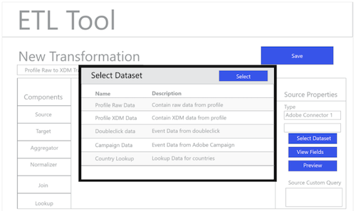
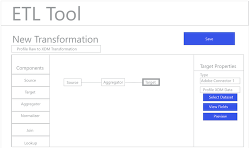

# ETL工作流程

各種提取、轉換和載入(ETL)工具在格式上可能有所不同，但大多數工具都公開類似的功能，以協助合併多個資料來源。

## ETL工具範例

下列圖表提供一般ETL動作的模型，以及基於標準互動的一般使用者體驗。 這些影像可輕鬆適應特定的ETL使用者體驗。

以下說明的動作會在中概述的步驟中進行說明 [ETL整合指南](home.md). 有些步驟會參考特定的「圖」，有些則說明與此處顯示的工作流程類似的動作。

### 圖1 — 設定新的Adobe Experience Platform聯結器：

### 圖2 - [!DNL Experience Platform] 聯結器已啟用：

### 圖3 - ETL Transformation Management UI：

### 圖4 — 新轉換UI，選取 [!DNL Experience Platform] 連線：

### 圖5 — 瀏覽來源 [!DNL Experience Platform] 資料集：

### 圖6 - ETL UI中資料集的中繼資料和範例資料：

### 圖7 — 從資料集檢視欄位結構描述資訊：

### 圖8 — 預覽資料集中的資料：

### 圖9 — 定義轉換作業的資料同步引數：

### 圖10 — 定義 [!DNL Experience Data Model] (XDM)目標資料集：

### 圖11 — 檢視XDM階層架構和中繼資料以支援對應/轉換：

### 圖12 — 儲存並執行/排程轉換：

