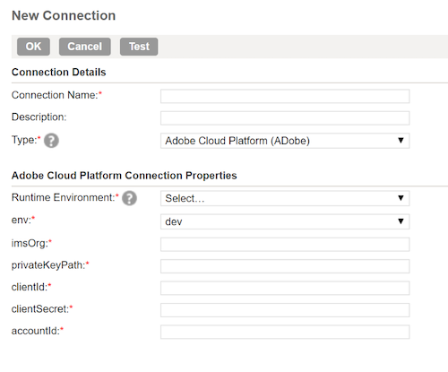

# ETL工作流程

各種擷取、轉換和載入(ETL)工具的格式可能不同，但大部分都會公開類似的功能，以協助結合多個資料來源。

## ETL工具範例

以下圖表提供常見ETL動作的模型，以及以標準互動為基礎的一般使用者體驗。 這些影像可輕鬆適用於特定ETL使用者體驗。

以下動作在「 [ETL整合指南」中說明的步驟中說明](home.md)。 有些步驟會參照特定的「圖」，有些則會說明與此處顯示的工作流程類似的動作。

### 圖1 —— 設定新的Adobe Experience Platform連接器：

### 圖2 —— 已激活 [!DNL Experience Platform] 連接器：

### 圖3 - ETL轉換管理UI:

### 圖4 —— 新的轉換UI，選擇 [!DNL Experience Platform] 連接：

### 圖5 —— 瀏覽源資料 [!DNL Experience Platform] 集：

### 圖6 - ETL使用者介面中資料集的中繼資料和範例資料：

### 圖7 —— 查看資料集中的欄位模式資訊：

### 圖8 —— 從資料集預覽資料：

### 圖9 —— 為轉換操作定義資料同步參數：

### 圖10 —— 定義(XDM) [!DNL Experience Data Model] 目標資料集：

### 圖11 —— 查看XDM分層結構模式和元資料以支援映射／轉換：

### 圖12 —— 保存並運行／計畫轉換：

