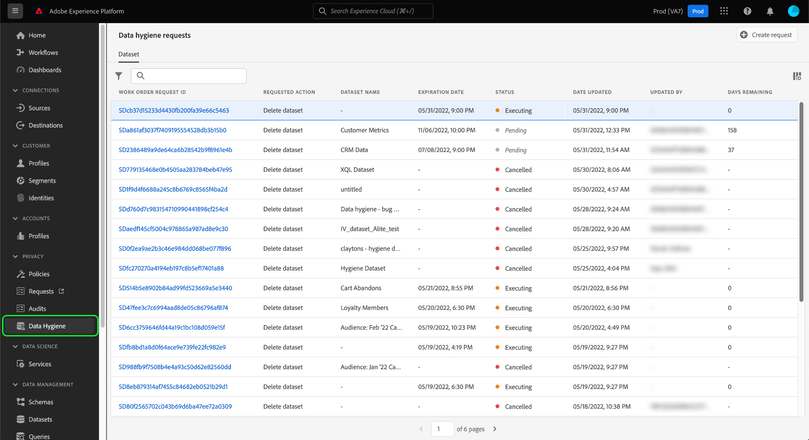
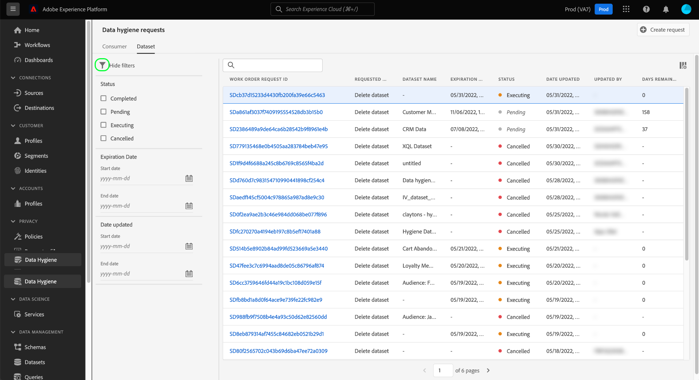
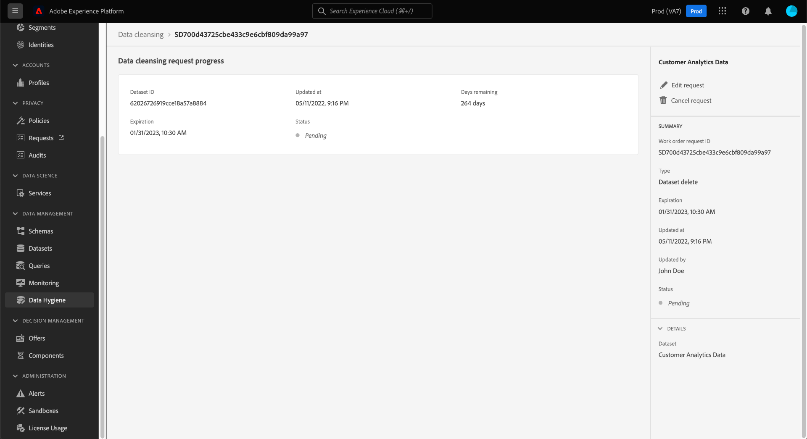

# 瀏覽資料生命週期工單 {#browse-work-orders}

>[!CONTEXTUALHELP]
>id="platform_hygiene_workorders"
>title="工單 ID"
>abstract="將資料生命週期要求傳送到系統時，便會建立執行所要求任務的工單。換句話說，工單代表特定的資料生命週期流程，包括其目前狀態和其他相關的詳細資訊。每個工單在建立時都會被自動指派自己的唯一 ID。"
>text="See the data lifecycle UI guide to learn more."

將資料生命週期要求傳送到系統時，便會建立執行所要求任務的工單。工單代表特定資料生命週期程式，例如排程的資料集到期日，其中包括其目前狀態和其他相關詳細資訊。

本指南說明如何在Adobe Experience Platform UI中檢視及管理現有工單。

## 列出及篩選現有工單

當您首次在UI中存取&#x200B;**[!UICONTROL 資料生命週期]**&#x200B;工作區時，會顯示現有工單清單及其基本詳細資料。

中的[!UICONTROL 資料生命週期]工作區

清單一次只會顯示一個類別的工作訂單。 選取&#x200B;**[!UICONTROL 取用者]**&#x200B;以檢視記錄刪除工作清單，並選取&#x200B;**[!UICONTROL 資料集]**&#x200B;以檢視排程的資料集到期清單。

![影像顯示[!UICONTROL 資料集]標籤](../images/ui/browse/dataset-tab.png)

選取漏斗圖示（）以檢視所顯示工單的篩選清單。

根據您檢視的工作單型別，有不同的篩選選項可供使用。

### 記錄刪除的篩選器

下列篩選條件適用於記錄刪除請求：

| 篩選器 | 說明 |
| --- | --- |
| [!UICONTROL 狀態] | 根據工單的目前狀態進行篩選：<ul><li>**[!UICONTROL 已完成]**：工作已完成。</li><li>**[!UICONTROL 失敗]**：工作發生錯誤，無法完成。</li><li>**[!UICONTROL 正在處理]**：要求已開始，目前正在處理。</li></ul> |
| [!UICONTROL 建立日期] | 根據產生工單的時間進行篩選。 |
| [!UICONTROL 日期已更新] | 根據上次更新工單的時間進行篩選。 建立即計為更新。 |

### 資料集有效期的篩選器

下列篩選器適用於資料集過期請求：

| 篩選器 | 說明 |
| --- | --- |
| [!UICONTROL 狀態] | 根據工單的目前狀態進行篩選：<ul><li>**[!UICONTROL 已完成]**：工作已完成。</li><li>**[!UICONTROL 擱置中]**：工作已建立，但尚未執行。 [資料集到期要求](./dataset-expiration.md)會在排定的刪除日期之前假設此狀態。 刪除日期到達後，狀態會更新為[!UICONTROL 正在執行]，除非事先取消工作。</li><li>**[!UICONTROL 正在執行]**：資料集到期要求已開始，目前正在處理中。</li><li>**[!UICONTROL 已取消]**：工作已取消為手動使用者要求的一部分。</li></ul> |
| [!UICONTROL 建立日期] | 根據產生工單的時間進行篩選。 |
| [!UICONTROL 到期日] | 根據排程的刪除日期篩選有問題的資料集的資料集到期請求。 |
| [!UICONTROL 日期已更新] | 根據上次更新工單的時間進行篩選。 建立及過期均會計為更新。 |

{style="table-layout:auto"}

## 檢視工單的詳細資訊 {#view-details}

>[!CONTEXTUALHELP]
>id="platform_hygiene_statusbyservice"
>title="服務狀態"
>abstract="資料生命週期要求會由多個 Experience Platform 服務獨立處理。本區段會概述各個服務之要求目前的處理狀態。若要了解詳細資訊，請參閱「資料生命週期 UI 指南」。"

>[!CONTEXTUALHELP]
>id="platform_hygiene_numberofidentities"
>title="身分識別的數量"
>abstract="作為此工單的一部分，其記錄被要求更新或刪除的身分識別的數量。計數中包含的身分識別不一定存在於受影響的資料集中。若要了解詳細資訊，請參閱「資料生命週期 UI 指南」。"

>[!CONTEXTUALHELP]
>id="platform_hygiene_responsemessages"
>title="記錄刪除回應"
>abstract="當記錄刪除流程收到來自系統的回應時，這些訊息會顯示在&#x200B;**[!UICONTROL 結果]**&#x200B;區段下。如果在處理工單時出現問題，任何相關的錯誤訊息都會出現在本區段以協助您對該問題進行疑難排解。若要了解詳細資訊，請查看「資料生命週期 UI 指南」。"

選取已列出工單的ID以檢視其詳細資料。

根據所選工單型別，會提供不同的資訊和控制項。 以下各節將說明這些內容。

### 記錄刪除詳細資料 {#record-delete}

記錄刪除請求的詳細資訊包括其目前狀態以及自提出請求以來經過的時間。 每個要求也包含一個&#x200B;**[!UICONTROL 依服務的狀態]**&#x200B;區段，此區段提供每個與刪除有關的下游服務的個別狀態詳細資訊。 在右邊欄中，您可以使用控制項來更新工單的名稱與描述。

### 資料集到期日詳細資料 {#dataset-expiration}

資料集到期的詳細資訊頁面提供其基本屬性的相關資訊，包括排程的到期日（即刪除前的剩餘天數）。 在右邊欄中，您可以使用控制項來編輯或取消有效期。

## 後續步驟

本指南說明如何在Platform UI中檢視及管理現有資料生命週期工單。 有關建立您自己的工單的資訊，請參閱下列檔案：

* [管理資料集有效期](./dataset-expiration.md)
* [管理記錄刪除](./record-delete.md)
