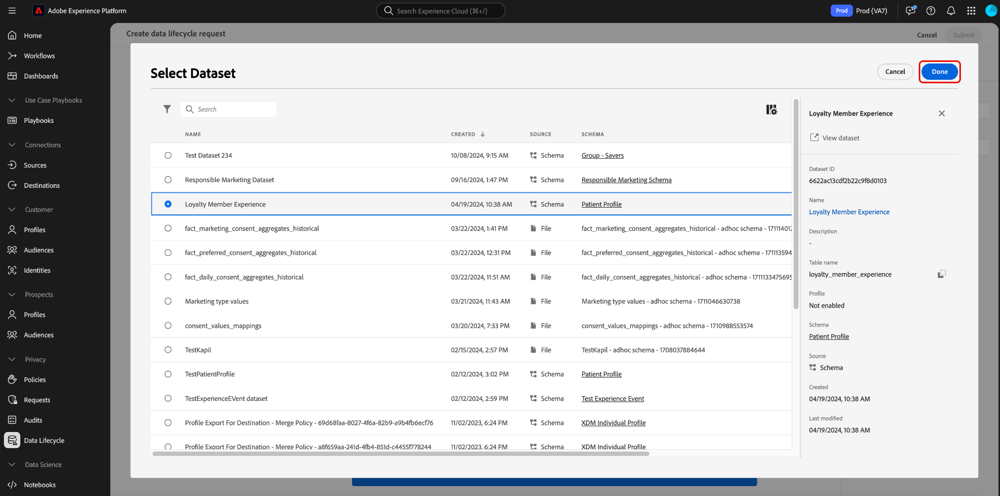

# 刪除記錄

此 [[!UICONTROL 資料衛生] 工作區](./overview.md) Adobe Experience Platform UI可讓您刪除參與Identity Service和即時客戶個人檔案的記錄。 這些記錄可以與個別消費者或包含在身分圖表中的任何其他實體繫結。

>[!IMPORTANT]
>
>記錄刪除請求僅適用於已購買的組織 **AdobeHealthcare Shield**.
>
>
>記錄刪除旨在用於資料清理、匿名資料移除或資料最小化。 它們是 **not** 根據一般資料保護規範(GDPR)等隱私權法規用於資料主體權利請求（法規遵循）。 對於所有合規性使用案例，請使用 [Adobe Experience Platform Privacy Service](../../privacy-service/home.md) 而非。

## 先決條件

刪除記錄需要深入瞭解身分欄位在Experience Platform中的運作方式。 具體而言，您必須知道要刪除其記錄之實體的主要身分值，視您要從中刪除這些記錄的資料集（或資料集）而定。

請參閱下列檔案，以取得有關Platform中身分的詳細資訊：

* [Adobe Experience Platform Identity Service](../../identity-service/home.md)：跨裝置和系統橋接身分，根據資料集符合的XDM結構描述所定義的身分欄位將其連結在一起。
   * [身分名稱空間](../../identity-service/namespaces.md)：身分名稱空間會定義可與單一人員相關的不同型別的身分資訊，且是每個身分欄位的必要元件。
* [即時客戶個人檔案](../../profile/home.md)：運用身分圖表，根據來自多個來源的彙總資料提供統一的消費者設定檔，且會近乎即時更新。
* [體驗資料模型(XDM)](../../xdm/home.md)：透過使用結構描述，為Platform資料提供標準定義和結構。 所有Platform資料集都符合特定的XDM結構描述，而結構描述會定義哪些欄位是身分。
   * [身分欄位](../../xdm/ui/fields/identity.md)：瞭解身分欄位在XDM結構描述中的定義。

## 建立新請求

若要啟動程式，請選取 **[!UICONTROL 建立請求]** 從工作區的首頁面。

![影像顯示 [!UICONTROL 建立請求] 正在選取按鈕](../images/ui/record-delete/create-request-button.png)

此時會出現請求建立對話方塊。 根據預設， **[!UICONTROL 刪除消費者]** 已選取「 」選項下的 **[!UICONTROL 請求的動作]** 區段。 保留選取此選項。


## 選取資料集

在 **[!UICONTROL 消費者詳細資料]** 區段，下一步是決定要從單一資料集還是所有資料集中刪除記錄。

如果您選擇 **[!UICONTROL 選取資料集]**，選取資料庫圖示()並出現對話方塊，可讓您從清單中選取所需的資料集。



如果您想要刪除所有資料集中的記錄，請選取 **[!UICONTROL 所有資料集]**.

![影像顯示 [!UICONTROL 所有資料集] 已選取選項](../images/ui/record-delete/all-datasets.png)

>[!NOTE]
>
>選取 **[!UICONTROL 所有資料集]** 選項可能會導致刪除操作花費更長的時間，並且可能不會導致準確的記錄刪除。

## 提供身分 {#provide-identities}

>[!CONTEXTUALHELP]
>id="platform_hygiene_primaryidentity"
>title="主要身分識別"
>abstract="主要身分識別指將記錄和 Experience Platform 中的消費者設定檔繫結的屬性。資料集的主要身分識別欄位由資料集建立基礎的方案定義。在此欄中，您必須提供記錄的主要身分識別的類型 (或命名空間)，例如用於電子郵件地址的 `email`，以及用於 Experience Cloud ID 的 `ecid`。若要了解詳細資訊，請查看資料檢疫 UI 指南。"

>[!CONTEXTUALHELP]
>id="platform_hygiene_identityvalue"
>title="身分識別值"
>abstract="在此欄中，您必須提供記錄的主要身分識別的值，該值必須和左欄中提供的身分識別類型相對應。如果主要身分識別類型是 `email`，則該值應該是記錄的電子郵件地址。若要了解詳細資訊，請查看資料檢疫 UI 指南。"

刪除記錄時，您必須提供身分資訊，讓系統能夠判斷哪些記錄必須刪除。 對於Platform中的任何資料集，記錄會根據以下條件刪除： **主要身分** 由資料集的結構描述定義的欄位。

和Platform中的所有身分識別欄位一樣，主要身分識別由兩部分組成： **type** （有時稱為身分名稱空間）和 **值**. 身分型別會提供欄位如何識別記錄（例如電子郵件地址）的相關內容，而值代表該型別記錄的特定身分(例如， `jdoe@example.com` 的 `email` 身分型別)。 作為身分識別的常見欄位包括帳戶資訊、裝置ID和Cookie ID。

>[!TIP]
>
>如果您不知道特定資料集的主要身分，可以在Platform UI中找到。 在 **[!UICONTROL 資料集]** 工作區中，從清單中選取有問題的資料集。 在資料集的詳細資訊頁面上，將滑鼠移到右側邊欄中資料集的結構描述名稱上。 主要身分會與結構描述名稱和說明一起顯示。
>
>

如果您要從單一資料集中刪除記錄，您提供的所有身分都必須有相同的型別，因為資料集只能有一個主要身分。 如果您要從所有資料集刪除，則可以包含多個身分型別，因為不同的資料集可能具有不同的主要身分。

刪除記錄時，有兩個選項可提供身分識別：

* [上傳JSON檔案](#upload-json)
* [手動輸入身分值](#manual-identity)

### 上傳JSON檔案 {#upload-json}

若要上傳JSON檔案，您可以將檔案拖放至提供區域，或選取 **[!UICONTROL 選擇檔案]** 瀏覽並從本機目錄中選取。


JSON檔案必須格式化為物件陣列，每個物件代表一個身分。

```json
[
  {
    "namespaceCode": "email",
    "value": "jdoe@example.com"
  },
  {
    "namespaceCode": "email",
    "value": "san.gray@example.com"
  }
]
```

| 屬性 | 說明 |
| --- | --- |
| `namespaceCode` | 身分型別。 |
| `value` | 型別所表示的身分值。 |

上傳檔案後，您可以繼續 [提交請求](#submit).

### 手動輸入身分 {#manual-identity}

若要手動輸入身分，請選取 **[!UICONTROL 新增身分]**.

![影像顯示 [!UICONTROL 新增身分] 正在選取按鈕](../images/ui/record-delete/add-identity.png)

顯示的控制項可讓您一次輸入一個身分。 下 **[!UICONTROL 主要身分]**，使用下拉式選單來選取身分型別。 下 **[!UICONTROL 身分值]**，提供記錄的主要身分值。


若要新增更多身分，請選取加號圖示()或選取 **[!UICONTROL 新增身分]**.


## 提交請求(#submit)

完成向請求新增身分後，請在 **[!UICONTROL 請求設定]**，在選取之前提供請求的名稱和選擇性說明 **[!UICONTROL 提交]**.

![影像顯示 [!UICONTROL 提交] 正在選取按鈕](../images/ui/record-delete/submit.png)

系統會要求您確認要刪除其資料的身分清單。 選取 **[!UICONTROL 提交]** 以確認您的選取。


提交請求後，即會建立工單並出現在 [!UICONTROL 消費者] 的標籤 [!UICONTROL 資料衛生] 工作區。 從這裡，您可以在工單處理請求時監視工單的狀態。

>[!NOTE]
>
>請參閱概述一節，網址為 [時間表與透明度](../home.md#record-delete-transparency) 以取得記錄刪除執行後如何處理的詳細資訊。

## 後續步驟

本檔案說明如何刪除Experience PlatformUI中的記錄。 有關如何在UI中執行其他資料檢疫工作的資訊，請參閱 [資料衛生UI總覽](./overview.md).

若要瞭解如何使用資料衛生API刪除記錄，請參閱 [工單端點指南](../api/workorder.md).
