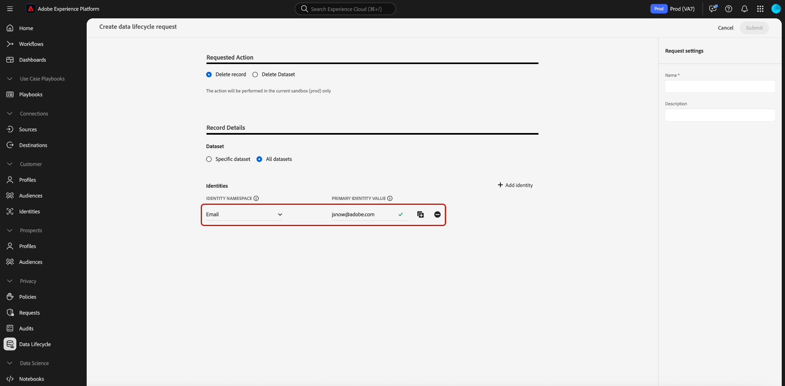

# 記錄刪除請求（UI工作流程） {#record-delete}

使用[[!UICONTROL Data Lifecycle]工作區](./overview.md)，根據其主要身分刪除Adobe Experience Platform中的記錄。 這些記錄可以與個別消費者或包含在身分圖表中的任何其他實體繫結。

>[!IMPORTANT]
>
>記錄刪除旨在用於資料清理、匿名資料移除或資料最小化。 它們&#x200B;**不**&#x200B;用於資料主體權利要求（法規遵循），因為與一般資料保護規範(GDPR)等隱私權法規相關。 對於所有規範使用案例，請改用[Adobe Experience Platform Privacy Service](../../privacy-service/home.md)。

## 先決條件 {#prerequisites}

刪除記錄需要實際瞭解Experience Platform中身分欄位的運作方式。 具體來說，您必須知道要刪除其記錄的實體的身分名稱空間值，端視您要從中刪除這些記錄的資料集（或資料集）而定。

請參閱以下檔案，瞭解有關Experience Platform中身分的詳細資訊：

* [Adobe Experience Platform Identity服務](../../identity-service/home.md)：跨裝置和系統橋接身分，根據資料集所符合的XDM結構描述所定義的身分欄位，將資料集連結在一起。
* [身分識別名稱空間](../../identity-service/features/namespaces.md)：身分識別名稱空間會定義與單一人員相關的不同身分識別資訊型別，而且是每個身分識別欄位的必要元件。
* [即時客戶個人檔案](../../profile/home.md)：使用身分圖表，根據來自多個來源的彙總資料提供統一的消費者個人檔案，近乎即時更新。
* [體驗資料模型(XDM)](../../xdm/home.md)：透過使用結構描述為Experience Platform資料提供標準定義和結構。 所有Experience Platform資料集都符合特定的XDM結構描述，而結構描述會定義哪些欄位是身分。
* [身分欄位](../../xdm/ui/fields/identity.md)：瞭解身分欄位在XDM結構描述中的定義方式。

## 建立請求 {#create-request}

若要開始此程式，請在Experience Platform UI的左側導覽中選取&#x200B;**[!UICONTROL Data Lifecycle]**。 [!UICONTROL Data lifecycle requests]工作區會出現。 接著，從工作區的首頁面選取&#x200B;**[!UICONTROL Create request]**。

![已選取[!UICONTROL Data lifecycle requests]的[!UICONTROL Create request]工作區。](../images/ui/record-delete/create-request-button.png)

此時會出現請求建立工作流程。 依預設，**[!UICONTROL Delete record]**&#x200B;區段底下會選取&#x200B;**[!UICONTROL Requested Action]**&#x200B;選項。 保留選取此選項。

>[!IMPORTANT]
> 
>為了提高效率並降低資料集操作的成本，已移至Delta格式的組織可以刪除Identity Service、即時客戶設定檔和資料湖中的資料。 此型別的使用者稱為差異移轉使用者。 已進行差異移轉的組織之使用者，可選擇從單一或所有資料集中刪除記錄。 來自未曾進行差異移轉之組織的使用者，無法從單一資料集或所有資料集中選擇性地刪除記錄，如下圖所示。 在此情況下，請繼續前往指南的[提供身分](#provide-identities)區段。

![已選取並反白顯示[!UICONTROL Delete record]選項的請求建立工作流程。](../images/ui/record-delete/delete-record.png)

## 選取資料集 {#select-dataset}

下一步是決定您要從單一資料集還是所有資料集中刪除記錄。 根據您組織的設定，可能無法使用資料集選擇選項。 如果沒有看到此選項，請繼續前往指南的[提供身分](#provide-identities)區段。

在&#x200B;**[!UICONTROL Record Details]**&#x200B;區段中，選取選項按鈕以選擇特定資料集或所有資料集。

若要從特定資料集刪除，請選取&#x200B;**[!UICONTROL Select dataset]**，然後選取資料庫圖示（）。 在出現的對話方塊中，選擇資料集並選取&#x200B;**[!UICONTROL Done]**&#x200B;進行確認。

![已選取資料集並醒目提示[!UICONTROL Select dataset]的[!UICONTROL Done]對話方塊。](../images/ui/record-delete/select-dataset.png)

若要從所有資料集中刪除，請選取&#x200B;**[!UICONTROL All datasets]**。 此選項會增加操作的範圍，並需要您提供所有相關身分型別。

![已選取[!UICONTROL Select dataset]選項的[!UICONTROL All datasets]對話方塊。](../images/ui/record-delete/all-datasets.png)

>[!WARNING]
>
>選取&#x200B;**[!UICONTROL All datasets]**&#x200B;會將作業展開至您組織中的所有資料集。 每個資料集都可以使用不同的主要身分型別。 您必須提供&#x200B;**所有必要的身分型別**，以確保正確比對。
>
>如果缺少任何身分型別，刪除期間可能會略過某些記錄。 這可能會減慢處理速度，並導致&#x200B;**部分結果**。

Experience Platform中的每個資料集僅支援一個主要身分型別。

* 從&#x200B;**單一資料集**&#x200B;中刪除時，請求中的所有身分都必須使用&#x200B;**相同型別**。
* 從&#x200B;**所有資料集**&#x200B;中刪除時，您可以包含&#x200B;**多個身分型別**，因為不同的資料集可能依賴不同的主要身分。」

## 提供身分識別 {#provide-identities}

>[!CONTEXTUALHELP]
>id="platform_hygiene_primaryidentity"
>title="身分識別命名空間"
>abstract="身分識別命名空間指將記錄和 Experience Platform 中的消費者設定檔繫結的屬性。資料集的身分識別命名空間欄位由資料集建立基礎的結構描述定義。在此欄中，您必須提供記錄的身分識別命名空間的類型 (或命名空間)，例如用於電子郵件地址的 `email`，以及用於 Experience Cloud ID 的 `ecid`。若要了解詳細資訊，請查看「資料生命週期 UI 指南」。"

>[!CONTEXTUALHELP]
>id="platform_hygiene_identityvalue"
>title="主要身分識別值"
>abstract="在此欄中，您必須提供記錄的身分命名空間的值，該值必須和左欄中提供的身分識別類型相對應。如果身分識別命名空間類型是 `email`，則該值應該是記錄的電子郵件地址。若要了解詳細資訊，請查看「資料生命週期 UI 指南」。"

刪除記錄時，您必須提供身分資訊，讓系統能夠決定要刪除哪些記錄。 對於Experience Platform中的任何資料集，會根據資料集結構描述所定義的&#x200B;**身分名稱空間**&#x200B;欄位來刪除記錄。

和Experience Platform中的所有身分識別欄位一樣，身分識別名稱空間是由兩部分組成： **型別** （有時稱為身分識別名稱空間）和&#x200B;**值**。 身分型別提供欄位如何識別記錄的上下文（例如電子郵件地址）。 值代表該型別的記錄特定身分（例如，`jdoe@example.com`身分型別的`email`）。 做為身分識別的常見欄位包括帳戶資訊、裝置ID和Cookie ID。

>[!TIP]
>
>如果您不知道特定資料集的身分名稱空間，可以在Experience Platform UI中找到。 在&#x200B;**[!UICONTROL Datasets]**&#x200B;工作區中，從清單中選取有問題的資料集。 在資料集的詳細資訊頁面上，將滑鼠移至右側邊欄中資料集的結構描述名稱上。 身分名稱空間會與結構描述名稱和說明一起顯示。
>
>

刪除記錄時，有兩個選項可提供身分識別：

* [上傳JSON檔案](#upload-json)
* [手動輸入主要身分值](#manual-identity)

### 上傳JSON檔案 {#upload-json}

若要上傳JSON檔案，您可以將檔案拖放至提供的區域，或選取&#x200B;**[!UICONTROL Choose files]**&#x200B;瀏覽並從本機目錄中選取。


JSON檔案必須格式化為物件陣列，每個物件代表一個身分。

```json
[
  {
    "namespaceCode": "email",
    "value": "jdoe@example.com"
  },
  {
    "namespaceCode": "email",
    "value": "san.gray@example.com"
  }
]
```

| 屬性 | 說明 |
| --- | --- |
| `namespaceCode` | 身分型別。 |
| `value` | 型別所代表的主要身分值。 |

上傳檔案後，您就可以繼續[提交要求](#submit)。

### 手動輸入身分 {#manual-identity}

若要手動輸入身分，請選取&#x200B;**[!UICONTROL Add identity]**。

![要求建立工作流程中反白了[!UICONTROL Add identity]選項。](../images/ui/record-delete/add-identity.png)

顯示的控制項可讓您一次輸入一個身分。 在&#x200B;**[!UICONTROL identity namespace]**&#x200B;底下，使用下拉式功能表來選取身分型別。 在&#x200B;**[!UICONTROL Primary Identity Value]**&#x200B;底下，提供記錄的身分名稱空間值。



若要新增更多身分，請選取加號圖示()，或選取&#x200B;**[!UICONTROL Add identity]**。


## 配額與處理時間表 {#quotas}

記錄刪除請求受到每日和每月識別碼提交限制的約束，此限制取決於您組織的授權權益。 這些限制同時適用於UI和API型刪除請求。

>[!NOTE]
>
>您每天最多可以提交&#x200B;**1,000,000個識別碼**，但前提是剩餘的每月配額允許。 如果您的每月上限少於100萬，則每日提交內容不能超過該上限。

### 依產品的每月提交權利 {#quota-limits}

下表概述產品和權益層級的識別碼提交限制。 對於每種產品，每月上限是兩個值中較小者：固定的識別碼上限，或與授權資料量繫結的百分比型臨界值。

| 產品 | 權益說明 | 每月上限（以較小者為準） |
|----------|-------------------------|---------------------------------|
| Real-Time CDP或Adobe Journey Optimizer | 不含Privacy and Security Shield或Healthcare Shield附加元件 | 2,000,000個識別碼或可定址對象的5% |
| Real-Time CDP或Adobe Journey Optimizer | 搭配Privacy and Security Shield或Healthcare Shield附加元件 | 15,000,000個識別碼或10%的可定址對象 |
| Customer Journey Analytics | 不含Privacy and Security Shield或Healthcare Shield附加元件 | 每百萬個CJA權益列有2,000,000個識別碼或100個識別碼 |
| Customer Journey Analytics | 搭配Privacy and Security Shield或Healthcare Shield附加元件 | 每百萬個CJA權益列有15,000,000個識別碼或200個識別碼 |

>[!NOTE]
>
> 根據組織的實際可定址對象或CJA列權益，大多陣列織的每月限制會較低。

配額在每個日曆月的第一天重設。 未使用的配額&#x200B;**不會**&#x200B;延續。

>[!NOTE]
>
>配額是以貴組織針對&#x200B;**已提交識別碼**&#x200B;的每月授權為基礎。 系統護欄不會強制執行這些動作，但可加以監控和檢閱。
>
>記錄刪除是&#x200B;**共用服務**。 您的每月上限反映了Real-Time CDP、Adobe Journey Optimizer、Customer Journey Analytics和任何適用的Shield附加元件的最高權益。

### 處理識別碼提交的時間表 {#sla-processing-timelines}

提交後，記錄刪除請求會根據您的權益層級排入佇列並進行處理。

| 產品與權益說明 | 佇列持續時間 | 最大處理時間(SLA) |
|------------------------------------------------------------------------------------|---------------------|-------------------------------|
| 不含Privacy and Security Shield或Healthcare Shield附加元件 | 最多15天 | 30 天 |
| 搭配Privacy and Security Shield或Healthcare Shield附加元件 | 通常為24小時 | 15 天 |

如果您的組織需要更高的限制，請聯絡您的Adobe代表以要求軟體權利檔案審查。

>[!TIP]
>
>若要檢查您目前的配額使用量或權利階層，請參閱[配額參考指南](../api/quota.md)。

## 提交請求 {#submit}

完成新增身分到要求之後，請在&#x200B;**[!UICONTROL Request settings]**&#x200B;底下提供要求的名稱和選擇性描述，然後再選取&#x200B;**[!UICONTROL Submit]**。

>[!TIP]
>
>您可以透過UI提交每個請求最多10,000個身分。 若要提交較大的磁碟區（每個請求最多100,000個ID），請使用[API方法](../api/workorder.md#create)。

![要求設定的[!UICONTROL Name]和[!UICONTROL Description]欄位中反白顯示[!UICONTROL Submit]。](../images/ui/record-delete/submit.png)

[!UICONTROL Confirm request]對話方塊似乎表示刪除後無法復原身分。 選取&#x200B;**[!UICONTROL Submit]**&#x200B;以確認您要刪除其資料的身分清單。

![&#x200B; [!UICONTROL Confirm request]對話方塊。](../images/ui/record-delete/confirm-request.png)

提交請求後，工作單即建立並顯示在[!UICONTROL Record]工作區的[!UICONTROL Data Lifecycle]標籤上。 從這裡，您可以在工單處理請求時監視工單的狀態。

>[!NOTE]
>
>如需記錄刪除執行後如何處理的詳細資訊，請參閱[時間表與透明度](../home.md#record-delete-transparency)的概觀區段。

![反白顯示新請求的[!UICONTROL Record]工作區的[!UICONTROL Data Lifecycle]索引標籤。](../images/ui/record-delete/request-log.png)

## 根據關聯式結構描述從資料集中刪除記錄 {#relational-record-delete}

如果您要刪除的資料集是根據關聯式結構描述，請檢閱下列考量事項，以確保正確移除記錄，且不會因為Experience Platform與來源系統之間的不相符而重新內嵌。

>[!NOTE]
>
>關聯式結構描述先前在舊版Adobe Experience Platform檔案中稱為模型式結構描述。 功能與刪除行為維持不變。

### 記錄刪除行為

下表概述記錄刪除在Experience Platform和來源系統間的行為，依擷取方法和變更資料擷取設定而定。

| 外觀 | 行為 |
|---------------------|--------------------------------------------------------------------------|
| 平台刪除 | 記錄會從Experience Platform資料集和資料湖中移除。 |
| Source保留 | 記錄會保留在來源系統中，除非在該處被明確刪除。 |
| 全面重新整理影響 | 如果使用完全重新整理，除非從來源移除或排除，否則可能會重新擷取已刪除的記錄。 |
| 變更資料擷取行為 | 擷取期間會刪除以`_change_request_type = 'd'`標幟的記錄。 未標幟的記錄可重新內嵌。 |

若要防止重新內嵌，請在來源系統和Experience Platform中套用相同的刪除方法，從兩個系統移除記錄，或針對您要刪除的記錄加入`_change_request_type = 'd'`。

### 變更資料擷取和控制欄

將來源與變更資料擷取搭配使用的關聯式結構描述，可在區分刪除與更新插入時使用`_change_request_type`控制欄。 擷取期間，會從資料集中刪除標示為`d`的記錄，而標示為`u`或未標示欄的記錄則被視為更新插入。 `_change_request_type`欄僅在擷取時讀取，不會儲存在目標結構描述中或對應到XDM欄位。

>[!NOTE]
>
>透過資料生命週期UI刪除記錄不會影響來源系統。 若要從這兩個位置移除資料，請在Experience Platform和來源中將其刪除。

### 關聯式結構描述的其他刪除方法

除了標準記錄刪除工作流程，關聯式結構描述還支援特定使用案例的其他方法：

* **安全複製資料集方法**：將變更套用到生產資料之前，請先複製生產資料集並將刪除套用到副本以進行受控測試或調解。
* **僅刪除批次上傳**：當您需要移除特定記錄而不影響其他資料時，請上傳僅包含目標衛生刪除操作的檔案。

### 衛生操作的描述項支援 {#descriptor-support}

關聯式結構描述項提供精確衛生操作的基本中繼資料：

* **主要索引鍵描述項**：識別目標更新或刪除的唯一記錄，確保正確的記錄受到影響。
* **版本描述項**：確保以正確的時間順序套用刪除和更新，防止不循序的操作。
* **時間戳記描述項（時間序列結構描述）**：將刪除作業與事件發生時間對齊，而非擷取時間。

>[!NOTE]
>
>衛生程式會在資料集層級運作。 對於啟用設定檔的資料集，可能需要額外的設定檔工作流程來維護即時客戶設定檔的一致性。

### 關聯式結構描述的排程保留

若要根據資料年齡而非特定身分來自動衛生，請參閱[管理體驗事件資料集保留(TTL)](../../catalog/datasets/experience-event-dataset-retention-ttl-guide.md)，以瞭解資料湖中排程的資料列層級保留。

>[!NOTE]
>
>只有使用時間序列行為的資料集才支援列層級的有效期。

### 關聯式記錄刪除的最佳實務

為避免無意中再次擷取並維持跨系統的資料一致性，請遵循以下最佳實務：

* **協調刪除**：將記錄刪除與變更資料擷取組態和來源資料管理策略對齊。
* **監視變更資料擷取流程**：在刪除Platform中的記錄之後，監視資料流程並確認來源系統是否移除相同的記錄或包含`_change_request_type = 'd'`的記錄。
* **清理來源**：對於使用完整重新整理擷取的來源，或那些不支援透過變更資料擷取進行刪除的來源，請直接從來源系統刪除記錄，以避免重新擷取。

如需結構描述需求的詳細資訊，請參閱[關聯式結構描述項需求](../../xdm/schema/relational.md#relational-schemas)。

若要瞭解變更資料擷取如何與來源搭配運作，請參閱[在來源中啟用變更資料擷取](../../sources/tutorials/api/change-data-capture.md#using-change-data-capture-with-relational-schemas)。

## 後續步驟

本檔案說明如何刪除Experience Platform UI中的記錄。 有關如何在UI中執行其他資料生命週期管理工作的資訊，請參閱[資料生命週期UI概觀](./overview.md)。

若要瞭解如何使用資料衛生API刪除記錄，請參閱[工單端點指南](../api/workorder.md)。
