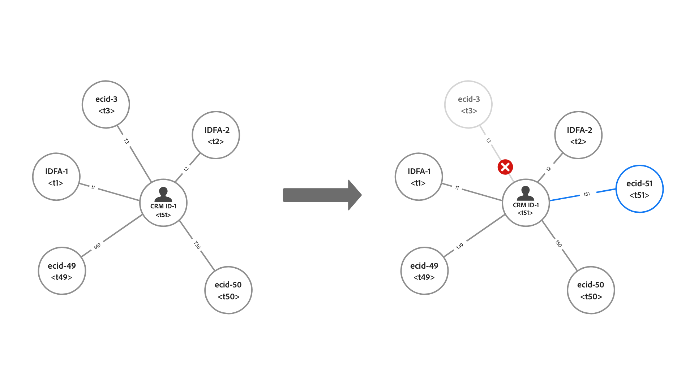

# 護欄 [!DNL Identity Service] 資料

本檔案提供以下專案的使用與速率限制相關資訊： [!DNL Identity Service] 資料可協助您最佳化身分圖表的使用方式。 檢閱下列護欄時，系統假設您已正確地模型化資料。 如果您有任何關於如何模型化資料的問題，請聯絡您的客戶服務代表。

>[!IMPORTANT]
>
>檢查您的銷售訂單中的授權權利以及對應的 [產品說明](https://helpx.adobe.com/legal/product-descriptions.html) 除了此護欄頁面之外，還受到實際使用量限制。

## 快速入門

下列Experience Platform服務與模型化身分資料有關：

* [身分](home.md)：橋接擷取到Platform中的不同資料來源身分。
* [[!DNL Real-Time Customer Profile]](../profile/home.md)：使用來自多個來源的資料建立統一的消費者設定檔。

## 資料模型限制

下表提供有關靜態限制的護欄指南，以及要考慮用於身分名稱空間的驗證規則。

### 靜態限制

下表概述套用至身分資料的靜態限制。

| 護欄 | 限制 | 附註 |
| --- | --- | --- |
| 圖表中的身分數量 | 50 | 更新具有50個連結身分的圖形時，Identity Service將套用「先進先出」的機制，並刪除最舊的身分，以為此圖形的最新身分騰出空間(**注意**：即時客戶設定檔不受影響)。 刪除是根據身分型別和時間戳記。 此限制會套用至沙箱層級。 如需詳細資訊，請閱讀以下章節： [瞭解刪除邏輯](#deletion-logic). |
| 單一批次擷取的身分連結數 | 50 | 單一批次可能包含異常身分，這些身分會造成不想要的圖表合併。 為防止此情況，Identity Service將不會擷取已連結至50個或更多身分的身分。 |
| XDM記錄中的身分數量 | 20 | 需要的XDM記錄數量下限為2。 |
| 自訂名稱空間數量 | None | 您可以建立的自訂名稱空間數量沒有限制。 |
| 名稱空間顯示名稱或身分符號的字元數 | None | 名稱空間顯示名稱或身分符號的字元數沒有限制。 |

{style="table-layout:auto"}

### 身分值驗證

下表概述您必須遵循的現有規則，以確保身分值成功驗證。

| 命名空間 | 驗證規則 | 違反規則時的系統行為 |
| --- | --- | --- |
| ECID | <ul><li>ECID的身分值必須剛好38個字元。</li><li>ECID的身分值必須僅由數字組成。</li></ul> | <ul><li>如果ECID的身分值不完全是38個字元，則會略過記錄。</li><li>如果ECID的身分值包含非數字字元，則會略過記錄。</li></ul> |
| 非ECID | <ul><li>身分值不可超過1024個字元。</li><li>身分值不可以是「null」、「anonymous」、「invalid」或空字串（例如：「 」、「」、「 」）。</li></ul> | <ul><li>如果身分值超過1024個字元，則會略過記錄。</li><li>此身分將會遭到封鎖，無法內嵌。</li></ul> |

{style="table-layout:auto"}

### 身分名稱空間擷取

自2023年3月31日起，Identity Service將封鎖新客戶的Adobe Analytics ID (AAID)擷取。 此身分通常透過 [Adobe Analytics來源](../sources/connectors/adobe-applications/analytics.md) 和 [Adobe Audience Manager來源](../sources//connectors/adobe-applications/audience-manager.md) 和是多餘的，因為ECID代表相同的網頁瀏覽器。 如果您想要變更此預設設定，請聯絡您的Adobe客戶團隊。

## 瞭解當容量中的身分圖表更新時的刪除邏輯 {#deletion-logic}

更新完整的身分圖表時，Identity Service會先刪除圖表中最舊的身分，然後再新增最新的身分。 這是為了維持身分資料的正確性和關聯性。 此刪除程式會遵循兩個主要規則：

### 刪除規則#1會根據名稱空間的身分型別來排定優先順序

刪除優先順序如下：

1. Cookie ID
2. 裝置 ID
3. 跨裝置ID、電子郵件和電話

### 刪除規則#2根據儲存在身分上的時間戳記

圖表中所連結的每個身分都有各自的對應時間戳記。 更新完整圖表時，Identity Service會刪除具有最舊時間戳記的身分。

當完整圖表更新為新身分時，這兩個規則會協同工作，指定將刪除哪個舊身分。 Identity Service會先刪除最舊的Cookie ID，接著刪除最舊的裝置ID，最後刪除最舊的跨裝置ID/電子郵件/電話。

>[!NOTE]
>
>如果要刪除的身分已連結到圖表中的多個其他身分，則連線該身分的連結也會被刪除。

### 對實作的影響

以下章節概述刪除邏輯對Identity Service、即時客戶個人檔案和WebSDK的影響。

#### 身分服務：自訂名稱空間身分型別變更

Adobe如果您的生產沙箱包含：

* 將人員識別碼（例如CRM ID）設定為Cookie/裝置身分型別的自訂名稱空間。
* 將Cookie/裝置識別碼設定為跨裝置識別型別的自訂名稱空間。

此功能可用後，超過50個身分限制的圖表將減少到最多50個身分。 對於Real-Time CDP B2C Edition，這可能會導致符合對象資格的設定檔數量增加到最低限度，因為這些設定檔先前在細分和啟動中被忽略。

#### 即時客戶個人檔案：對可定址對象的影響

刪除僅發生在Identity Service中的資料，不會發生在即時客戶個人檔案中。

* 因此，此行為可能會使用單一ECID建立更多設定檔，因為ECID不再是身分圖表的一部分。
* 為了讓您保持在可定址對象權益數量內，建議您啟用 [假名設定檔資料有效期](../profile/pseudonymous-profiles.md) 以刪除您的舊設定檔。

#### 即時客戶個人檔案和WebSDK：主要身分刪除

若您想要保留已根據CRM ID驗證的事件，建議您將ECID的主要識別碼變更為CRM ID。 請閱讀下列檔案，以瞭解如何實作此變更的步驟：

* [設定Experience Platform標籤的身分對應](../tags/extensions/client/web-sdk/data-element-types.md#identity-map).
* [Experience Platform Web SDK中的身分資料](../web-sdk/identity/overview.md#using-identitymap)

### 範例情境

#### 範例一：典型的大型圖表

*圖表附註：*

* `t` =時間戳記。
* 時間戳記的值對應至指定身分的造訪間隔。 例如， `t1` 代表第一個連結的身分（最舊）和 `t51` 將代表最新的連結身分。

在此範例中，Identity Service會先刪除具有最舊時間戳記的現有身分，之後才能使用新身分更新左側的圖形。 但是，由於最舊的身分識別是裝置ID，Identity Service會略過該身分識別，直到它到達刪除優先順序清單中型別較高的名稱空間(在此例中為 `ecid-3`. 一旦移除具有更高刪除優先順序型別的最舊身分識別，圖表就會更新為新連結。 `ecid-51`.

* 在極少數情況下，會有兩個具有相同時間戳記和身分型別的身分，Identity Service會根據此ID排序 [XID](./api/list-native-id.md) 並執行刪除。

#### 範例二：「圖表分割」

>[!BEGINTABS]

>[!TAB 傳入事件]

*圖表附註：*

* 下圖假設在 `timestamp=50`，身分圖表中有50個身分。
* `(...)` 表示已在圖形內連結的其他身分。

在此範例中，會擷取ECID：32110並連結至位於的大型圖形 `timestamp=51`，因此超過50個身分的限制。

>[!TAB 刪除程式]

因此，Identity Service會根據時間戳記和身分型別刪除最舊的身分。 在此情況下，ECID：35577只會從身分圖表中刪除。

>[!TAB 圖表輸出]

刪除ECID：35577後，連結CRM ID：60013和CRM ID：25212與現在已刪除之ECID：35577的邊緣也會被刪除。 此刪除程式會導致圖表被分割成兩個較小的圖表。

>[!ENDTABS]

#### 範例三：「軸輻式」

>[!BEGINTABS]

>[!TAB 傳入事件]

*圖表附註：*

* 下圖假設在 `timestamp=50`，身分圖表中有50個身分。
* `(...)` 表示已在圖形內連結的其他身分。

透過刪除邏輯，某些「中樞」身分也可能會被刪除。 這些中心身分識別是指連結到多個單獨身分識別的節點，否則這些身分識別會解除連結。

在以下範例中，ECID：21011已擷取並連結至的圖形 `timestamp=51`，因此超過50個身分的限制。

>[!TAB 刪除程式]

因此，Identity Service只會從身分圖表刪除最舊的身分，此案例中為ECID：35577。 刪除ECID：35577也會導致以下刪除：

* CRM ID：60013和現已刪除的ECID：35577之間的連結，因此會產生圖表分割情況。
* IDFA： 32110、IDFA： 02383以及所代表的其餘身分 `(...)`. 這些身分會遭到刪除，因為個別身分不會連結至任何其他身分，因此無法在圖形中顯示。

>[!TAB 圖表輸出]

最後，刪除程式會產生兩個較小的圖表。

>[!ENDTABS]

## 後續步驟

請參閱以下檔案以瞭解更多有關 [!DNL Identity Service]：

* [[!DNL Identity Service] 概觀](home.md)
* [身分圖表檢視器](features/identity-graph-viewer.md)

請參閱下列檔案，深入瞭解其他Experience Platform服務護欄、端對端延遲資訊，以及Real-Time CDP產品說明檔案的授權資訊：

* [Real-Time CDP護欄](/help/rtcdp/guardrails/overview.md)
* [端對端延遲圖](https://experienceleague.adobe.com/docs/blueprints-learn/architecture/architecture-overview/deployment/guardrails.html?lang=en#end-to-end-latency-diagrams) 用於各種Experience Platform服務。
* [Real-time Customer Data Platform （B2C版本 — Prime和Ultimate套件）](https://helpx.adobe.com/legal/product-descriptions/real-time-customer-data-platform-b2c-edition-prime-and-ultimate-packages.html)
* [Real-time Customer Data Platform （B2P - Prime和Ultimate套件）](https://helpx.adobe.com/legal/product-descriptions/real-time-customer-data-platform-b2p-edition-prime-and-ultimate-packages.html)
* [Real-time Customer Data Platform （B2B - Prime和Ultimate套件）](https://helpx.adobe.com/legal/product-descriptions/real-time-customer-data-platform-b2b-edition-prime-and-ultimate-packages.html)
