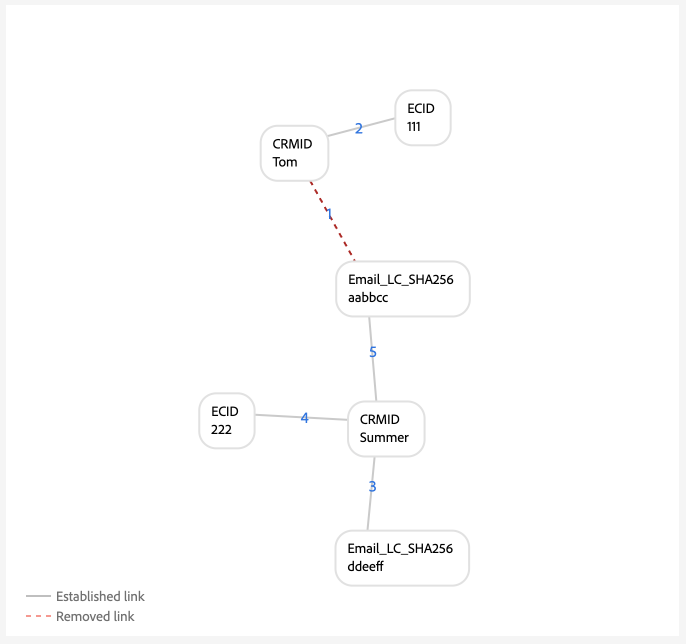
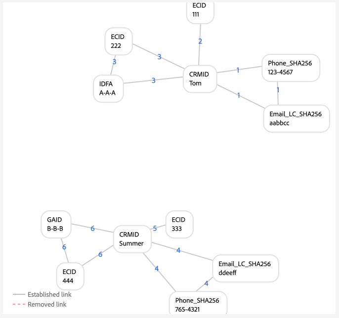

# 圖表設定範例

>[!AVAILABILITY]
>
>身分圖表連結規則目前處於Beta版。 如需參與率條件的詳細資訊，請聯絡您的Adobe客戶團隊。 功能和檔案可能會有所變更。

>[!NOTE]
>
>* &quot;CRMID&quot;和&quot;loginID&quot;均為自訂名稱空間。 在此檔案中，「CRMID」是人員識別碼，而「loginID」是與指定人員相關聯的登入識別碼。
>* 若要模擬本檔案中概述的範例圖表情境，您必須先建立兩個自訂名稱空間，一個具有身分符號「CRMID」，另一個具有身分符號「loginID」。 身分符號區分大小寫。

本檔案概述使用身分資料時可能遇到的常見情境的圖表設定範例。

## 僅限CRMID

這是簡單實施情境的範例，其中擷取線上事件（CRMID和ECID），並僅針對CRMID儲存離線事件（設定檔記錄）。

**實作：**

| 使用的名稱空間 | Web行為收集方法 |
| --- | --- |
| CRMID、ECID | Web SDK |

**事件：**

您可以將下列事件複製到文字模式，以在圖表模擬中建立此案例：

* CRMID： Tom，ECID： 111

**演演算法組態：**

您可以透過為演演算法設定下列設定，在圖表模擬中建立此情境：

| 優先等級 | 顯示名稱 | 身分類型 | 在每個圖表中唯一 |
| ---| --- | --- | --- |
| 1 | CRMID | 跨裝置 | 是 |
| 2 | ECID | COOKIE | 無 |

**即時客戶個人檔案的主要身分選擇：**

在此設定的內容中，主要身分的定義如下：

| 驗證狀態 | 事件中的名稱空間 | 主要身分識別 |
| --- | --- | --- |
| 已驗證 | CRMID、ECID | CRMID |
| 未驗證 | ECID | ECID |

>[!BEGINTABS]

>[!TAB 理想的單人圖表情境]

以下是理想的單人圖表範例，其中CRMID是唯一的，且有最高優先順序。

>[!TAB 多人圖表情境]

以下是多人圖表的範例。 此範例會顯示「共用裝置」情境，其中包含兩個CRMID，而含有已建立舊連結的CRMID則會被移除。

>[!ENDTABS]

## 使用雜湊電子郵件的CRMID

此情境中，CRMID會內嵌並代表線上（體驗事件）和離線（設定檔記錄）資料。 此案例也涉及雜湊電子郵件的擷取，其代表CRM記錄資料集中與CRMID一起傳送的另一個名稱空間。

**實作：**

| 使用的名稱空間 | Web行為收集方法 |
| --- | --- |
| CRMID、Email_LC_SHA256、ECID | Web SDK |

**事件：**

您可以將下列事件複製到文字模式，以在圖表模擬中建立此案例：

* CRMID： Tom， Email_LC_SHA256： tom@acme.com
* CRMID： Tom，ECID： 111
* CRMID：夏季，Email_LC_SHA256：夏季@acme.com
* CRMID：Summer，ECID：222

**演演算法組態：**

您可以透過為演演算法設定下列設定，在圖表模擬中建立此情境：

| 優先等級 | 顯示名稱 | 身分類型 | 在每個圖表中唯一 |
| ---| --- | --- | --- |
| 1 | CRMID | 跨裝置 | 是 |
| 2 | 電子郵件 (SHA256，小寫) | 電子郵件 | 無 |
| 3 | ECID | COOKIE | 無 |

**設定檔的主要身分選擇：**

在此設定的內容中，主要身分的定義如下：

| 驗證狀態 | 事件中的名稱空間 | 主要身分識別 |
| --- | --- | --- |
| 已驗證 | CRMID、ECID | CRMID |
| 未驗證 | ECID | ECID |

>[!BEGINTABS]

>[!TAB 理想的單人圖表情境]

>[!TAB 多人圖表：共用裝置]

>[!TAB 多人圖表：非唯一電子郵件]

>[!ENDTABS]

## 使用雜湊電子郵件、雜湊電話、GAID和IDFA的CRMID

此案例與上一個案例類似。 不過，在此案例中，雜湊電子郵件和電話會標示為身分，以用於區段比對。

**實作：**

| 使用的名稱空間 | Web行為收集方法 |
| --- | --- |
| CRMID、Email_LC_SHA256、Phone_SHA256、GAID、IDFA、ECID | Web SDK |

**事件：**

您可以將下列事件複製到文字模式，以在圖表模擬中建立此案例：

* CRMID： Tom， Email_LC_SHA256： aabbcc， Phone_SHA256： 123-4567
* CRMID： Tom，ECID： 111
* CRMID：Tom，ECID：222，IDFA：A-A-A
* CRMID：Summer，Email_LC_SHA256：deeff，Phone_SHA256:765-4321
* CRMID：Summer，ECID：333
* CRMID：Summer，ECID：444，GAID：B-B-B

**演演算法組態：**

您可以透過為演演算法設定下列設定，在圖表模擬中建立此情境：

| 優先等級 | 顯示名稱 | 身分類型 | 在每個圖表中唯一 |
| ---| --- | --- | --- |
| 1 | CRMID | 跨裝置 | 是 |
| 2 | 電子郵件 (SHA256，小寫) | 電子郵件 | 無 |
| 3 | 電話 (SHA256) | 電話 | 無 |
| 4 | Google廣告ID (GAID) | 裝置 | 無 |
| 5 | Apple IDFA (Apple的ID) | 裝置 | 無 |
| 6 | ECID | COOKIE | 無 |

**設定檔的主要身分選擇：**

在此設定的內容中，主要身分的定義如下：

| 驗證狀態 | 事件中的名稱空間 | 主要身分識別 |
| --- | --- | --- |
| 已驗證 | CRMID、IDFA、ECID | CRMID |
| 已驗證 | CRMID、GAID、ECID | CRMID |
| 已驗證 | CRMID、ECID | CRMID |
| 未驗證 | GAID、ECID | GAID |
| 未驗證 | IDFA、ECID | IDFA |
| 未驗證 | ECID | ECID |

>[!BEGINTABS]

>[!TAB 理想的單人圖表情境]

>[!ENDTABS]

<!-- 
## Single CRMID with multiple login IDs (simple)

In this scenario, there is a single CRMID that represents a person entity. However, a person entity may have multiple login identifiers:

* A given person entity can have different account account types (personal vs. business, account by state, account by brand, etc.)
* A given person entity may use different email addresses for any number of accounts.

Therefore, **it is crucial that the CRMID is always sent for every user**. Failure to do so may result in a "dangling" login ID scenario, where a single person entity is assumed to be sharing a device with another person.

**Implementation:**

| Namespaces used | Web behavior collection method |
| --- | --- |
| CRMID, loginID, ECID | Web SDK |

**Events:**

You can create this scenario in graph simulation by copying the following events to text mode:

* CRMID: John, loginID: ID_A
* CRMID: John, loginID: ID_B
* loginID: ID_A, ECID: 111
* CRMID: Jane, loginID: ID_C
* CRMID: Jane, loginID: ID_D
* loginID: ID_C, ECID: 222

**Algorithm configuration:**

You can create this scenario in graph simulation by configuring the following setup for your algorithm configuration:

| Priority | Display name | Identity symbol | Identity type | Unique per graph |
| ---| --- | --- | --- | --- |
| 1 | CRMID | CRMID | CROSS_DEVICE | Yes |
| 2 | loginID | loginID | CROSS_DEVICE | No |
| 3 | ECID | ECID | COOKIE | No |

## Single CRMID with multiple login IDs (complex)

In this scenario, there is a single CRMID that represents a person entity. However, a person entity may have multiple login identifiers:

* A given person entity can have different account account types (personal vs. business, account by state, account by brand, etc.)
* A given person entity may use different email addresses for any number of accounts.

The case of "dangling" loginID also applies for this scenario.

**Implementation:**

| Namespaces used | Web behavior collection method |
| --- | --- |
| CRMID, Email_LC_SHA256, Phone_SHA256, loginID, ECID, AAID | Adobe Analytics source connector |

**Events:**

You can create this scenario in graph simulation by copying the following events to text mode:

* CRMID: John, Email_LC_SHA256: aabbcc, Phone_SHA256: 123-4567
* CRMID: John, loginID: ID_A
* CRMID: John, loginID: ID_B
* loginID:ID_A, ECID: 111, AAID: AAA
* CRMID: Jane, Email_LC_SHA256: ddeeff, Phone_SHA256: 765-4321
* CRMID: Jane, loginID: ID_C
* CRMID: Jane, loginID: ID_D
* loginID: ID_C, ECID: 222, AAID: BBB

**Algorithm configuration:**

You can create this scenario in graph simulation by configuring the following setup for your algorithm configuration:

| Priority | Display name | Identity symbol | Identity type | Unique per graph |
| ---| --- | --- | --- | --- |
| 1 | CRMID | CRMID | CROSS_DEVICE | Yes |
| 2 | Email_LC_SHA256 | Email_LC_SHA256 | EMAIL | No |
| 3 | Phone_SHA256 | Phone_SHA256 | PHONE | No |
| 4 | loginID | loginID | CROSS_DEVICE | No |
| 5 | ECID | ECID | COOKIE | No |
| 6 | AAID | AAID | COOKIE | No |
 -->
