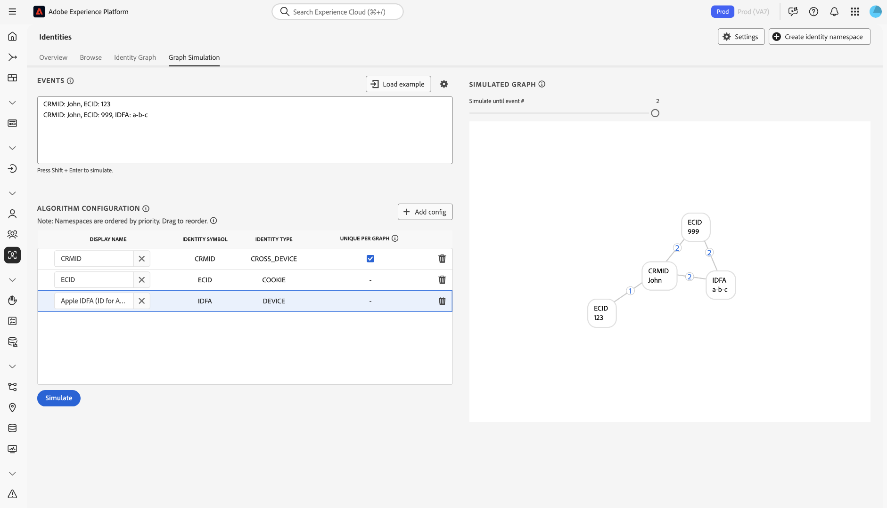
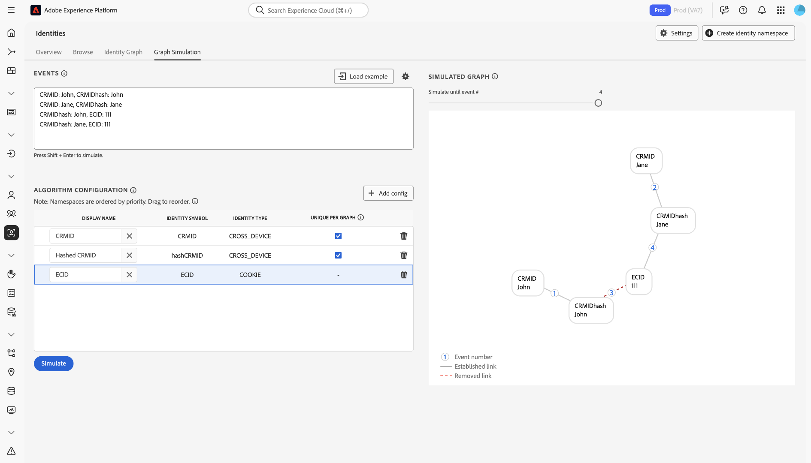

# [!DNL Identity Graph Linking Rules]設定指南 {#configurations-guide}

>[!CONTEXTUALHELP]
>id="platform_identities_algorithmconfiguration"
>title="演算法設定"
>abstract="設定適合您所攝取身分的唯一命名空間和命名空間優先順序。"

閱讀本檔案以瞭解您可以使用[!DNL Identity Graph Linking Rules]設定的不同實作型別。

客戶圖表案例可以分組為三個不同的類別。

* **基本**： [基本實作](#basic-implementations)包含最常包含簡單實作的圖形。 這些實施傾向於以單一跨裝置名稱空間（例如CRMID）為中心。 雖然基本實作相當簡單明瞭，但圖形摺疊仍可能發生，通常是由於&#x200B;**共用裝置**&#x200B;的情況。
* **中繼**： [中繼實作](#intermediate-implementations)包含數個變數，例如&#x200B;**多個跨裝置名稱空間**、**非唯一身分**&#x200B;和&#x200B;**多個唯一名稱空間**。
* **進階**： [進階實作](#advanced-implementations)涉及複雜的多層圖表情境。 對於進階實作，必須建立正確的名稱空間優先順序，以確保移除適當的連結，進而防止圖表摺疊。

## 快速入門

在參閱下列檔案之前，請確定您已熟悉Identity Service和[!DNL Identity Graph Linking Rules]的幾個重要概念。

* [身分識別服務概觀](../home.md)
* [[!DNL Identity Graph Linking Rules] 概觀](../identity-graph-linking-rules/namespace-priority.md)
* [命名空間優先順序](namespace-priority.md)
* [唯一命名空間](overview.md#unique-namespace)
* [圖表模擬](graph-simulation.md)

## 基本實施 {#basic-implementations}

>[!NOTE]
>
>若要完成下列實作，您必須使用身分符號（區分大小寫）建立自訂名稱空間： `CRMID`。

請閱讀本節，瞭解[!DNL Identity Graph Linking Rules]的基本實作。

### 使用案例：使用一個跨裝置名稱空間的簡單實施

一般而言，Adobe客戶會有一個跨裝置名稱空間，用於其所有屬性，包括Web、行動和應用程式。 由於零售、電信和金融服務業的客戶使用此型別的實作，此系統與產業和地理位置無關。

一般而言，使用者會以跨裝置名稱空間（通常是CRMID）表示，因此CRMID應分類為唯一名稱空間。 擁有電腦和[!DNL iPhone]且未共用其裝置的一般使用者可能會有如下的身分圖表。

假設您是一家名為&#x200B;**ACME**&#x200B;的電子商務公司的資料架構師。 John和Jane是您的客戶。 他們是住在加州聖荷西的最終使用者。 他們共用一部桌上型電腦，並使用此電腦來瀏覽您的網站。 同樣地，John和Jane也共用一個[!DNL iPad]，並偶爾使用此[!DNL iPad]瀏覽網際網路，包括您的網站。

**文字模式**

```json
CRMID: John, ECID: 123
CRMID: John, ECID: 999, IDFA: a-b-c
```

**演演算法組態（身分設定）**

在模擬圖形之前，先在圖形模擬介面中設定下列設定。

| 顯示名稱 | 身分識別符號 | 身分識別類型 | 在每個圖表中唯一 | 命名空間優先順序 |
| --- | --- | --- | --- | --- |
| CRMID | CRMID | 跨裝置 | ✔️ | 1 |
| ECID | ECID | COOKIE | | 2 |
| IDFA | IDFA | 裝置 | | 3 |

**模擬圖形**

在此圖表中，John （一般使用者）由CRMID表示。 `{ECID: 123}`代表John在其個人電腦上用來造訪您的電子商務平台的網頁瀏覽器。 `{ECID: 999}`代表他在[!DNL iPhone]上使用的瀏覽器，`{IDFA: a-b-c}`代表他的[!DNL iPhone]。



**練習**

在圖形模擬中模擬以下設定。 您可以建立自己的事件，或使用文字模式複製並貼上。

>[!BEGINTABS]

>[!TAB 共用裝置（電腦）]

**共用裝置（電腦）**

**文字模式**

```json
CRMID: John, ECID: 111
CRMID: Jane, ECID: 111
```

**模擬圖形**

在此圖表中，John和Jane由他們各自的CRMID表示：

* `{CRMID: John}`
* `{CRMID: Jane}`

桌上型電腦上同時用來造訪您的電子商務平台的瀏覽器由`{ECID: 111}`表示。 在此圖表案例中，Jane是最後驗證的使用者，因此`{ECID: 111}`與`{CRMID: John}`之間的連結已移除。


>[!TAB 共用裝置（行動裝置）]

**共用裝置（行動裝置）**

**文字模式**

```json
CRMID: John, ECID: 111, IDFA: a-b-c
CRMID: Jane, ECID: 111, IDFA: a-b-c
```

**模擬圖形**

在此圖表中，John和Jane都由各自的CRMID表示。 他們使用的瀏覽器由`{ECID: 111}`表示，他們共用的[!DNL iPad]由`{IDFA: a-b-c}`表示。 在此圖表情境中，Jane是最後驗證的使用者，因此會移除從`{ECID: 111}`和`{IDFA: a-b-c}`到`{CRMID: John}`的連結。


>[!ENDTABS]

## 中繼實施 {#intermediate-implementations}

>[!TIP]
>
>**非唯一識別**&#x200B;是與非唯一名稱空間關聯的識別。

閱讀本節以瞭解[!DNL Identity Graph Linking Rules]的中繼實作。

### 使用案例：您的資料包含非唯一身分

>[!NOTE]
>
>若要完成下列實作，您必須使用身分符號（區分大小寫）建立下列自訂名稱空間：
>* `CRMID`
>* `CCHash` （這是代表雜湊信用卡號碼的自訂名稱空間。）

假設您是一位資料架構師，為一家發行信用卡的商業銀行工作。 您的行銷團隊已表示他們要將過去的信用卡交易歷史記錄納入設定檔。 此身分圖表可能如下所示。

**文字模式**

```json
CRMID: John, CChash: 1111-2222 
CRMID: John, CChash: 3333-4444 
CRMID: John, ECID: 123 
CRMID: John, ECID: 999, IDFA: a-b-c
```

**演演算法組態（身分設定）**

在模擬圖形之前，先在圖形模擬介面中設定下列設定。

| 顯示名稱 | 身分識別符號 | 身分識別類型 | 在每個圖表中唯一 | 命名空間優先順序 |
| --- | --- | --- | --- | --- |
| CRMID | CRMID | 跨裝置 | ✔️ | 1 |
| Cchash | Cchash | 跨裝置 | | 2 |
| ECID | ECID | COOKIE | | 3 |
| IDFA | IDFA | 裝置 | | 4 |

**模擬圖形**


我們不保證這些信用卡號碼或任何其他非唯一名稱空間會一律與單一使用者相關聯。 兩個一般使用者可能會以相同的信用卡註冊，因為可能會有非唯一的預留位置值遭到錯誤擷取。 簡言之，不保證非唯一名稱空間不會導致圖表摺疊。

為解決此問題，Identity Service會移除最舊的連結，並保留最新的連結。 這可確保圖形中只有一個CRMID，從而防止圖形摺疊。

**練習**

在圖形模擬中模擬以下設定。 您可以建立自己的事件，或使用文字模式複製並貼上。

>[!BEGINTABS]

>[!TAB 共用裝置]

**文字模式**

```json
CRMID: John, CChash: 1111-2222
CRMID: Jane, CChash: 3333-4444
CRMID: John, ECID: 123
CRMID: Jane, ECID:123
```

**模擬圖形**


>[!TAB 兩個擁有相同信用卡的使用者]

兩個不同的一般使用者使用相同的信用卡註冊您的電子商務網站。 您的行銷團隊想要確保信用卡僅與單一設定檔相關聯，以防止圖表摺疊。

**文字模式**

```json
CRMID: John, CChash: 1111-2222
CRMID: Jane, CChash: 1111-2222
CRMID: John, ECID: 123
CRMID: Jane, ECID:456
```

**模擬圖形**


>[!TAB 無效的信用卡號碼]

由於資料不乾淨，Experience Platform中擷取的信用卡號碼無效。

**文字模式**

```json
CRMID: John, CChash: undefined
CRMID: Jane, CChash: undefined
CRMID: Jack, CChash: undefined
CRMID: Jill, CChash: undefined
```

**模擬圖形**


>[!ENDTABS]

### 使用案例：您的資料包含雜湊和未雜湊CRMID

>[!NOTE]
>
>若要完成下列實作，您必須使用身分符號（區分大小寫）建立自訂名稱空間：
>* `CRMID`
>* `CRMIDhash`

您同時擷取非雜湊（離線） CRMID和雜湊（線上） CRMID。 未雜湊與雜湊CRMID兩者間會有直接關係，這是預期的結果。 當一般使用者使用已驗證的帳戶瀏覽時，雜湊CRMID將會與裝置ID （以ECID在Identity Service上表示）一起傳送。

**演演算法組態（身分設定）**

在模擬圖形之前，先在圖形模擬介面中設定下列設定。

| 顯示名稱 | 身分識別符號 | 身分識別類型 | 在每個圖表中唯一 | 命名空間優先順序 |
| --- | --- | --- | --- | --- | 
| CRMID | CRMID | 跨裝置 | ✔️ | 1 |
| CRMIDhash | CRMIDhash | 跨裝置 | ✔️ | 2 |
| ECID | ECID | COOKIE | | 3 |


**練習**

在圖形模擬中模擬以下設定。 您可以建立自己的事件，或使用文字模式複製並貼上。

>[!BEGINTABS]

>[!TAB 共用裝置]

John和Jane共用一個裝置。

**文字模式**

```json
CRMID: John, CRMIDhash: John
CRMID: Jane, CRMIDhash: Jane
CRMIDhash: John, ECID: 111 
CRMIDhash: Jane, ECID: 111
```



>[!TAB 錯誤的資料]

由於雜湊程式發生錯誤，系統會產生非唯一的雜湊CRMID，並傳送至Identity Service。

**文字模式**

```json
CRMID: John, CRMIDhash: aaaa
CRMID: Jane, CRMIDhash: aaaa
```


>[!ENDTABS]
<!-- 
### Use case: You are using Real-Time CDP and Adobe Commerce

You have two types of end-users:

* **Members**: An end-user who is assigned a CRMID and has an email account registered to your system.
* **Guests**: An end-user who is not a member. They do not have an assigned CRMID and their email accounts are not registered to your system.

In this scenario, your customers are sending data from Adobe Commerce to Real-Time CDP.

**Exercise**

Simulate the following configurations in the graph simulation tool. You can either create your own events, or copy and paste using text mode.

>[!BEGINTABS]

>[!TAB Shared device between two members]

In this scenario, two members share the same device to browse an e-commerce website.

**Text mode**

```json
CRMID: John, Email: john@g
CRMID: Jane, Email: jane@g
CRMID: John, ECID: 111
CRMID: Jane, ECID: 111
```


>[!TAB Shared device between two guests]

In this scenario, two guests share the same device to browse an e-commerce website.

**Text mode**

```json
Email: john@g, ECID: 111
Email: jane@g, ECID: 111
```


>[!TAB Shared device between a member and a guest]

In this scenario, a member and a guest share the same device to browse an e-commerce website.

**Text mode**

```json
CRMID: John, Email: john@g
CRMID: John, ECID: 111
Email: jane@g, ECID: 111
```


>[!ENDTABS] -->

### 使用案例：您的資料包含三個不重複的名稱空間

>[!NOTE]
>
>若要完成下列實作，您必須使用身分符號（區分大小寫）建立自訂名稱空間： `CRMID`。

您的客戶會依下列方式定義單一人員實體：

* 具有指派CRMID的一般使用者。
* 與雜湊電子郵件地址相關聯的一般使用者，以便設定檔可以啟動至支援雜湊電子郵件的目的地（例如，[!DNL Facebook]）。
* 與電子郵件地址有關聯的一般使用者，讓支援人員可以使用所述電子郵件地址在Real-Time CDP上查詢其設定檔。

| 顯示名稱 | 身分識別符號 | 身分識別類型 | 在每個圖表中唯一 | 命名空間優先順序 |
| --- | --- | --- | --- | --- |
| CRMID | CRMID | 跨裝置 | ✔️ | 1 |
| 電子郵件 | 電子郵件 | 電子郵件 | ✔️ | 2 |
| Email_LC_SHA256 | Email_LC_SHA256 | 電子郵件 | ✔️ | 3 |
| ECID | ECID | COOKIE | | 4 |

在圖表模擬工具中模擬下列設定。 您可以建立自己的事件，或使用文字模式複製並貼上。

>[!BEGINTABS]

>[!TAB 共用裝置]

在此案例中，John和Jane都會登入電子商務網站。

**文字模式**

```json
CRMID: John, Email: john@g, Email_LC_SHA256: john_hash 
CRMID: Jane, Email: jane@g, Email_LC_SHA256: jane_hash 
CRMID: John, ECID: 111 
CRMID: Jane, ECID: 111
```


>[!TAB 一般使用者變更其電子郵件]

**文字模式**

```json
CRMID: John, Email: john@g, Email_LC_SHA256: john_hash
CRMID: John, Email: john@y, Email_LC_SHA256: john_y_hash
```


>[!ENDTABS]

## 進階實施 {#advanced-implementations}

進階實施涉及複雜的多層圖表情境。 這些型別的實作包括使用&#x200B;**名稱空間優先順序**，以識別必須移除的正確連結，以防止圖表摺疊。

**名稱空間優先順序**&#x200B;是根據名稱空間重要性排列名稱空間的中繼資料。 如果圖表包含兩個身分，每個都有不同的唯一名稱空間，Identity Service會使用名稱空間優先順序來決定要移除的連結。 如需詳細資訊，請閱讀名稱空間優先順序[&#128279;](../identity-graph-linking-rules/namespace-priority.md)的檔案。

在複雜的圖表情境中，名稱空間優先順序扮演關鍵角色。 圖表可以有多個層 — 一個使用者可以與多個登入ID相關聯，並且這些登入ID可以進行雜湊處理。 此外，不同的ECID可以連結至不同的登入ID。 為了確保移除正確層中的正確連結，您的名稱空間優先順序設定必須正確。

閱讀本節以瞭解[!DNL Identity Graph Linking Rules]的進階實作。

### 使用案例：您需要多個業務線的支援

>[!NOTE]
>
>若要完成下列實作，您必須使用身分符號（區分大小寫）建立自訂名稱空間：
>* `CRMID`
>* `loginID`

您的一般使用者有兩個不同的帳戶：個人帳戶和商務帳戶。 每個帳戶都由不同的ID識別。 在此案例中，典型的圖表將如下所示：

**文字模式**

```json
CRMID: John, loginID: JohnPersonal
CRMID: John, loginID: JohnBusiness
loginID: JohnPersonal, ECID: 111
loginID: JohnPersonal, ECID: 222
loginID: JohnBusiness, ECID: 222
```

**演演算法組態（身分設定）**

在模擬圖形之前，先在圖形模擬介面中設定下列設定。

| 顯示名稱 | 身分識別符號 | 身分識別類型 | 在每個圖表中唯一 | 命名空間優先順序 |
| --- | --- | --- | --- | --- |
| CRMID | CRMID | 跨裝置 | ✔️ | 1 |
| loginID | loginID | 跨裝置 | | 2 |
| ECID | ECID | COOKIE | | 3 |

**模擬圖形**


**練習**

在圖形模擬中模擬以下設定。 您可以建立自己的事件，或使用文字模式複製並貼上。

>[!BEGINTABS]

>[!TAB 共用裝置]

**文字模式**

```json
CRMID: John, loginID: JohnPersonal
CRMID: John, loginID: JohnBusiness
CRMID: Jane, loginID: JanePersonal
CRMID: Jane, loginID: JaneBusiness
loginID: JohnPersonal, ECID: 111
loginID: JanePersonal, ECID: 111
```


>[!TAB 傳送到Real-Time CDP的資料不正確]

**文字模式**

```json
CRMID: John, loginID: JohnPersonal
CRMID: John, loginID: error
CRMID: Jane, loginID: JanePersonal
CRMID: Jane, loginID: error
loginID: JohnPersonal, ECID: 111
loginID: JanePersonal, ECID: 222
```


>[!ENDTABS]

### 使用案例：您有需要多個名稱空間的複雜實施

>[!NOTE]
>
>若要完成下列實作，您必須使用身分符號（區分大小寫）建立自訂名稱空間：
>* `CRMID`
>* `loyaltyID`
>* `thirdPartyID`

您是一家媒體和娛樂公司，您的使用者擁有以下優勢：

* A CRMID
* 熟客方案ID

此外，您的一般使用者可在電子商務網站上購物，此資料會繫結至其電子郵件地址。 協力廠商資料庫提供者也擴充了使用者資料，並成批傳送給Experience Platform。

**文字模式**

```json
CRMID: John, loyaltyID: John, Email: john@g
Email: john@g, orderID: aaa
CRMID: John, thirdPartyID: xyz
CRMID: John, ECID: 111
```

**演演算法組態（身分設定）**

在模擬圖形之前，先在圖形模擬介面中設定下列設定。

| 顯示名稱 | 身分識別符號 | 身分識別類型 | 在每個圖表中唯一 | 命名空間優先順序 |
| --- | --- | --- | --- | --- |
| CRMID | CRMID | 跨裝置 | ✔️ | 1 |
| loyaltyID | loyaltyID | 跨裝置 | ✔️ | 2 |
| 電子郵件 | 電子郵件 | 電子郵件 | ✔️ | 3 |
| thirdPartyID | thirdPartyID | 跨裝置 | | 4 |
| orderID | orderID | 跨裝置 | | 5 |
| ECID | ECID | COOKIE | | 6 |

**練習**

在圖形模擬中模擬以下設定。 您可以建立自己的事件，或使用文字模式複製並貼上。

>[!BEGINTABS]

>[!TAB 共用裝置]

**文字模式**

```json
CRMID: John, loyaltyID: John, Email: john@g
CRMID: Jane, loyaltyID: Jane, Email: jane@g
Email: john@g, orderID: aaa 
CRMID: John, thirdPartyID: xyz 
CRMID: John, ECID: 111
CRMID: Jane, ECID: 111
```


>[!TAB 一般使用者變更其電子郵件地址]

**文字模式**

```json
CRMID: John, loyaltyID: John, Email: john@g
CRMID: John, loyaltyID: John, Email: john@y
```


>[!TAB thirdPartyID關聯變更]

**文字模式**

```json
CRMID: John, loyaltyID: John, Email: john@g
CRMID: Jane, loyaltyID: Jane, Email: jane@g
CRMID: John, thirdPartyID: xyz
CRMID: Jane, thirdPartyID: xyz
```


>[!TAB 非唯一的orderID]

**文字模式**

```json
CRMID: John, loyaltyID: John, Email: john@g
CRMID: Jane, loyaltyID: Jane, Email: jane@g
Email: john@g, orderID: aaa
Email: jane@g, orderID: aaa
```


>[!TAB 錯誤的忠誠度ID]

**文字模式**

```json
CRMID: John, loyaltyID: aaa, Email: john@g
CRMID: Jane, loyaltyID: aaa, Email: jane@g
```


>[!ENDTABS]

## 後續步驟

如需[!DNL Identity Graph Linking Rules]的詳細資訊，請閱讀下列檔案：

* [[!DNL Identity Graph Linking Rules] 概觀](./overview.md)
* [身分識別最佳化演算法](./identity-optimization-algorithm.md)
* [實作指南](./implementation-guide.md)
* [疑難排解和常見問答( FAQ)](./troubleshooting.md)
* [命名空間優先順序](./namespace-priority.md)
* [圖表模擬UI](./graph-simulation.md)
* [身分設定UI](./identity-settings-ui.md)