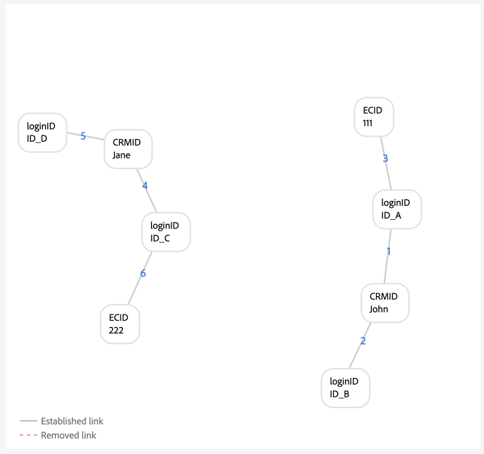
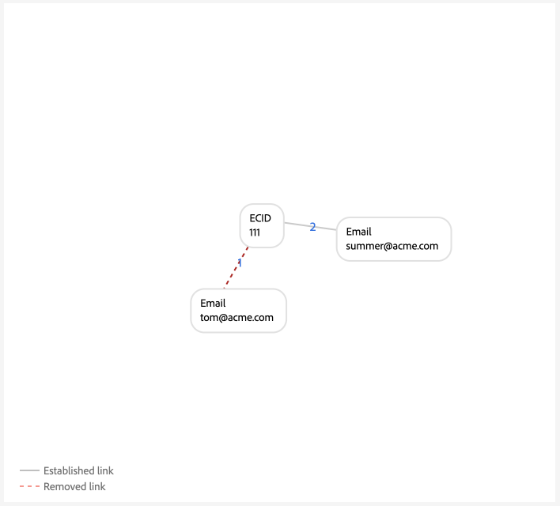

# 圖表設定範例 {#examples-of-graph-configurations}

>[!CONTEXTUALHELP]
>id="platform_identities_algorithmconfiguration"
>title="演算法設定"
>abstract="設定適合您所攝取身分的唯一命名空間和命名空間優先順序。"

>[!AVAILABILITY]
>
>身分圖表連結規則目前處於「有限可用性」。 如需如何在開發沙箱中存取功能的相關資訊，請聯絡您的Adobe客戶團隊。

>[!NOTE]
>
>* &quot;CRMID&quot;和&quot;loginID&quot;均為自訂名稱空間。 在此檔案中，「CRMID」是人員識別碼，而「loginID」是與指定人員相關聯的登入識別碼。
>* 若要模擬本檔案中概述的範例圖表情境，您必須先建立兩個自訂名稱空間，一個具有身分符號「CRMID」，另一個具有身分符號「loginID」。 身分符號區分大小寫。

本檔案概述使用身分圖表連結規則和身分資料時，可能會遇到的常見案例圖表設定範例。

## 僅限CRMID

這是簡單實施情境的範例，其中擷取線上事件（CRMID和ECID），並僅針對CRMID儲存離線事件（設定檔記錄）。

**實作：**

| 使用的名稱空間 | Web行為收集方法 |
| --- | --- |
| CRMID、ECID | Web SDK |

**事件：**

您可以將下列事件複製到文字模式，以在圖表模擬中建立此案例：

```shell
CRMID: Tom, ECID: 111
```

**演演算法組態：**

您可以透過為演演算法設定下列設定，在圖表模擬中建立此情境：

| 優先順序 | 顯示名稱 | 身分識別類型 | 在每個圖表中唯一 |
| ---| --- | --- | --- |
| 1 | CRMID | 跨裝置 | 是 |
| 2 | ECID | COOKIE | 無 |

**即時客戶個人檔案的主要身分選擇：**

在此設定的內容中，主要身分的定義如下：

| 驗證狀態 | 事件中的名稱空間 | 主要身分識別 |
| --- | --- | --- |
| 已驗證 | CRMID、ECID | CRMID |
| 未驗證 | ECID | ECID |

**圖表範例**

>[!BEGINTABS]

>[!TAB 理想的單人圖表]

以下是理想的單人圖表範例，其中CRMID是唯一的，且有最高優先順序。


>[!TAB 多人圖表]

以下是多人圖表的範例。 此範例會顯示「共用裝置」情境，其中包含兩個CRMID，而含有已建立舊連結的CRMID則會被移除。


**圖形模擬事件輸入**

```shell
CRMID: Tom, ECID: 111
CRMID: Summer, ECID: 111
```

>[!ENDTABS]

## 使用雜湊電子郵件的CRMID

此情境中，CRMID會內嵌並代表線上（體驗事件）和離線（設定檔記錄）資料。 此案例也涉及雜湊電子郵件的擷取，其代表CRM記錄資料集中與CRMID一起傳送的另一個名稱空間。

>[!IMPORTANT]
>
>**務必一律為每個使用者傳送CRMID**。 若未這麼做，可能會導致「擱置」登入ID案例，此案例假設單一人員實體與其他人員共用裝置。

**實作：**

| 使用的名稱空間 | Web行為收集方法 |
| --- | --- |
| CRMID、Email_LC_SHA256、ECID | Web SDK |

**事件：**

您可以將下列事件複製到文字模式，以在圖表模擬中建立此案例：

```shell
CRMID: Tom, Email_LC_SHA256: tom<span>@acme.com
CRMID: Tom, ECID: 111
CRMID: Summer, Email_LC_SHA256: summer<span>@acme.com
CRMID: Summer, ECID: 222
```

**演演算法組態：**

您可以透過為演演算法設定下列設定，在圖表模擬中建立此情境：

| 優先順序 | 顯示名稱 | 身分識別類型 | 在每個圖表中唯一 |
| ---| --- | --- | --- |
| 1 | CRMID | 跨裝置 | 是 |
| 2 | 電子郵件 (SHA256，小寫) | 電子郵件 | 無 |
| 3 | ECID | COOKIE | 無 |

**設定檔的主要身分選擇：**

在此設定的內容中，主要身分的定義如下：

| 驗證狀態 | 事件中的名稱空間 | 主要身分識別 |
| --- | --- | --- |
| 已驗證 | CRMID、ECID | CRMID |
| 未驗證 | ECID | ECID |

**圖表範例**

>[!BEGINTABS]

>[!TAB 理想的單人圖表]

以下是一組理想的單一人員圖表範例，其中每個CRMID都與各自的雜湊電子郵件名稱空間和ECID相關聯。


>[!TAB 多人圖表：共用裝置]

以下是多人圖表情境的範例，其中裝置由兩個人共用。


**圖形模擬事件輸入**

```shell
CRMID: Tom, Email_LC_SHA256: aabbcc
CRMID: Tom, ECID: 111
CRMID: Summer, Email_LC_SHA256: ddeeff
CRMID: Summer, ECID: 222
CRMID: Summer, ECID: 111
```

>[!TAB 多人圖表：非唯一電子郵件]

以下為多人圖表案例的範例，其中電子郵件不是唯一的，且與兩個不同的CRMID相關聯。


**圖形模擬事件輸入**

```shell
CRMID: Tom, Email_LC_SHA256: aabbcc
CRMID: Tom, ECID: 111
CRMID: Summer, Email_LC_SHA256: ddeeff
CRMID: Summer, ECID: 222
CRMID: Summer, Email_LC_SHA256: aabbcc
```

>[!ENDTABS]

## 使用雜湊電子郵件、雜湊電話、GAID和IDFA的CRMID

此案例與上一個案例類似。 不過，在此案例中，雜湊電子郵件和電話會標示為身分識別，以便在[[!DNL Segment Match]](../../segmentation/ui/segment-match/overview.md)中使用。

>[!IMPORTANT]
>
>**務必一律為每個使用者傳送CRMID**。 若未這麼做，可能會導致「擱置」登入ID案例，此案例假設單一人員實體與其他人員共用裝置。

**實作：**

| 使用的名稱空間 | Web行為收集方法 |
| --- | --- |
| CRMID、Email_LC_SHA256、Phone_SHA256、GAID、IDFA、ECID | Web SDK |

**事件：**

您可以將下列事件複製到文字模式，以在圖表模擬中建立此案例：

```shell
CRMID: Tom, Email_LC_SHA256: aabbcc, Phone_SHA256: 123-4567
CRMID: Tom, ECID: 111
CRMID: Tom, ECID: 222, IDFA: A-A-A
CRMID: Summer, Email_LC_SHA256: ddeeff, Phone_SHA256: 765-4321
CRMID: Summer, ECID: 333
CRMID: Summer, ECID: 444, GAID:B-B-B
```

**演演算法組態：**

您可以透過為演演算法設定下列設定，在圖表模擬中建立此情境：

| 優先順序 | 顯示名稱 | 身分識別類型 | 在每個圖表中唯一 |
| ---| --- | --- | --- |
| 1 | CRMID | 跨裝置 | 是 |
| 2 | 電子郵件 (SHA256，小寫) | 電子郵件 | 無 |
| 3 | 電話 (SHA256) | 電話 | 無 |
| 4 | Google廣告ID (GAID) | 裝置 | 無 |
| 5 | Apple IDFA (Apple的ID) | 裝置 | 無 |
| 6 | ECID | COOKIE | 無 |

**設定檔的主要身分選擇：**

在此設定的內容中，主要身分的定義如下：

| 驗證狀態 | 事件中的名稱空間 | 主要身分識別 |
| --- | --- | --- |
| 已驗證 | CRMID、IDFA、ECID | CRMID |
| 已驗證 | CRMID、GAID、ECID | CRMID |
| 已驗證 | CRMID、ECID | CRMID |
| 未驗證 | GAID、ECID | GAID |
| 未驗證 | IDFA、ECID | IDFA |
| 未驗證 | ECID | ECID |

**圖表範例**

>[!BEGINTABS]

>[!TAB 理想的單人圖表]

以下是理想的單一人員圖表案例，雜湊電子郵件和雜湊電話會標示為身分識別，以便在[!DNL Segment Match]中使用。 在此案例中，圖表會分割為兩個，以代表不同的個人實體。


>[!TAB 多人圖表：共用裝置，共用電腦]

以下是多人圖表情境，其中裝置（電腦）由兩個人共用。 在此案例中，共用電腦由`{ECID: 111}`表示，且連結至`{CRMID: Summer}`，因為該連結是最近建立的連結。 `{CRMID: Tom}`已移除，因為`{CRMID: Tom}`與`{ECID: 111}`之間的連結較舊，而且CRMID是此組態中指定的唯一名稱空間。


**圖形模擬事件輸入**

```shell
CRMID: Tom, Email_LC_SHA256: aabbcc, Phone_SHA256: 123-4567
CRMID: Tom, ECID: 111
CRMID: Tom, ECID: 222, IDFA: A-A-A
CRMID: Summer, Email_LC_SHA256: ddeeff, Phone_SHA256: 765-4321
CRMID: Summer, ECID: 333
CRMID: Summer, ECID: 444, GAID:B-B-B
CRMID: Summer, ECID: 111
```

>[!TAB 多人圖表：共用裝置、android行動裝置]

以下是多人圖表情境，其中一個Android裝置由兩個人共用。 在此案例中，CRMID設定為唯一的名稱空間，因此`{CRMID: Tom, GAID: B-B-B, ECID:444}`的較新連結會取代較舊的`{CRMID: Summer, GAID: B-B-B, ECID:444}`。


**圖形模擬事件輸入**

```shell
CRMID: Tom, Email_LC_SHA256: aabbcc, Phone_SHA256: 123-4567
CRMID: Tom, ECID: 111
CRMID: Tom, ECID: 222, IDFA: A-A-A
CRMID: Summer, Email_LC_SHA256: ddeeff, Phone_SHA256: 765-4321
CRMID: Summer, ECID: 333
CRMID: Summer, ECID: 444, GAID: B-B-B
CRMID: Tom, ECID: 444, GAID: B-B-B
```

>[!TAB 多人圖表：共用裝置、apple行動裝置、無ECID重設]

以下是兩人共用Apple裝置的多人圖表情境。 在此案例中，IDFA為共用狀態，但ECID不會重設。


**圖形模擬事件輸入**

```shell
CRMID: Tom, Email_LC_SHA256: aabbcc, Phone_SHA256: 123-4567
CRMID: Tom, ECID: 111
CRMID: Tom, ECID: 222, IDFA: A-A-A
CRMID: Summer, Email_LC_SHA256: ddeeff, Phone_SHA256: 765-4321
CRMID: Summer, ECID: 333
CRMID: Summer, ECID: 444, GAID: B-B-B
CRMID: Summer, ECID: 222, IDFA: A-A-A
```

>[!TAB 多人圖表：共用裝置、apple、ECID重設]

以下是兩人共用Apple裝置的多人圖表情境。 此情境中，ECID會重設，但IDFA會維持不變。


**圖形模擬事件輸入**

```shell
CRMID: Tom, Email_LC_SHA256: aabbcc, Phone_SHA256: 123-4567
CRMID: Tom, ECID: 111
CRMID: Tom, ECID: 222, IDFA: A-A-A
CRMID: Summer, Email_LC_SHA256: ddeeff, Phone_SHA256: 765-4321
CRMID: Summer, ECID: 333
CRMID: Summer, ECID: 444, GAID: B-B-B
CRMID: Summer, ECID: 555, IDFA: A-A-A
```

>[!TAB 多人圖表：非唯一電話]

以下是多人圖表情境，兩個人共用相同的電話號碼。


**圖形模擬事件輸入**

```shell
CRMID: Tom, Email_LC_SHA256: aabbcc, Phone_SHA256: 123-4567
CRMID: Tom, ECID: 111
CRMID: Tom, ECID: 222, IDFA: A-A-A
CRMID: Summer, Email_LC_SHA256: ddeeff, Phone_SHA256: 765-4321
CRMID: Summer, ECID: 333
CRMID: Summer, ECID: 444, GAID: B-B-B
CRMID: Summer, Phone_SHA256: 123-4567
```

在此範例中，`{Phone_SHA256}`也標籤為唯一的名稱空間。 因此，圖表不能有多個名稱空間為`{Phone_SHA256}`的身分。 在此案例中，`{Phone_SHA256: 765-4321}`已從`{CRMID: Summer}`和`{Email_LC_SHA256: ddeeff}`取消連結，因為它是較舊的連結，


>[!TAB 多人圖表：非唯一電子郵件]

以下是多人圖表情境，其中電子郵件由兩個人共用。


**圖形模擬事件輸入**

```shell
CRMID: Tom, Email_LC_SHA256: aabbcc, Phone_SHA256: 123-4567
CRMID: Tom, ECID: 111
CRMID: Tom, ECID: 222, IDFA: A-A-A
CRMID: Summer, Email_LC_SHA256: ddeeff, Phone_SHA256: 765-4321
CRMID: Summer, ECID: 333
CRMID: Summer, ECID: 444, GAID: B-B-B
CRMID: Summer, Email_LC_SHA256: aabbcc
```

>[!ENDTABS]

## 具有多個登入ID的單一CRMID （簡單版本）

此情境中，單一CRMID代表個人實體。 不過，個人實體可能擁有多個登入識別碼：

* 指定的個人實體可以有不同的帳戶型別（個人與企業、州別帳戶、品牌帳戶等）
* 指定的個人實體可針對任意數量的帳戶使用不同的電子郵件地址。

>[!IMPORTANT]
>
>**務必一律為每個使用者傳送CRMID**。 若未這麼做，可能會導致「擱置」登入ID案例，此案例假設單一人員實體與其他人員共用裝置。

**實作：**

| 使用的名稱空間 | Web行為收集方法 |
| --- | --- |
| CRMID、loginID、ECID | Web SDK |

**事件：**

您可以將下列事件複製到文字模式，以在圖表模擬中建立此案例：

```shell
CRMID: Tom, loginID: ID_A
CRMID: Tom, loginID: ID_B
loginID: ID_A, ECID: 111
CRMID: Summer, loginID: ID_C
CRMID: Summer, loginID: ID_D
loginID: ID_C, ECID: 222
```

**演演算法組態：**

您可以透過為演演算法設定下列設定，在圖表模擬中建立此情境：

| 優先順序 | 顯示名稱 | 身分識別類型 | 在每個圖表中唯一 |
| ---| --- | --- | --- |
| 1 | CRMID | 跨裝置 | 是 |
| 2 | loginID | 跨裝置 | 無 |
| 3 | ECID | COOKIE | 無 |

**設定檔的主要身分選擇：**

在此設定的內容中，主要身分的定義如下：

| 驗證狀態 | 事件中的名稱空間 | 主要身分識別 |
| --- | --- | --- |
| 已驗證 | loginID， ECID | loginID |
| 已驗證 | loginID， ECID | loginID |
| 已驗證 | CRMID、loginID、ECID | CRMID |
| 已驗證 | CRMID、ECID | CRMID |
| 未驗證 | ECID | ECID |

**圖表範例**

>[!BEGINTABS]

>[!TAB 理想的單人情境]

以下是單一CRMID和多個loginID的單一人員圖表案例。



>[!TAB 多人圖表情境：共用裝置]

以下是多人圖表情境，其中裝置由兩個人共用。 在此案例中，`{ECID:111}`同時與`{loginID:ID_A}`和`{loginID:ID_C}`連結，且已建立的`{ECID:111, loginID:ID_A}`舊連結已移除。


**圖形模擬事件輸入**

```shell
CRMID: Tom, loginID: ID_A
CRMID: Tom, loginID: ID_B
loginID: ID_A, ECID: 111
CRMID: Summer, loginID: ID_C
CRMID: Summer, loginID: ID_D
loginID: ID_C, ECID: 222
loginID: ID_C, ECID: 111
```

>[!TAB 多人圖表情境：錯誤的資料]

以下為涉及不良資料的多人圖表情境。 在此案例中，`{loginID:ID_D}`錯誤地連結到兩個完全不同的使用者，而且已刪除具有舊時間戳記的連結，而改用最近建立的連結。


**圖形模擬事件輸入**

```shell
CRMID: Tom, loginID: ID_A
CRMID: Tom, loginID: ID_B
loginID: ID_A, ECID: 111
CRMID: Summer, loginID: ID_C
CRMID: Summer, loginID: ID_D
loginID: ID_C, ECID: 222
CRMID: Tom, loginID: ID_D
```

>[!TAB &#39;Dangling&#39;登入ID]

下圖會模擬「懸浮」登入ID案例。 在此範例中，兩個不同的loginID已繫結至相同的ECID。 但是，`{loginID:ID_C}`未連結至CRMID。 因此，Identity Service無法偵測這兩個loginID代表兩個不同的實體。


**圖形模擬事件輸入**

```shell
CRMID: Tom, loginID: ID_A
CRMID: Tom, loginID: ID_B
loginID: ID_A, ECID: 111
loginID: ID_C, ECID: 111
```

>[!ENDTABS]

## 具有多個登入ID的單一CRMID （複雜版本）

此情境中，單一CRMID代表個人實體。 不過，個人實體可能擁有多個登入識別碼：

* 指定的個人實體可以有不同的帳戶型別（個人與企業、州別帳戶、品牌帳戶等）
* 指定的個人實體可針對任意數量的帳戶使用不同的電子郵件地址。

>[!IMPORTANT]
>
>**務必一律為每個使用者傳送CRMID**。 若未這麼做，可能會導致「擱置」登入ID案例，此案例假設單一人員實體與其他人員共用裝置。

**實作：**

| 使用的名稱空間 | Web行為收集方法 |
| --- | --- |
| CRMID、Email_LC_SHA256、Phone_SHA256、loginID、ECID | Adobe Analytics來源聯結器。<br> **注意：**&#x200B;依預設，AAID在Identity Service中會遭到封鎖，因此，在使用Analytics來源時，您必須將ECID置於比AAID更高的優先順序。 如需詳細資訊，請參閱[實作指南](./implementation-guide.md#ingest-your-data)。</br> |

**事件：**

您可以將下列事件複製到文字模式，以在圖表模擬中建立此案例：

```shell
CRMID: Tom, Email_LC_SHA256: aabbcc, Phone_SHA256: 123-4567
CRMID: Tom, loginID: ID_A
CRMID: Tom, loginID: ID_B
loginID: ID_A, ECID: 111
CRMID: Summer, Email_LC_SHA256: ddeeff, Phone_SHA256: 765-4321
CRMID: Summer, loginID: ID_C
CRMID: Summer, loginID: ID_D
loginID: ID_C, ECID: 222
```

**演演算法組態：**

您可以透過為演演算法設定下列設定，在圖表模擬中建立此情境：

| 優先順序 | 顯示名稱 | 身分識別類型 | 在每個圖表中唯一 |
| ---| --- | --- | --- | 
| 1 | CRMID | 跨裝置 | 是 |
| 2 | Email_LC_SHA256 | 電子郵件 | 無 |
| 3 | Phone_SHA256 | 電話 | 無 |
| 4 | loginID | 跨裝置 | 無 |
| 5 | ECID | COOKIE | 無 |
| 6 | AAID | COOKIE | 無 |

**設定檔的主要身分選擇：**

在此設定的內容中，主要身分的定義如下：

| 驗證狀態 | 事件中的名稱空間 | 主要身分識別 |
| --- | --- | --- |
| 已驗證 | loginID， ECID | loginID |
| 已驗證 | loginID， ECID | loginID |
| 已驗證 | CRMID、loginID、ECID | CRMID |
| 已驗證 | CRMID、ECID | CRMID |
| 未驗證 | ECID | ECID |

**圖表範例**

>[!BEGINTABS]

>[!TAB 理想的單人圖表]

以下範例是兩個單一人員圖表，各自有一個CRMID和多個登入ID。


>[!TAB 多人圖表：共用裝置1]

以下是多人共用裝置案例，`{ECID:111}`同時連結至`{loginID:ID_A}`和`{loginID:ID_C}`。 在此情況下，較早建立的連結會被移除，而改用較新建立的連結。


**圖形模擬事件輸入**

```shell
CRMID: Tom, Email_LC_SHA256: aabbcc, Phone_SHA256: 123-4567
CRMID: Tom, loginID: ID_A
CRMID: Tom, loginID: ID_B
loginID: ID_A, ECID: 111
CRMID: Summer, Email_LC_SHA256: ddeeff, Phone_SHA256: 765-4321
CRMID: Summer, loginID: ID_C
CRMID: Summer, loginID: ID_D
loginID: ID_C, ECID: 222
loginID: ID_C, ECID: 111
```

>[!TAB 多人圖表：共用裝置2]

在這種情況下，loginID和CRMID都會以體驗事件的形式傳送，而不是只傳送loginID。


**圖形模擬事件輸入**

```shell
CRMID: Tom, Email_LC_SHA256: aabbcc, Phone_SHA256: 123-4567
CRMID: Tom, loginID: ID_A
CRMID: Tom, loginID: ID_B
loginID: ID_A, ECID: 111
CRMID: Summer, Email_LC_SHA256: ddeeff, Phone_SHA256: 765-4321
CRMID: Summer, loginID: ID_C
CRMID: Summer, loginID: ID_D
loginID: ID_C, ECID: 222
CRMID: Summer, loginID: ID_C, ECID: 111
loginID: ID_A, ECID: 111
```

>[!TAB 多人圖表：錯誤的登入ID資料]

在此案例中，`{loginID:ID_C}`同時連結至`{CRMID:Tom}`和`{CRMID:Summer}`，因此被視為不良資料，因為理想的圖表案例不應將相同的loginID連結至兩個不同的使用者。 在此情況下，會移除已建立的舊連結，而改用最近建立的連結。


**圖形模擬事件輸入**

```shell
CRMID: Tom, Email_LC_SHA256: aabbcc, Phone_SHA256: 123-4567
CRMID: Tom, loginID: ID_A
CRMID: Tom, loginID: ID_B
loginID: ID_A, ECID: 111
CRMID: Summer, Email_LC_SHA256: ddeeff, Phone_SHA256: 765-4321
CRMID: Summer, loginID: ID_C
CRMID: Summer, loginID: ID_D
loginID: ID_C, ECID: 222
CRMID: Tom, loginID: ID_C
```

>[!TAB 多人圖表：非唯一電子郵件]

在此案例中，非唯一電子郵件正在與兩個不同的CRMID連結，因此，已建立的舊連結會被移除，而改用最近建立的連結。


**圖形模擬事件輸入**

```shell
CRMID: Tom, Email_LC_SHA256: aabbcc, Phone_SHA256: 123-4567
CRMID: Tom, loginID: ID_A
CRMID: Tom, loginID: ID_B
loginID: ID_A, ECID: 111
CRMID: Summer, Email_LC_SHA256: ddeeff, Phone_SHA256: 765-4321
CRMID: Summer, loginID: ID_C
CRMID: Summer, loginID: ID_D
loginID: ID_C, ECID: 222
CRMID: Summer, Email_LC_SHA256: aabbcc
```

>[!TAB 多人圖表：非唯一電話]

在此案例中，非唯一電話號碼與兩個不同的CRMID連結，已建立的舊連結會被移除，而採用最近建立的連結。


**圖形模擬事件輸入**

```shell
CRMID: Tom, Email_LC_SHA256: aabbcc, Phone_SHA256: 123-4567
CRMID: Tom, loginID: ID_A
CRMID: Tom, loginID: ID_B
loginID: ID_A, ECID: 111
CRMID: Summer, Email_LC_SHA256: ddeeff, Phone_SHA256: 765-4321
CRMID: Summer, loginID: ID_C
CRMID: Summer, loginID: ID_D
loginID: ID_C, ECID: 222
CRMID: Tom, Phone_SHA256: 111-1111
CRMID: Summer, Phone_SHA256: 111-1111
```

>[!ENDTABS]

## 在其他Adobe Commerce中的使用情況

本節中的圖表設定範例概述了Adobe Commerce的使用案例。 以下範例著重於具有兩種使用者型別的零售客戶：

* 註冊使用者（建立帳戶的使用者）
* 訪客使用者（只有電子郵件地址的使用者）

>[!IMPORTANT]
>
>**務必一律為每個使用者傳送CRMID**。 若未這麼做，可能會導致「擱置」登入ID案例，此案例假設單一人員實體與其他人員共用裝置。

**實作：**

| 使用的名稱空間 | Web行為收集方法 |
| --- | --- |
| CRMID、電子郵件、ECID | Web SDK |

**事件：**

您可以將下列事件複製到文字模式，以在圖表模擬中建立此案例：

```shell
CRMID: Tom, Email: tom@acme.com
CRMID: Tom, ECID: 111
```

**演演算法組態：**

您可以透過為演演算法設定下列設定，在圖表模擬中建立此情境：

| 優先順序 | 顯示名稱 | 身分識別類型 | 在每個圖表中唯一 |
| ---| --- | --- | --- | 
| 1 | CRMID | 跨裝置 | 是 |
| 2 | 電子郵件 | 電子郵件 | 是 |
| 5 | ECID | COOKIE | 無 |

**設定檔的主要身分選擇：**

在此設定的內容中，主要身分的定義如下：

| 使用者活動 | 事件中的名稱空間 | 主要身分識別 |
| --- | --- | --- |
| 已驗證的瀏覽 | CRMID、ECID | CRMID |
| 訪客簽出 | 電子郵件、ECID | 電子郵件 |
| 未驗證的瀏覽 | ECID | ECID |

>[!WARNING]
>
>註冊的使用者必須在他們的設定檔中同時使用CRMID和電子郵件，以下圖表情境才能運作。

**圖表範例**

>[!BEGINTABS]

>[!TAB 理想的單人圖表]

以下是理想的單人圖表範例。


>[!TAB 多人圖表]

以下是多人圖表的範例，其中兩位註冊使用者使用同一部裝置進行瀏覽。


**圖形模擬事件輸入**

```shell
CRMID: Tom, Email: tom@acme.com
CRMID: Summer, Email: summer@acme.com
CRMID: Tom, ECID: 111
CRMID: Summer, ECID: 111
```

在此案例中，註冊使用者和訪客使用者共用相同的裝置。


**圖形模擬事件輸入**

```shell
CRMID: Tom, Email: tom@acme.com
CRMID: Tom, ECID: 111
Email: summer@acme.com, ECID: 111
```

在此案例中，註冊使用者和訪客使用者會共用裝置。 但是，由於CRMID不包含對應的電子郵件名稱空間，因此會發生實施錯誤。 在此案例中，Tom是註冊使用者，而Summer是訪客使用者。 與上一個案例不同，這兩個實體會合併，因為這兩個人員實體之間沒有共同的電子郵件名稱空間。


**圖形模擬事件輸入**

```shell
CRMID: Tom, ECID: 111
Email: summer@acme.com, ECID: 111
```

此情境中，兩名訪客使用者共用同一部裝置。



**圖形模擬事件輸入**

```shell
Email: tom@acme.com, ECID: 111
Email: summer@acme.com, ECID: 111
```

在此案例中，訪客使用者會簽出專案，然後使用相同的裝置進行註冊。


**圖形模擬事件輸入**

```shell
Email: tom@acme.com, ECID: 111
Email: tom@acme.com, CRMID: Tom
CRMID: Tom, ECID: 111
```

>[!ENDTABS]

## 後續步驟

如需身分圖表連結規則的詳細資訊，請參閱下列檔案：

* [身分圖表連結規則概觀](./overview.md)
* [身分最佳化演演算法](./identity-optimization-algorithm.md)
* [實作指南](./implementation-guide.md)
* [疑難排解和常見問答( FAQ)](./troubleshooting.md)
* [命名空間優先等級](./namespace-priority.md)
* [圖表模擬UI](./graph-simulation.md)
* [身分設定UI](./identity-settings-ui.md)