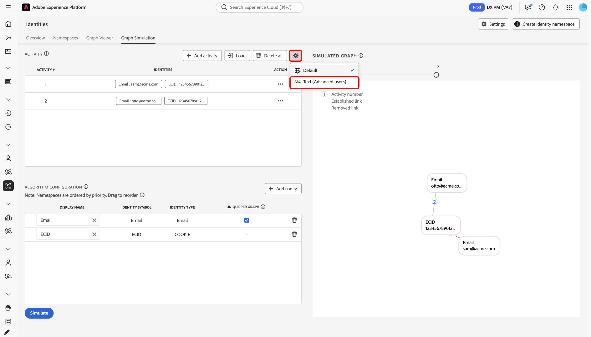
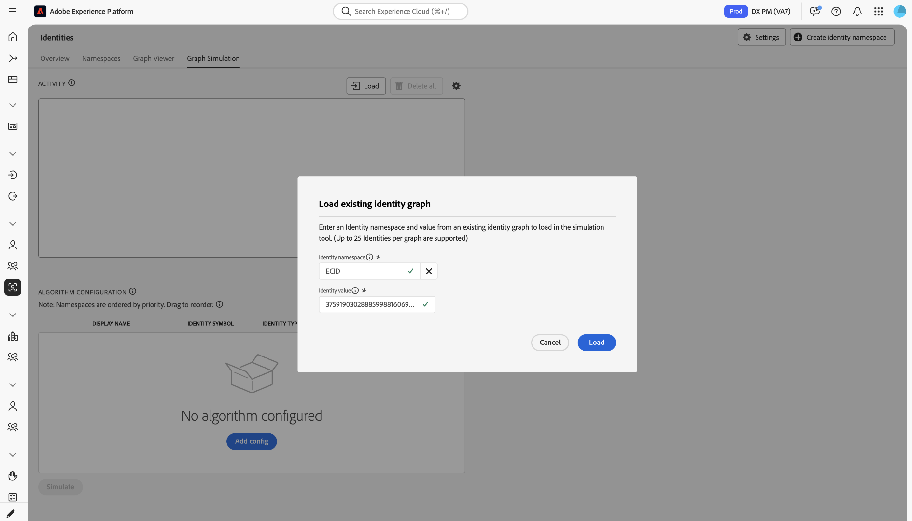

# [!DNL Graph Simulation] 使用者介面指南 {#graph-simulation}

>[!CONTEXTUALHELP]
>id="platform_identities_graphsimulation"
>title="圖表模擬"
>abstract="模擬圖表，用於了解身分識別服務如何連結身分，以及身分識別最佳化演算法如何運作。"

[!DNL Graph Simulation]是Identity Service UI中的工具，可用來根據您提供的身分來模擬身分圖表行為，以及設定[身分最佳化演演算法](./identity-optimization-algorithm.md)的方式。

在您將[!DNL Identity Graph Linking Rules]套用至生產資料之前，請使用它來安全地測試圖表行為。 透過定義範例事件並設定身分最佳化演演算法（包括名稱空間優先順序和「每個圖表獨特」設定），您可以檢視身分是否合併為一個圖表或保持獨立，然後視需要調整設定。 此功能可用於：

* 防止圖表摺疊（例如，多人共用一部裝置或電話號碼時）
* 調整名稱空間優先順序（例如，EMAIL或CRM_ID是否應該占主導地位）
* 評估低品質或重複使用的識別碼如何影響您環境中的彙整。

您也可以排練設定變更，以及偵錯下游應用程式中顯示的身分問題。 例如，如果對象大小或合併的設定檔看起來錯誤，您可以在[!DNL Graph Simulation]中重新建置相關事件，以檢視您目前的規則如何塑造圖表，並嘗試更安全的替代方案。

內建範例情境可協助您向利害關係人說明身分行為和圖表摺疊風險，並支援資料品質和身分治理的購買。

## 瞭解[!DNL Graph Simulation]介面

若要存取[!DNL Graph Simulation]，請導覽至Adobe Experience Platform使用者介面中的Identity Service工作區，然後選取&#x200B;**[!UICONTROL Graph Simulation]**。

此介面分成三個主要區段：

>[!BEGINTABS]

>[!TAB 活動]

使用&#x200B;**[!UICONTROL Activity]**&#x200B;面板新增身分以模擬圖形。 每個身分識別都需要名稱空間和值。 您必須至少新增兩個身分才能執行模擬。 您也可以選取&#x200B;**[!UICONTROL Load]**&#x200B;以匯入預先設定的事件和演演算法設定，或開啟現有的圖表。

>[!TAB 演演算法組態]

使用&#x200B;**[!UICONTROL Algorithm configuration]**&#x200B;面板為您的名稱空間新增及設定最佳化演演算法。 拖放名稱空間列以變更優先順序。 您也可以選取&#x200B;**[!UICONTROL Unique Per Graph]**&#x200B;來標示名稱空間在圖形中是否必須是唯一的。

>[!TAB 模擬圖形]

使用&#x200B;**[!UICONTROL Simulated graph]**&#x200B;顯示來檢閱從您的活動和演演算法設定產生的圖形。 兩個身分之間的實線表示保留連結；虛線表示演演算法已移除該連結。

>[!ENDTABS]

## [!DNL Graph Simulation]工作流程

### 新增活動

若要開始模擬身分圖表，請選取&#x200B;**[!UICONTROL Add Activity]**。

當[!UICONTROL Activity #1]的快顯視窗出現時，請選擇身分名稱空間並輸入其值。 您可以從下拉式清單中選取名稱空間，或輸入一些字母以篩選清單。 選取名稱空間後，請輸入相符的身分值。

>[!TIP]
>
>使用[!DNL Graph Simulation]時，您不必使用真正的身分值。

[!UICONTROL Activity]介面會更新以顯示您的第一個活動。

再次選取&#x200B;**[!UICONTROL Add Activity]**&#x200B;並完成第二個活動。 您至少需要兩個完整身分（名稱空間加上值）才能產生圖形。

### 設定演算法

>[!IMPORTANT]
>
>您設定的演演算法會控制Identity Service如何處理活動中的名稱空間。 您在[!DNL Graph Simulation UI]中設定的任何專案都不會儲存到Identity Service識別設定。

活動就緒後，請設定模擬的演演算法。 選擇「**[!UICONTROL Add config]**」。

新增您希望演演算法考慮的每個名稱空間。 使用下拉式清單進行搜尋，或輸入前幾個字母以縮小清單。

* **名稱空間優先順序**：您可以控制身分圖表內每個名稱空間的重要順序。 例如，如果您的圖表使用CRMID、ECID、電子郵件和Apple IDFA，您可以設定其優先順序，以反映在連結身分時應先考慮哪些專案。 清單頂端的名稱空間有最高優先順序。
* **唯一的名稱空間**：當名稱空間標示為唯一時，身分服務會確保圖形中只會出現一個具有該名稱空間的身分。 例如，如果電子郵件設定為唯一，則每個圖表將僅包含一個電子郵件身分。 如果存在多個具有相同電子郵件的身分，則會移除最舊的連線以維持唯一性。

將名稱空間列拖曳到優先順序：頂端列是最高優先順序，底部是最低優先順序。 若要將名稱空間在圖形中視為唯一，請選取其&#x200B;**[!UICONTROL Unique Per Graph]**&#x200B;核取方塊。

準備就緒後，選取&#x200B;**[!UICONTROL Simulate]**。

### 檢視模擬圖形

[!UICONTROL Simulated Graph]區段會顯示從您的活動和演演算法設定產生的一個或多個圖形。

| 圖表圖示 | 說明 |
| --- | --- |
| 實線 | 實線表示兩個身分之間的已建立連結。 |
| 虛線 | 虛線代表兩個身分之間的已移除連結。 |
| 線上號碼 | 行上的數字表示該連結相對於其他連結形成的時間。 最低數字(1)是最早的連結。 |

## 其他功能

您也可以編輯或刪除活動、在文字模式中輸入活動、載入範例情境，或從Identity Service提取現有圖形。

### 編輯活動 {#edit-activity}

若要編輯活動，請選取指定活動旁的省略符號(`...`)，然後選取&#x200B;**[!UICONTROL Edit]**。

### 刪除活動 {#delete-activity}

若要刪除活動，請選取指定活動旁的省略符號(`...`)，然後選取&#x200B;**[!UICONTROL Delete]**。

### 使用文字模式 {#use-text-mode}

您可以使用文字模式來設定活動。 若要使用文字模式，請選取設定圖示，然後選取&#x200B;**[!UICONTROL Text (Advanced users)]**。

在文字模式中，輸入每個身分識別為`namespace:value`。 以逗號(`,`)分隔相同事件中的多個身分。 為每個事件開始新的一行。

### 載入範例 {#load-example}

選取&#x200B;**[!UICONTROL Load example]**&#x200B;以載入具有預設活動與演演算法設定的現成圖表。

對話方塊會列出您可以開啟的情境：

| 範例圖表 | 說明 | 範例 |
| --- | --- | --- |
| 共用裝置 | 兩個不同的使用者登入同一部裝置。 | 夫妻共用一個iPad進行瀏覽和電子商務。 |
| 無效 (非唯一) 電話 | 兩個不同的使用者使用相同的電話號碼註冊。 | 母親和女兒使用共用的家庭電話號碼註冊電子商務帳戶。 |
| 「不良」身分識別值 | 實作錯誤會傳送重複或預留位置ID （例如，許多使用者會使用相同的IDFA）。 | 由於程式碼缺陷，Web SDK會在每個活動上傳送`user_null`值。 |

選擇情境以載入具有相符活動和演演算法設定的[!DNL Graph Simulation]。 您可以像編輯任何其他模擬一樣編輯結果。

載入範例情境後

### 載入現有圖表 {#load-existing-graph}

您可以使用[!DNL Graph Simulation]載入現有的圖表，並檢視其活動、演演算法組態和圖表。

選取&#x200B;**[!UICONTROL Load]**，然後選取&#x200B;**[!UICONTROL Existing graph]**。

![已選取現有圖表展開的[載入]功能表，以匯入已儲存在Identity Service中的圖表。](../images/graph-simulation/load-existing.png)

在對話方塊中，輸入屬於您要檢查的圖形的名稱空間和身分值。

載入成功時，[!DNL Graph Simulation]會顯示包含該身分的圖形。

>[!TIP]
>
>在前[個身分設定](./identity-settings-ui.md)熒幕上設定您的設定後，您可以使用&#x200B;**載入現有圖形**&#x200B;選項，根據這些確切的設定來模擬您的圖形。 模擬將使用您定義的組態。

## 後續步驟

在變更生產設定之前，您可以使用[!DNL Graph Simulation]來檢視Identity Service如何連結不同規則下的身分。 若要更深入瞭解，請參閱下列檔案：

* [[!DNL Identity Graph Linking Rules] 概觀](./overview.md)
* [身分識別最佳化演算法](./identity-optimization-algorithm.md)
* [實作指南](./implementation-guide.md)
* [疑難排解和常見問答( FAQ)](./troubleshooting.md)
* [圖表設定範例](./example-configurations.md)
* [命名空間優先順序](./namespace-priority.md)
* [身分設定UI](./identity-settings-ui.md)
