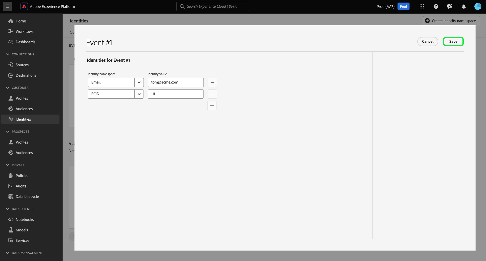
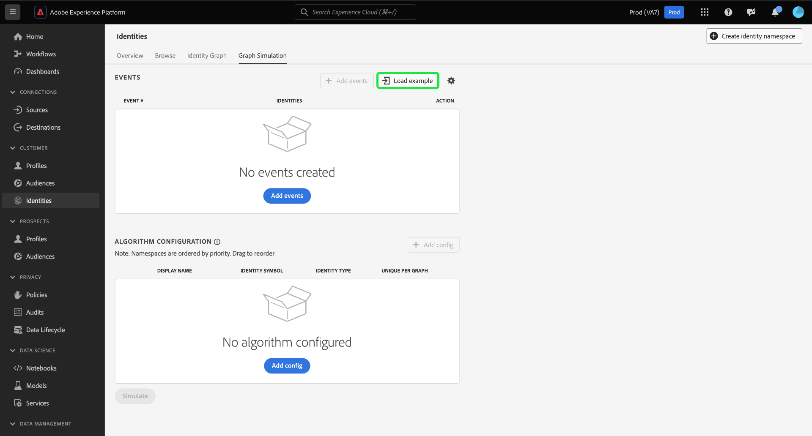
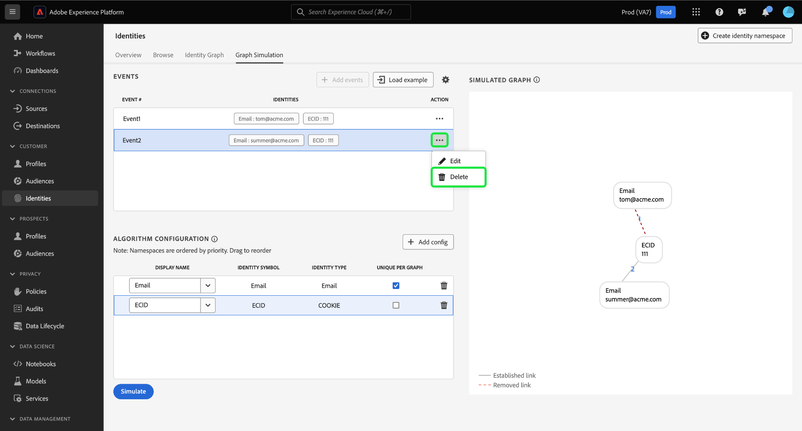
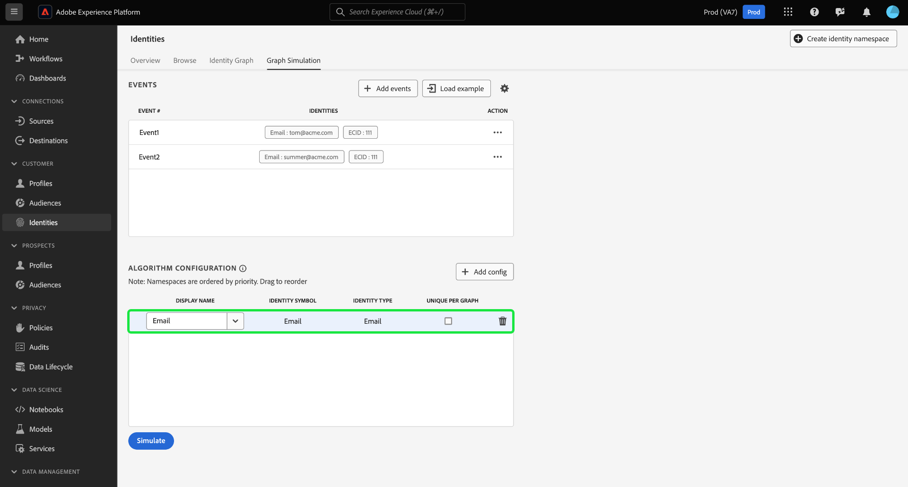

# [!DNL Graph Simulation] UI指南

>[!AVAILABILITY]
>
>此功能尚未推出；身分圖表連結規則的Beta版計畫預計於7月在開發沙箱上開始。 如需參與率條件的詳細資訊，請聯絡您的Adobe客戶團隊。

[!DNL Graph Simulation] 是Identity Service UI中的工具，可用於模擬身分圖表在指定身分的特定組合下的行為方式，以及您設定 [身分最佳化演演算法](./identity-optimization-algorithm.md).

請參閱本檔案以瞭解如何使用 [!DNL Graph Simulation] 以更清楚瞭解身分圖表行為以及圖表演演算法的運作方式。

## 開始瞭解 [!DNL Graph Simulation] 介面 {#interface}

您可以存取 [!DNL Graph Simulation] 在Adobe Experience Platform UI中。 選取 **[!UICONTROL 身分]** 從左側導覽列中，然後選取 **[!UICONTROL 圖表模擬]** 從頂端標題。

此 [!DNL Graph Simulation] 介面可分成三個區段：

>[!BEGINTABS]

>[!TAB 事件]

事件：使用 **[!UICONTROL 活動]** 面板以新增身分來模擬圖表。 完整身分必須具有身分名稱空間及其對應的身分值。 您必須至少新增兩個身分才能模擬圖形。 您也可以選取 **[!UICONTROL 載入範例]** 以輸入預先設定的事件和演演算法設定。

>[!TAB 演演算法設定]

演演算法設定：使用 **[!UICONTROL 演演算法設定]** 面板，為您的名稱空間新增及設定最佳化演演算法。 您可以拖放名稱空間來修改其各自的優先順序排名。 您也可以選取 **[!UICONTROL 每個圖表不重複]** 以判斷名稱空間是否唯一。

>[!TAB 模擬圖表檢視器]

模擬圖形檢視器：模擬圖形檢視器會根據您新增的事件和您設定的演演算法顯示產生的圖形。 兩個身分之間的直線表示已建立連結。 虛線表示連結已移除。

>[!ENDTABS]

## 新增事件 {#add-events}

若要開始，請選取 **[!UICONTROL 新增事件]**.

隨即出現快顯視窗 [!UICONTROL 事件#1]. 從這裡，輸入您的身分名稱空間和身分值組合。 您可以使用下拉式選單來選取身分名稱空間。 或者，您可以輸入名稱空間的前幾個字母，然後選取下拉式選單中提供的選項。 選取名稱空間後，請提供與名稱空間對應的身分值。

>[!TIP]
>
>您在此期間輸入的身分值 [!DNL Graph Simulation] 練習不一定要是真正的身分值，而且可以是簡單的預留位置。

第一個身分識別完成後，請選取新增圖示(**`+`**)以新增第二個身分。

接下來，重複相同的步驟並新增第二個身分。 需要兩個完全合格的身分才能產生身分圖表。 在以下範例中，ECID會新增為名稱空間，並隨附值 `111`. 完成後，選取 **[!UICONTROL 儲存]**.

此 [!UICONTROL 活動] 介面更新以顯示您的第一個事件，此例中為： `{Email: tom@acme.com, ECID: 111}`.

接下來，重複相同的步驟以新增第二個事件。 對於事件#2，新增 `{Email: summer@acme.com}` 作為您的第一個身分，然後新增相同的 `{ECID: 111}` 做為第二個身分，因此會建立下列專案的第二個事件： `{Email: summer@acme.com}, {ECID: 111}`. 完成後，您應該有兩個事件，一個用於 `{Email: tom@acme.com, ECID: 111}` 一個用於 `{Email: summer@acme.com}, {ECID: 111}`.

### 載入範例 {#load-example}

選取 **[!UICONTROL 載入範例]** 使用預先設定的演演算法和事件組態來設定範例圖形。

此時會出現一個快顯視窗，提供您可用的圖表情境，供您選擇：

| 範例圖表 | 說明 | 範例 |
| --- | --- | --- |
| 共用裝置 | 共用裝置是指兩個不同使用者登入同一部裝置的情境。 | 夫妻共用一個iPad進行網際網路瀏覽和電子商務。 |
| 無效 (非唯一) 電話 | 無效或非唯一電話是指兩個不同使用者使用相同電話號碼建立帳戶的情況。 | 母親和女兒使用他們共用的家庭電話號碼註冊任何電子商務帳戶。 |
| 「不良」身分值 | 「不良」身分值是指身分服務因錯誤實作而產生非唯一IDFA的情況。 | WebSDK錯誤地傳送 `user_null` 由於程式碼實作問題而造成的每個事件值。 |

選取任何要載入的選項 [!DNL Graph Simulation] 以及預先設定的事件和演演算法。 您仍然可以對任何預先載入的圖表案例範例進行進一步的設定。

完成後，選取 **[!UICONTROL 模擬]**.

### 使用文字版本 {#use-text-version}

您也可以使用文字模式來設定事件。 若要使用文字模式，請選取設定圖示，然後選取 **[!UICONTROL 文字（進階使用者）]**.

您可以使用文字模式手動輸入身分。 使用冒號(`:`)以區別與您輸入之名稱空間對應的身分值，然後使用逗號(`,`)以分隔您的身分。 若要區分不同的事件，請為每個事件使用新行。

### 編輯事件 {#edit-event}

若要編輯事件，請選取省略符號(`...`)，然後選取 **[!UICONTROL 編輯]**.

### 刪除事件 {#delete-event}

若要刪除事件，請選取省略符號(`...`)，然後選取 **[!UICONTROL 刪除]**.

## 設定演演算法 {#configure-algorithm}

>[!IMPORTANT]
>
>您設定的演演算法會指示Identity Service如何處理您在事件中輸入的名稱空間。 您在中組合的任何設定 [!DNL Graph Simulation UI] 未儲存在身分設定中。

新增事件後，您現在可以設定將用來模擬圖表的演演算法。 若要開始，請選取 **[!UICONTROL 新增設定]**.

空白的設定列隨即顯示。 首先，輸入您用於事件的相同名稱空間。 在此情況下，請先輸入電子郵件。 輸入名稱空間後，欄中的 [!UICONTROL 身分符號] 和 [!UICONTROL 身分型別] 自動填入。

接下來，重複相同的步驟，並新增第二個名稱空間（在此例中為ECID）。 輸入完所有名稱空間後，您就可以開始設定其優先順序和唯一性。

* **名稱空間優先順序**：名稱空間的優先順序決定其與指定身分圖表中其他名稱空間相比的相對重要性。 例如，如果您的身分圖表有四個不同的名稱空間：CRM ID、ECID、電子郵件和Apple IDFA，您可以設定優先順序來判斷四個名稱空間的重要性順序。
* **唯一的名稱空間**：如果將名稱空間指定為唯一，則Identity Service將會產生圖形，並注意只能有一個具有指定唯一名稱空間的身分。 例如，如果電子郵件名稱空間指定為唯一的名稱空間，則圖表只能有一個包含電子郵件的身分。 如果電子郵件名稱空間中有多個身分，則會移除最舊的連結。

若要設定名稱空間優先順序，請選取名稱空間列，並將其拖曳到您想要的優先順序順序，頂端列代表較高的優先順序，底部列代表較低的優先順序。 若要將名稱空間指定為唯一，請選取 **[!UICONTROL 每個圖表不重複]** 核取方塊。

完成後，選取 **[!UICONTROL 模擬]**.

## 檢視模擬圖形

此 [!UICONTROL 模擬圖形] 區段會顯示根據您新增的事件和您設定的演演算法所產生的身分圖表。

| 圖表圖示 | 說明 |
| --- | --- |
| 實線 | 實線表示兩個身分之間的已建立連結。 |
| 虛線 | 虛線代表兩個身分之間的已移除連結。 |
| 線上號碼 | 某一行上的數字代表產生該指定連結時的時間戳記。 最低數字(1)代表最早建立的連結。 |

在下方範例圖表中，您會看到一條虛線介於 `{Email: tom@acme.com}` 和 `{ECID: 111}` 基於以下原因：

* 在演演算法設定步驟中，電子郵件被指定為唯一。 因此，圖形中可能只有一個具有電子郵件名稱空間的身分。
* 連結介於 `{Email: tom@acme.com}` 和 `{ECID: 111}` 是第一個建立的身分識別(事件#1)。 這是最舊的連結，因此會被移除。

## 後續步驟

閱讀本檔案後，您現在知道如何使用 [!DNL Graph Simulation] 工具，瞭解在指定一組特定規則和設定時，身分資料的處理方式。 如需詳細資訊，請閱讀下列檔案：

* [身分圖表連結規則](overview.md)
* [身分最佳化演演算法](identity-optimization-algorithm.md)
* [名稱空間優先順序](namespace-priority.md)
