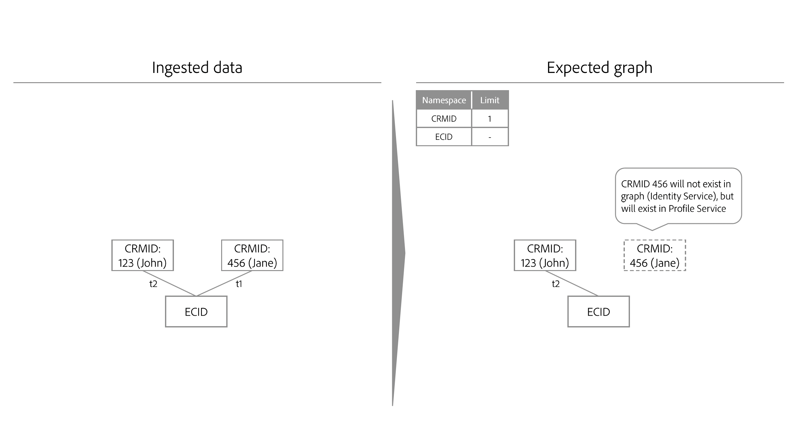
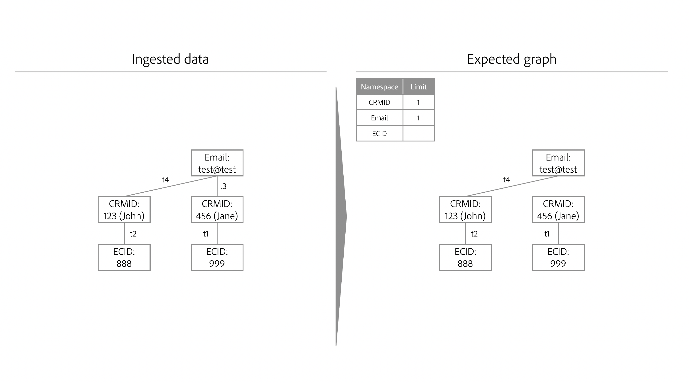

# 身分最佳化演演算法 {#identity-optimization-algorithm}

>[!CONTEXTUALHELP]
>id="platform_identities_uniquenamespace"
>title="唯一的名稱空間"
>abstract="一個圖不能有兩個具有唯一命名空間的身分識別。若圖表試圖超出此限制時，將會保留最新的連結並移除最舊的連結。"

>[!AVAILABILITY]
>
>身分圖表連結規則目前處於「有限可用性」。 如需如何在開發沙箱中存取功能的相關資訊，請聯絡您的Adobe客戶團隊。

身分最佳化演演算法是Identity Service上的圖表演演算法，可協助確保身分圖表代表單一人員，因此可防止即時客戶設定檔上不想要的身分合併。

## 輸入引數 {#input-parameters}

請閱讀本節，瞭解不重複名稱空間和名稱空間優先順序的相關資訊。 這兩個概念可作為身分最佳化演演算法所需的輸入引數。

### 唯一命名空間 {#unique-namespace}

唯一的名稱空間會決定圖形摺疊時移除的連結。

單一合併的個人檔案及其對應的身分圖表應代表單一個人（個人實體）。 一般來說，一個人會以CRMID和/或登入ID表示。 預期不會將兩個個人(CRMID)合併至單一設定檔或圖表。

您必須使用身分最佳化演演算法，指定哪些名稱空間代表Identity Service中的個人實體。 例如，如果CRM資料庫定義使用者帳戶與單一CRMID和單一電子郵件地址相關聯，則此沙箱的身分設定如下：

* CRMID名稱空間=唯一
* 電子郵件名稱空間=唯一

您宣告為唯一的名稱空間會自動設定為指定身分圖表中的最大限製為1。 例如，如果您宣告CRMID名稱空間為唯一，則身分圖表只能有一個包含CRMID名稱空間的身分。 如果您未宣告名稱空間為唯一，則圖表可能會包含多個具有該名稱空間的身分。

>[!NOTE]
>
>* 目前不支援家用實體表示（「家用圖表」）。
>
>* 作為人員識別碼以及用在沙箱中以產生身分圖表的所有名稱空間都必須標示為唯一的名稱空間。 否則，您可能會看到不想要的連結結果。

### 命名空間優先等級 {#namespace-priority}

名稱空間優先順序會決定身分最佳化演演算法如何移除連結。

Identity Service中的名稱空間具有隱含的相對重要性順序。 假設圖表的結構如金字塔。 最上層有一個節點，中間層有兩個節點，最下層有四個節點。 名稱空間優先順序必須反映此相對順序，以確保正確表示個人實體。

若要深入瞭解名稱空間優先順序及其完整的功能和用途，請閱讀[名稱空間優先順序指南](./namespace-priority.md)。

## 程式 {#process}

擷取新身分時，Identity Service會檢查新身分及其對應的名稱空間是否依循唯一的名稱空間設定。 如果依照設定進行，擷取作業會繼續，而新身分會連結至圖形。 不過，如果未依循設定，則身分最佳化演演算法會：

* 擷取最近的事件，同時將名稱空間優先順序納入考量。
* 從適當的圖表層移除會合併兩個人員實體的連結。

## 身分最佳化演演算法詳細資料

違反唯一名稱空間限制時，身分最佳化演演算法會「重播」連結，並從頭開始重建圖形。

* 連結會依下列順序排序：
   * 最新事件。
   * 依名稱空間優先順序總和的時間戳記（較低總和=較高順序）。
* 圖表會根據上述順序重新建立。 如果新增連結違反限制條件約束（例如，圖表包含兩個以上具有唯一名稱空間的身分），則會移除連結。
* 然後，產生的圖形將與您設定的唯一名稱空間限制相容。

## 身分最佳化演演算法的範例案例

下節會概述身分最佳化演演算法在共用裝置或擷取具有相同時間戳記的資料等情境下的行為。

### 共用裝置

共用裝置是指由超過一個使用者使用的裝置。 例如，共用裝置可以是您與合作夥伴或家庭成員共用的筆記型電腦或平板電腦、圖書館電腦或公用資訊站。

>[!BEGINTABS]

>[!TAB 範例1]

| 命名空間 | 唯一命名空間 |
| --- | --- |
| CRMID | 是 |
| 電子郵件 | 是 |
| ECID | 無 |

在此範例中，CRMID和電子郵件都被指定為唯一的名稱空間。 在`timestamp=0`，已擷取CRM記錄資料集，並因為唯一的名稱空間設定而建立兩個不同的圖形。 每個圖表都包含CRMID和電子郵件名稱空間。

* `timestamp=1`： Jane使用筆記型電腦登入您的電子商務網站。 Jane由CRMID和電子郵件代表，而她所使用筆記型電腦上的網頁瀏覽器則由ECID代表。
* `timestamp=2`： John使用相同的筆記型電腦登入您的電子商務網站。 John由他的CRMID和電子郵件代表，而他使用的網頁瀏覽器已由ECID代表。 由於相同的ECID連結至兩個不同的圖表，Identity Service可得知此裝置（筆記型電腦）為共用裝置。
* 不過，由於唯一的名稱空間設定為最多一個CRMID名稱空間和每個圖表一個電子郵件名稱空間，身分最佳化演演算法會將圖表分割為兩個。
   * 最後，由於John是最後驗證的使用者，因此代表筆記型電腦的ECID仍會連結至他的圖表，而非Jane&#39;s。

>[!TAB 範例2]

| 命名空間 | 唯一命名空間 |
| --- | --- |
| CRMID | 是 |
| ECID | 無 |

在此範例中，CRMID名稱空間會指定為唯一的名稱空間。

* `timestamp=1`： Jane使用筆記型電腦登入您的電子商務網站。 她由CRMID代表，而筆記型電腦上的網頁瀏覽器則由ECID代表。
* `timestamp=2`： John使用相同的筆記型電腦登入您的電子商務網站。 他由他的CRMID代表，而他使用的網頁瀏覽器由相同的ECID代表。
   * 此事件會將兩個獨立的CRMID連結至相同的ECID，超過設定的一個CRMID限制。
   * 因此，身分最佳化演演算法會移除較舊的連結，在此案例中為連結在`timestamp=1`的Jane CRMID。
   * 不過，雖然Jane的CRMID不再以Identity Service的圖表形式存在，但仍會以即時客戶個人檔案的設定檔形式持續存在。 這是因為身分圖表必須至少包含兩個連結的身分，並且在移除連結後，Jane的CRMID不再擁有可連結的另一個身分。

>[!ENDTABS]

### 錯誤的電子郵件

在某些情況下，使用者可能會輸入錯誤的電子郵件和/或電話號碼值。

| 命名空間 | 唯一命名空間 |
| --- | --- |
| CRMID | 是 |
| 電子郵件 | 是 |
| ECID | 無 |

在此範例中，CRMID和電子郵件名稱空間會指定為唯一。 請考慮Jane和John使用錯誤的電子郵件值(例如test@test.com)登入您的電子商務網站的案例。

* `timestamp=1`： Jane在其iPhone上使用Safari登入您的電子商務網站，建立其CRMID （登入資訊）和ECID （瀏覽器）。
* `timestamp=2`： John在其iPhone上使用Google Chrome登入您的電子商務網站，建立其CRMID （登入資訊）和ECID （瀏覽器）。
* `timestamp=3`：您的資料工程師擷取Jane的CRM記錄，導致她的CRMID連結至不良電子郵件。
* `timestamp=4`：您的資料工程師擷取John的CRM記錄，導致其CRMID連結至不良電子郵件。
   * 這樣會違反唯一名稱空間設定，因為它會建立具有兩個CRMID名稱空間的單一圖形。
   * 因此，身分最佳化演演算法會刪除較舊的連結，在此例中是Jane身分與CRMID名稱空間及身分與測試@test之間的連結。

使用身分最佳化演演算法，不正確的身分值（例如假電子郵件或電話號碼）不會傳播到數個不同的身分圖表中。

### 匿名事件關聯

ECID會儲存未驗證（匿名）的事件，而CRMID會儲存已驗證的事件。 在共用裝置的情況下，ECID （未驗證事件的持有者）會與&#x200B;**上次驗證的使用者**&#x200B;相關聯。

請檢視下圖，深入瞭解匿名事件關聯的運作方式：

* Kevin和Nora共用平板電腦。
   * `timestamp=1`： Kevin使用帳戶登入電子商務網站，藉此建立其CRMID （登入資訊）和ECID （瀏覽器）。 登入時，Kevin現在被視為最後驗證的使用者。
   * `timestamp=2`： Nora使用她的帳戶登入電子商務網站，因此建立了她的CRMID （登入資訊）和相同的ECID。 登入時，Nora現在被視為最後驗證的使用者。
   * `timestamp=3`： Kevin使用平板電腦瀏覽電子商務網站，但未使用帳戶登入。 Kevin的瀏覽活動會儲存在ECID中，而此ECID又與Nora相關聯，因為她是最後驗證的使用者。 此時，Nora擁有匿名活動。
      * 在Kevin再次登入之前，Nora的合併設定檔將與針對ECID儲存的所有未驗證事件相關聯（其中事件是ECID是主要身分）。
   * `timestamp=4`： Kevin第二次登入。 此時，他再次成為最後驗證的使用者，且現在擁有未驗證的事件：
      * 在`timestamp=1`之前的初次登入之前；以及
      * 他或Nora在匿名瀏覽中間Kevin第一次登入和第二次登入時所做的任何活動。

## 後續步驟

如需身分圖表連結規則的詳細資訊，請參閱下列檔案：

* [身分圖表連結規則概觀](./overview.md)
* [實作指南](./implementation-guide.md)
* [圖表設定範例](./example-configurations.md)
* [疑難排解和常見問答( FAQ)](./troubleshooting.md)
* [命名空間優先等級](./namespace-priority.md)
* [圖表模擬UI](./graph-simulation.md)
* [身分設定UI](./identity-settings-ui.md)