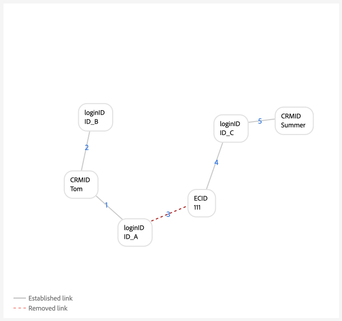

# 身分圖表連結規則的實作指南

>[!AVAILABILITY]
>
>身分圖表連結規則目前處於「有限可用性」。 如需如何在開發沙箱中存取功能的相關資訊，請聯絡您的Adobe客戶團隊。

請參閱本檔案，瞭解在使用Adobe Experience Platform Identity Service實作資料時可遵循的逐步指南。

逐步大綱：


1. [實作的完整必要條件](#prerequisites-for-implementation)
2. [建立必要的身分名稱空間](#namespace)
3. [使用圖表模擬工具來熟悉身分最佳化演演算法](#graph-simulation)
4. [使用身分設定UI來指定您專屬的名稱空間，並設定名稱空間的優先順序排名](#identity-settings)
5. [建立體驗資料模型(XDM)結構描述](#schema)
6. [建立資料集](#dataset)
7. [將資料內嵌至Experience Platform](#ingest)

## 實作的先決條件 {#prerequisites-for-implementation}

本節概述在實作身分圖表連結規則至您的資料之前，您必須完成的先決條件步驟。

### 唯一命名空間

#### 單一人員名稱空間需求 {#single-person-namespace-requirement}

您必須確保每個設定檔中一律存在具有最高優先順序的唯一名稱空間。 如此可讓Identity Service偵測指定圖表中的適當人員識別碼。

+++選取此選項可檢視沒有單一人員識別碼名稱空間的圖表範例

如果沒有能代表您個人識別碼的唯一名稱空間，您最終可能會看到將不同的個人識別碼連結至相同ECID的圖表。 在此範例中，B2BCRM和B2CCRM會同時連結至相同的ECID。 此圖表建議Tom使用其B2C登入帳戶與Summer共用裝置（使用她的B2B登入帳戶）。 但是，系統將識別這是一個設定檔（圖形摺疊）。


+++

+++選取此選項可檢視具有單一人員識別碼名稱空間的圖表範例

指定唯一的名稱空間（在此案例中是CRMID，而不是兩個完全不同的名稱空間），Identity Service就能夠識別上次與ECID建立關聯的人員識別碼。 在此範例中，由於存在唯一的CRMID，Identity Service能夠識別「共用裝置」情境，其中兩個實體共用相同裝置。


+++

### 名稱空間優先順序設定

如果您使用[Adobe Analytics來源聯結器](../../sources/tutorials/ui/create/adobe-applications/analytics.md)來內嵌資料，則您必須為ECID指定比Adobe Analytics ID (AAID)更高的優先順序，因為Identity Service會封鎖AAID。 透過優先處理ECID，您可以指示即時客戶設定檔將未驗證事件儲存至ECID而非AAID。

### XDM體驗事件

在預先實作程式中，請確定系統要傳送至Experience Platform的已驗證事件一律包含人員識別碼，例如CRMID。

>[!BEGINTABS]

>[!TAB 具有人員識別碼的已驗證事件]

```json
{
  "_id": "test_id",
  "identityMap": {
      "ECID": [
          {
              "id": "62486695051193343923965772747993477018",
              "primary": false
          }
      ],
      "CRMID": [
          {
              "id": "John",
              "primary": true
          }
      ]
  },
  "timestamp": "2024-09-24T15:02:32+00:00",
  "web": {
      "webPageDetails": {
          "URL": "https://business.adobe.com/",
          "name": "Adobe Business"
      }
  }
}
```

>[!TAB 沒有人員識別碼的已驗證事件]


```json
{
    "_id": "test_id",
    "identityMap": {
        "ECID": [
            {
                "id": "62486695051193343923965772747993477018",
                "primary": false
            }
        ]
    },
    "timestamp": "2024-09-24T15:02:32+00:00",
    "web": {
        "webPageDetails": {
            "URL": "https://business.adobe.com/",
            "name": "Adobe Business"
        }
    }
}
```


>[!ENDTABS]

在預先實作程式中，您必須確保系統要傳送至Experience Platform的已驗證事件一律包含&#x200B;**單一**&#x200B;人員識別碼，例如CRMID。

* （建議）具有一個人員識別碼的已驗證事件。
* （不建議）具有兩個人員識別碼的已驗證事件。
* （不建議）沒有任何人員識別碼的已驗證事件。

如果您的系統傳送兩個人員識別碼，則實作可能會讓單一人員名稱空間需求失效。 例如，如果webSDK實作中的identityMap包含CRMID、customerID和ECID名稱空間，則兩個共用裝置的個人可能會錯誤地關聯到不同的名稱空間。

在Identity Service中，此實作可能如下所示：

* `timestamp1` = John登入 — >系統擷取`CRMID: John, ECID: 111`。
* `timestamp2` = Jane登入 — >系統擷取`customerID: Jane, ECID: 111`。

+++檢視實施在圖表模擬中的外觀


+++

## 設定許可權 {#set-permissions}

Identity Service實作程式中的第一個步驟，是確保將您的Experience Platform帳戶新增至已布建必要許可權的角色。 您的管理員可以導覽至Adobe Experience Cloud中的許可權UI，設定您帳戶的許可權。 之後，您的帳戶必須新增至具有以下許可權的角色：

* [!UICONTROL 檢視身分設定]：套用此許可權，以便在身分名稱空間瀏覽頁面中檢視唯一的名稱空間和名稱空間優先順序。
* [!UICONTROL 編輯身分設定]：套用此許可權，以便能夠編輯並儲存您的身分設定。

如需許可權的詳細資訊，請閱讀[許可權指南](../../access-control/abac/ui/permissions.md)。

## 建立您的身分識別名稱空間 {#namespace}

如果您的資料需要這些資料，您必須先為組織建立適當的名稱空間。 如需如何建立自訂名稱空間的步驟，請閱讀[在UI](../features/namespaces.md#create-custom-namespaces)中建立自訂名稱空間的指南。

## 使用圖表模擬工具 {#graph-simulation}

接下來，導覽至Identity Service UI工作區中的[圖形模擬工具](./graph-simulation.md)。 您可以使用圖表模擬工具來模擬使用各種不同唯一名稱空間和名稱空間優先順序設定所建立的身分圖表。

透過建立不同的設定，您可以使用圖表模擬工具來學習和更好地瞭解身分最佳化演演算法和特定設定如何影響您的圖表行為。

## 設定身分設定 {#identity-settings}

一旦您知道您想要圖形的行為方式，請瀏覽至Identity Service UI工作區中的[身分設定UI](./identity-settings-ui.md)。 若要存取身分設定UI，請從左側導覽選取&#x200B;**[!UICONTROL 身分]**，然後選取&#x200B;**[!UICONTROL 設定]**。


使用身分設定UI來指定您唯一的名稱空間，並依優先順序設定您的名稱空間。 套用完設定後，您必須至少等待六個小時才能繼續內嵌資料，因為新設定至少需要六個小時才能反映在Identity Service中。

如需詳細資訊，請閱讀[身分設定UI指南](./identity-settings-ui.md)。

## 建立 XDM 結構描述 {#schema}

在建立唯一的名稱空間和名稱空間優先順序後，您現在可以繼續進行必要的設定，以擷取您的資料。 首先，您必須建立XDM結構描述。 根據您的資料，您可能需要為XDM Individual Profile和XDM ExperienceEvent建立結構。

若要將資料內嵌至Real-time Customer Profile，您必須確保您的結構描述至少包含一個已指定為主要身分的欄位。 透過設定主要身分，您可以為設定檔擷取啟用指定的結構描述。

如需如何建立結構描述的指示，請閱讀[在UI](../../xdm/tutorials/create-schema-ui.md)中建立XDM結構描述的指南。

## 建立資料集 {#dataset}

接下來，建立資料集以針對您要擷取的資料提供結構。 資料集是資料集合的儲存和管理結構，通常是包含方案 (欄) 和欄位 (列) 的表格。 資料集與結構描述搭配使用，若要將資料擷取到即時客戶個人檔案，您的資料集必須啟用個人檔案擷取。 為了針對設定檔啟用您的資料集，它必須參考針對設定檔擷取啟用的結構描述。

如需如何建立資料集的說明，請參閱[資料集UI指南](../../catalog/datasets/user-guide.md)。

## 擷取您的資料 {#ingest}

此時，您應該具備下列專案：

* 存取Identity Service功能的必要許可權。
* 資料適用的名稱空間。
* 為名稱空間指定的唯一名稱空間和設定的優先順序。
* 至少一個XDM結構描述。 （根據您的資料和特定使用案例，您可能需要建立設定檔和體驗事件結構。）
* 以您的結構描述為基礎的資料集。

完成上述所有專案後，您就可以開始將資料內嵌至Experience Platform。 您可以透過數種不同的方式執行資料擷取。 您可以使用下列服務將資料帶入Experience Platform：

* [批次和串流擷取](../../ingestion/home.md)
* [Experience Platform中的資料收集](../../collection/home.md)
* [Experience Platform來源](../../sources/home.md)

>[!TIP]
>
>擷取您的資料後，XDM原始資料裝載不會變更。 您仍可在UI中看到主要身分設定。 不過，身分設定將會覆寫這些設定。

如需任何意見，請使用Identity Service UI工作區中的&#x200B;**[!UICONTROL Beta意見]**&#x200B;選項。

## 驗證圖表 {#validate}

使用身分儀表板來深入分析身分圖表狀態，例如整體身分計數和圖表計數趨勢、依名稱空間的身分計數和依圖表大小的圖表計數。 您也可以使用身分儀表板來檢視具有兩個或多個身分（依名稱空間組織）的圖表趨勢。

選取省略符號(`...`)，然後選取&#x200B;**[!UICONTROL 檢視更多]**&#x200B;以取得進一步資訊，並驗證沒有收合的圖形。


使用顯示的視窗來檢視收合圖形的資訊。 在此範例中，電子郵件和電話都標示為唯一的名稱空間，因此您的沙箱中沒有收合的圖表。


## 附錄 {#appendix}

請參閱本節，瞭解實作身分設定和唯一名稱空間時可參考的其他資訊。

### Danging loginID案例 {#dangling-loginid-scenario}

下圖會模擬「懸浮」登入ID案例。 在此範例中，兩個不同的loginID已繫結至相同的ECID。 但是，`{loginID: ID_C}`未連結至CRMID。 因此，Identity Service無法偵測這兩個loginID代表兩個不同的實體。

>[!BEGINTABS]

>[!TAB 不明確的登入ID]

在此範例中，`{loginID: ID_C}`懸空且未連結至CRMID。 因此，此loginID應關聯的個人實體變得模稜兩可。


>[!TAB loginID已連結至CRMID]

在此範例中，`{loginID: ID_C}`連結至`{CRMID: Tom}`。 因此，系統能夠識別此loginID與Tom相關聯。


>[!TAB loginID已連結至另一個CRMID]

在此範例中，`{loginID: ID_C}`連結至`{CRMID: Summer}`。 因此，系統能夠識別此loginID與另一個個人實體（在此例中為Summer）相關聯。

此範例也顯示Tom和Summer是共用裝置的不同個人實體，以`{ECID: 111}`表示。



>[!ENDTABS]

## 後續步驟

如需身分圖表連結規則的詳細資訊，請參閱下列檔案：

* [身分圖表連結規則概觀](./overview.md)
* [身分識別最佳化演算法](./identity-optimization-algorithm.md)
* [圖表設定範例](./example-configurations.md)
* [疑難排解和常見問答( FAQ)](./troubleshooting.md)
* [命名空間優先順序](./namespace-priority.md)
* [圖表模擬UI](./graph-simulation.md)
* [身分設定UI](./identity-settings-ui.md)
