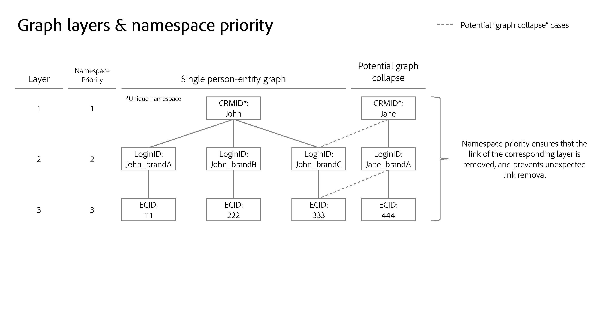

# 命名空間優先順序 {#namespace-priority}

>[!CONTEXTUALHELP]
>id="platform_identities_namespacepriority"
>title="命名空間優先順序"
>abstract="命名空間優先順序會決定如何從身分識別圖中移除連結。"

每個客戶實作都是獨一無二，並根據特定組織的目標量身打造，因此，特定名稱空間的重要性因客戶而異。 現實世界的範例包括：

* 貴公司可能會將每個電子郵件地址視為代表單一人員實體，因此使用[身分設定](./identity-settings-ui.md)將電子郵件名稱空間設定為唯一。 但其他公司可能想要將單一人員實體表示為具有多個電子郵件地址，因此將電子郵件名稱空間設定為非唯一。 這些公司需要使用另一個身分名稱空間作為唯一，例如CRMID名稱空間，因此可能會有一個單一人員識別碼連結到多個電子郵件地址。
* 您可以使用「登入ID」名稱空間收集線上行為。 此登入ID可能會與CRMID維持1:1關係，而CRMID則會儲存CRM系統的屬性，且可能會被視為最重要的名稱空間。 在此案例中，您接著會判斷CRMID名稱空間是人員的更精確表示法，而「登入ID」名稱空間是第二重要的。

您必須在Identity Service中進行反映名稱空間重要性的設定，因為這會影響設定檔及其相關身分圖表的形成和分割方式。

## 決定您的優先順序

名稱空間優先順序的判斷會依據下列因素：

### 身分圖表結構

如果貴組織的圖表結構是分層的，則名稱空間優先順序應反映這一點，以便在圖表摺疊時移除正確的連結。

>[!TIP]
>
>* 「圖表摺疊」是指多個不同的設定檔不慎合併到單一身分圖表中的情況。
>
>* 分層圖表是指具有多重連結層級的身分圖表。 檢視下方影像以取得含有三個圖層的圖形範例。

### 名稱空間的語意意義

身分代表真實世界的物件。 身分圖中有三個物件代表。 按照重要性順序，它們是：

* 人員（跨裝置、電子郵件、電話號碼）
* 硬體裝置
* 網頁瀏覽器(Cookie)

與硬體裝置（例如IDFA、GAID）相比，人員名稱空間相對不可變，而硬體裝置相對於網頁瀏覽器則相對不可變。 基本上，您（人員）永遠是單一實體，擁有多部硬體裝置（手機、筆記型電腦、平板電腦等），並使用多部瀏覽器(Google Chrome、Safari、FireFox等)

處理此主題的另一種方法是使用基數。 對於指定的人員實體，將會建立多少身分？ 在大多數情況下，個人會有一個CRMID、數個硬體裝置識別碼（IDFA/GAID重設不應該經常發生），以及甚至更多Cookie （個人可視地在多個裝置上瀏覽、使用無痕模式或在任何指定時間重設Cookie）。 一般而言，**較低的基數表示具有較高值**&#x200B;的名稱空間。

## 驗證名稱空間優先順序設定

瞭解如何排列名稱空間的優先順序後，您就可以在UI中使用圖表模擬工具來測試各種圖表摺疊情況，並確保優先順序設定傳回預期的圖表結果。 如需詳細資訊，請閱讀使用[圖表模擬工具](./graph-simulation.md)的指南。

## 設定名稱空間優先順序

可使用[身分設定UI](./identity-settings-ui.md)來設定名稱空間優先順序。 在身分設定介面中，您可以拖放名稱空間以判斷其相對重要性。

>[!IMPORTANT]
>
>裝置/Cookie名稱空間優先順序無法高於人員名稱空間。 此限制可確保不會發生錯誤設定。

## 名稱空間優先順序使用方式

目前，名稱空間優先順序會影響即時客戶個人檔案的系統行為。 下圖說明了此概念。 如需詳細資訊，請閱讀[Adobe Experience Platform和應用程式架構圖](https://experienceleague.adobe.com/zh-hant/docs/blueprints-learn/architecture/architecture-overview/platform-applications)的指南。

## Identity服務：身分最佳化演演算法

對於相對複雜的圖表結構，名稱空間優先順序在確保在圖表摺疊情況發生時移除正確連結方面扮演重要角色。 如需詳細資訊，請閱讀[身分最佳化演演算法總覽](../identity-graph-linking-rules/identity-optimization-algorithm.md)。

## 即時客戶個人檔案：體驗事件的主要身分確定

* 在您設定好指定沙箱的身分設定後，體驗事件的主要身分將由設定中最高的名稱空間優先順序決定。
   * 這是因為體驗事件的本質是動態的。 身分對應可能包含三個或更多身分，而名稱空間優先順序可確保最重要的名稱空間與體驗事件相關聯。
* 因此，即時客戶設定檔&#x200B;**將不再使用下列設定**：
   * 使用網頁SDK、Mobile SDK或Edge Network API （身分名稱空間和身分值將繼續用於設定檔中）在`identityMap`中傳送身分時，主要身分設定(`primary=true`)。 **注意**： Real-time Customer Profile以外的服務(如Data Lake Storage或Adobe Target)將繼續使用主要身分設定(`primary=true`)。
   * 任何在XDM體驗事件類別結構描述上標示為主要身分的欄位。
   * Adobe Analytics來源聯結器（ECID或AAID）中的預設主要身分設定。
* 另一方面，**名稱空間優先順序不會決定設定檔記錄**&#x200B;的主要身分。
   * 針對設定檔記錄，您應該繼續在結構描述中定義身分欄位，包括主要身分。 如需詳細資訊，請參閱[在UI](../../xdm/ui/fields/identity.md)中定義身分欄位的指南。

>[!TIP]
>
>* 名稱空間優先順序是&#x200B;**名稱空間**&#x200B;的屬性。 這是指派給名稱空間的數值，可指出其相對重要性。
>
>* 主要身分是儲存設定檔片段所針對的身分。 設定檔片段是儲存特定使用者相關資訊的資料記錄：屬性（例如CRM記錄）或事件（例如網站瀏覽）。

### 範例情境

本節提供優先順序設定如何影響資料的範例。

假設為給定沙箱建立了以下設定：

| 命名空間 | 名稱空間的實際應用程式 | 優先順序 |
| --- | --- | --- |
| CRMID | 使用者 | 1 |
| IDFA | Apple硬體裝置(iPhone、IPad等) | 2 |
| GAID | Google硬體裝置(Google Pixel、Pixelbook等) | 3 |
| ECID | 網頁瀏覽器(Firefox、Safari、Google Chrome等) | 4 |
| AAID | 網頁瀏覽器 | 5 |

{style="table-layout:auto"}

基於上述設定，使用者動作和主要身分的判定將依下列方式解析：

| 使用者動作（體驗事件） | 驗證狀態 | 資料來源 | 事件中的名稱空間 | 主要身分的名稱空間 |
| --- | --- | --- | --- | --- |
| 檢視信用卡優惠方案頁面 | 未驗證（匿名） | Web SDK | `{ECID}` | ECID |
| 檢視說明頁面 | 未驗證 | Mobile SDK | `{ECID, IDFA}` | IDFA |
| 檢視支票帳戶餘額 | 已驗證 | Web SDK | `{CRMID, ECID}` | CRMID |
| 註冊房屋貸款 | 已驗證 | Analytics來源聯結器 | `{CRMID, ECID, AAID}` | CRMID |
| 將$1,000從支票轉帳至節省金額 | 已驗證 | Mobile SDK | `{CRMID, GAID, ECID}` | CRMID |

{style="table-layout:auto"}

## 細分服務：區段會籍中繼資料儲存

對於指定的合併設定檔，區段會籍會根據具有最高名稱空間優先順序的身分來儲存。

例如，假設有兩個設定檔：

* 設定檔1代表John。
   * John的設定檔符合S1 （區段會籍1）資格。 例如，S1可能指識別為男性的客戶區段。
   * John的設定檔也符合S2 （區段會籍2）資格。 這可能代表忠誠度狀態為金色的客戶區段。
* 個人資料2代表Jane。
   * Jane的個人資料符合S3 （區段會籍3）資格。 這可能是指識別為女性的客戶區段。
   * Jane的個人資料也符合S4 （區段會籍4）資格。 這可以指代忠誠度狀態為白金級的客戶區段。

如果John和Jane共用裝置，則ECID （網頁瀏覽器）會從一個人傳輸給另一個人。 不過，這不會影響針對John和Jane所儲存的區段會籍資訊。

如果區段資格標準完全以根據ECID儲存的匿名事件為基礎，則Jane將符合該區段的資格。

## 對其他Experience Platform服務的影響 {#implications}

本節概述名稱空間優先順序如何影響其他Experience Platform服務。

### 進階資料生命週期管理

對於指定的身分，資料衛生記錄刪除請求會以下列方式運作：

* 即時客戶設定檔：刪除任何將指定身分識別為主要身分的設定檔片段。 **設定檔上的主要身分現在將根據名稱空間優先順序來判定。**
* 資料湖：刪除任何以指定身分作為主要身分的記錄。 與即時客戶設定檔不同，資料湖中的主要身分是以WebSDK (`primary=true`)上指定的主要身分或標示為主要身分的欄位為基礎

如需詳細資訊，請閱讀[進階生命週期管理概觀](../../hygiene/home.md)。

### 計算屬性

如果啟用身分設定，則計算屬性將使用名稱空間優先順序來儲存計算屬性值。 對於指定的事件，具有最高名稱空間優先順序的身分將會擁有針對其寫入的計算屬性的值。 如需詳細資訊，請閱讀[計算屬性UI指南](../../profile/computed-attributes/ui.md)。

### 資料湖

資料湖的資料擷取將繼續遵循在[網頁SDK](../../tags/extensions/client/web-sdk/data-element-types.md#identity-map)和結構描述上設定的主要身分設定。

資料湖不會根據名稱空間優先順序來判斷主要身分。 例如，即使在啟用名稱空間優先順序（例如將資料集新增至新連線）後，Adobe Customer Journey Analytics仍會繼續使用身分對應中的值，因為Customer Journey Analytics會消耗其來自資料湖的資料。

### Experience Data Model (XDM)結構

任何不是XDM體驗事件的結構描述（例如XDM個別設定檔）將繼續遵循您標籤為身分的任何[欄位](../../xdm/ui/fields/identity.md)。

如需有關XDM結構描述的詳細資訊，請閱讀[結構描述概觀](../../xdm/home.md)。

### Intelligent services

選取資料時，您需要指定名稱空間，用於決定計算分數的事件，以及儲存計算分數的事件。 建議您選取代表個人的名稱空間。

* 如果您使用WebSDk收集Web行為資料，建議您在身分對應中選擇CRMID名稱空間。
* 如果您使用Analytics來源聯結器收集網頁行為資料，則應該選取身分描述項(CRMID)。

此設定導致僅使用已驗證的事件計算分數。

如需詳細資訊，請閱讀[Attribution AI](../../intelligent-services/attribution-ai/overview.md)和[Customer AI](../../intelligent-services/customer-ai/overview.md)上的檔案。

### 合作夥伴建立的目的地

與共用裝置相關之設定檔的更新對象資格取消結果可能不會傳送至下游目的地。 這種情況可能會發生在某些罕見的情況下，例如：

* 對象資格僅以匿名活動為基礎。
* 在短時間內可以跨多個設定檔登入。

如需合作夥伴建立的目的地詳細資訊，請閱讀[目的地概觀](../../destinations/home.md#adobe-built-and-partner-built-destinations)。

### Privacy Service

針對指定身分識別的[Privacy Service刪除要求](../privacy.md)會以下列方式運作：

* 即時客戶設定檔：刪除任何將指定身分值作為主要身分的設定檔片段。 **設定檔上的主要身分現在將根據名稱空間優先順序來判定。**
* 資料湖：刪除具有指定身分作為主要或次要身分的任何記錄。

如需詳細資訊，請閱讀[隱私權服務概觀](../../privacy-service/home.md)。

### Edge細分和Edge Network應用程式

在[!DNL Identity Graph Linking Rules]的情境中，關於Edge細分和Edge Network應用程式，有兩個主要行為變更需要注意：

1. `identityMap`必須包含已標示為唯一的人員名稱空間。 不支援標籤為身分的欄位（身分描述項）。
2. 當一般使用者在驗證時進行瀏覽時，人員名稱空間必須具有`primary = true`設定。

#### 邊緣分段

在指定的事件中，請確定所有代表個人實體的名稱空間都包含在`identityMap`中，因為會忽略以XDM欄位[&#128279;](../../xdm/ui/fields/identity.md)傳送的身分，且不會用於區段會籍中繼資料儲存。

* **事件適用性**：此行為僅適用於直接傳送至Edge Network的事件(例如WebSDK和Mobile SDK)。 從[Experience Platform中心](../../landing/edge-and-hub-comparison.md)擷取的事件（例如透過HTTP API來源、其他串流來源及批次來源擷取的事件）不受此限制。
* **Edge分段特殊性**：此行為是邊緣分段所特有的。 批次和串流區段是集線器上評估的獨立服務，不會遵循相同程式。 如需詳細資訊，請參閱[邊緣分段指南](../../segmentation/methods/edge-segmentation.md)。
* 如需詳細資訊，請閱讀[Adobe Experience Platform和應用程式架構圖](https://experienceleague.adobe.com/zh-hant/docs/blueprints-learn/architecture/architecture-overview/platform-applications#detailed-architecture-diagram)和[Edge Network與集線器比較](../../landing/edge-and-hub-comparison.md)頁面。

#### Edge Network應用程式

若要確保Edge Network上的應用程式能立即存取Edge設定檔，請確定您的事件包含CRMID上的`primary=true`。 這可確保立即可用，而無需等待來自中樞的身分圖表更新。

* Edge Network上的應用程式(例如Adobe Target、Offer Decisioning和自訂Personalization目的地)將繼續取決於事件中的主要身分，以從Edge設定檔存取設定檔。
* 閱讀[Experience Platform Web SDK &amp; Edge Network架構圖](https://experienceleague.adobe.com/zh-hant/docs/blueprints-learn/architecture/architecture-overview/deployment/websdk#experience-platform-webmobile-sdk-or-edge-network-server-api-deployment)，瞭解Edge Network行為的詳細資訊。
* 如需如何在Web SDK[&#128279;](../../web-sdk/identity/overview.md)上設定主要身分的詳細資訊，請閱讀有關[資料元素型別](../../tags/extensions/client/web-sdk/data-element-types.md)和Web SDK中的身分資料的檔案。
* 確認ECID包含在體驗事件中。 如果ECID遺失，則會將其新增至具有`primary=true`的事件裝載，這可能會導致未預期的結果。