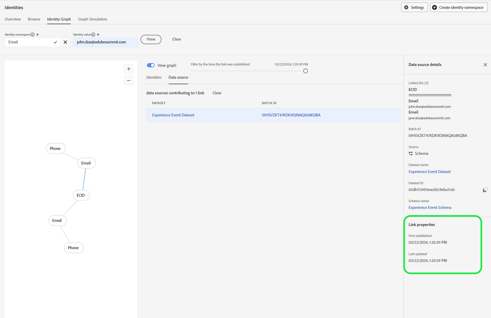

# 身分圖表連結規則疑難排解指南

>[!AVAILABILITY]
>
>身分圖表連結規則功能目前處於Beta版。 如需參與率條件的詳細資訊，請聯絡您的Adobe客戶團隊。 功能和檔案可能會有所變更。

測試和驗證身分圖表連結規則時，您可能會遇到一些與資料擷取和圖表行為相關的問題。 請閱讀本檔案，瞭解如何疑難排解使用身分圖表連結規則時可能會遇到的一些常見問題。

## 資料擷取流程概觀 {#data-ingestion-flow-overview}

下圖是資料如何流入Adobe Experience Platform和應用程式的簡化表示。 使用此圖表作為參考，協助您更清楚瞭解此頁面的內容。


請務必注意下列因素：

* 對於串流資料，即時客戶設定檔、身分服務和資料湖將在資料傳送後開始處理資料。 不過，完成資料處理的延遲需視服務而定。 通常而言，與設定檔和身分識別相比，資料湖需要更長的時間來處理。
   * 如果資料在數小時後對資料集執行查詢時仍沒有顯示，則資料很可能未內嵌到Experience Platform中。
* 針對批次資料，所有資料將先流入資料湖，然後如果資料集已啟用設定檔和身分功能，資料將傳播到設定檔和身分識別中。
* 對於內嵌相關問題，務必要在服務層級隔離問題，以便進行精確的偵錯和疑難排解。 需要考慮三種潛在問題型別：

| 擷取問題型別 | 資料會擷取到Data Lake中嗎？ | 資料會內嵌在設定檔中嗎？ | 資料會內嵌在Identity Service中嗎？ |
| --- | --- | --- | --- |
| 一般擷取問題 | 無 | 無 | 無 |
| 圖表問題 | 是 | 是 | 無 |
| 設定檔片段問題 | 是 | 無 | 是 |

## 資料擷取問題 {#data-ingestion-issues}

>[!NOTE]
>
>* 本節假設資料已成功擷取至Data Lake，且沒有語法或其他錯誤會防止資料從一開始就擷取至Experience Platform。
>
>* 這些範例使用ECID作為Cookie名稱空間，使用CRMID作為人員名稱空間。

### 我的身分未內嵌到Identity Service中{#my-identities-are-not-getting-ingested-into-identity-service}

發生此情形有多種原因，包括但不限於下列各項：

* [未針對設定檔](../../catalog/datasets/enable-for-profile.md)啟用資料集。
* 系統會略過記錄，因為事件中只有一個身分。
* [識別服務](../guardrails.md#identity-value-validation)發生驗證失敗。
   * 例如，ECID可能超過38個字元的最大長度。
* 依預設，[AAID會封鎖擷取](../guardrails.md#identity-namespace-ingestion)。
* 身分已移除，因為[系統護欄](../guardrails.md#understanding-the-deletion-logic-when-an-identity-graph-at-capacity-is-updated)。

在身分圖表連結規則的內容中，可能會拒絕身分服務的記錄，因為傳入事件有兩個或多個具有相同唯一名稱空間但不同身分值的身分。 發生此情形通常是因為實作錯誤。

考量下列事件有兩個假設：

* 欄位名稱CRMID會以名稱空間CRMID標示為身分。
* 名稱空間CRMID定義為唯一的名稱空間。

下列事件將傳回錯誤訊息，指出擷取失敗。

<!-- because the ingestion of this erroneous event would have resulted in graph collapse. In the following event, two entities (Alice and Bob) are both associated with the same namespace (CRMID). -->

```json
{ 
  "_id": "random_string", 
  "eventType": "web browsing event", 
  "identityMap": { 
    "ECID": [ 
      { 
        "id": "11111111111111111111111111111111111111", 
        "primary": false 
      } 
    ], 
    "CRMID": [ 
      { 
        "id": "Alice", 
        "primary": true 
      } 
    ] 
  }, 
  "CRMID": "Bob", 
  "timestamp": "2024-08-17T15:22:51+00:00", 
  "web": { 
    "webPageDetails": { 
      "URL": "https://www.adobe.com/acrobat.html", 
      "name": "Adobe Acrobat" 
    } 
  } 
} 
```

**疑難排解步驟**

若要解決此錯誤，您必須先收集下列資訊：

* 您預期要在身分圖形中內嵌的身分值(`identity_value`)。
* 傳送事件的資料集(`dataset_name`)。

接下來，使用[Adobe Experience Platform查詢服務](../../query-service/home.md)並執行下列查詢：

>[!TIP]
>
>將`dataset_name`和`identity_value`取代為您收集的資訊。

```sql
  SELECT key, col.id as identityValue, timestamp, _id, identityMap, * 
  FROM (SELECT key, explode(value), * 
  FROM (SELECT explode(identityMap), * 
  FROM dataset_name)) WHERE col.id = 'identity_value' 
```

執行查詢後，尋找您預期產生圖形的事件記錄，然後驗證同一列中的身分值是否不同。 檢視下列影像以取得範例：


>[!NOTE]
>
>如果兩個身分完全相同，而且事件是透過串流擷取，則身分和設定檔都會刪除身分重複。

### 我的體驗事件片段未內嵌到設定檔中 {#my-experience-event-fragments-are-not-getting-ingested-into-profile}

您的體驗事件片段未擷取至設定檔中的原因有很多，包含但不限於：

* [未針對設定檔](../../catalog/datasets/enable-for-profile.md)啟用資料集。
* [設定檔](../../xdm/classes/experienceevent.md)可能發生驗證失敗。
   * 例如，體驗事件必須同時包含`_id`和`timestamp`。
   * 此外，每個事件（記錄）的`_id`必須是唯一的。

在名稱空間優先順序的情境下，設定檔將拒絕任何包含兩個或多個具有最高名稱空間優先順序的身分的事件。 例如，如果GAID未標籤為唯一的名稱空間，且有兩個身分都具有GAID名稱空間和不同的身分值傳入，則設定檔不會儲存任何事件。

**疑難排解步驟**

若要解決此錯誤，請閱讀上述指南中概述的疑難排解步驟，針對[有關未擷取至Identity服務的資料進行疑難排解](#my-identities-are-not-getting-ingested-into-identity-service)。

### 我的體驗事件片段已擷取，但設定檔中的主要身分有「錯誤」

名稱空間優先順序在事件片段判斷主要身分的方式中會扮演重要角色。

* 設定並儲存指定沙箱的[身分設定](./identity-settings-ui.md)後，設定檔就會使用[名稱空間優先順序](namespace-priority.md#real-time-customer-profile-primary-identity-determination-for-experience-events)來判斷主要身分。 在identityMap的情況下，設定檔將不再使用`primary=true`旗標。
* 雖然設定檔將不再參考此標幟，但Experience Platform上的其他服務可能會繼續使用`primary=true`標幟。

為了將[已驗證的使用者事件](configuration.md#ingest-your-data)繫結至人員名稱空間，所有已驗證的事件都必須包含人員名稱空間(CRMID)。 這表示即使使用者登入後，每個已驗證的事件上仍必須存在人員名稱空間。

在設定檔檢視器中查詢設定檔時，您可能會繼續看到`primary=true`個「事件」標幟。 不過，此專案會被忽略，且不會由設定檔使用。

預設會封鎖AAID。 因此，如果您使用[Adobe Analytics來源聯結器](../../sources/tutorials/ui/create/adobe-applications/analytics.md)，您必須確定ECID的優先順序高於ECID，讓未驗證的事件具有ECID的主要身分識別。

**疑難排解步驟**

* 若要驗證驗證事件是否同時包含人員和Cookie名稱空間，請閱讀[疑難排解未擷取至身分識別服務之資料的錯誤一節中概述的步驟](#my-identities-are-not-getting-ingested-into-identity-service)。
* 若要驗證驗證事件是否具有人員名稱空間的主要身分（例如CRMID），請使用不拼接合併原則（這是不使用私人圖表的合併原則）在設定檔檢視器上搜尋人員名稱空間。 此搜尋只會傳回與人員名稱空間關聯的事件。

## 圖表行為相關問題 {#graph-behavior-related-issues}

本節概述您可能會遇到的有關身分圖表行為方式的常見問題。

### 此身分正連結至「錯誤」的人

身分最佳化演演算法會接受[最近建立的連結，並移除最舊的連結](./identity-optimization-algorithm.md#identity-optimization-algorithm-details)。 因此，啟用此功能後，ECID可能會從一個人重新指派（重新連結）至另一個人。 若要瞭解身分在一段時間內如何連結的歷史記錄，請遵循下列步驟：

**疑難排解步驟**

>[!NOTE]
>
>下列步驟將擷取下列假設下的資訊：
>
>* 單一資料集正在使用中（這不會查詢多個資料集）。
>
>* 由於[進階資料生命週期管理](../../hygiene/home.md)、[Privacy Service](../../privacy-service/home.md)或執行刪除的其他服務已刪除，因此資料不會從資料湖中刪除。

首先，您必須收集下列資訊：

* 已傳送之Cookie名稱空間（例如ECID）和人員名稱空間（例如CRMID）的身分符號(namespaceCode)。
   * 針對Web SDK實作，這些通常是identityMap中包含的名稱空間。
   * 對於Analytics來源聯結器實作，這些是identityMap中包含的Cookie識別碼。 個人識別碼是標示為身分的eVar欄位。
* 在中傳送事件的資料集(dataset_name)。
* 要查閱的Cookie名稱空間身分值(identity_value)。

身分符號(namespaceCode)區分大小寫。 若要擷取identityMap中指定資料集的所有身分符號，請執行以下查詢：

```sql
SELECT distinct explode(*)FROM (SELECT map_keys(identityMap) FROM dataset_name)
```

如果您不知道Cookie識別碼的身分值，而想要搜尋已連結至多個人員識別碼的Cookie ID，則必須執行下列查詢。 此查詢假設ECID為Cookie名稱空間，CRMID為人員名稱空間。

>[!BEGINTABS]

>[!TAB Web SDK實作]

```sql
  SELECT identityMap['ECID'][0]['id'], count(distinct identityMap['CRMID'][0]['id']) as crmidCount FROM dataset_name GROUP BY identityMap['ECID'][0]['id'] ORDER BY crmidCount desc 
```

>[!TAB Analytics來源聯結器實施]

```sql
  SELECT identityMap['ECID'][0]['id'], count(distinct personID) as crmidCount FROM dataset_name group by identityMap['ECID'][0]['id'] ORDER BY crmidCount desc 
```

**注意：**&#x200B;人員ID參考描述項的路徑。 您可以在結構描述下找到此資訊。

>[!ENDTABS]

接下來，執行下列查詢，依時間戳記順序檢查Cookie名稱空間的關聯：

>[!BEGINTABS]

>[!TAB Web SDK實作]

```sql
  SELECT identityMap['CRMID'][0]['id'] as personEntity, * 
  FROM dataset_name 
  WHERE identitymap['ECID'][0].id ='identity_value' 
  ORDER BY timestamp desc 
```

>[!TAB Analytics來源聯結器實施]

```sql
SELECT _experience.analytics.customDimensions.eVars.eVar10 as personEntity, * 
FROM dataset_name 
WHERE identitymap['ECID'][0].id ='identity_value' 
ORDER BY timestamp desc 
```

**注意**：此範例假設`eVar10`已標示為身分。 針對您的設定，您必須根據自己組織的實作變更eVar。

>[!ENDTABS]

### 身分最佳化演演算法未如預期「運作」

**疑難排解步驟**

請參閱有關[身分最佳化演演算法](./identity-optimization-algorithm.md)的檔案，以及支援的圖表結構型別。

* 閱讀[圖形組態指南](./example-configurations.md)以取得支援的圖形結構範例。
* 您也可以閱讀[實作指南](./configuration.md#appendix)，以取得不支援的圖表結構範例。 有兩種情況可能發生：
   * 您的所有設定檔中沒有單一名稱空間。
   * 發生[「擱置識別碼」](./configuration.md#dangling-loginid-scenario)個狀況。 在此案例中，Identity Service無法判斷暫留ID是否與圖形中的任何個人實體相關聯。

您也可以在UI](./graph-simulation.md)中使用[圖形模擬工具來模擬事件，並設定您自己的唯一名稱空間和名稱空間優先順序設定。 這麼做有助於您基本瞭解身分最佳化演演算法應該如何運作。

如果您的模擬結果與圖形行為預期相符，則可以檢查您的[身分設定](./identity-settings-ui.md)是否與您在模擬中設定的設定相符。

### 即使在設定身分設定後，我仍會在沙箱中看到摺疊的圖表

在儲存設定後&#x200B;_身分圖表將遵循您設定的唯一名稱空間和名稱空間優先順序_。 在&#x200B;_之前您儲存新設定的任何「摺疊」圖形，在擷取新資料以更新摺疊的圖形之前，都不會受到影響。_&#x200B;即使名稱空間優先順序有所變更，即時客戶設定檔上的事件片段的主要身分也不會更新。

**疑難排解步驟**

您可以使用[身分圖表檢視器](../features/identity-graph-viewer.md)來檢查您的圖表是在設定之前或之後擷取。 檢查[!UICONTROL 連結屬性]下上次更新的時間戳記，以檢視Identity Service何時擷取圖形。 如果時間戳記在設定之前，則表示在啟用功能之前已建立「摺疊」圖形。



### 我想知道我的沙箱中有多少「摺疊」的圖表

使用身分儀表板來深入分析身分圖表的狀態，例如身分計數和圖表。 請參閱量度「具有多個名稱空間的圖表計數」，以取得已收合的圖表計數 — 這些圖表包含兩個或多個具有相同名稱空間的身分。 假設沙箱沒有資料，並且您已將名稱空間（例如CRMID）設定為唯一，則預期應該有零個具有兩個或更多CRMID的圖表。 在下列範例中，有兩個圖表包含兩個或多個電子郵件地址。


您可以執行下列查詢，在Data Lake的[設定檔快照匯出資料集](../../dashboards/query.md)中找到詳細的劃分：

>[!NOTE]
>
>* 將`dataset_name`取代為您的資料集實際名稱。
>
>* 這些計數可能並不完全相符。 身分儀表板是以身分圖表計數為基礎，而以下查詢是以具有兩個或多個身分的設定檔計數為基礎。 資料會由服務獨立處理和更新。

```sql
  SELECT key, identityCountInGraph, count(identityCountInGraph) as graphCount 
  FROM (SELECT key, cardinality(value) as identityCountInGraph 
  FROM (SELECT explode(identityMap) 
  FROM dataset_name 
  WHERE cardinality(identityMap) > 1)) /* by definition, graphs have 2 or more identities */ 
  WHERE key not in ('ecid', 'aaid', 'idfa', 'gaid') /* filter out common device/cookie namespaces */ 
  GROUP BY 1, 2 
  ORDER BY 1, 2 asc 
```

您可以在設定檔快照匯出資料集中使用以下查詢，以從「摺疊」的圖形取得範例身分。

```sql
  SELECT identityMap 
  FROM dataset_name 
  WHERE cardinality(identityMap['CRMID'])>1 /* any graphs with 2+ CRMID. Change CRMID namespace if needed */ 
```

>[!TIP]
>
>如果沙箱未針對共用裝置臨時方法啟用，則上述兩個查詢將產生預期結果，且行為將與身分圖表連結規則不同。
