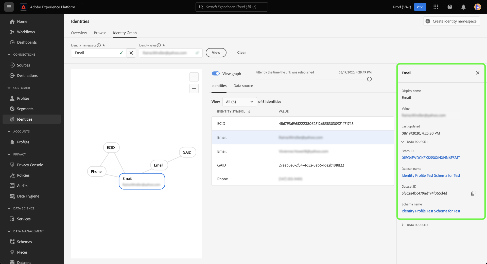
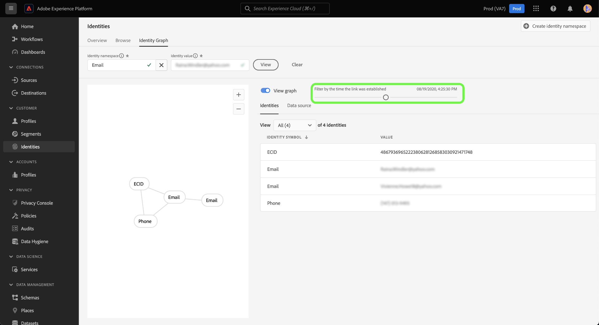

# 身分圖表檢視器

身分圖表是特定客戶不同身分之間關係的對應，可讓您以視覺化方式呈現客戶如何跨不同管道與您的品牌互動。 所有客戶識別圖均由 Adobe Experience Platform 身分服務以近乎即時的方式集中管理並更新，以回應客戶活動。

Platform使用者介面中的身分圖表檢視器可讓您以視覺效果呈現並更瞭解哪些客戶身分識別專案以何種方式拼接在一起。 檢視器可讓您拖曳圖形的不同部分並加以互動，讓您檢查複雜的身分關係、更有效率地偵錯，並透過資訊的使用方式提高透明度而受益。

以下檔案提供如何在Platform UI中存取和使用身分圖表檢視器的步驟。

## 教學課程影片

以下影片旨在協助您瞭解身分圖表檢視器。

>[!VIDEO](https://video.tv.adobe.com/v/331030/?quality=12&learn=on)

## 快速入門

使用身分圖表檢視器需要瞭解所涉及的各種Adobe Experience Platform服務。 開始使用身分圖表檢視器之前，請檢閱下列服務的檔案：

- [[!DNL Identity Service]](../home.md)：透過跨裝置和系統橋接身分，更能瞭解個別客戶及其行為。
- [即時客戶個人檔案](../../profile/home.md)：即時客戶個人檔案會運用身分圖表，建立客戶屬性和行為的完整且單一檢視。

### 術語

- **身分（節點）：** 身分或節點是實體（通常是人員）的唯一資料。 身分是由身分名稱空間和身分值所組成。 例如，完全合格的身分可以由身分名稱空間組成， **電子郵件**，與身分值結合 **robin@email.com**.
- **連結（邊緣）：** 連結或邊緣代表身分之間的連線。 身分連結包含首次建立和上次更新時間戳記等屬性。 第一個建立的時間戳記會定義新身分連結至現有身分的日期和時間。 上次更新時間戳記會定義上次更新現有身分連結的日期和時間。
- **圖表（叢集）：** 圖表或叢集是代表個人的一組身分和連結。

## 存取身分圖表檢視器 {#access-identity-graph-viewer}

在Platform UI中選取 **[!UICONTROL 身分]** 在左側導覽中，然後選取 **[!UICONTROL 身分圖表]** 從頁首的索引標籤清單中。

若要檢視身分圖表，請提供身分名稱空間及其對應的值，然後選取 **[!UICONTROL 檢視]**.

>[!TIP]
>
>選取表格圖示  檢視包含貴組織中所有可用身分識別名稱空間清單的面板。 只要連線身分識別值，您就可以使用任何身分識別名稱空間。 如需詳細資訊，請閱讀 [身分名稱空間指南](../namespaces.md).

## 瞭解身分圖表檢視器介面

身分圖表檢視器介面由數個元素組成，可用來與身分資料互動及更好地瞭解資料。

身分圖表會顯示連結至您輸入的身分名稱空間和值組合的所有身分。 每個節點都包含一個身分名稱空間及其對應的值。 您可以選取、保留和拖曳任何節點，與圖形互動。 或者，您可以將滑鼠指標暫留在節點上，檢視其對應身分值的相關資訊。 選取 **[!UICONTROL 檢檢視表]** 以隱藏或顯示圖形。

>[!IMPORTANT]
>
>身分圖表至少需要產生兩個連結的身分，以及有效的身分名稱空間和值組合。 圖表檢視器可顯示的最大身分數量為150。 請參閱 [附錄](#appendix) 區段以取得詳細資訊。

在圖形內選取連結，以檢視貢獻該連結的資料集和批次ID。 選取連結也會更新右側邊欄，以提供更多資料來源詳細資訊以及首次建立和上次更新時間戳記等屬性。

此 [!UICONTROL 身分] 表格提供身分資料的不同檢視，以表格格式列出身分名稱空間和身分值組合。 在圖形中選取節點將會更新中反白的條列專案 [!UICONTROL 身分] 表格。

使用下拉式選單來排序圖表資料，並反白顯示特定身分名稱空間的資訊。 例如，選取 **[!UICONTROL 電子郵件]** 以檢視電子郵件身分識別名稱空間的特定資料。

右邊欄會顯示所選身分的相關資訊，包括其上次更新的時間戳記。 右側邊欄也會顯示與所選身分對應的資料來源資訊，包括其批次ID、資料集名稱、資料集ID和結構描述名稱。

下表提供有關右側邊欄中顯示的資料來源屬性的其他資訊：

| 資料來源 | 說明 |
| --- | --- | 
| 批次 ID  | 與批次資料對應的自動產生識別碼。 |
| 資料集 ID | 與您的資料集對應的自動產生識別碼。 |
| 資料集名稱 | 包含批次資料的資料集名稱。 |
| 方案名稱 | 結構描述的名稱。 結構描述提供一組規則，可代表及驗證資料的結構和格式。 |

您也可以使用 *[!UICONTROL 資料來源]* 檢視對您的身分有貢獻的資料來源清單。 選取 [!UICONTROL 資料來源] 取得資料集和批次ID的表格檢視。

使用滑桿，依首次建立身分的時間來篩選圖表資料。 依預設，身分圖表檢視器會顯示圖表內連結的所有身分。 按住並拖曳滑桿，將時間調整為新身分連結至圖表的最後一個時間戳記。 在以下範例中，圖表顯示最近建立的身分連結(GAID)位於 **[!UICONTROL 2020年8月19日， 4:29:下午29點]**.

調整滑桿，檢視是否有另一個身分連結（電子郵件）建立於 **[!UICONTROL 2020年8月19日， 4:25:下午30]**.

您也可以調整滑桿來檢視圖形的最早版序。 在以下範例中，身分圖表檢視器會顯示該圖表最初建立日期 **[!UICONTROL 2020年8月19日， 4:11:下午49]**，其第一個連結為ECID、電子郵件和電話。

## 附錄

下節提供使用身分圖表檢視器的其他資訊。

### 瞭解錯誤訊息

存取身分圖表檢視器時可能會發生錯誤。 以下是使用Identity Graph Viewer時要注意的先決條件和限制清單。

- 身分值必須存在於選取的名稱空間中。
- 身分圖表檢視器至少需要兩個連結的身分才能產生。 可能只有一個身分值，但沒有連結的身分，而且在這種情況下，該值只會存在於 [!DNL Profile] 檢視器。
- 身分圖表檢視器不能超過最多150個身分。

### 從資料集存取身分圖表檢視器

您也可以使用資料集介面存取身分圖表檢視器。 從資料集 [!UICONTROL 瀏覽] 頁面，選取您要與其互動的資料集，然後選取 **[!UICONTROL 預覽資料集]**

從預覽視窗中選取指紋圖示，以檢視透過身分圖表檢視器表示的身分。

>[!TIP]
>
>只有在資料集有兩個或多個身分時，指紋圖示才會出現。

## 後續步驟

閱讀本檔案後，您已瞭解如何在Platform UI中探索客戶的身分圖。 如需Platform中身分的詳細資訊，請參閱 [Identity Service概觀](../home.md)

## Changelog

| 日期 | 動作 |
| ---- | ------ |
| 2021-01 | <ul><li>新增對串流擷取資料和非生產沙箱的支援。</li><li>微幅錯誤修正。</li></ul> |
| 2021-02 | <ul><li>身分圖表檢視器可透過資料集預覽存取。</li><li>微幅錯誤修正。</li><li>身分圖表檢視器已正式推出。</li></ul> |
| 2023-01 | <ul><li>UI更新。</li></ul> |
