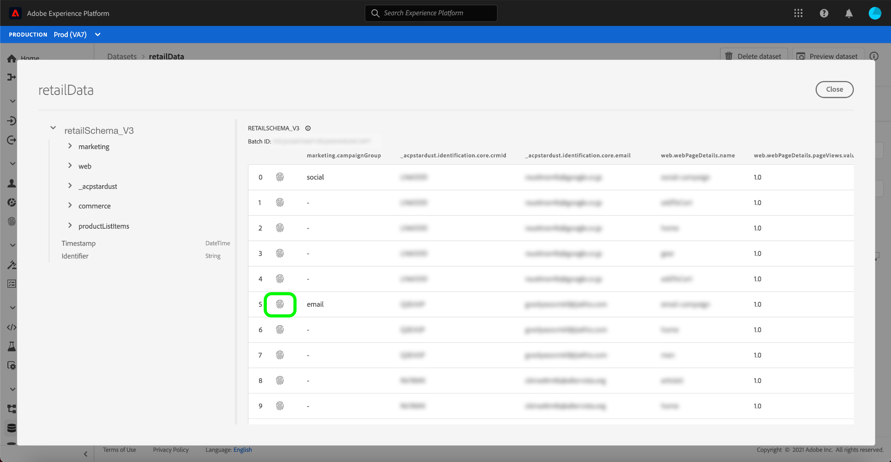

# 身分圖表檢視器概觀

身分圖是特定客戶不同身分之間關係的地圖，可以透過視覺化呈現方式呈現客戶如何透過不同管道與品牌互動。 所有客戶身分圖表均由Adobe Experience Platform Identity Service以近乎即時的方式共同管理和更新，以回應客戶活動。

Platform使用者介面中的身分圖表檢視器可讓您視覺化，並更清楚了解哪些客戶身分識別是匯整在一起的，以及以哪些方式匯整。 檢視器可讓您拖曳圖形的不同部分並加以互動，讓您檢查複雜的身分關係、更有效率地偵錯，並透過資訊的使用方式提高透明度而獲益。

## 教學課程影片

以下影片旨在協助您了解身分圖表檢視器。

>[!VIDEO](https://video.tv.adobe.com/v/331030/?quality=12&learn=on)

## 快速入門

若要使用身分圖表檢視器，您必須了解所涉的各種Adobe Experience Platform服務。 開始使用身分圖表檢視器之前，請先檢閱下列服務的檔案：

- [[!DNL Identity Service]](../home.md):跨裝置和系統橋接身分，以更全面了解個別客戶及其行為。

### 術語

- **身份（節點）:** 身分或節點是實體（通常是人員）專屬的資料。 身分識別由命名空間和身分值組成。
- **連結（邊緣）:** 連結或邊緣代表身分之間的連線。
- **圖表（叢集）:** 圖形或叢集是代表人員的身分和連結群組。

## 存取身分圖表檢視器

若要在UI中使用身分圖表檢視器，請選取 **[!UICONTROL 身分]** 在左側導覽器中，然後選取 **[!UICONTROL 身分圖]** 標籤。 從 **[!UICONTROL 身分命名空間]** 螢幕上，按一下 **[!UICONTROL 選取身分命名空間]** 圖示來搜尋您要使用的命名空間。

此 **[!UICONTROL 選取身分命名空間]** 框。 此畫麵包含貴組織可用的命名空間清單，包括命名空間的相關資訊 **[!UICONTROL 顯示名稱]**, **[!UICONTROL 標識符]**, **[!UICONTROL 擁有者]**, **[!UICONTROL 上次更新]** 日期和 **[!UICONTROL 說明]**. 只要您已將有效身分值連線至命名空間，即可使用提供的任何命名空間。

選取您要使用的命名空間，然後按一下 **[!UICONTROL 選擇]** 繼續。

選取命名空間後，請在 **[!UICONTROL 身分值]** 文字方塊中選取 **[!UICONTROL 檢視]**.

### 從資料集存取身分圖表檢視器

您也可以使用資料集介面存取身分圖表檢視器。 從資料集 [!UICONTROL 瀏覽] 頁面，選取您要與之互動的資料集，然後選取 **[!UICONTROL 預覽資料集]**

從預覽視窗中選取指紋圖示，以查看透過身分圖表檢視器所呈現的身分。

>[!TIP]
>
>只有當資料集有兩個或多個身分時，才會顯示指紋圖示。

此時將顯示標識圖查看器。 螢幕的左側是身分圖表，顯示連結至您選取之命名空間和輸入身分值的所有身分識別。 每個身分節點都包含命名空間及其對應的ID值。 您可以選取並保留任何身分，以拖曳及與圖形互動。 或者，您可以將滑鼠移至身分識別上，查看其ID值的相關資訊。 圖形輸出也會以表格清單的形式顯示在畫面中央。

>[!IMPORTANT]
>
>身分圖表至少需要兩個連結的身分來產生，以及有效的命名空間和ID組。 圖表檢視器可顯示的身分數上限為150。 請參閱 [附錄](#appendix) 一節以取得詳細資訊。

選取要更新 **[!UICONTROL 身分]** 表格和，以更新右側邊欄上提供的資訊，包括身分 **[!UICONTROL 值]**, **[!UICONTROL 批次ID]**，及其 **[!UICONTROL 上次更新]** 日期。

您可以透過圖形進行篩選，並使用 **[!UICONTROL 身分]** 表格。 從下拉式選單中，選取您要反白顯示的命名空間。

圖表檢視器會傳回，並醒目提示您選取的命名空間。 篩選選項也會更新 **[!UICONTROL 身分]** 表格，僅傳回您選取之命名空間的資訊。

圖形查看器框的右上角包含放大選項。 選取 **(+)** 圖示來放大圖形或 **(-)** 表徵圖縮小。

您可以透過選取 **[!UICONTROL 資料來源]** 從標題。 此 **[!UICONTROL 資料來源]** 表格顯示 **[!UICONTROL 批次ID]** 與圖形及其關聯 **[!UICONTROL 連結ID]**、來源結構和擷取日期。

您可以選取身分圖中的任何連結，以查看對連結有貢獻的所有來源批次。

或者，您也可以選取一個批次，以查看此批次貢獻的所有連結。

身分圖表檢視器也可存取具有較大身分叢集的身分圖。

## 附錄

下節提供使用身分圖表檢視器的其他資訊。

### 了解錯誤訊息

存取身分圖表檢視器時可能會發生錯誤。 下列為使用身分圖表檢視器時需要注意的先決條件和限制清單。

- 所選命名空間中必須存在標識值。
- 身分圖表檢視器至少需要兩個連結的身分來產生。 可能只有一個身分值，且沒有連結的身分，而在此情況下，值只會存在於 [!DNL Profile] 檢視器。
- 身分圖表檢視器不能超過150個身分。

## 後續步驟

閱讀本檔案後，您便學會如何在Platform UI中探索客戶的身分圖表。 如需Platform中身分的詳細資訊，請參閱 [Identity服務概述](../home.md)

## 變更記錄

| 日期 | 動作 |
| ---- | ------ |
| 2021-01 | <ul><li>新增對串流內嵌資料和非生產沙箱的支援。</li><li>微幅錯誤修正。</li></ul> |
| 2021-02 | <ul><li>身分圖表檢視器可透過資料集預覽功能存取。</li><li>微幅錯誤修正。</li><li>身分圖表檢視器已設為「一般可用」。</li></ul> |
