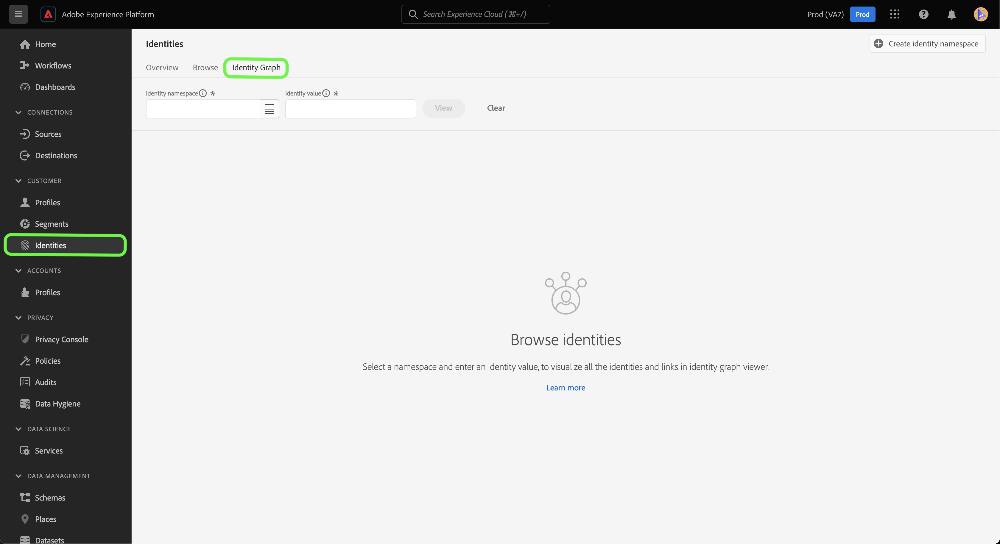

# 標識圖形查看器

身份圖是特定客戶不同身份之間關係的映射，它為您提供了客戶如何通過不同渠道與您的品牌進行交互的直觀表示。 所有客戶識別圖均由 Adobe Experience Platform 身分服務以近乎即時的方式集中管理並更新，以回應客戶活動。

平台用戶介面中的標識圖形查看器使您能夠直觀顯示和更好地瞭解哪些客戶標識是通過什麼方式拼接在一起的。 檢視器可讓您拖曳圖形的不同部分並加以互動，讓您檢查複雜的身分關係、更有效率地偵錯，並透過資訊的使用方式提高透明度而受益。

以下文檔提供了如何訪問和使用平台UI中的標識圖形查看器的步驟。

## 教程視頻

以下視頻旨在支援您對身份圖形查看器的理解。

>[!VIDEO](https://video.tv.adobe.com/v/331030/?quality=12&learn=on)

## 快速入門

使用身份圖查看器需要瞭解所涉及的Adobe Experience Platform各種服務。 開始使用身份圖查看器之前，請查看以下服務的文檔：

- [[!DNL Identity Service]](../home.md):通過跨設備和系統橋接身份，更好地瞭解單個客戶及其行為。
- [即時客戶配置檔案](../../profile/home.md):即時客戶配置檔案利用身份圖建立客戶屬性和行為的全面而單一視圖。

### 術語

- **標識（節點）:** 標識或節點是實體（通常是個人）唯一的資料。 標識由標識命名空間和標識值組成。 例如，完全限定的標識可能包含的標識命名空間 **電子郵件**，與的標識值 **羅賓@email.com**。
- **連結（邊緣）:** 連結或邊表示標識之間的連接。 標識連結包括屬性，如首次建立和上次更新的時間戳。 第一建立的時間戳定義新標識連結到現有標識的日期和時間。 上次更新的時間戳定義上次更新現有標識連結的日期和時間。
- **圖形（群集）:** 圖形或群集是一組代表人的身份和連結。

## 訪問標識圖查看器 {#access-identity-graph-viewer}

在平台UI中，選擇 **[!UICONTROL 身份]** 在左側導航中，然後選擇 **[!UICONTROL 標識圖]** 的子菜單。

要查看標識圖，請提供標識命名空間及其相應值，然後選擇 **[!UICONTROL 視圖]**。

>[!TIP]
>
>選擇表格表徵圖  查看包含組織中所有可用標識命名空間的清單的面板。 只要連接到有效標識值，就可以使用任何標識命名空間。 有關詳細資訊，請閱讀 [標識命名空間指南](../namespaces.md)。

## 瞭解身份圖查看器介面

標識圖形查看器介面由若干元素組成，您可以使用這些元素與身份資料交互並更好地瞭解身份資料。

標識圖形顯示連結到您輸入的標識命名空間和值組合的所有標識。 每個節點都包含一個標識命名空間及其相應的值。 可以選擇、保持和拖動任何節點以與圖形交互。 或者，可以將滑鼠懸停在節點上查看有關其相應標識值的資訊。 選擇 **[!UICONTROL 查看圖形]** 隱藏或顯示圖形。

>[!IMPORTANT]
>
>標識圖需要最少生成兩個連結的標識以及有效的標識命名空間和值組合。 圖形查看器可顯示的最大標識數為150。 查看 [附錄](#appendix) 的下一頁。

在圖形中選擇一個連結，以查看該連結的資料集和批處理ID。 選擇連結還會更新右滑軌，以提供有關資料源詳細資訊以及諸如首次建立和上次更新時間戳等屬性的更多資訊。

的 [!UICONTROL 身份] 表提供了標識資料的不同視圖，以表格格式列出標識命名空間和標識值組合。 在圖形中選擇節點將更新圖中突出顯示的行項 [!UICONTROL 身份] 的子菜單。

使用下拉菜單可以對圖形資料進行排序，並突出顯示特定標識命名空間上的資訊。 例如，選擇 **[!UICONTROL 電子郵件]** 的子菜單。

右欄顯示有關選定標識的資訊，包括上次更新的時間戳。 右欄還顯示與所選標識對應的資料源資訊，包括其批ID、資料集名稱、資料集ID和架構名稱。

下表提供了右滑軌中顯示的資料源屬性的附加資訊：

| 資料來源 | 說明 |
| --- | --- | 
| 批次 ID  | 與批資料對應的自動生成的標識符。 |
| 資料集 ID | 與您的資料集對應的自動生成的標識符。 |
| 資料集名稱 | 包含批處理資料的資料集的名稱。 |
| 方案名稱 | 架構的名稱。 該架構提供一組規則，用於表示和驗證資料的結構和格式。 |

您還可以使用 *[!UICONTROL 資料源]* 查看對您的身份有貢獻的資料源清單。 選擇 [!UICONTROL 資料源] 的子目錄。

使用滑塊按首次建立身份時間篩選圖形資料。 預設情況下，標識圖形查看器顯示圖形中連結的所有標識。 按住並拖動滑塊，將時間調整到將新標識連結到圖形的上次時間戳。 在下面的示例中，該圖顯示了在 **[!UICONTROL 08/19/2020,4:29:晚29點]**。

調整滑塊，以查看在上建立了另一個身份連結（電子郵件） **[!UICONTROL 08/19/2020,4:25:晚30點]**。

還可調整滑塊以查看圖形的最早小版本。 在下面的示例中，標識圖查看器顯示圖形是首次在 **[!UICONTROL 08/19/2020,4:11:下午49點]**，其第一個連結是ECID、電子郵件和電話。

## 附錄

以下部分提供了有關使用身份圖形查看器的其他資訊。

### 瞭解錯誤消息

訪問標識圖查看器時可能出錯。 以下是使用標識圖形查看器時需要注意的先決條件和限制的清單。

- 所選命名空間中必須存在標識值。
- 標識圖形查看器至少需要兩個連結的標識來生成。 可能只有一個標識值且沒有連結的標識，在這種情況下，該值僅存在於 [!DNL Profile] 查看器。
- 標識圖形查看器不能超過150個標識。

### 從資料集訪問標識圖查看器

您還可以使用資料集介面訪問標識圖查看器。 從資料集 [!UICONTROL 瀏覽] 頁，選擇要與之交互的資料集，然後選擇 **[!UICONTROL 預覽資料集]**

在預覽窗口中，選擇指紋表徵圖以查看通過標識圖形查看器表示的身份。

>[!TIP]
>
>僅當資料集具有兩個或多個標識時，才會顯示指紋表徵圖。

## 後續步驟

通過閱讀此文檔，您已學會了如何在平台UI中瀏覽客戶的身份圖。 有關平台中標識的詳細資訊，請參閱 [Identity Service概述](../home.md)

## 更改日誌

| 日期 | 動作 |
| ---- | ------ |
| 2021-01 | <ul><li>增加了對接收的資料和非生產沙箱的流式傳輸支援。</li><li>微幅錯誤修正。</li></ul> |
| 2021-02 | <ul><li>通過資料集預覽可訪問標識圖查看器。</li><li>微幅錯誤修正。</li><li>標識圖形查看器已通常可用。</li></ul> |
| 2023-01 | <ul><li>UI更新。</li></ul> |
