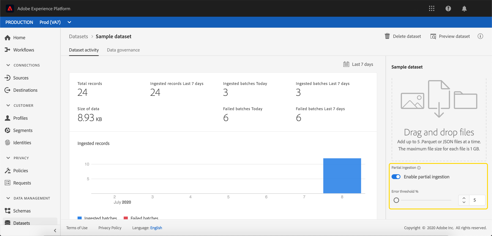

# 部分批次擷取

部分批次擷取是指能夠擷取包含錯誤的資料，最高可達到特定臨界值。 有了這項功能，使用者就可以在將所有正確資料單獨批次處理時，成功將其所有正確資料收錄至Adobe Experience Platform，並詳細瞭解其無效原因。

本檔案提供管理部分批次擷取的教學課程。

## 快速入門

本教學課程需要對涉及部分批次提取的各種Adobe Experience Platform服務有工作知識。 在開始本教學課程之前，請先閱讀下列服務的檔案：

- [批次擷取](./overview.md):從資料檔 [!DNL Platform] 案（例如CSV和Parce）擷取和儲存資料的方法。
- [[!DNL Experience Data Model (XDM)]](../../xdm/home.md):組織客戶體驗資 [!DNL Platform] 料的標準化架構。

以下各節提供您必須知道的其他資訊，以便成功呼叫[!DNL Platform] API。

### 讀取範例API呼叫

本指南提供範例API呼叫，以示範如何格式化您的請求。 這些包括路徑、必要標題和正確格式化的請求負載。 也提供API回應中傳回的範例JSON。 如需範例API呼叫檔案中所用慣例的詳細資訊，請參閱[!DNL Experience Platform]疑難排解指南中[如何讀取範例API呼叫](../../landing/troubleshooting.md#how-do-i-format-an-api-request)一節。

### 收集必要標題的值

若要呼叫[!DNL Platform] API，您必須先完成[驗證教學課程](https://www.adobe.com/go/platform-api-authentication-en)。 完成驗證教學課程後，所有[!DNL Experience Platform] API呼叫中每個所需標題的值都會顯示在下面：

- 授權：載體`{ACCESS_TOKEN}`
- x-api-key:`{API_KEY}`
- x-gw-ims-org-id:`{IMS_ORG}`

[!DNL Experience Platform]中的所有資源都隔離到特定的虛擬沙盒。 對[!DNL Platform] API的所有請求都需要一個標題，該標題指定要在中執行操作的沙盒的名稱：

- x-sandbox-name:`{SANDBOX_NAME}`

>[!NOTE]
>
>如需[!DNL Platform]中沙盒的詳細資訊，請參閱[沙盒概述檔案](../../sandboxes/home.md)。

## 在API {#enable-api}中啟用批處理以進行部分批處理

>[!NOTE]
>
>本節說明如何使用API啟用批次以擷取部分批次。 有關使用UI的說明，請閱讀[在UI](#enable-ui)步驟中啟用批處理以進行部分批處理。

您可以建立啟用部分擷取的新批次。

若要建立新批次，請依照[批次擷取開發人員指南](./api-overview.md)中的步驟進行。 到達&#x200B;**[!UICONTROL Create batch]**&#x200B;步驟後，請在請求正文中添加以下欄位：

```json
{
    "enableErrorDiagnostics": true,
    "partialIngestionPercentage": 5
}
```

| 屬性 | 說明 |
| -------- | ----------- |
| `enableErrorDiagnostics` | 允許[!DNL Platform]生成有關批的詳細錯誤消息的標籤。 |
| `partialIngestionPercentage` | 整個批失敗前可接受錯誤的百分比。 因此，在此示例中，最多5%的批可能是錯誤，否則將失敗。 |


## 在UI {#enable-ui}中啟用批處理以進行部分批處理

>[!NOTE]
>
>本節說明如何使用UI啟用批處理以進行部分批處理。 如果您已使用API啟用批次以擷取部分批次，則可跳至下一節。

若要透過[!DNL Platform] UI啟用批次以進行部分擷取，您可以透過來源連線建立新批次、在現有資料集中建立新批次，或透過「[!UICONTROL Map CSV to XDM flow]」建立新批次。

### 建立新源連接{#new-source}

要建立新源連接，請遵循[源概述](../../sources/home.md)中列出的步驟。 到達&#x200B;**[!UICONTROL Dataflow detail]**&#x200B;步驟後，記下&#x200B;**[!UICONTROL Partial ingestion]**&#x200B;和&#x200B;**[!UICONTROL Error diagnostics]**&#x200B;欄位。


**[!UICONTROL Partial ingestion]**&#x200B;切換可讓您啟用或停用部分批次擷取的使用。

只有當&#x200B;**[!UICONTROL Partial ingestion]**&#x200B;關閉時，才會顯示&#x200B;**[!UICONTROL Error diagnostics]**&#x200B;切換。 此功能允許[!DNL Platform]生成有關所接收批處理的詳細錯誤消息。 如果&#x200B;**[!UICONTROL Partial ingestion]**&#x200B;切換已開啟，則會自動強制執行增強的錯誤診斷。


**[!UICONTROL Error threshold]**&#x200B;允許您在整個批失敗之前設定可接受錯誤的百分比。 依預設，此值會設為5%。

### 使用現有資料集{#existing-dataset}

若要使用現有資料集，請從選取資料集開始。 右側的側欄會填入資料集的相關資訊。


**[!UICONTROL Partial ingestion]**&#x200B;切換可讓您啟用或停用部分批次擷取的使用。

只有當&#x200B;**[!UICONTROL Partial ingestion]**&#x200B;關閉時，才會顯示&#x200B;**[!UICONTROL Error diagnostics]**&#x200B;切換。 此功能允許[!DNL Platform]生成有關所接收批處理的詳細錯誤消息。 如果&#x200B;**[!UICONTROL Partial ingestion]**&#x200B;切換已開啟，則會自動強制執行增強的錯誤診斷。



**[!UICONTROL Error threshold]**&#x200B;允許您在整個批失敗之前設定可接受錯誤的百分比。 依預設，此值會設為5%。

現在，您可以使用&#x200B;**新增資料**&#x200B;按鈕來上傳資料，並會使用部分擷取來擷取資料。

### 使用&quot;[!UICONTROL Map CSV to XDM schema]&quot;流{#map-flow}

要使用「[!UICONTROL Map CSV to XDM schema]」流，請遵循[映射CSV檔案教程](../tutorials/map-a-csv-file.md)中列出的步驟。 到達&#x200B;**[!UICONTROL Add data]**&#x200B;步驟後，記下&#x200B;**[!UICONTROL Partial ingestion]**&#x200B;和&#x200B;**[!UICONTROL Error diagnostics]**&#x200B;欄位。


**[!UICONTROL Partial ingestion]**&#x200B;切換可讓您啟用或停用部分批次擷取的使用。

只有當&#x200B;**[!UICONTROL Partial ingestion]**&#x200B;關閉時，才會顯示&#x200B;**[!UICONTROL Error diagnostics]**&#x200B;切換。 此功能允許[!DNL Platform]生成有關所接收批處理的詳細錯誤消息。 如果&#x200B;**[!UICONTROL Partial ingestion]**&#x200B;切換已開啟，則會自動強制執行增強的錯誤診斷。


**[!UICONTROL Error threshold]** 允許您在整個批失敗之前設定可接受錯誤的百分比。依預設，此值會設為5%。

## 下一步 {#next-steps}

本教學課程涵蓋如何建立或修改資料集以啟用部分批次擷取。 有關批次擷取的詳細資訊，請閱讀[批次擷取開發人員指南](./api-overview.md)。

有關監視部分攝取錯誤的資訊，請閱讀[批次攝取錯誤診斷指南](../quality/error-diagnostics.md)。
