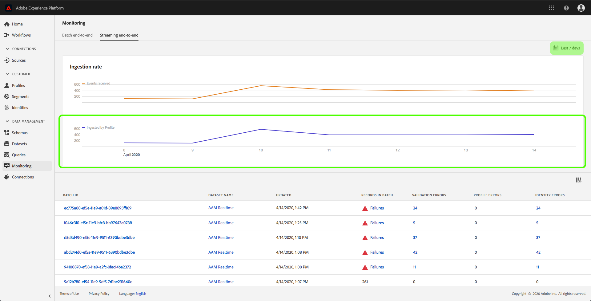

# 監控資料擷取

資料擷取可讓您將資料擷取至Adobe Experience Platform。 您可以使用批次擷取功能(可讓您使用各種檔案類型（例如CSV）插入資料)或串流擷取功能（可讓您即時將資料擷取至使用串流端點） [!DNL Platform] 。

本使用指南提供如何在Adobe Experience Platform使用者介面中監控資料的步驟。 本指南要求您必須擁有Adobe ID和Adobe Experience Platform的存取權。

## 監控端對端資料擷取

在 [Experience Platform UI](https://platform.adobe.com)，按一下左側導覽功能表上的「監視 **[!UICONTROL 」，然後按一]** 下「端對端串流」 ****。

此時 *[!UICONTROL 會顯示「串流端對端監控]* 」頁面。 此工作區提供顯示接收的串流事件比率的圖表、顯示成功處理的串流事件比率的圖表 [!DNL Platform][!DNL Real-time Customer Profile](../../profile/home.md)，以及傳入資料的詳細清單。

依預設，頂端圖表顯示過去七天的擷取率。 按一下反白顯示的按鈕，即可調整此日期範圍，以顯示不同的時段。

下圖顯示過去七天內成功處理串流事 [!DNL Profile] 件的比率。 按一下反白顯示的按鈕，即可調整此日期範圍，以顯示不同的時段。

>[!NOTE]
>
>為了讓資料顯示在此圖表上，必須明確啟 **用** for [!DNL Profile]。 若要瞭解如何啟用串流資料，請 [!DNL Profile]閱讀資料集 [使用指南](../../catalog/datasets/user-guide.md#enable-a-dataset-for-real-time-customer-profile)。

圖表下方是所有串流擷取記錄的清單，這些記錄與上方顯示的日期範圍相對應。 每個列出的批次會顯示其ID、資料集名稱、上次更新時的記錄數，以及錯誤數（如果有）。 您可以按一下任何記錄，以取得該記錄的詳細資訊。

### 檢視串流記錄

在查看成功流式記錄的詳細資訊時，會顯示諸如所接收記錄數、檔案大小以及所接收開始和結束時間等資訊。

失敗的串流記錄的詳細資料會顯示與成功記錄相同的資訊。

此外，失敗的記錄會提供處理批時產生的錯誤的詳細資料。 在下列範例中，驗證目錄中的datasetId時發生系統錯誤。

## 監控批次端對端資料擷取

在中， [!DNL Experience Platform UI](https://platform.adobe.com)按一下左 **[!UICONTROL 側導覽功能表上的]** 「監視」。

此時 **[!UICONTROL 將顯示「批端對端監視]** 」頁，其中顯示先前提取的批的清單。 您可以按一下任一批以瞭解有關該記錄的詳細資訊。

### 查看批

在查看成功批的詳細資訊時，會顯示已接收的記錄數、檔案大小以及提取開始和結束時間等資訊。

失敗批的詳細資訊顯示與成功批相同的資訊，添加失敗的記錄數。

此外，失敗的批處理提供了處理批時出現的錯誤的詳細資訊。 在以下範例中，由於收錄的批次使用未知欄位，因此發生錯誤 `_experience`。

