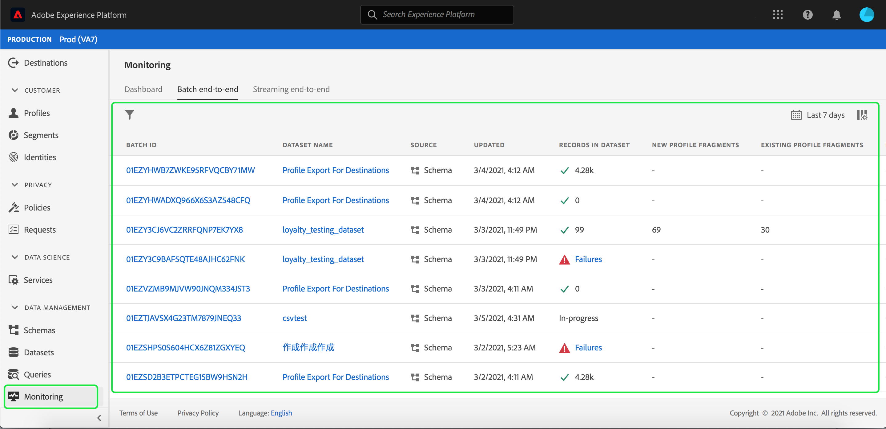
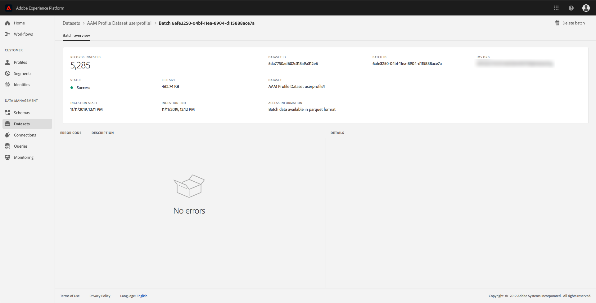

# 監控資料擷取

資料內嵌可讓您將資料內嵌至Adobe Experience Platform。 您可以使用批次擷取，這可讓您使用各種檔案型別（例如CSV）插入資料，或是串流擷取，可讓您將資料擷取至 [!DNL Platform] 即時使用串流端點。

本使用手冊提供如何在Adobe Experience Platform使用者介面中監視資料的步驟。 本指南會要求您擁有Adobe ID並存取Adobe Experience Platform。

## 監視串流端對端資料擷取 {#monitor-streaming-end-to-end-data-ingestion}

>[!CONTEXTUALHELP]
>id="platform_ingestion_streaming_ingestionrate"
>title="擷取率"
>abstract="每秒成功處理的事件數。"
>text="Learn more in the documentation"
>additional-url="https://experienceleague.adobe.com/docs/experience-platform/dataflows/ui/monitor-sources.html?lang=zh-Hant" text="監視 UI 中來源的資料流"

>[!TIP]
>
>若要計算特定日期的總事件數，請使用下列運算式： `total events / day = ingestion rate * 60 * 60 * 24`.

在 [EXPERIENCE PLATFORMUI](https://platform.adobe.com)，選取 **[!UICONTROL 監視]** 在左側導覽選單上，後面接著 **[!UICONTROL 端對端串流]**.

此 **[!UICONTROL 端對端串流]** 便會顯示「監督」頁面。 此工作區提供的圖形可顯示接收串流事件的速率 [!DNL Platform]，此圖表顯示已順利處理之串流事件的速率 [[!DNL Real-Time Customer Profile]](../../profile/home.md)以及傳入資料的詳細清單。

根據預設，頂端圖表會顯示過去七天的擷取率。 您可以選取醒目提示的按鈕，調整此日期範圍以顯示不同的時段。

下方圖表顯示成功處理串流事件的速率。 [!DNL Profile] 過去七天內。 您可以選取醒目提示的按鈕，調整此日期範圍以顯示不同的時段。

>[!NOTE]
>
>為了讓資料顯示在此圖表上，資料必須 **明確** 已啟用： [!DNL Profile]. 瞭解如何啟用的串流資料 [!DNL Profile]，閱讀 [資料集使用手冊](../../catalog/datasets/user-guide.md#enable-a-dataset-for-real-time-customer-profile).

圖形下方是與上方顯示之日期範圍相對應的所有串流擷取記錄清單。 每個列出的批次都會顯示其ID、資料集名稱、上次更新時間、批次中的記錄數以及錯誤數（如果存在）。 您可以選取任何記錄，以取得有關該記錄的詳細資訊。

### 檢視串流記錄

檢視成功串流記錄的詳細資訊時，會顯示所擷取的記錄數、檔案大小以及擷取開始和結束時間等資訊。

失敗的串流記錄的詳細資訊會顯示與成功記錄相同的資訊。

此外，失敗的記錄會提供處理批次時發生之錯誤的詳細資料。 在以下範例中，轉換或驗證資料時出現剖析錯誤。

>[!NOTE]
>
>如果擷取的列有錯誤，這些列將 **非** 除非產生的訊息導致無效的XDM，否則會捨棄該專案。

## 監視批次端對端資料擷取

在 [[!DNL Experience Platform UI]](https://platform.adobe.com)，選取 **[!UICONTROL 監視]** ，位於左側導覽功能表中。

此 **[!UICONTROL 批次端對端]** 「監督」頁面隨即顯示，顯示先前擷取的批次清單。 您可以選取任何批次，以取得該記錄的詳細資訊。

### 檢視批次

檢視成功批次的詳細資訊時，會顯示擷取的記錄數、檔案大小以及擷取的開始和結束時間等資訊。

失敗批次的詳細資訊會顯示與成功批次相同的資訊，以及失敗記錄數的增加。

此外，失敗的批次會提供處理批次時發生之錯誤的詳細資料。 在以下範例中，擷取的批次發生錯誤，因為它有人員的最大身分數量。

>[!NOTE]
>
>如果擷取的列有錯誤，這些列將 **非** 除非產生的訊息導致無效的XDM，否則會捨棄該專案。

