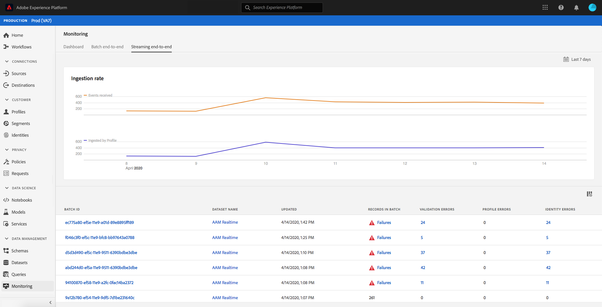

# 監控資料擷取

資料擷取可讓您將資料擷取至Adobe Experience Platform。 您可以使用批次擷取功能(可讓您使用各種檔案類型（例如CSV）插入資料)或串流擷取功能（可讓您使用串流端點將資料即時擷取至[!DNL Platform]）。

本使用指南提供如何在Adobe Experience Platform使用者介面中監控資料的步驟。 本指南要求您擁有Adobe ID並可以訪問Adobe Experience Platform。

## 監控端對端資料擷取

在[Experience PlatformUI](https://platform.adobe.com)中，選擇左側導覽功能表上的&#x200B;**[!UICONTROL Monitoring]**，然後選擇&#x200B;**[!UICONTROL Streaming end-to-end]**。

此時將顯示&#x200B;**[!UICONTROL Streaming end-to-end]**&#x200B;監視頁。 此工作區提供顯示[!DNL Platform]所接收串流事件的速率的圖表、顯示[[!DNL Real-time Customer Profile]](../../profile/home.md)所成功處理之串流事件的速率的圖表，以及傳入資料的詳細清單。

依預設，頂端圖表顯示過去七天的擷取率。 選取反白顯示的按鈕，即可調整此日期範圍以顯示不同的時段。

下圖顯示過去7天內[!DNL Profile]成功處理串流事件的比率。 選取反白顯示的按鈕，即可調整此日期範圍以顯示不同的時段。

>[!NOTE]
>
>為了讓資料顯示在此圖表上，資料必須為&#x200B;**明確**&#x200B;啟用[!DNL Profile]。 要瞭解如何為[!DNL Profile]啟用流資料，請閱讀[資料集使用手冊](../../catalog/datasets/user-guide.md#enable-a-dataset-for-real-time-customer-profile)。

圖表下方是所有串流擷取記錄的清單，這些記錄與上方顯示的日期範圍相對應。 每個列出的批次會顯示其ID、資料集名稱、上次更新時的記錄數，以及錯誤數（如果有）。 您可以選擇任何記錄，以獲得有關該記錄的詳細資訊。

### 檢視串流記錄

在查看成功流式記錄的詳細資訊時，會顯示諸如所接收記錄數、檔案大小以及所接收開始和結束時間等資訊。

失敗的串流記錄的詳細資料會顯示與成功記錄相同的資訊。

此外，失敗的記錄會提供處理批時發生錯誤的詳細資料。 在以下範例中，轉換或驗證資料時發生解析錯誤。

## 監控批次端對端資料擷取

在[[!DNL Experience Platform UI]](https://platform.adobe.com)中，選擇左側導覽功能表上的&#x200B;**[!UICONTROL Monitoring]**。

此時將顯示&#x200B;**[!UICONTROL Batch end-to-end]**&#x200B;監視頁，其中顯示了以前吸收的批的清單。 您可以選擇任何批，以瞭解有關該記錄的詳細資訊。

### 查看批

在查看成功批的詳細資訊時，會顯示已接收的記錄數、檔案大小以及提取開始和結束時間等資訊。

失敗批的詳細資訊顯示與成功批相同的資訊，添加失敗的記錄數。

此外，失敗的批處理提供了處理批時發生錯誤的詳細資訊。 在以下範例中，收錄的批次發生錯誤，因為該批次具有該人員的最大身分數。

