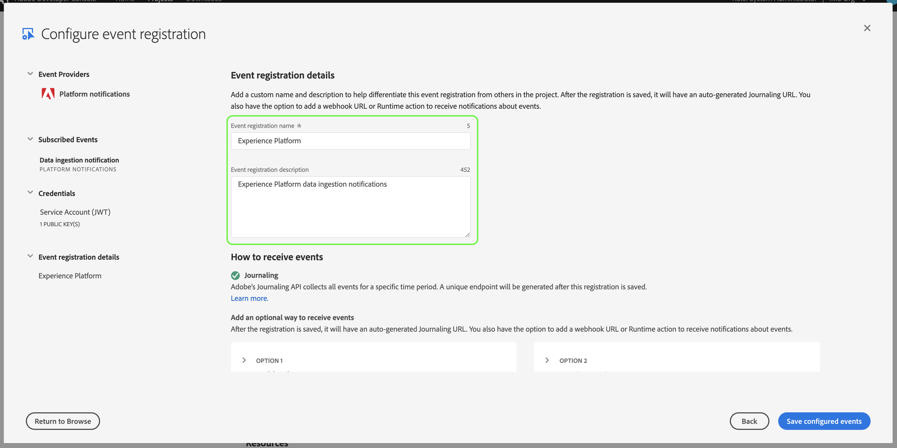

# 資料擷取通知

將資料擷取至Adobe Experience Platform的程式由多個步驟組成。 一旦您識別需要擷取的資料檔案後，擷取程 [!DNL Platform]序就會開始，每個步驟都會連續進行，直到資料被成功擷取或失敗為止。 您可以使用 [Adobe Experience Platform Data Ingestion API](https://www.adobe.io/apis/experienceplatform/home/api-reference.html#!acpdr/swagger-specs/ingest-api.yaml) ，或使用使用者介面來啟 [!DNL Experience Platform] 動擷取程式。

載入的資 [!DNL Platform] 料必須經過多個步驟，才能到達其目的地、 [!DNL Data Lake] 或資 [!DNL Real-time Customer Profile] 料儲存。 每個步驟都包括處理資料、驗證資料，然後儲存資料，再傳遞至下一步驟。 視所擷取的資料量而定，這可能會變成耗時的程式，而且程式總會因為驗證、語義或處理錯誤而失敗。 發生故障時，需要修正資料問題，然後必須使用修正的資料檔案重新啟動整個擷取程式。

為協助監控擷取程式， [!DNL Experience Platform] 可訂閱由程式每個步驟所發佈的一組事件，並通知您所擷取資料的狀態和任何可能的失敗。

## 可用狀態通知事件

以下是可供訂閱的可用資料擷取狀態通知清單。

>[!NOTE]
>
>所有資料擷取通知只提供一個事件主題。 為了區分不同的狀態，可以使用事件代碼。

| 平台服務 | 狀態 | 事件說明 | 事件代碼 |
| ---------------- | ------ | ----------------- | ---------- |
| 資料著陸 | success | 擷取——批次成功 | ing_load_success |
| 資料著陸 | 失敗 | 擷取——批次失敗 | ing_load_failure |
| 即時客戶個人檔案 | success | 配置檔案服務——資料載入批成功 | ps_load_success |
| 即時客戶個人檔案 | 失敗 | 配置檔案服務——資料載入批失敗 | ps_load_failure |
| 身分圖 | success | 身份圖——資料載入批成功 | ig_load_success |
| 身分圖 | 失敗 | 身份圖——資料載入批失敗 | ig_load_failure |

## 通知裝載方案

資料擷取通知事件模式是 [!DNL Experience Data Model] (XDM)模式，包含欄位和值，提供有關所擷取資料狀態的詳細資訊。 請造訪公開的XDM [!DNL GitHub] repo，以檢視最新的通知 [裝載架構](https://github.com/adobe/xdm/blob/master/schemas/notifications/ingestion.schema.json)。

## 訂閱資料擷取狀態通知

透過 [Adobe I/O Events](https://www.adobe.io/apis/experienceplatform/events.html)，您可以使用Webhook訂閱多種通知類型。 以下各節將說明使用Adobe Developer Console訂閱 [!DNL Platform] 資料擷取事件通知的步驟。

### 在Adobe Developer Console中建立新專案

前往 [Adobe Developer Console](https://www.adobe.com/go/devs_console_ui) ，使用您的Adobe ID登入。 接著，請依照教學課程中說明的步驟， [在Adobe Developer Console檔案中建立空白的專案](https://www.adobe.io/apis/experienceplatform/console/docs.html#!AdobeDocs/adobeio-console/master/projects-empty.md) 。

### 新增 [!DNL Experience Platform] 事件至專案

建立新專案後，請導覽至該專案的概述畫面。 在這裡，按一下「 **[!UICONTROL 新增事件」]**。

此時將 **[!UICONTROL 顯示「添加事件]** 」對話框。 按一 **[!UICONTROL 下「Experience Platform]** 」(體驗平台 **[!UICONTROL )以篩選可用選項清單，然後按一下「]** Platform notifications **[!UICONTROL 」（平台通知），再按「]**&#x200B;下一步」。

下一個畫面會顯示要訂閱的事件類型清單。 選取「 **[!UICONTROL 資料擷取通知]**」，然後按一 **[!UICONTROL 下「下一步]**」。

下一個畫面會提示您建立JSON網頁Token(JWT)。 您可以選擇自動產生金鑰對，或上傳您在終端機中產生的公開金鑰。

在本教學課程中，會遵循第一個選項。 按一下「Generate a key pair **[!UICONTROL (生成密鑰對]**)」選項框 **[!UICONTROL ，然後按一下右下角的「]** Generate keypair（生成密鑰對）」按鈕。

當鍵對產生時，瀏覽器會自動下載它。 您必須自行儲存此檔案，因為它不會保存在Developer Console中。

下一個畫面可讓您檢視新產生的金鑰對的詳細資訊。 按一 **[!UICONTROL 下]** 「下一步」繼續。

在下一個畫面中，提供事件註冊的名稱和說明。 最佳實務是建立獨特、可輕鬆辨識的名稱，以協助區隔此活動註冊與同一專案中的其他活動。

在同一螢幕的下方，您可選擇設定如何接收事件。 **[!UICONTROL Webhook]** 可讓您提供自訂的Webhook位址以接收事件，而 **[!UICONTROL Runtime動作則可讓您使用]** Adobe I/O Runtime進行相同動作 。

本教學課程會略過此選用的設定步驟。 完成後，按一下「儲 **[!UICONTROL 存設定的事件]** 」以完成事件註冊。

此時會顯示新建立事件註冊的詳細資訊頁面，您可在此處檢視已接收的事件、執行除錯追蹤及編輯其設定。

## 後續步驟

在您將通知注 [!DNL Platform] 冊到專案後，您就可以從專案儀表板檢視收到的事件。 如需如何追 [蹤事件的詳細指示，請參閱「追蹤Adobe I/O事件](https://www.adobe.io/apis/experienceplatform/events/docs.html#!adobedocs/adobeio-events/master/support/tracing.md) 」指南。
